# 机器学习概述

> 原文：<https://medium.com/analytics-vidhya/a-general-introduction-to-machine-learning-cea282802a15?source=collection_archive---------12----------------------->

给大家解码机器学习

沙哈达特·拉赫曼在 [Unsplash](https://unsplash.com?utm_source=medium&utm_medium=referral) 上拍摄的照片

**什么是机器学习，它与传统的计算机编程有什么不同？**

我们将借助框图来理解这一点。

*   **传统计算机编程**

在传统计算 *r* 编程中，我们向计算机提供数据和程序以获得输出。

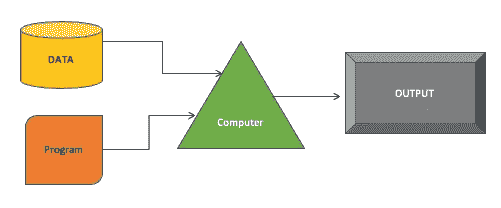

图 1:传统的计算机编程

*   **机器学习**

在机器学习中，我们的计算机被输入数据和输出，以生成一个程序，该程序以后可以在看不见的情况下使用。

使用不同的评估标准来测量程序的性能。

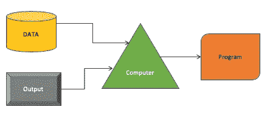

图 2:机器学习

现在舞台已经搭好，让我们更深入地研究机器学习。

## 什么是机器学习？

> [机器学习是]在没有明确编程的情况下赋予计算机学习能力的研究领域。阿瑟·塞缪尔，1959 年

可以说，机器学习是通过编程使计算机能够从数据中学习的科学

例子:垃圾邮件过滤，虚拟个人助理(Siri，Alexa)，产品推荐。

## 为什么是机器学习？

*   经济原因:使用机器学习可以开发需要复杂技术用户手动操作的系统。
*   简单且易于实现:需要大量规则或手工调整的问题可以用机器学习算法来解决。
*   个性化的用户体验:人们可以开发一个能够适应新数据的机器学习系统，因此可以进行个性化定制。
*   从大量数据中发现洞察力:机器学习可用于从数据中获取有意义的信息，例如，购物篮分析*(商店的销售数据用于揭示产品之间的关联。可以推导出类似“购买牛奶的顾客也购买了鸡蛋”的见解)*甚至可以用于对未来事件进行预测，例如:天气预报*(我们使用以前的天气数据来预测未来的天气状况)*

## 机器学习的类型

为了便于理解，我们可以将机器学习分为三大类:

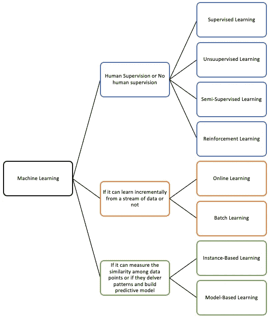

图 3:显示机器学习类型的框图

***1。基于模型是否需要人工监督***

在这一类别下，机器学习系统可以基于训练所需的监督的数量和类型来进一步分类。

**a)监督学习**

监督学习主要是基于分类的(例如:一个学生在考试中失败或没有失败)，但也可以用于回归(例如:预测商店的销售额)

当所提供的数据被结构化和标记时，这种类型的学习是优选的。下面的框图提供了如何实施这种学习的见解。

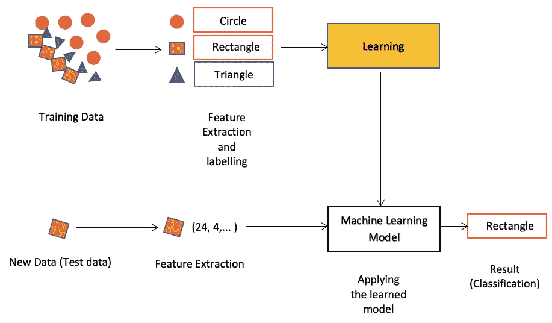

图 4:监督机器学习的框图

监督学习的一些重要算法是:

*   k 近邻
*   支持向量机
*   决策树和随机森林
*   线性回归
*   逻辑回归
*   神经网络

像逻辑回归这样的回归算法也可以用于分类。

**b)无监督学习**

当所提供的数据未被标记时，这种类型的学习是优选的，因此系统被编程为在没有标记的情况下学习。

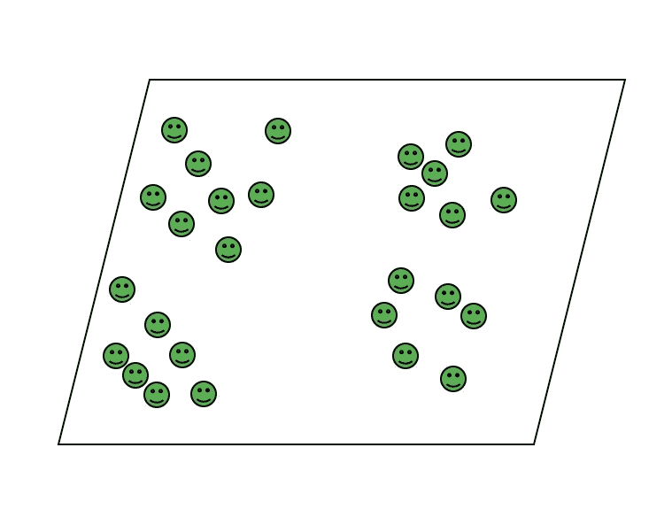

图 5:用于无监督学习的未标记数据集

无监督学习的一些重要算法是:

*   聚类(k 均值、层次聚类分析、期望值最大化)
*   维数缩减和可视化{ t-分布式随机邻居嵌入(t-SNE)，局部线性嵌入(LLE)，主成分分析(PCA)，核主成分分析}
*   关联规则学习(Apriori，Eclat)

为了将一组人分成子组，可以使用不同的聚类方法。

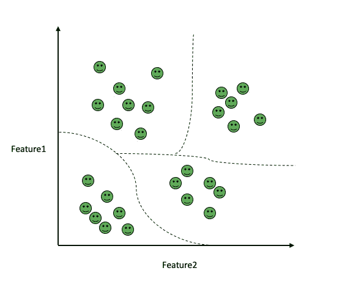

图 6:在应用无监督学习后，我们可以看到一个大的组被细分成更小的组

**c)半监督学习**

半监督学习用于混合数据(标记+未标记数据),其包含

*   一个非常小的标记数据块。
*   很大一部分数据没有标注。

为了处理这样的数据类型，可以使用像*伪标签这样的技术。*

伪标记是一种使用数据的标记部分为未标记的数据预测伪标记的技术。

现在，伪标记数据和标记数据一起用于生成新的模型。然后，这个新模型被用于对测试数据进行预测。

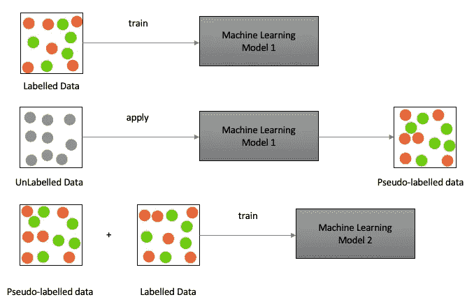

图 7:半监督学习的伪学习框图

**d)强化学习**

在上面讨论的所有学习方法中，强化学习的工作方式不同。

照片由 [Franck V.](https://unsplash.com/@franckinjapan?utm_source=medium&utm_medium=referral) 在 [Unsplash](https://unsplash.com?utm_source=medium&utm_medium=referral) 上拍摄

*   这里的目标是在未知环境中通过试错来训练一个学习系统(Agent)。
*   代理负责根据观察结果采取行动，并根据环境进行奖励或处罚。
*   代理有一个学习算法和一个策略。
*   策略帮助代理在未知环境中做出正确的决策。
*   为了最大化回报，系统需要不断更新策略来处理这项任务，我们有一个学习算法。

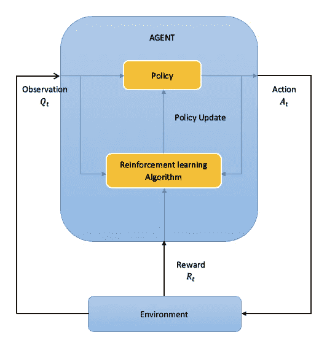

图 8:强化学习的框图

这里有一个好玩的视频，可以让你更好的理解。

***2。他们是否能从数据流中增量学习***

**a)在线学习**

*   该系统能够增量学习
*   小组数据(小批量)被馈送到系统，以允许系统顺序学习(单个实例)。
*   支持核外学习(能够处理无法容纳在内存中的数据)。
*   系统在新的或变化的环境中学习的能力称为学习率。
*   这里，为了处理坏数据，需要监控系统。
*   在连续生成数据的情况下非常有用。

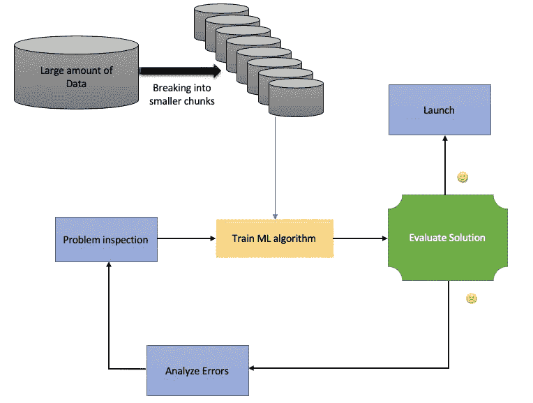

图 9:大型数据集的在线学习

**b)批量学习**

*   该系统能够增量学习。
*   也称为离线学习，因为系统经过训练(系统已经学习)，然后部署到生产中，无需任何进一步的学习过程。
*   使用可用的数据来完成系统的训练。
*   这非常耗时，因为要使用完整的数据集来训练模型。
*   需要大量计算资源来处理大量数据。
*   应用受到限制。

***3。如果他们能测量数据中各点之间的相似性，或者他们能提供模式并建立预测模型***

**a)基于实例的学习:**

*   不执行显式归纳。
*   将定型数据中看到的实例与新数据进行比较，并得出两者之间的相似之处，以做出决策。

**b)基于模型的学习**

一个模型是从一组给定的例子中建立起来的，然后用来进行预测(推理)。

模型构建包括 6 个步骤:

*   **问题定义:**在这一步中，我们确定我们要解决的问题，并尝试用数学方法来表述这个问题。
*   **假设生成:**这一步最好在查看数据之前完成，以便做到无偏见。
*   **数据提取:**从各种来源收集数据。
*   **数据探索和转换:**

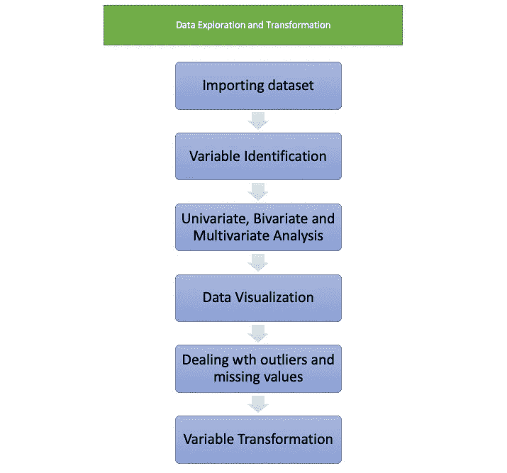

图 10:数据探索和转换中涉及的步骤

*   **预测建模:**这是我们选择模型(例如:线性回归)的部分，需要部署该模型以获得期望的结果。
*   **模型部署/实现:**在这一步中，我们根据训练数据对选定的模型进行训练，并进行预测。不同的*性能测量*用于比较和选择最佳模型。

## 机器学习面临的挑战

ML 涉及的两个主要挑战是糟糕的算法和糟糕的数据。

*   **坏数据:**如果训练数据有噪声，那么系统就很难学习数据中的潜在模式。这将对模型的性能产生负面影响。因此，拥有干净的数据对于开发高性能模型非常重要。

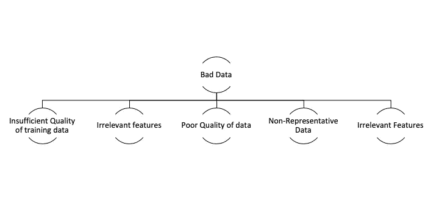

图 11:由于不良数据，机器学习面临的挑战

*   **糟糕的算法:**下面的框图展示了与糟糕算法相关的挑战:

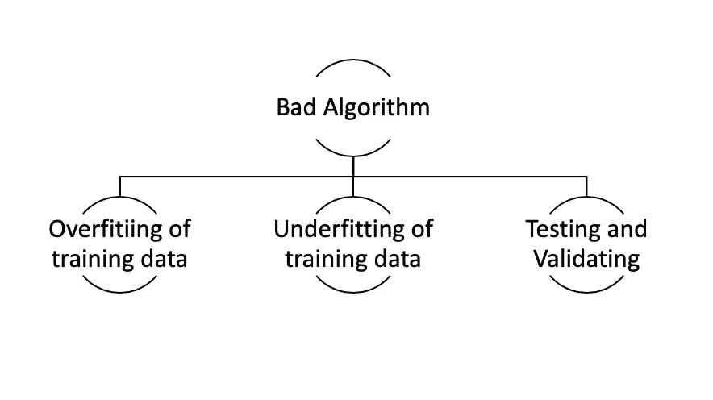

图 12:由于糟糕的算法，机器学习面临的挑战

**参考文献**

*   使用 Scikit-Learn 和 TensorFlow 进行机器学习:构建智能系统的概念、工具和技术，第 1 版，第 1 章。

*恭喜你！现在你对机器学习有了一个基本的概念。*

如果你不熟悉文中提到的任何算法，不要担心，我们将在以后的文章中讨论它们。

如果你有任何问题，你可以在评论中发表，我会很乐意解答。

也可以在 [LinkedIn](https://www.linkedin.com/in/sumit-kumar-3b0a9b171) 上找到我。

*欢迎提出任何改进建议和反馈。*

如果你喜欢我的工作，请考虑关注我，我会写更多关于数据科学的文章。