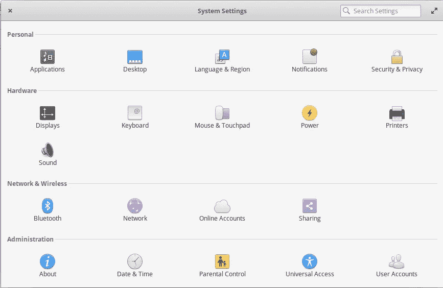
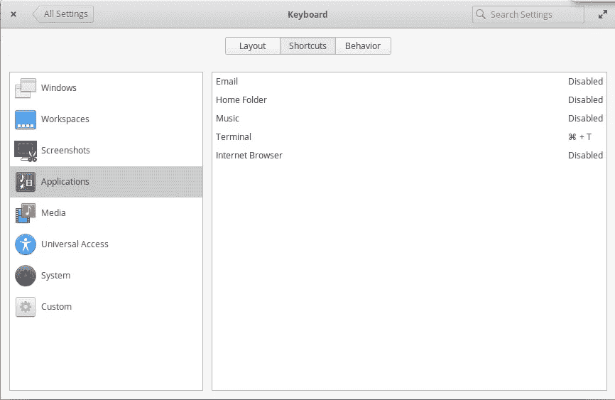
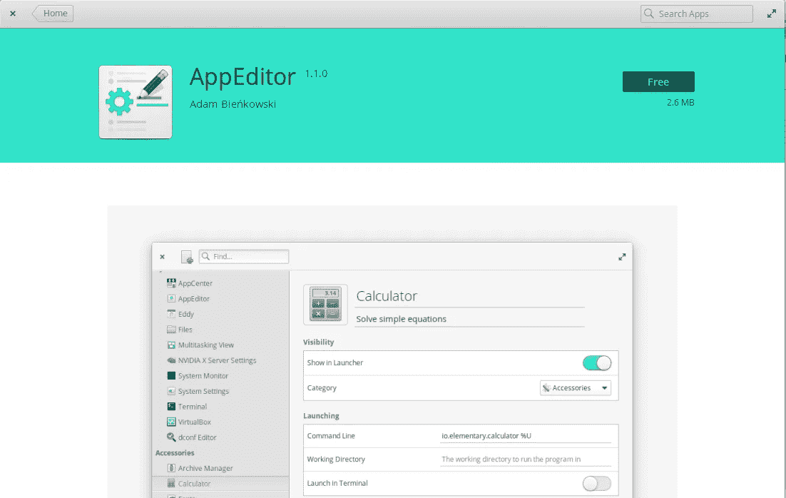
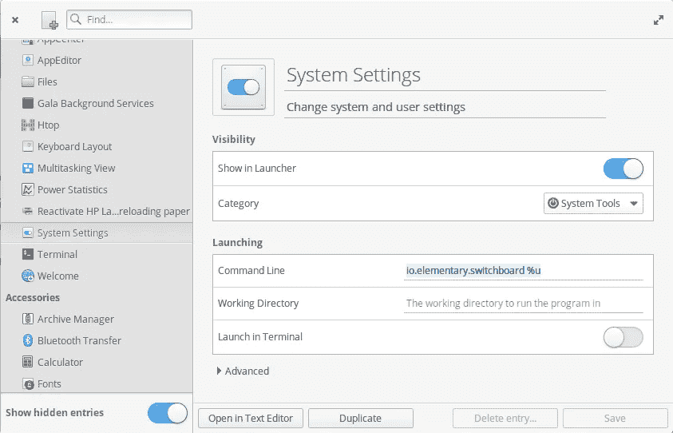
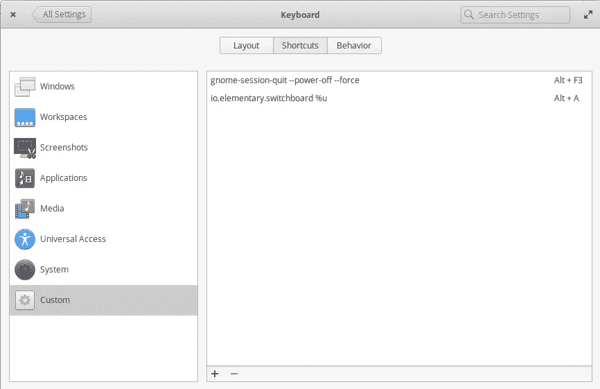
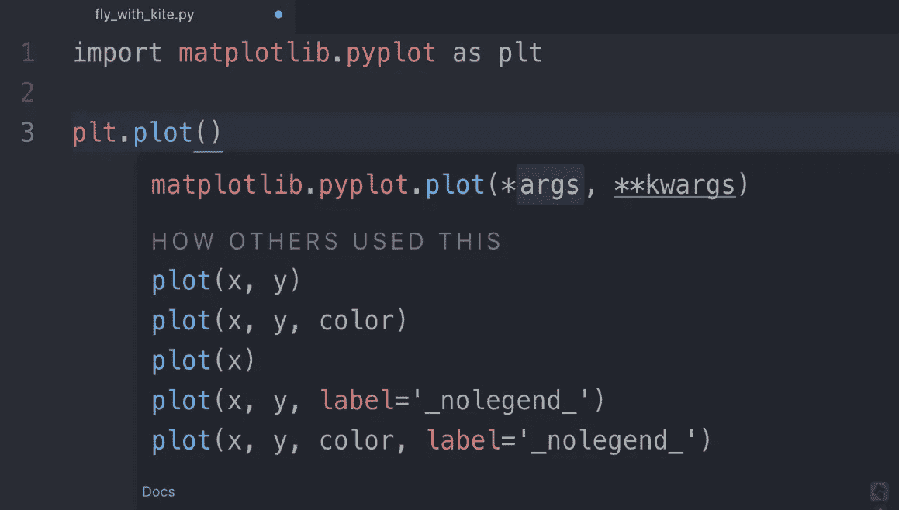

# 关于设置 ElementaryOS (Linux 发行版)的简明指南

> 原文：<https://medium.com/analytics-vidhya/a-gentle-guide-on-setting-up-elementaryos-linux-distribution-for-python-data-science-work-12be4364c4eb?source=collection_archive---------4----------------------->

## 同时你还可以继续使用 Windows。

我一生都是 Windows 用户。我仍然使用 Windows 10 进行数据科学的 Python 工作，直到我发现基于 Linux 的系统有更大的好处。首先，我在使用 Python 时经常遇到 Windows 中的 PATH 问题，无论是在 VS 代码中还是在 Pycharm 中。Windows 在这方面似乎不稳定，而且漏洞百出。其次，大多数服务器计算机使用 Linux 系统，所以从长远来看，开始使用 Linux 将对你有益。

出于这些原因，我强烈建议您尝试一下基于 Linux 的系统。有许多 Linux 发行版，Ubuntu 18.04 长期支持(LTS)是目前最受欢迎的。也可以试试 Linux Mint，弱电脑用的 Xubuntu。你可以点击谷歌查看完全免费的 Linux 发行版的完整列表。不过，我个人选择的是初级 OS。

# I —安装基本操作系统

这里有一个基本操作系统的快速概述:【https://elementary.io/】T2 我选择基本操作系统的主要原因是因为它非常类似于 Ubuntu(安装和命令行完全相同)，但它给了一个开源操作系统一种独特优雅的类似 MacOS 的感觉。在我看来，ElementaryOS 是其中最漂亮也可能是最稳定的 Linux 发行版。在众多 Linux 发行版的海洋中，ElementaryOS 最近做了很多改进，相信不会让你失望。事实上，我已经在 ElementaryOS 工作了几个月了。它不仅没有 bug，而且大大提高了我的创造力和生产力:)


我的基本操作系统界面

要安装初级操作系统，只需遵循这个教程:【https://itsfoss.com/guide-install-elementary-os-luna/】T4 这将解释安装初级操作系统所需的一切。但是，你可以从它的主页上找到最新的初级操作系统包。此时写的是初级 OS 5.1.3 Hera。

因为我在安装双启动 Linux 和 Windows 系统时遇到了很多问题，所以我只给你两个重要的注意事项:

*   首先，确保你仔细阅读并遵循教程，尤其是在选择分区，创建卷和交换区的步骤。我希望在浪费大量时间重新安装和修复系统之前，我已经遵循了这个教程。
*   其次，如果你想拥有双启动 Linux 和 Windows 系统:先安装 Windows 10，再安装 Elementary OS。因为从我的经验来看，如果你先安装 Elementary OS 再安装 Windows 10，Windows 10 的设置会损坏 Elementary OS 的引导文件，使其无法加载。后来我不得不通过重新安装基本操作系统来解决这个问题。

# 二——刷初级安装

许多 ElementaryOS 和 Ubuntu 用户在安装后遇到的典型问题包括关机时的运行时错误信息屏幕和长时间关机(长达 2 分钟)。这让我觉得很没有安全感，好像系统是那么的脆弱，充满了 bug。然而，这些可以很容易地修复如下。

## 1.修复“PCI 错误严重性”关机屏幕

*   步骤 1:备份 grub 配置文件。打开终端并使用以下命令:

```
$ cp /etc/default/grub ~/grub.back
```

*   步骤 2:打开要编辑的 grub 文件:

```
$ sudo nano /etc/default/grub
```

步骤 3:如下编辑该行:

```
GRUB_CMDLINE_LINUX_DEFAULT="quiet splash pci=nomsi"
```

*   第四步:按 Ctrl+O 保存文件→回车，然后按 Ctrl+X 退出。
*   步骤 5:更新 grub 并重启系统

```
$ sudo update-grub
```

## 2.修复 Ubuntu 的缓慢关闭

*   步骤 1:打开 system.conf 文件

```
$ sudo nano /etc/systemd/system.conf
```

*   步骤 2:取消注释并如下设置这些行:

```
RuntimeWatchdogSec=0
ShutdownWatchdogSec=0min
DefaultTimeoutStartSec=10s
DefaultTimeoutStopSec=5s
DefaultRestartSec=100ms
```

*   第三步:按 Ctrl+O 保存文件→回车，然后按 Ctrl+X 退出。
*   第四步:重启。

现在你可以期待你的基本操作系统运行顺畅。

## **参考:**

【https://itsfoss.com/pcie-bus-error-severity-corrected/
https://medium . com/@ sb yang/slow-shut-down-of-Ubuntu-18-04-e5fcc 31255 e 2

# III —定制基本操作系统

## 1.自定义键盘快捷键

若要自定键盘快捷键，请选取“系统设置”>“键盘”>“快捷键”。



在这里，您可以编辑 ElementaryOS 中几乎所有内容的键盘快捷键，例如在窗口中平铺应用程序、切换工作区、设置应用程序的快捷键(打开终端、web 浏览器、个人文件夹等)。

你可以做很多事情来定制 ElementaryOS，你可以在 Google 上搜索特定的东西来了解。在这里我将只向你展示一件没多少人知道的事情。

在应用中心安装**应用编辑器**。



这个应用程序将让你知道应用程序条目的命令行，你可以用它来添加你在别处找不到的自定义键盘快捷键。例如，我可以创建一个新的快捷键来打开系统设置，如下所示。首先在 AppEditor 中复制这个应用程序的命令行，然后将其添加到键盘设置的快捷键选项卡中，并与 Alt+A 之类的组合键绑定。现在我可以通过点击 Alt+A 打开系统设置:



另一个重要的快捷键是关机。将以下命令行复制到系统设置>键盘的快捷方式选项卡中的自定义部分:

```
gnome-session-quit --power-off
```

然后结合 Alt+F3。现在我可以通过按 Alt+F3 来关闭计算机。当然，你可以使用你选择的任何组合键，因为这只是我的偏好。

## 2.自定义启动菜单

按照这个教程安装 Grub 定制器:[https://itsfoss.com/grub-customizer-ubuntu/](https://itsfoss.com/grub-customizer-ubuntu/)

# 四——Git

## 1.安装 git

```
$ sudo apt-get install git
```

## 2.基本 git 命令

*   步骤 1:在 github 上创建一个新的存储库(repo ),并复制它的链接。
*   步骤 2:在终端中打开您的本地项目目录，并按顺序键入以下命令:

```
git init # to initialize an empty repo in your local directory
git add . # to add all files
git commit -m 'your message or note'
git remote add origin <your copied github repo link>
git push origin master
```

更多 git 指南和命令:
[什么是 Git？](https://en.wikipedia.org/wiki/Git)
[GitHub 凭证设置](https://www.freecodecamp.org/news/how-to-fix-git-always-asking-for-user-credentials/)
[https://rogerdudler.github.io/git-guide/](https://rogerdudler.github.io/git-guide/)

# V—设置 Python IDE

## 蟒蛇

您可能知道要开始使用 Python，需要安装的最稳定的发行版之一是 Anaconda。本教程也适用于 ElementaryOS。只需查找最新的 Anaconda 包。

[https://www . digital ocean . com/community/tutorials/how-to-install-anaconda-on-Ubuntu-18-04-quick start](https://www.digitalocean.com/community/tutorials/how-to-install-anaconda-on-ubuntu-18-04-quickstart)

## 原子

Atom 被认为是 Linux 中最稳定、最强大和可定制的文本编辑器之一。这也是我的首选。

如何安装 Atom:[https://flight-manual . Atom . io/getting-started/sections/installing-Atom/](https://flight-manual.atom.io/getting-started/sections/installing-atom/)

## 风筝



Kite 对编码有很多支持。我最喜欢的功能是 Kite copilot，它显示了每个函数和对象的细节，使我的编码变得更加容易和愉快。

[在 Atom](https://kite.com/download/) 中使用风筝插件安装风筝

# VI —设置 R 编程 IDE

## 1.安装最新版本的 R:

默认命令行下的 R-base 安装通常是过时的。下面是克兰项目网站上关于安装最新版本 R 的说明:【https://cran.r-project.org】T21 特别需要调整`/etc/apt/sources.list`中的条目，强制其安装最新版本(本文撰写时为 R 4 . 0 . 0 版)

```
deb http://cloud.r-project.org/bin/linux/debian stretch-cran40/
```

## 2.在 R Studio 中安装“tidyverse”包:

最初，RStudio 在尝试安装“tidyverse”时多次失败。这是因为我的 Linux 系统缺少几个必备的非 R 包。我花了相当长的时间来寻找解决方案，幸运的是这家伙做了一件非常棒的工作:[https://blog . Zeng Yu . com/en/post/2018-01-29/installing-r-r-packages-e-g-tidy verse-and-r studio-on-Ubuntu-Linux/](https://blog.zenggyu.com/en/post/2018-01-29/installing-r-r-packages-e-g-tidyverse-and-rstudio-on-ubuntu-linux/)。如果你遇到和我一样的问题，我希望这能有所帮助。

# VI—用于安装和卸载软件包的 Linux 命令行

## 要安装软件包，请执行以下操作:

```
$ sudo apt-get install <package_name>
```

## 要删除软件包，请执行以下操作:

```
$ dpkg --list # check the installed package 
$ sudo apt-get remove <package_name> # uninstall a package
$ sudo apt-get purge <package_name> # uninstall a package + its config files
$ sudo apt-get autoremove
$ sudo apt-get clean
```

今天我的 ElementaryOS 教程就到这里了。如果这能对你的编码之旅有所帮助或者给你一个新的思路，我会非常高兴。如果你在安装 ElementaryOS 的过程中有其他问题，欢迎留下你的评论，我会尽力帮助你。

祝您愉快:)