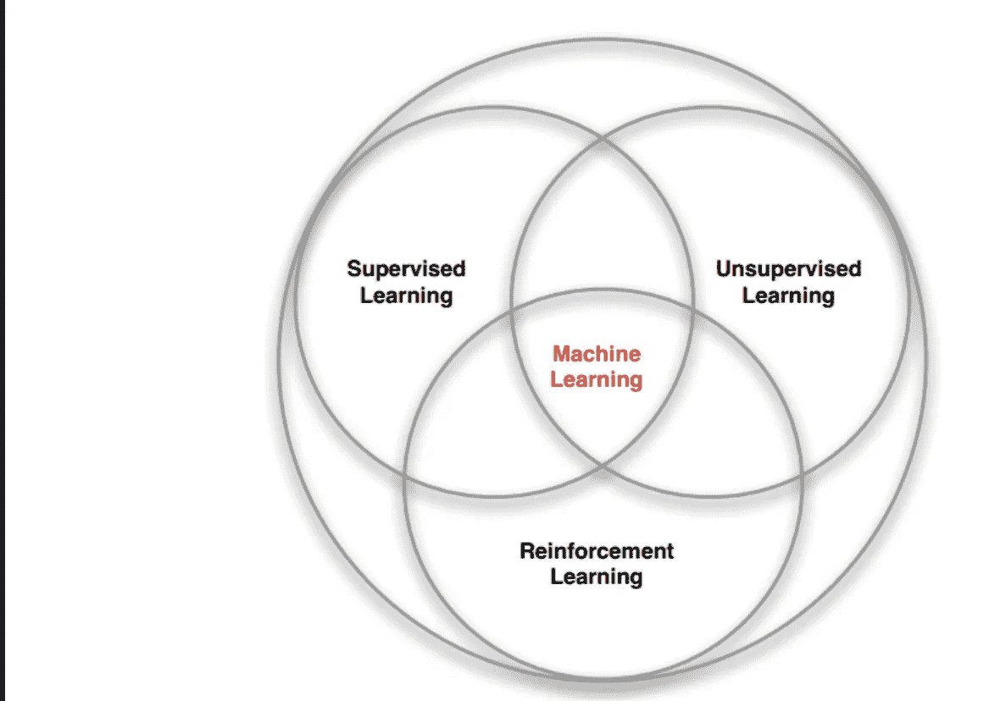

# 对强化学习的温和介绍

> 原文：<https://medium.com/analytics-vidhya/a-gentle-intro-to-reinforcement-learning-4f925b42f31c?source=collection_archive---------20----------------------->

当我开始学习 ML 时，我看到一个图表，它将机器学习分为监督学习、非监督学习和强化学习(RL)。下面是一个变体，很多人可能已经看到了:

image Ref:[https://www . researchgate . net/figure/Reinforcement-Learning-standard-diagram-Fig-2-Machine-Learning-branches-10 _ Fig 2 _ 323178749](https://www.researchgate.net/figure/Reinforcement-Learning-standard-diagram-Fig-2-Machine-Learning-branches-10_fig2_323178749)

在这篇博文中，我将介绍 RL 和 RL 使用的基本构建模块/概念。