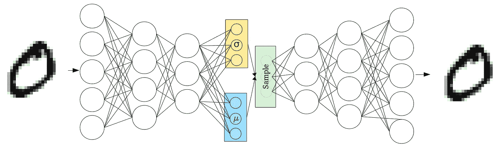
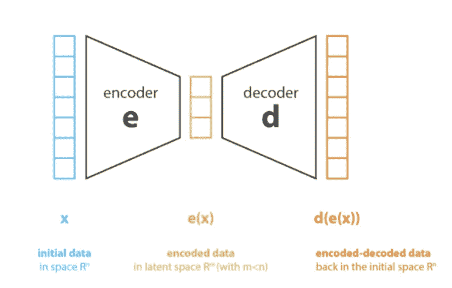
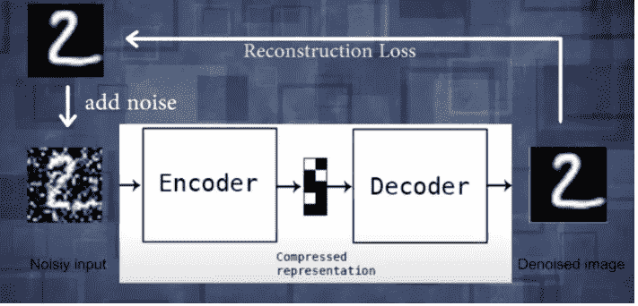
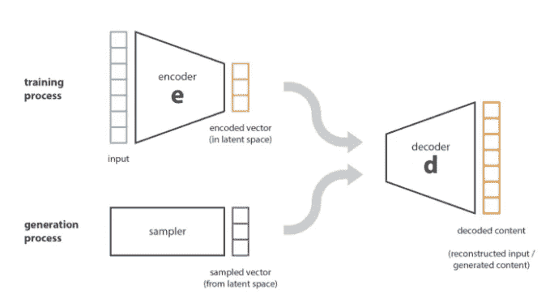
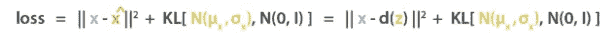

# 变分自动编码器简介

> 原文：<https://medium.com/analytics-vidhya/a-gentle-introduction-into-variational-autoencoders-ca75b1d5b34d?source=collection_archive---------6----------------------->



变分自动编码器的表示。([图像来源](http://www.cvc.uab.es/people/joans/slides_tensorflow/tensorflow_html/vae.html)

想象一下:你花了很长时间在网上搜寻图片，最终找到了放在演示文稿中的完美图片。你保存图像并把它移到你的演示文稿中，这时你意识到，**图像有水印！**当你想起不久前在你的人工智能课上创建的一个计算机程序时，你愤怒地开始拿起你的水瓶扔向计算机:使用自动编码器消除水印的完美方法。

好吧，这是对自动编码器所能做的事情的一种轻描淡写，但仍然是重要的！自动编码器被广泛用于各种各样的事情，从**降维**到**图像生成**到**特征提取**。自动编码器可以让你复制毕加索的作品，缩小万亿字节的数据，并消除安全摄像头拍摄的颗粒状图像的噪声。我们先从如何制作通用自动编码器开始，然后再来讲变型自动编码器。

# 自动编码器的基础知识



自动编码器的简单表示。([图像源](https://towardsdatascience.com/understanding-variational-autoencoders-vaes-f70510919f73))

上面是自动编码器的最简单的表示。它由三个主要部分组成:编码器**、瓶颈**、解码器**。**

编码器是模型学习如何减少输入数据并将其压缩成编码表示的方式，计算机稍后可以使用该编码表示来重建图像。编码器通常采用简单的 CNN 形式，具有卷积层和丢弃层。当编码一个编码器时，我发现使用一个**泄漏的 ReLU 激活函数**也比普通的 ReLU 激活函数效果更好。下面是一个示例编码器，它接收 28x28 图像的输入，返回大小为 8 的瓶颈层，并使用泄漏 ReLU 激活函数:

```
**def** lrelu(x, alpha=0.3):
    **return** tf.maximum(x, tf.multiply(x, alpha))**def** encoder(X_in, keep_prob=0.8):
    activation = lrelu
    **with** tf.variable_scope("encoder", reuse=tf.AUTO_REUSE):
        X = tf.reshape(X_in, shape=[-1, 28, 28, 1])
        x = tf.layers.conv2d(X, filters=64, kernel_size=4, strides=2, padding='same', activation=activation)
        x = tf.nn.dropout(x, keep_prob)
        x = tf.layers.conv2d(x, filters=64, kernel_size=4, strides=2, padding='same', activation=activation)
        x = tf.nn.dropout(x, keep_prob)
        x = tf.layers.conv2d(x, filters=64, kernel_size=4, strides=1, padding='same', activation=activation)
        x = tf.nn.dropout(x, keep_prob)
        x = tf.contrib.layers.flatten(x)
        x = tf.layers.dense(x, units=8)
        return x
```

瓶颈，或者说编码器和解码器之间的区域，是输入数据的压缩形式。数据被编码在 *n* 维度的**潜在空间**中，其中 *n* 是瓶颈中的输出数量。重要的是要记住 *n* 是您设置的超参数，并且 *n* 越大，瓶颈就越接近实际图像，但是它的表示需要更多的存储。瓶颈可以用于特征提取和图像压缩，因为原始图像可以压缩成更小的尺寸，从而需要更少的存储空间。

解码器接收该压缩输入，并尝试从编码表示中重新生成数据，以重建原始图像。解码器再次采用简单的 CNN 形式，具有卷积和丢弃层。通过将原始图像与重建图像进行比较来训练该模型，从而产生**重建损失**，当网络被更新时，该损失被最小化。下面可以看到一个样本解码器，它接收 8 个输入的瓶颈层，返回 28x28 图像的输出，并使用泄漏 ReLU 激活函数:

```
**def** decoder(z, keep_prob=0.8):
     **with** tf.variable_scope("decoder", reuse=tf.AUTO_REUSE):
         x = tf.layers.dense(z, units=8, activation=lrelu)
         x = tf.layers.dense(x, units=49, activation=lrelu)
         x = tf.reshape(x, [-1, 7, 7, 1])
         x = tf.layers.conv2d_transpose(x, filters=64, kernel_size=4, strides=2, padding='same', activation=tf.nn.relu)
         x = tf.nn.dropout(x, keep_prob)
         x = tf.layers.conv2d_transpose(x, filters=64, kernel_size=4, strides=1, padding='same', activation=tf.nn.relu)
         x = tf.nn.dropout(x, keep_prob)
         x = tf.layers.conv2d_transpose(x, filters=64, kernel_size=4, strides=1, padding='same', activation=tf.nn.relu)
         x = tf.contrib.layers.flatten(x) 
         x = tf.layers.dense(x, units=28*28, activation=tf.nn.sigmoid)
         img = tf.reshape(x, shape=[-1, 28, 28])
         **return** img
```

下图显示了如何使用自动编码器去除**水印和噪声**。不是找到输入图像和解码图像之间的重建损失，而是找到没有噪声的图像和解码图像之间的重建损失。



**去噪自动编码器**的示意图。([图像来源](https://www.youtube.com/watch?v=9zKuYvjFFS8&vl=en))

# 可变自动编码器

*注意:变分自动编码器比一般的自动编码器稍微复杂一些，并且需要诸如正态分布、采样和一些线性代数的概念知识。*



变分自动编码器的简化表示。([图片来源](https://towardsdatascience.com/understanding-variational-autoencoders-vaes-f70510919f73))

变化的自动编码器建立在通用自动编码器的概念上，但是代替解码器接收瓶颈向量，它现在接收瓶颈向量的**样本**。这防止了自动编码器的过度拟合，因为瓶颈向量中的每个点都没有被用于训练解码器。为了进一步减少过拟合，采样分布取自**正态分布** (N(0，1))的点。

简而言之，变分自动编码器是一种其训练被正则化以避免过拟合并确保潜在空间能够实现生成过程的编码器。它从编码向量的潜在空间中采样点，并将这些点作为输入传递给解码器。

在更深的层次上，编码向量被分成两个向量:一个平均值向量和一个样本偏差向量。这些向量是运行反向传播来更新编码器和解码器的权重。您可能想知道，训练网络的损耗函数是否仍然与一般的自动编码器相同？

不完全是。虽然损失中仍使用了重构损失，但增加了一项:a **正则化损失**(KL 的 Kulback-Leibler 散度)，使得编码器返回的分布(均值向量和标准差向量)接近标准正态分布。假设解码器为 *d* ，样本为 *z* ，则损失函数如下:



变分自动编码器损失函数的公式。([图像源](https://towardsdatascience.com/understanding-variational-autoencoders-vaes-f70510919f73))

用较少的数学术语来表达向量空间的规律性或正态分布，可以用两个术语来解释:**连续性**和**完备性**。潜在空间在训练中努力实现这两个属性。连续性是指当解码时，潜在空间中的两个接近点不应该给出两个完全不同的内容。完整性是这样一个条件，即从潜在空间中采样的一个点一旦被解码就应该给出有意义的内容。

# 项目理念

既然你已经了解了可变自动编码器背后的理论，现在是时候通过自己编写一个来测试它了。您的第一个项目将使用 Tensorflow 生成类似于 MNIST 数据集的数字。最终代码可以在这里看到:

[](https://github.com/adityamittal13/Semisupervised-GANs-for-Melanoma-Detection/blob/main/Variational%20Autoencoder%20for%20MNIST%20Dataset%20%28No%20Training%20Output%29.ipynb) [## adiyamittal 13/半超免疫-GANs-用于黑色素瘤检测

### Permalink GitHub 是 5000 多万开发人员的家园，他们共同主持和审查代码，管理项目，以及…

github.com](https://github.com/adityamittal13/Semisupervised-GANs-for-Melanoma-Detection/blob/main/Variational%20Autoencoder%20for%20MNIST%20Dataset%20%28No%20Training%20Output%29.ipynb) 

祝你好运，我希望这个项目将向你展示可变自动编码器的不可思议的力量！从它在电影中的应用到安全性，可变自动编码器无疑将是未来人工智能的驱动力。

# TL；速度三角形定位法(dead reckoning)

*   自动编码器具有多种功能，从去除噪声到生成图像再到压缩图像。
*   一般的自动编码器由三部分组成:编码器、瓶颈和解码器。瓶颈是您的图像的压缩形式为 *n* 维，其中 *n* 是输出数量。
*   使用重建损失来训练通用自动编码器，重建损失测量重建图像和原始图像之间的差异。
*   变分自动编码器基本相同，但它们使用正态分布的瓶颈向量样本来减少过度拟合。

# 进一步阅读

注意:这些是按照从最容易理解到最难理解的顺序排列的。我建议从顶部的资源开始！

*   文章:[自动编码器:它的基础和用途](https://towardsdatascience.com/auto-encoder-what-is-it-and-what-is-it-used-for-part-1-3e5c6f017726)
*   视频:[变型自动编码器](https://www.youtube.com/watch?v=9zKuYvjFFS8&vl=en)
*   文章:[了解变分自动编码器](https://towardsdatascience.com/understanding-variational-autoencoders-vaes-f70510919f73)
*   文章:[使用变分自动编码器绘制 MNIST 字符](https://towardsdatascience.com/teaching-a-variational-autoencoder-vae-to-draw-mnist-characters-978675c95776)

*如果你想多谈谈 hyperloops 或者其他什么，安排一次会面:* [*日历*](https://calendly.com/adityamittal307) *！关于我目前正在做的项目的信息，可以考虑订阅我的* [*简讯*](https://preview.mailerlite.com/n6i2a6///txt/?_ga=2.41361956.740814334.1602086419-725195476.1601478917&_gac=1.23735624.1601481944.CjwKCAjw2dD7BRASEiwAWCtCb9e_PY7h1fV_Dzcreyzgo-fJf8FaYXuduumwCUXXJrpyha4XDaPfohoCTJMQAvD_BwE) *！下面是* [*订阅*](https://forms.gle/pLWuNuBuJQokMk3N8) *的链接。有兴趣连线的话，关注我上*[*Linkedin*](https://www.linkedin.com/in/adityamittal-/)*[*Github*](https://github.com/adityamittal13)*[*中*](/@adityamittal307) *。***