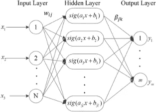
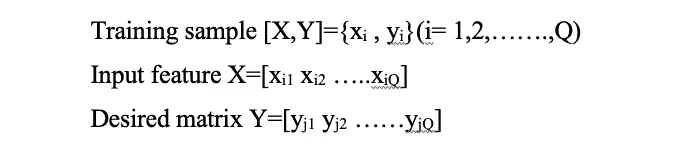
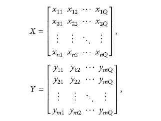
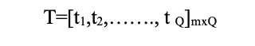
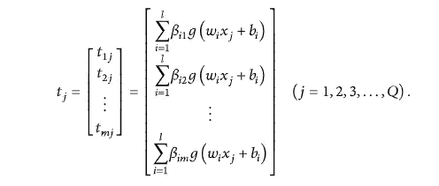
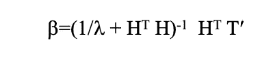
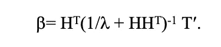

# 极限学习机温和介绍[ELM]

> 原文：<https://medium.com/analytics-vidhya/a-gentle-introduction-to-extreme-learning-machines-elm-91bb793effa8?source=collection_archive---------8----------------------->

# 为什么是榆树？

在过去的几十年中，基于反向传播(BP)的算法在前向神经网络的训练中发挥了主导作用。另一方面，它们缺乏更快的神经网络学习算法。传统的学习算法可能需要几个小时、几天甚至更多的时间来训练神经网络。人们提出了许多算法来提高单前馈神经网络的运算速度和精度，如 BP 算法及其改进算法。由于 BP 算法的局限性，网络的泛化能力不理想，容易出现过学习。2004 年，Huang G.B 提出了极限学习机(ELM ),该学习机在训练前馈神经网络和克服 BP 算法及其变体所面临的局限性方面显示了其有效性。

# 榆树是什么？

极端学习机是一种新的学习算法，用于具有单层或多层隐节点的前馈神经网络，其中输入和隐节点之间的权重是随机分配的，并且在训练和预测阶段从不更新。它使用 Moore Penrose 广义逆来设置其权重。ELMs 能够产生可接受的预测性能，并且其学习速度比其他算法快数千倍，并且其计算成本比通过反向传播算法训练的网络低得多。

# 算法:

图 1 榆树的结构

ELM 的学习阶段通常包括:

*   用随机隐含神经元构造隐含层输出矩阵
*   查找输出连接。

图 1 是 ELM 网络结构，包括 n 个输入层神经元、l 个隐藏层神经元和 m 个输出层神经元。考虑一下，

其中矩阵 X 和矩阵 Y 可以表示为:

其中参数 n 和 m 是输入和输出矩阵的维数。

然后 ELM 随机设置输入层和隐含层之间以及隐含层和输出层之间的权重，其中图 1 中的 wij 表示第 *j* 个输入层和第 *i* 个隐含层神经元之间的权重， *b* jk 表示第 *j* 个隐含层和第 *k* 个输出层神经元之间的权重。

ELM 随机设置隐藏层神经元的偏置:

ELM 选择网络激活函数 g(x)。根据图 1，输出矩阵 T 可以表示为

输出矩阵 T 的每个列向量是:

从输出矩阵和输出矩阵方程的每一列向量，我们可以得到

其中 T '是 T 的转置，H 是隐藏层的输出。为了获得误差最小的唯一解，我们用最小二乘法计算 b 的权矩阵值。

为了提高网络的泛化能力，使结果更加稳定，我们加入了一个正则项。当隐藏层神经元的数量小于训练样本的数量时，β可以表示为

当隐藏层神经元的数量大于训练样本的数量时，β可以表示为

# 理论:

已证明 ELM 具有通用近似和分类能力。

只要隐藏神经元的输出函数是非线性分段连续的，并且即使它们的形状和建模未知，具有随机隐藏神经元的(生物)神经网络同时获得**通用逼近**和**分类能力**，并且有限数量的隐藏神经元及其相关连接的变化不影响网络的整体性能。从[这里](https://arxiv.org/pdf/2004.08867.pdf)你可以更好的了解数学上的普适近似定理。

# 变体:

随着传统 ELM 算法的发展，许多改进的 ELM 算法被提出；同时，ELM 的实现范围已经从监督学习进一步扩展到半监督和非监督学习。

榆树变种是，

*   完全复杂榆树
*   增量 ELM
*   在线顺序 ELM
*   全体榆树
*   修剪榆树

# 可靠性:

机器学习方法的可靠应用在具有挑战性的工程领域变得越来越重要。特别是，极限学习机(ELM)的应用似乎很有前景，因为它们明显简单，并且能够非常有效地处理大型和高维数据集。然而，ELM 范例是基于具有随机初始化和固定输入权重的单隐层神经网络的概念，因此本质上是不可靠的。一般而言，神经网络的黑盒特性，尤其是极限学习机(ELM)的黑盒特性，是工程师们在不安全的自动化任务中拒绝应用的主要问题之一。这个特殊的问题是通过几种不同的技术来解决的。一种方法是减少对随机输入的依赖。另一种方法集中于将连续约束结合到 elm 的学习过程中，该学习过程来自于关于特定任务的先验知识。这是合理的，因为机器学习解决方案必须保证许多应用领域中的安全操作。上述研究表明，具有功能分离和线性读出权重的特殊形式的 ELMs 特别适合于在输入空间的预定义区域中有效合并连续约束。

# 问题:

虽然在过去的几年里，高维数据应用已经取得了大量的成果，但以下三个问题值得考虑。

*   免调优是 ELM 最重要的贡献之一。然而，各种方法和应用已经将迭代更新处理应用到原始 ELM 中以产生良好的泛化性能，例如使用遗传算法、增强方法、修剪方法和进化集成。虽然通过引入这些策略，模型回归精度和数据分类性能或多或少得到了提高，但毫无疑问，计算复杂度也增加了。因此，如何平衡性能和处理时间是一个悬而未决的问题，特别是对于高维数据的应用。
*   对于特定的应用，如何选择最佳的隐神经元数目还没有很好地解决。在现有的大部分工作中，很少讨论隐神经元的选择，几乎所有的隐神经元都是以试探性的方式人工选择的。虽然一些研究人员声称，当使用大量隐藏神经元时，ELM 及其变体的性能趋于稳定和可接受，但冗余和高计算负担也会出现。
*   非常需要为具有 ELM 的应用设计实时处理系统和设备。尽管在过去的 10 年左右的时间里，已经有大量的研究成果被报道，但是其中的大部分仍然是在实验室中通过计算机模拟进行的。不同应用的真实设备总是面临着各种挑战，这对于大数据应用来说更为明显。

# 参考资料:

*   [https://en . Wikipedia . org/wiki/Extreme _ learning _ machine #:~:text = Extreme % 20 learning % 20 machines % 20 are % 20 前馈，hidden % 20 nodes)% 20 need % 20 not % 20 be](https://en.wikipedia.org/wiki/Extreme_learning_machine#:~:text=Extreme%20learning%20machines%20are%20feedforward,hidden%20nodes)%20need%20not%20be)
*   [https://www . NTU . edu . SG/home/egbhuang/pdf/ELM-Rosenblatt-neumann . pdf](https://www.ntu.edu.sg/home/egbhuang/pdf/ELM-Rosenblatt-Neumann.pdf)
*   【https://arxiv.org/pdf/2004.08867.pdf 