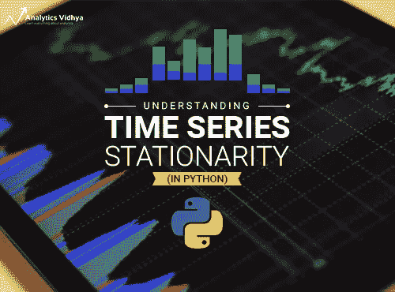
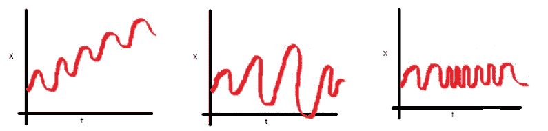
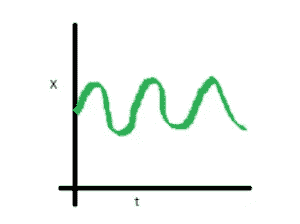
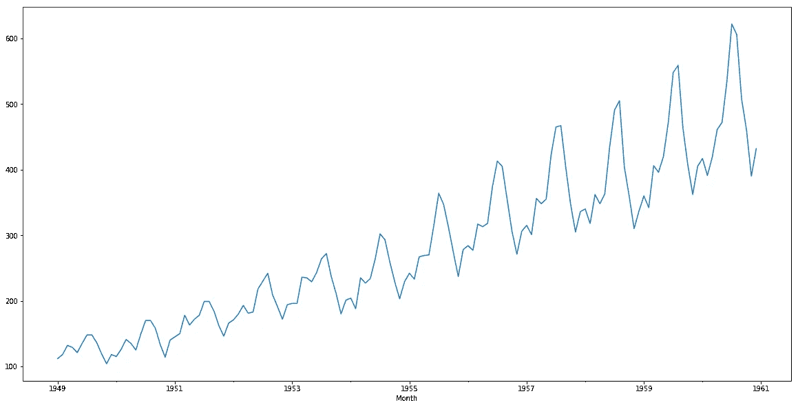
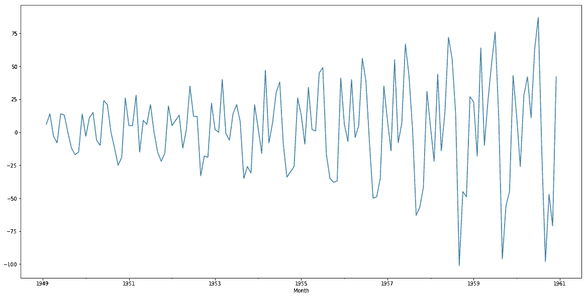
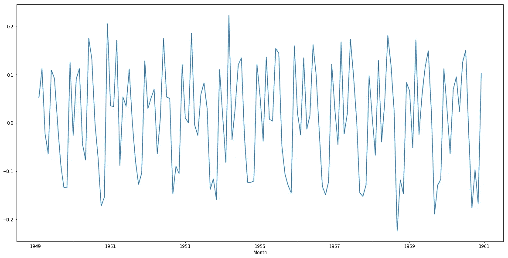

# 用 Python 处理非平稳时间序列的简明介绍

> 原文：<https://medium.com/analytics-vidhya/a-gentle-introduction-to-handling-a-non-stationary-time-series-in-python-8be1c1d4b402?source=collection_archive---------1----------------------->

这些应用程序有什么共同点:预测一个家庭未来三个月的用电量，估计特定时段的道路交通流量，以及预测纽约证券交易所的股票交易价格？

都属于时间序列数据的概念！如果没有“时间”这个因素，你就无法准确预测这些结果中的任何一个。随着我们周围的世界产生越来越多的数据，时间序列预测不断成为数据科学家掌握的越来越重要的技术。

但是时间序列是一个复杂的话题，同时涉及多个方面。



首先，如果我们想让预测模型很好地工作，使时间序列平稳是至关重要的。为什么？因为你收集的大部分数据都会有非平稳趋势。如果尖峰是不稳定的，你怎么能确定模型会正常工作呢？

本文的重点是检查时间序列数据平稳性的方法。本文假设读者熟悉时间序列、ARIMA 和平稳性的概念。下面是一些复习基础知识的参考资料:

*   [时间序列建模完整教程](https://www.analyticsvidhya.com/blog/2015/12/complete-tutorial-time-series-modeling/)
*   [综合初学者指南创建时间序列预测](https://www.analyticsvidhya.com/blog/2016/02/time-series-forecasting-codes-python/)

# 目录

1.  平稳性简介
2.  加载数据
3.  检查平稳性的方法
    3.1 ADF 测试
    3.2 KPSS 测试
4.  平稳性的类型
    4.1 严格平稳
    4.2 差分平稳
    4.3 趋势平稳
5.  使时间序列平稳
    5.1 差分
    5.2 季节差分
    5.3 对数变换

# 1.平稳性介绍

“平稳性”是你在处理时间序列数据时会遇到的最重要的概念之一。**平稳序列是指其属性(均值、方差和协方差)不随时间变化的序列。**

让我们用一个直观的例子来理解这一点。考虑下面显示的三幅图:



*   在第一幅图中，我们可以清楚地看到平均值随时间变化(增加),这导致了上升趋势。因此，这是一个非平稳序列。**对于要归类为平稳的系列，它不应显示趋势。**
*   转到第二个图，我们当然看不到序列中的趋势，但是序列的方差是时间的函数。如前所述，平稳序列必须有一个恒定的方差。
*   如果看第三个图，随着时间的增加，分布变得更接近，这意味着协方差是时间的函数。

上面显示的三个例子代表非平稳时间序列。现在来看第四个情节:



在这种情况下，均值、方差和协方差随时间保持不变。这就是平稳时间序列的样子。

想一想这个问题——使用上面哪个图预测未来值更容易？第四个情节吧？大多数统计模型要求序列是平稳的，以便进行有效和精确的预测。

总之，平稳时间序列是指其性质(即均值、方差和协方差)不依赖于时间的序列。在下一节中，我们将介绍检查给定序列是否平稳的各种方法。

# 2.加载数据

在本节和接下来的几节中，我将介绍检查时间序列数据平稳性的方法，以及处理任何非平稳序列所需的技术。我还提供了应用每种技术的 python 代码。**你可以从这个链接下载我们将要使用的数据集:** [**航空乘客**](https://s3-ap-south-1.amazonaws.com/av-blog-media/wp-content/uploads/2018/09/AirPassengers.csv) **。**

在我们继续分析数据集之前，让我们先加载和预处理数据。

```
#loading important libraries
import pandas as pd
import matplotlib.pyplot as plt
%matplotlib inline

#reading the dataset
train = pd.read_csv('AirPassengers.csv')

#preprocessing
train.timestamp = pd.to_datetime(train.Month , format = '%Y-%m')
train.index = train.timestamp
train.drop('Month',axis = 1, inplace = True)

#looking at the first few rows
#train.head()#Passengers  Month 
1949–01–01    112 
1949–02–01    118 
1949–03–01    132 
1949–04–01    129 
1949–05–01    121
```

看起来我们准备好了！

# 3.检验平稳性的方法

下一步是确定一个给定的序列是否是平稳的，并相应地处理它。本节将介绍一些我们可以用来执行这种检查的常用方法。

# 目视检查

考虑我们在上一节中使用的图。我们能够识别出均值和方差随时间变化的序列，只需查看每个图。类似地，我们可以绘制数据并确定序列的属性是否随时间变化。

```
train['#Passengers'].plot()
```



尽管很明显我们在上面的系列中有一个趋势(变化的平均值),这种可视化的方法可能并不总是给出准确的结果。最好使用一些统计测试来确认观察结果。

# 统计检验

除了视觉测试，我们可以使用统计测试，比如单位根平稳测试。单位根表示给定序列的统计性质不随时间恒定，这是平稳时间序列的条件。下面是相同的数学解释:

假设我们有一个时间序列:

y(t) = a*y(t-1) + ε( t)

其中 y(t)是 t 时刻的值，ε(t)是误差项。为了计算 y(t ),我们需要 y(t-1)的值，即:

y(t-1) = a*y(t-2) + ε (t-1)

如果我们对所有观测值都这样做，yt 的值将会是:

y(t)= a^n*y(t-n)+σε(t-i)*a^i

如果上式中 a 的值为 1(单位)，那么预测值将等于 y(t-n)和从 t-n 到 t 的所有误差之和，这意味着方差将随时间增加。这就是时间序列中的单位根。我们知道，对于一个平稳的时间序列，方差一定不是时间的函数。单位根测试通过检查 a 值是否=1 来检查数列中单位根的存在。下面是两个最常用的单位根平稳测试:

## ADF 试验

迪基富勒测试是最流行的统计测试之一。它可以用来确定数列中单位根的存在，从而帮助我们理解数列是否平稳。该检验的无效假设和替代假设是:

**零假设**:数列有单位根(a =1)

**交替假设**:数列没有单位根。

如果我们不能拒绝零假设，我们可以说这个序列是非平稳的。这意味着序列可以是线性的或差分平稳的(我们将在下一节了解更多关于差分平稳的内容)。

**Python 代码:**

```
#define function for ADF test
from statsmodels.tsa.stattools import adfuller
def adf_test(timeseries):
    #Perform Dickey-Fuller test:
    print ('Results of Dickey-Fuller Test:')
    dftest = adfuller(timeseries, autolag='AIC')
    dfoutput = pd.Series(dftest[0:4], index=['Test Statistic','p-value','#Lags Used','Number of Observations Used'])
    for key,value in dftest[4].items():
       dfoutput['Critical Value (%s)'%key] = value
    print (dfoutput)

#apply adf test on the series
adf_test(train['#Passengers'])
```

**ADF 测试结果:**ADF 测试给出了以下结果——测试统计量、p 值以及 1%、5%和 10%置信区间的临界值。我们对这一特定系列的测试结果如下:

```
Results of Dickey-Fuller Test:
Test Statistic                   0.815369
p-value                          0.991880
#Lags Used                      13.000000
Number of Observations Used    130.000000
Critical Value (1%)             -3.481682
Critical Value (5%)             -2.884042
Critical Value (10%)            -2.578770
dtype: float64
```

**平稳性检验**:如果检验统计量小于临界值，我们可以拒绝零假设(也就是序列是平稳的)。当检验统计量大于临界值时，我们无法拒绝零假设(这意味着序列不是平稳的)。

在上面的例子中，检验统计量>临界值，这意味着序列不是平稳的。这证实了我们最初在视觉测试中看到的原始观察。

## 2 .KPSS(科维亚特科夫斯基-菲利普-施密特-申)试验

KPSS 是另一种检验时间序列平稳性的测试(比迪基·富勒测试稍逊一筹)。KPSS 检验的无效假设和替代假设与 ADF 检验的相反，这经常造成混淆。

KPSS 测试的作者定义了零假设，因为过程是趋势平稳的，到一个单位根序列的替代假设。我们将在下一节详细了解*趋势平稳性*。现在，让我们把重点放在实现上，看看 KPSS 测试的结果。

**零假设:**过程是趋势平稳的。

**交替假设:**数列有单位根(数列不是平稳的)。

**Python 代码:**

```
#define function for kpss test
from statsmodels.tsa.stattools import kpss
#define KPSS
def kpss_test(timeseries):
    print ('Results of KPSS Test:')
    kpsstest = kpss(timeseries, regression='c')
    kpss_output = pd.Series(kpsstest[0:3], index=['Test Statistic','p-value','Lags Used'])
    for key,value in kpsstest[3].items():
    kpss_output['Critical Value (%s)'%key] = value
print (kpss_output)
```

**KPSS 检验结果**:以下是 KPSS 检验的结果——检验统计量、p 值、1%、2.5%、5%、10%置信区间的临界值。对于航空乘客数据集，以下是结果:

```
Results of KPSS Test:
Test Statistic            1.052175
p-value                   0.010000
Lags Used                14.000000
Critical Value (10%)      0.347000
Critical Value (5%)       0.463000
Critical Value (2.5%)     0.574000
Critical Value (1%)       0.739000
dtype: float64
```

**平稳性检验**:如果检验统计量大于临界值，我们拒绝零假设(序列不是平稳的)。如果检验统计量小于临界值，如果不能拒绝零假设(序列是平稳的)。对于航空旅客数据，检验统计量的值在所有置信区间都大于临界值，因此我们可以说该序列不是平稳的。

在为我的时间序列数据准备模型之前，我通常会执行这两种统计测试。有一次，两次测试显示出相互矛盾的结果。其中一个测试显示该系列是稳定的，而另一个测试显示该系列不是！我在这一部分被困了几个小时，试图弄明白这怎么可能。事实证明，平稳性的类型不止一种。

因此，总而言之，ADF 检验有一个线性或差异平稳的替代假设，而 KPSS 检验确定一个序列的趋势平稳性。

# 3.平稳性的类型

让我们了解不同类型的平稳性以及如何解释上述测试的结果。

*   **严格平稳**:严格平稳序列满足平稳过程的数学定义。对于严格平稳序列，均值、方差和协方差都不是时间的函数。目的是将一个非平稳序列转换成一个严格的平稳序列来进行预测。
*   **趋势平稳**:没有单位根但呈现趋势的序列称为趋势平稳序列。一旦趋势被去除，产生的序列将是严格平稳的。KPSS 检验将没有单位根的序列归类为平稳序列。这意味着序列可以是严格平稳的或趋势平稳的。
*   **差分平稳**:可以通过差分使之严格平稳的时间序列属于差分平稳。ADF 检验也称为差异平稳性检验。

最好同时应用这两个检验，这样我们就能确定这个序列是真正平稳的。让我们看看应用这些静态测试的可能结果。

*   **情况 1** :两个测试的结论都是序列不平稳- >序列不平稳
*   **情况 2** :两个测试的结论都是序列是平稳的- >序列是平稳的
*   **情况 3** : KPSS =平稳，ADF =不平稳- >趋势平稳，去除趋势使序列严格平稳
*   **情况 4** : KPSS =不平稳，ADF =平稳- >差分平稳，使用差分使序列平稳

# 4.使时间序列平稳

既然我们已经熟悉了平稳性的概念及其不同的类型，我们终于可以继续实际上使我们的系列平稳。请记住，为了使用时间序列预测模型，必须先将任何非平稳序列转换为平稳序列。

# 区别

在这种方法中，我们计算序列中连续项的差。通常执行差分来消除变化的平均值。数学上，差异可以写成:

y(t)'= y(t) — y(t-1)

*其中 y(t)是时间 t* 的值

对我们的系列应用差分并绘制结果:

```
train['#Passengers_diff'] = train['#Passengers'] - train['#Passengers'].shift(1) train['#Passengers_diff'].dropna().plot()
```



# 季节性差异

在季节差异中，我们不是计算连续值之间的差异，而是计算同一季节的一个观测值与前一个观测值之间的差异。例如，在星期一进行的观察将从上一个星期一进行的观察中减去。数学上可以写成:

y(t)'= yt — y(t-n)

```
n=7 train['#Passengers_diff'] = train['#Passengers'] - train['#Passengers'].shift(n)
```

# 转换

变换用于稳定序列的非恒定方差。常见的变换方法包括幂变换、平方根和对数变换。让我们对我们的航空乘客数据集进行快速对数转换和差分:

```
train['#Passengers_log'] = np.log(train['#Passengers'])
train['#Passengers_log_diff'] = train['#Passengers_log'] - train['#Passengers_log'].shift(1)
train['#Passengers_log'] = np.sqrt(train['#Passengers'].dropna())
```



正如你所看到的，这个图比之前的图有了很大的改进。你可以在级数上使用平方根或幂变换，看看他们是否能得出更好的结果。欢迎在下面的评论区分享你的发现！

# 结束注释

在本文中，我们介绍了不同的方法，可以用来检查时间序列的平稳性。但是责任并不止于此。下一步是对我们获得的序列应用预测模型。可以参考下面这篇文章来建立这样一个模型:[时间序列预测初学者指南](https://www.analyticsvidhya.com/blog/2016/02/time-series-forecasting-codes-python/)。

如果您对本文有任何问题或反馈，可以在下面的评论部分与我联系。

*原载于 2018 年 9 月 13 日*[*www.analyticsvidhya.com*](https://www.analyticsvidhya.com/blog/2018/09/non-stationary-time-series-python/)*。*