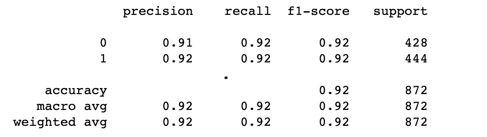
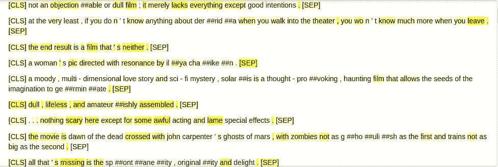

# 一个温和的介绍实现伯特使用拥抱脸！

> 原文：<https://medium.com/analytics-vidhya/a-gentle-introduction-to-implementing-bert-using-hugging-face-35eb480cff3?source=collection_archive---------8----------------------->

在这篇文章中，我将分享我使用[拥抱人脸库](https://huggingface.co/transformers/model_doc/bert.html)实现来自变压器(BERT) 的[双向编码器表示的心得。BERT 是 Google 为不同的自然语言处理(NLP)任务开发的最新模型。在这篇文章中，我们将使用](https://arxiv.org/abs/1810.04805)[斯坦福树库数据集](https://nlp.stanford.edu/sentiment/treebank.html)构建一个情感分析分类器，该数据集包含电影评论的肯定句和否定句。为此，我们将使用拥抱人脸库中的`[BertForSequenceClassification](https://huggingface.co/transformers/model_doc/bert.html?highlight=bert#bertforsequenceclassification)`模块。该代码可在[https://github.com/rajatbhatnagar94/bert_getting_started](https://github.com/rajatbhatnagar94/bert_getting_started)获得。

**快速笔记**

为了完全理解本文，我强烈建议您对 Pytorch 概念有一个基本的了解。我发现[这个](https://pytorch.org/tutorials/beginner/pytorch_with_examples.html)对理解它的基础很有帮助。我发现[这篇](https://towardsdatascience.com/deconstructing-bert-part-2-visualizing-the-inner-workings-of-attention-60a16d86b5c1)文章对于理解 BERT 模型内部工作的基础很有用。

**下载并保存数据集**

为了简单起见，我在这里上传了 Github 资源库[中的数据。您可以从这里下载培训、开发和测试集，并保存在任何目录中(在我的例子中是示例`data/<dataset_type>.csv`),或者直接克隆存储库。数据集非常小，所以我们不需要花很长时间来训练或克隆存储库。](https://github.com/rajatbhatnagar94/bert_getting_started/tree/master/data)


# 我们开始吧！

让我们导入将在整个教程中使用的所有库。安装库的说明在 [README.md](https://github.com/rajatbhatnagar94/bert_getting_started/blob/master/README.md) 中给出。

```
import os
import pandas as pd
import torch
import transformers
import sklearn
from transformers import BertTokenizer,BertForSequenceClassification
from IPython.core.display import display, HTML
```

# **读取所有数据集**

培训、测试和开发数据集可以按如下方式导入:

```
dataset = {
            "name": "Stanford treebank",
            "train_path": "data/train.csv",
            "dev_path": "data/dev.csv",
            "test_path": "data/test.csv",
            'classes': ['neg', 'pos']
          }def read_data():
    train = pd.read_csv(dataset['train_path'], sep='\t')
    dev = pd.read_csv(dataset['dev_path'], sep='\t')
    test = pd.read_csv(dataset['test_path'], '\t')
    return train, dev, test
train, dev, test = read_data()
```

# 制作批次和使用数据加载器

一旦我们有了原始数据，我们需要在训练数据之前做两件事:

1.  将文本句子标记化，并将其转换为矢量化形式
2.  使用[数据加载器](https://pytorch.org/docs/stable/data.html#torch.utils.data.DataLoader)为训练、开发和测试集创建批量矢量化记号

**对文本句子进行分词并转换成矢量化形式**

将数据转换成我们将传递给 BERT 模型的格式。为此我们将使用拥抱脸提供的`[tokenizer.encode_plus](https://huggingface.co/transformers/main_classes/tokenizer.html?highlight=encode_plus#transformers.PreTrainedTokenizer.encode_plus)`功能。首先我们定义记号赋予器。为此，我们将使用`[BertTokenizer](https://huggingface.co/transformers/model_doc/bert.html#berttokenizer)`。

```
tokenizer = BertTokenizer.from_pretrained('bert-base-uncased')
```

稍后我们将传递两个变量给伯特的正向函数，即`[input_ids](https://huggingface.co/transformers/glossary.html#input-ids)`和`[attention_mask](https://huggingface.co/transformers/glossary.html#attention-mask).``[input_ids](https://huggingface.co/transformers/glossary.html#input-ids)`仅仅是记号的数字表示。当我们向输入标记添加填充时,`[Attention_mask](https://huggingface.co/transformers/glossary.html#attention-mask)`是有用的。注意掩码告诉我们哪些 input _ ids 对应于填充。添加填充是因为我们希望所有输入的句子长度相同(至少对于一个批处理来说)，这样我们就能够正确地形成张量对象。我们将使用`[tokenizer.encode_plus](https://huggingface.co/transformers/main_classes/tokenizer.html?highlight=encode_plus#transformers.PreTrainedTokenizer.encode_plus)`函数来获取`input_ids, attention_mask.`

```
def encode(data, tokenizer):
    input_ids = [] attention_mask = [] for text in data: tokenized_text = tokenizer.encode_plus(text,
                                            max_length=128,
                                            add_special_tokens =          True,
                                            pad_to_max_length=True,
                                            padding_side='right',
                                            return_attention_mask=True) input_ids.append(tokenized_text['input_ids']) attention_mask.append(tokenized_text['attention_mask'])

    return torch.tensor(input_ids, dtype=torch.long), torch.tensor(attention_mask, dtype=torch.long)
```

上面的`encode`函数将迭代所有的句子，对于每个句子——标记文本，截断或添加填充以使其长度为 128，添加特殊标记([CLS]、[SEP]、[PAD])并返回`attention_mask.`,我们需要将所有这些传递给 BERT 分类器的 forward 函数。

**使用** [**数据加载器**](https://pytorch.org/docs/stable/data.html#torch.utils.data.DataLoader) **创建批量矢量化记号，用于训练、开发和测试集**

在将输入传递给 train 函数之前，我们需要做的第二件事是批量生成数据集。我们创建一个函数`get_batches`，它调用上面的`encode`函数来创建批处理。我们使用 Pytorch 的`[TensorDataset](https://pytorch.org/docs/stable/data.html#torch.utils.data.TensorDataset)`和`[DataLoader](https://pytorch.org/docs/stable/data.html#torch.utils.data.DataLoader)`函数来完成这个任务。

```
def get_batches(df, tokenizer, batch_size=2): x = list(df['text'].values)

    y_indices = df['classification'].apply(lambda each_y: dataset['classes'].index(each_y))

    y = torch.tensor(list(y_indices), dtype=torch.long) input_ids, attention_mask = encode(x, tokenizer) tensor_dataset = torch.utils.data.TensorDataset(input_ids, attention_mask, y) tensor_randomsampler = torch.utils.data.RandomSampler(tensor_dataset) tensor_dataloader = torch.utils.data.DataLoader(tensor_dataset, sampler=tensor_randomsampler, batch_size=batch_size) return tensor_dataloader
```

为培训、测试和开发设备制作批次:

```
batch_train = get_batches(train, tokenizer, batch_size=2)
batch_dev = get_batches(dev, tokenizer, batch_size=2)
batch_test = get_batches(test, tokenizer, batch_size=2)
```

现在我们有了批次`batch_train, batch_dev, batch_test`。批处理的每个元素都是一个元组，其中包含训练我们的模型所需的`input_ids (batch_size x max_sequence_length), attention_mask (batch_size x max_sequence_length) and labels (batch_size x number_of_labels`！

# 编写列车功能

现在我们都准备好训练我们的模型了。这个训练函数就像我们如何处理一个普通 Pytorch 模型一样。我们首先将模式设置为 training，然后遍历每一批，并将其传输到 GPU。然后我们将`input_ids, attention_mask`和`input_ids`传递给模型。它给我们输出，由`loss, logits, hidden_states_output`和`attention_mask_output`组成。`loss`包含分类损失值。我们调用`loss`的后向函数来计算 BERT 模型参数的梯度。然后我们调用`clip_grad_norm_`来防止梯度变得太高或太低。然后我们调用`optimizer.step()`来更新由`loss.backward(). scheduler.step()`计算的梯度，用于根据调度器更新学习率。

```
def train_model(batch, model, optimizer, scheduler, epochs, device): model.train()  # Set the mode to training for e in range(epochs): for i, batch_tuple in enumerate(batch): batch_tuple = (t.to(device) for t in batch_tuple) input_ids, attention_mask, labels = batch_tuple outputs = model(input_ids=input_ids, attention_mask=attention_mask, labels=labels) loss, logits, hidden_states_output, attention_mask_output = outputs if i % 100 == 0:
                print("loss - {0}, iteration - {1}/{2}".format(loss, e + 1, i)) model.zero_grad() optimizer.zero_grad() loss.backward() torch.nn.utils.clip_grad_norm_(model.parameters(), 
parameters['max_grad_norm']) optimizer.step() scheduler.step()
```

# 估价

评估函数类似于我们之前编写的`train_model`函数。我们将模型的模式设置为`eval`。然后我们迭代每一批，并在`torch.no_grad()`下执行模型的正向函数。`torch.no_grad()`确保这次我们不计算梯度。我们获得了与训练步骤类似的输出。我们将利用`logits`变量来得到预测。`logits`变量包含每个类的预测，不包括 Softmax。我们将简单地找出`logits`的`argmax`来得到预测的标签。一个更有趣的输出字段是`attention_mask_output`。`attention_mask_output`包含每一层的“注意力”。它是一个大小为 12 的元组，表示 BERT 模型的 12 层。每个元组由形状的注意张量组成(`batch_size (2), number_of_heads (12), max_sequence_length (128), max_sequence_length (128)`)。我们选择`attention_mask_output`的最后一层和最后一个头，并返回对应于`[CLS]`标记的值。对应于`[CLS]`记号的值给了我们给予句子中每个记号的重要性值的总体印象，这导致了分类器的预测。这是一个形状张量`(batch_size(2), max_sequence_length(128))`。每个批次的值相加为 1，填充标记的值为 0。我们将用它来显示最后的注意力层。

```
def evaluate(batch, model, device): input_ids, predictions, true_labels, attentions = [], [], [], [] model.eval() for i, batch_cpu in enumerate(batch): batch_gpu = (t.to(device) for t in batch_cpu) input_ids_gpu, attention_mask, labels = batch_gpu with torch.no_grad(): loss, logits, hidden_states_output, attention_mask_output = model(input_ids=input_ids_gpu, attention_mask=attention_mask, labels=labels) logits =  logits.cpu() prediction = torch.argmax(logits, dim=1).tolist() true_label = labels.cpu().tolist() input_ids_cpu = input_ids_gpu.cpu().tolist() attention_last_layer = attention_mask_output[-1].cpu() # selection the last attention layer attention_softmax = attention_last_layer[:,-1, 0].tolist()  # selection the last head attention of CLS token input_ids += input_ids_cpu predictions += prediction true_labels += true_label attentions += attention_softmax return input_ids, predictions, true_labels, attentions
```

# 最后，运行代码

现在我们有了执行代码的所有函数。我们定义了一些超参数，如周期数、学习率、热身步数、训练步数和 max_grad_norm。我们还从`BertForSequenceClassification`启动我们的模型，并将其移动到我们在开始时定义的设备。我们还用上面选择的超参数定义了优化器和调度器。

```
epochs=2parameters = {
    'learning_rate': 2e-5,
    'num_warmup_steps': 1000,
    'num_training_steps': len(batch_train) * epochs,
    'max_grad_norm': 1
}device = torch.device("cuda:0" if torch.cuda.is_available() else "cpu")model = BertForSequenceClassification.from_pretrained('bert-base-uncased', num_labels=2, output_hidden_states=True, output_attentions=True)model.to(device)optimizer = transformers.AdamW(model.parameters(), 
lr=parameters['learning_rate'], correct_bias=False)scheduler = transformers.get_linear_schedule_with_warmup(optimizer,
                                                         num_warmup_steps=parameters['num_warmup_steps'],
                                                         num_training_steps=parameters['num_training_steps'])
```

训练模型。这应该不会花很多时间，因为训练集中的数据量较少。我用 1 个 GPU 大概花了 8 分钟。我们在每 100 次迭代时打印损失。您还可以通过调用 evaluate 函数来计算开发集的临时精度，但是我在这个基本实现中避免了这一点。

```
train_model(batch_train, model, optimizer, scheduler, epochs, device)
```

在训练模型之后，我们可以评估开发和测试集。在对开发集进行评估后，我们使用`sklearn.metrics`显示分类报告。

```
input_ids, predictions, true_labels, attentions = evaluate(batch_dev, model, device)print(sklearn.metrics.classification_report(true_labels, predictions))
```



使用 BERT 分类器的斯坦福树库数据集的结果

通过很少的超参数调整，我们得到了 92 %的 F1 分数。可以通过使用不同的超参数、优化器和调度器来提高分数。我们不会在本文中讨论这些。

所以这是使用 BERT 建立情感分类器的一个非常基本的方法。您可以遵循类似的方法来探索可以使用 BERT 解决的不同任务。

接下来的部分展示了`[CLS]`标记赋予句子中每个标记的重要性的可视化。这给了我们一些信息——为什么模型做出了一个特定的预测，以及句子中最重要的标记是什么。

# 注意层可视化

当我最初制作这个分类器时，我无法找出为什么要做一个预测。为了可视化预测，您可以使用各种方法。LIME 是一个非常著名的库，但是它非常慢。我已经使用了之前获得的注意力层来进行可视化。我已经用它们的注意力得分的强度突出显示了记号。下图显示了几个例子。

```
def get_length_without_special_tokens(sentence):
    length = 0
    for i in sentence:
        if i == 0:
            break
        else:
            length += 1
    return lengthdef print_attention(input_ids_all, attentions_all, tokenizer):
    for input_ids, attention in zip(input_ids_all, attentions_all):
        html = []
        len_input_ids = get_length_without_special_tokens(input_ids)
        input_ids = input_ids[:len_input_ids]
        attention = attention[:len_input_ids]
        for input_id, attention_value in zip(input_ids, attention):
            token = tokenizer.convert_ids_to_tokens(input_id)
            attention_value = attention_value
            html.append('<span style="background-color: rgb(255,255,0,{0})">{1}</span>'.format(10 * attention_value, token))
        html_string = " ".join(html)
        display(HTML(html_string))print_attention(input_ids, attentions, tokenizer)
```



突出由注意力层给出的重要标记

# 保存和加载模型

保存模型很重要，这样你就不用再训练它了。可以调用`model.save_pretrained`和`tokenizer.save_pretrained`函数分别保存模型和分词器。在初始化模型时，你可以通过在`BertForSequenceClassification.from_pretrained('/path')`中给出相同的路径来重新加载模型。

```
def save(model, tokenizer):
    output_dir = './output'
    if not os.path.exists(output_dir):
        os.makedirs(output_dir)
    print("Saving model to {}".format(output_dir))
    model.save_pretrained(output_dir)
    tokenizer.save_pretrained(output_dir)save(model, tokenizer)
```

# 结论

就是这样！您已经成功实现了一个简单的 BERT 分类器，用于将电影评论分为正面或负面。这是一个非常基本的实现，只是让你开始。希望你喜欢。