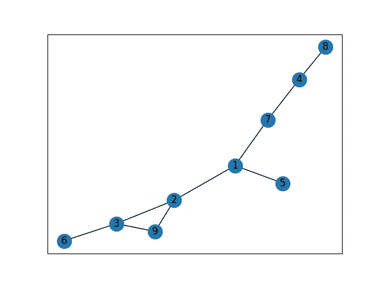

# 用 Python 对 Networkx 的简单介绍

> 原文：<https://medium.com/analytics-vidhya/a-gentle-introduction-to-networkx-with-python-21c29419d28a?source=collection_archive---------12----------------------->

艾莉娜·格鲁布尼亚克在 [Unsplash](https://unsplash.com?utm_source=medium&utm_medium=referral) 上的照片

正如我们所知，网络存在于几个领域，像*生物学*、*计算机*、*科学*甚至*社会*、*科学*。

所以，网络帮助我们更好地理解和描述这个世界，为什么不呢，它们也有助于推断我们还不知道的信息。

Python 中管理网络的最强大的工具之一是 **networkx** 。因此，继续查看一些命令。

首先，我们需要导入库，然后选择要构建的网络类型:

- **图**:无向网络

- **有向图**:有向网络

- **多图**:有自环和平行边的无向网络

每种类型的图形都有不同的可用属性和操作。

例如，我们尝试实例化一个无向图:

现在，为了赋予网络生命，我们需要手动添加节点和边，或者从现有的数据集开始添加。

**手动添加信息:**

添加节点和属性的最简单(也是最无聊)的方法如下所示，我们一个一个地添加它们。

正如我们所看到的，有可能单独添加一个节点或直接添加一条边(这样两个节点链接在一起)。当我们给网络添加边时，我们可以给它们附加一些属性。例如，我们可以考虑一个社交网络，其中边的属性可以是*多年的友谊*或*朋友圈*。

**从文件添加信息:**

当我们必须处理大量数据时，最常见的是从数据集开始构建网络。例如，如果我们有一个带有节点 id 值的文本文件，networkx 理解成对的节点将形成图。

基于这个数据集:

我们可以以这种方式构建并给出网络的表示:

这是我们应该看到的:

根据数据集构建的网络

现在我们可以看到网络的一些重要特性，以及如何从中提取信息。

# 距离

有时知道**两个节点之间的最短路径**是很有用的，我们可以使用函数 *shortest_path()。*其他功能有 *:*

*   ***【shortest _ path _ length()***:最短路径的距离。
*   ***average _ shortest _ path _ length()***:每对节点间的平均距离。
*   ***直径()*** :每对节点之间的最大值。
*   ***【偏心()】*** :一个节点与所有其他节点之间的最大距离。
*   ***peripheral()***:偏心率等于直径的节点集合。
*   ***center()*** :偏心率等于半径(最小偏心率)的节点集合。

# 使聚集

群集是网络中节点相互连接的趋势。因此，这使我们能够理解网络节点之间会有什么新的连接。

我们可以定义两种类型的聚类:

*   **节点的局部聚类系数**:节点的邻居如何倾向于形成完整图形的度量
*   **全局聚类系数(传递性)**:闭合三角形的个数与三角形总数之比。这度量了整个网络的聚集程度。

# 网络中心性

有一些方法可以识别网络中最重要的节点。这个性质可以应用于各种领域，我们可以认为例如在电信网络或计算机网络中，识别重要节点对于网络优化是很重要的。

我们必须考虑的重要指标包括:

*   **度中心性**:关联在一个节点上的链接数。所以，一个节点的链接越多，它就越重要。
*   **接近中心性**:图中该节点与所有其他节点之间最短路径的平均长度。所以，重要的节点离其他节点很近。
*   **中间中心性**:一个节点在其他两个节点之间充当最短路径桥梁的次数。所以，重要节点连接其他节点。
*   **特征向量中心性**:网络中节点的影响力。它根据与高得分节点的连接比与低得分节点的同等连接对所讨论节点的得分贡献更大的概念，给网络中的所有节点分配相对得分
*   渗透中心性:这种方法不同于其他方法，因为它更关注网络中节点的状态，而不是拓扑结构。这在描述社交网络中病毒或新闻传播的动态网络中非常重要。对于给定的节点，在给定的时间，它被定义为通过该节点的“渗透路径”的比例。“渗透路径”是一对节点之间的最短路径，其中源节点被渗透(例如，被感染)。目标节点可以是渗透的或非渗透的，或者处于部分渗透的状态。必须用函数的字典参数指定状态，其中节点是键，状态是值。

# 链路预测的措施

在网络中，分析存在于两个节点之间的关系是很重要的，特别是当你想预测网络中的新连接时。能够比较节点对的一些指标有:

*   **优先连接**:一个节点连接的越多，就越有可能接收到新的链接。因为度数高的节点有更多的邻居，所以这个度量是节点度数的乘积。
*   **共同的邻居**:抓住了两个有共同朋友的陌生人比那些没有共同朋友的人更容易被介绍认识的想法。因此，这个度量只是表示两个节点之间共有的节点数量。
*   **Jaccard 系数**:遵循与共同邻居相同的原则，是两个节点的共同邻居与两个节点所有邻居的比值。
*   **资源分配指数**:一个节点可以通过它们的共同邻居发送给另一个节点的信息的分数。因此，如果两个节点具有高度相同的节点，那么 ROI 将会较低，反之亦然，如果相邻节点的度数较低。

我希望对网络分析的介绍能有所帮助，尤其是对初学者。

# 参考资料:

*   [网络中心性](https://en.wikipedia.org/wiki/Centrality)，维基百科
*   D.李奔-诺埃尔，j .克莱恩伯格。社交网络的链接预测问题(2004)。[http://www.cs.cornell.edu/home/kleinber/link-pred.pdf](http://www.cs.cornell.edu/home/kleinber/link-pred.pdf)