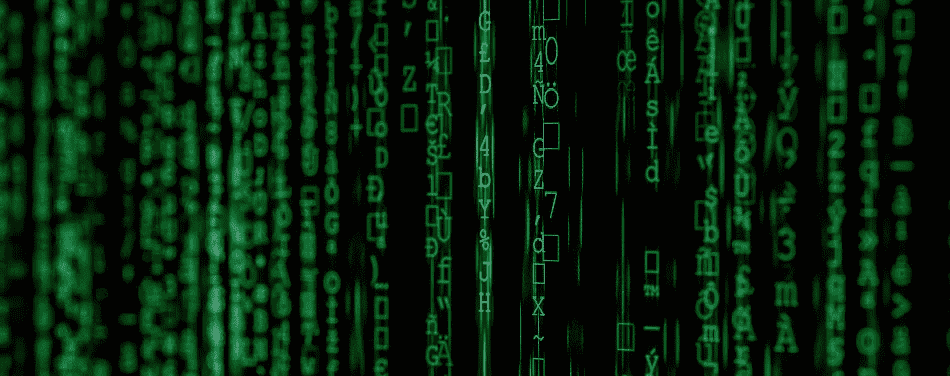
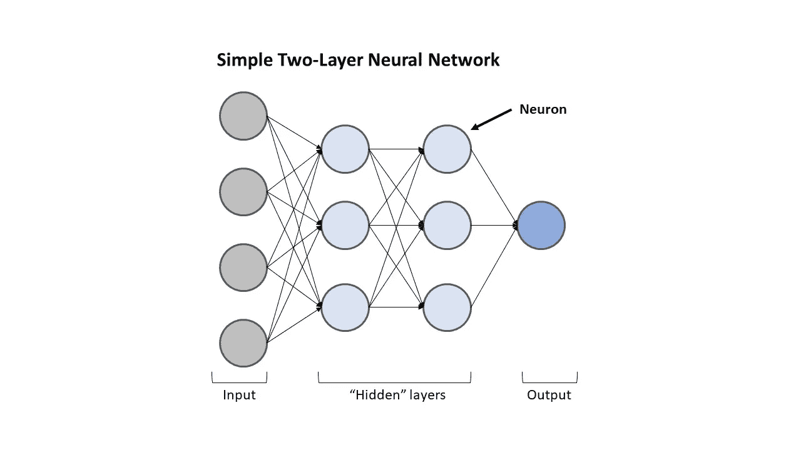
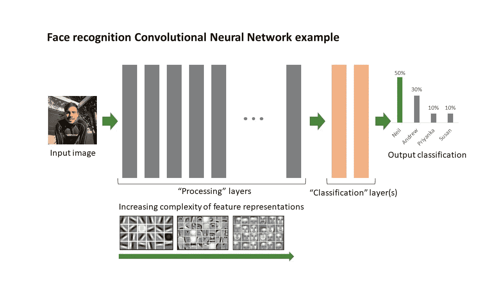

# 人工智能中迁移学习的温和、非技术性介绍

> 原文：<https://medium.com/analytics-vidhya/a-gentle-non-technical-introduction-to-transfer-learning-in-artificial-intelligence-2fd178bd7e54?source=collection_archive---------13----------------------->

鸣谢:马库斯·斯皮斯克—昂斯普拉什

人工智能领域的转移学习——特别是在神经网络的情况下——有点类似于《黑客帝国》中尼奥几乎瞬间下载他的武术能力的场景。它允许一个人将神经网络在一个设置中学习的知识转移到另一个相关但不同的设置，本质上使你的神经网络能够学习如何(相对)很好地完成一项新任务，几乎是瞬间的。它促成了过去几年人工智能领域一些最令人兴奋的进步，也是我对人工智能民主化如此兴奋的关键原因之一。

本文面向对神经网络或机器学习如何工作知之甚少，但希望对该领域最强大的趋势之一迁移学习的基础知识了解更多一点的人，以及如何应用它(如果你想要一种更技术性/应用性的方法，[这篇](https://ruder.io/transfer-learning/)是一篇优秀的文章)。我会尽可能简短而甜蜜。这篇文章首先从很高的层面概述了神经网络是如何构建的，然后深入研究了迁移学习在计算机视觉领域是如何工作的。我将在未来几周分享一篇关于自然语言处理(NLP)中迁移学习的后续文章。

让我们通过定义神经网络来深入研究，这是过去十年人工智能进步的最大驱动力之一。在很高的层面上，它本质上是一个被称为神经元的小处理单元的集合，它们被放在一起形成网络，这些网络松散地(非常松散地)模拟了大脑中的神经元如何共同工作来处理信息(这里有一个稍微更深入的[解释](https://www.forbes.com/sites/bernardmarr/2018/09/24/what-are-artificial-neural-networks-a-simple-explanation-for-absolutely-anyone/#7f276ec51245))。

一个基本的 2 隐层神经网络

在计算机视觉和自然语言处理领域，神经网络本质上是建立在称为层的块中。随着数据在网络中移动，这些层的设计使得它们能够构建越来越丰富的输入数据表示形式，本质上是将数据处理成信息密集的数学抽象。在计算机视觉的情况下，神经网络中的较低层本质上提取高级特征，如线条和边缘，而网络中较深的层提取更复杂的特征——例如面部检测网络中的眼睛或嘴巴。

最终，你希望你的神经网络用这种丰富的数据表示做一些事情。如果是图像数据，也许你想建立一个系统，在员工上班时识别他们的脸，这样前门就会自动为他们打开。基于这种理解，我们可以在概念上将神经网络分为两个部分:处理数据并构建员工面部图像的丰富表示的部分；通过分类来决定如何处理这些处理过的数据的部分，在这种情况下，可能是将它归类为在您公司工作的人，从而触发了一扇门的打开。

概述神经网络的分层结构以及卷积神经网络为图像分类创建的日益丰富的表示

神经网络革命的关键驱动因素之一是，一般来说，随着你向神经网络输入更多的数据，它的准确性会不断提高(并非所有的机器学习方法都是如此)。然而，神经网络在过去通常被训练成非常擅长于使用与它们被训练的数据非常相似的数据的狭窄任务。当你需要训练一个新任务的神经网络时，你会发现收集和管理(例如标记和处理)数据是昂贵的(查看[这些家伙](https://enlabeler.com/)对这个问题的伟大解决方案)。通常，在您关注的任何领域获取足够的数据来充分训练您的模型也是一项挑战。即使你能够收集足够的数据，从头开始训练网络可能会变得非常昂贵，并且需要很长时间，从几天到几周。

如果我们可以在一个领域或有大量数据的数据集上训练一个神经网络，然后在我们的领域中使用它，会怎么样？事实证明我们可以。

虽然迁移学习已经讨论了 20 多年，但最近图像处理神经网络显示出切实的结果。据观察，如果你在一项任务上训练一个计算机视觉网络，比如对 1000 幅不同类型的图像进行分类(例如，将图像分类为包含一只猫、一只狗或一辆汽车等。)你实际上可以把训练过的处理图像的部分(并创建那些丰富的表示)用在另一个设置中。通常，你所要做的只是重新训练网络顶端的“分类器”。事实证明，处理图像的部分需要很长的时间来训练，潜在的成本相当高，而进行分类的部分训练起来非常便宜。这一基本发现表明，在一些更一般的任务上训练神经网络，然后调整它们如何分类新数据——通过重新训练分类器部分——可以让一个人将他们的学习转移到另一个领域。

举一个具体的例子，假设我经营一家服装公司，想要建立一个系统来对发布在社交媒体上的照片中最受欢迎的服装进行分类，这样我就可以在我的商店里储存这些类型的商品。我们可以做的是，用一个相对通用的模型，我们可以从网上下载这个模型，这个模型已经被训练用来对各种不同的东西进行分类，并用它来对衣服进行分类。我们将首先替换顶部的*分类层*，然后在穿着不同衣服的人的标签数据集上对其进行短时间训练(即，我们数据集中的每张照片还带有存储在文件中的标签，说明照片中穿的是什么衣服)。如果我们仍然没有获得很好的结果，我们可以重新训练网络中的一些较晚的图层-这些图层从较简单的图层构建了更复杂的表示-从而训练模型来识别数据集的一些更特定于域(特定于服装)的要素。即使我们必须调整模型的一部分，与一个全新的模型相比，它仍然只需要一小部分时间来训练，最重要的是，我们只需要一小部分数据就可以得到不错的结果。

那么，这对你意味着什么？首先，这并不意味着你可以在没有任何数据的情况下，用任何 AI 任务取得不可思议的结果。你仍然需要一些数据，但是数量级比你以前需要的要少。当然，你可能需要对你的数据做一些微调，但与从头训练一个模型相比，这只是沧海一粟——相信我，如果你花了*小时*试图从头训练一个图像分类模型来预测一些东西，却因为需要更多的训练和更多的数据而得到垃圾，你会感谢只需要做一点微调。这意味着您可以更快地开始尝试新的想法，并且可以将更多的产品和服务融入计算智能，以提供更好的产品，并更好地满足客户的需求。这意味着，通过利用预先训练好的开源模型，你经常可以接触到机器学习中正在发生的最前沿的事情——并且一直有很多事情在发生和变化。

虽然这当然不意味着制造令人敬畏的人工智能产品*很容易*，但这确实意味着*更容易*。除了训练你的模型，还有很多其他的事情需要考虑，尤其是如何扩展产品，让它快速有效地运行，让你的客户满意。然而，当谈到你能提供的产品种类时，你的想象力越来越成为你能做什么的唯一障碍。