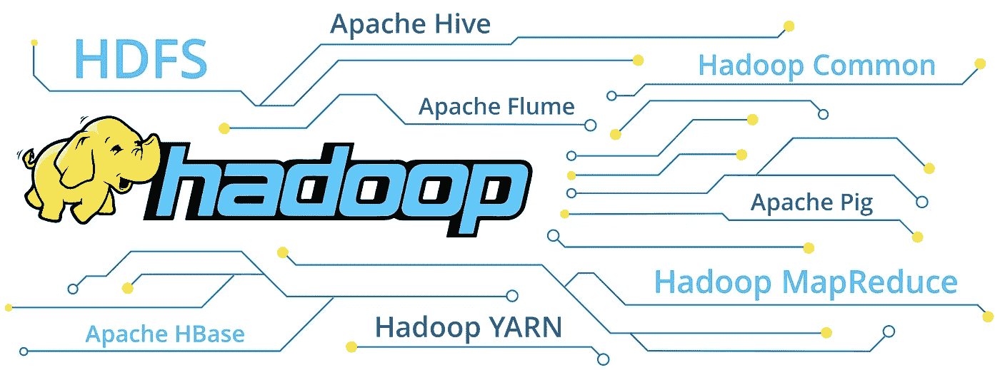

# 通过大数据一瞥 Hadoop

> 原文：<https://medium.com/analytics-vidhya/a-glimpse-of-hadoop-through-big-data-c2e9d8c0aaf?source=collection_archive---------17----------------------->

# 我将开始谈论什么是大数据。我会尽量让它简短，但我还是要说一些关于概念的话。

大数据已经成为 IT 业务人员中非常流行的术语，甚至在数据工程专业人员之外也很流行。那么，为什么每个人都一直在谈论它？这些流言是从哪里来的？它来自任何方向:加密货币、在线广告、社交媒体、电子商务、移动应用程序、游戏等等。

在过去的二十年里，互联网的使用量惊人地增长，而且每天都在以更快的速度增长。社交媒体革命已经在任何可能的意义上改变了我们的生活。让我们一起想一想，我们一直在使用的东西有哪些是 10-15 年前不存在的？

我们有 Instagram，脸书，Twitter，Tinder，优步，Linkedin，健康追踪器，跑步伙伴和许多其他我们根据自己的喜好使用的东西。那么，如果我们在看别人的照片，阅读他们发布的内容，在 Linked-in 上找工作；革命在哪里？好吧，不仅仅是一切都是相连的，现在整个世界都是相连的；每个人都以某种方式彼此相连。如果这不是革命，那么我不知道什么是。你可以通过下面链接查看过去 15 年互联网使用的急剧增长:

[https://www . pewresearch . org/internet/fact-sheet/social-media/](https://www.pewresearch.org/internet/fact-sheet/social-media/)

信不信由你，但无论何时你上网都会留下你的足迹。你上网时的每一个动作都会被记录下来。通过使用一段名为“Cookies”的代码来跟踪这个足迹是可能的。我打赌每个人都记得那些告诉我们接受使用条款的弹出窗口。有许多其他方法来跟踪网站访问者的行动，但 cookies 仍然是最常见的方式。没必要对那些脚印感到兴奋或担心。还有一项严格的法规叫做 T2 GDPR T3，这是所有公司都必须遵守的。

我们在社交媒体上看到的内容也取决于我们与之互动的人。

想象一个巨大的电信公司和它的 3000 万、5000 万客户。假设你是那家公司的首席执行官，如果你有机会更多地了解你的客户，你会怎么做？我打赌你会接受的。因此，这正是公司正在做的，他们利用他们对客户的了解来提供更好的服务，并从潜在的观众中赢得更多的客户。我们可以理解为一定有很多数据来源；你在 Instagram 上的每个赞、你的评论、你在 Google 上的搜索、你在 twitter 上的关注者和推特、你在 linked-in 上查看的最后一份工作等等——这些都是你在滚动会话期间生成的实际数据。

此外，我们大多数人使用电子邮件帐户登录社交媒体系统，这意味着我们提供了关于我们是谁的很好的暗示。通过使用我们的电子邮件，现在他们可以知道我们发布了哪些推文，我们在谷歌上搜索了什么，我们正在使用哪个 GSM 运营商，我们正在与哪个银行合作，我们访问了哪些网站，以及我们喜欢哪些图片。因此，请发挥你的想象力，理解你在网上产生的各种数据，想象这些数据能为你提供多么有价值的见解。

电子商务[客户之旅](https://apexit.com/marketing-customer-experience-transportation-logistics-industry/customer-journey/)

将如此惊人的信息量结合起来是一个艰难的过程。公司必须拥有惊人的庞大、精心构建的系统和计算能力来完成这项工作。

我可以为您提供更多大数据使用案例的示例，如科学研究、生产部门、航空和国防行业、媒体行业、流媒体平台、制药公司等。但这不是我们的目标。这应该是简单的解释。让我们把一些应用程序的概念放在下面；

[情绪分析](https://en.wikipedia.org/wiki/Sentiment_analysis)

[推荐引擎](https://en.wikipedia.org/wiki/Recommender_system)

[异常检测](https://en.wikipedia.org/wiki/Anomaly_detection)

[链接分析](https://en.wikipedia.org/wiki/Link_analysis)

[自然语言处理](https://en.wikipedia.org/wiki/Natural_language_processing)

因此，我觉得我已经迷失在向你们讲述大数据概念的过程中了，我不想再说什么了。这个想法很明确:**使用大容量或/和快速涌现的数据，结合实时源和处理，进行复杂的计算和运行多个操作，以便获得所需的结果，这就是大数据。**

# **终于有了 Hadoop！**

[影片的演职员表](https://www.scnsoft.com/services/big-data/hadoop)

Hadoop 在大约 15 年(实际上是 13 年)前进入舞台，承诺集成数据存储和多处理基础设施。使用 Hadoop，您可以创建由称为节点的多台计算机(服务器)组成的集群。节点可以组成一个集群。

在 Hadoop 集群中，每个节点都与其他节点通信，以共享它们的状态和信息。这种通信确保了集群的可用性和一致性。

我们说的是一组物品。你如何管理一个团队的所有成员，让他们为了一个目标一起工作？一定有控制机制吧？Hadoop 遵循分布式系统的主/从模式来管理集群。在这种架构中，每个节点在集群中都有一个角色，可以是主节点，也可以是从节点。

您必须将其中一台机器设置为主节点，称为 NameNode，其他机器将作为从节点，称为 DataNode。名称节点是 HDFS 文件系统的核心。它保存文件系统中所有文件的目录树，并跟踪文件数据在群集中的保存位置。它本身并不存储这些文件的数据。一个 [DataNode](https://cwiki.apache.org/confluence/display/HADOOP2/DataNode) 在[HadoopFileSystem]中存储数据。一个正常工作的文件系统有不止一个 DataNode(数据节点)(数据节点)。

Hadoop 可以在只有一个主机的情况下运行，但是让您的集群像这样运行可能会导致非常有问题的状态。Hadoop 存在“单点故障”问题，如果您丢失了 NameNode，就意味着您的集群停止服务。但是不用担心！有一种方法可以防止这种情况发生，让您的集群使用 tswo NameNode 一个活动，一个备用，并将 DataNotes 的所有信息分发给两者就可以完成这项工作。

Hadoop 基础框架由以下模块组成:

*   [*Hadoop Common*](https://en.wikipedia.org/wiki/Apache_Hadoop)—包含其他 Hadoop 模块所需的库和实用程序；
*   [*Hadoop 分布式文件系统(HDFS)*](https://en.wikipedia.org/wiki/Apache_Hadoop) —在商用机器上存储数据的分布式文件系统，在整个集群中提供非常高的聚合带宽；
*   [*Hadoop YARN*](https://hadoop.apache.org/docs/current/hadoop-yarn/hadoop-yarn-site/YARN.html)——(2012 年推出)一个平台，负责管理集群中的计算资源，并使用它们来调度用户的应用；
*   *Hadoop MapReduce*—MapReduce 编程模型在大规模数据处理中的实现。

术语 *Hadoop* 通常用于基础模块和子模块，也用于*生态系统*，或者可以安装在 Hadoop 之上或旁边的附加软件包的集合，例如 [Apache Pig](https://en.wikipedia.org/wiki/Pig_(programming_tool)) 、 [Apache Hive](https://en.wikipedia.org/wiki/Apache_Hive) 、 [Apache HBase](https://en.wikipedia.org/wiki/Apache_HBase) 、 [Apache Phoenix](https://en.wikipedia.org/wiki/Apache_Phoenix) 、 [Apache Spark](https://en.wikipedia.org/wiki/Apache_Spark) 、 [Apache ZooKeeper](https://en.wikipedia.org/wiki/Apache_ZooKeeper)

根据项目的上下文和要求，堆栈可以有所不同

Hadoop 框架中有两个关键元素，即 HDFS 和 MapReduce。我们可以将 HDFS 定义为跨多个链接的存储设备的存储。而 MapReduce 是你可以用来操作驻留在 HDFS 的数据的主要方法。MapReduce 顾名思义就是映射和减少数据的操作。映射就是发现所需的数据，而缩减是根据给定的规则和参数过滤数据的过程。

Hadoop 是高度熟练的基础设施，但让它如此受欢迎的是它从围绕 Hadoop 或基于 Hadoop 开发的软件中获得的能力。我已经在上面列出了大部分模块:Hive、Spark、ZooKeeper、Flume、Impala、Sqoop 等等。它们中的每一个都有不同的用途，而且它们都在做非常好的操作。在您花一些时间思考您的数据管理管道的架构设计之后，您将能够理解您应该在您的项目中使用哪一个/哪些。很难找到最适合自己兴趣的，每个模块都有不同的开发逻辑，而且在能力和目的上也有所不同。

在这篇文章中，我不会对这些软件做详细的解释，但是我会给你一些基本的想法。因为它们对于理解使用 Hadoop 背后的逻辑非常重要。

***提醒*** : HDFS 是一个分布式文件系统，它运行在操作系统之上。它基本上提供了可靠的存储基础架构，该基础架构的使用完全由您决定。Hadoop 只是一个工具，而不是某个东西的答案。

[阿帕奇 Sqoop](https://sqoop.apache.org/docs/1.4.6/SqoopUserGuide.html)

Sqoop 是一种工具，旨在 Hadoop 和关系数据库或大型机之间传输数据。您可以使用 Sqoop 将数据从关系数据库管理系统(RDBMS)如 MySQL 或 Oracle 或大型机导入 Hadoop 分布式文件系统(HDFS)，在 Hadoop MapReduce 中转换数据，然后将数据导出回 RDBMS。

[阿帕奇蜂巢](https://cwiki.apache.org/confluence/display/Hive/Home)

Hive 是一个数据仓库软件，方便读取、写入和管理驻留在分布式存储中的大型数据集，并使用 SQL 语法进行查询。提供对各种数据格式强加结构的机制。

[阿帕奇 Spark](https://spark.apache.org/docs/latest/)

是一个快速通用的集群计算系统。它提供了 Java、Scala、Python 和 R 的高级 API，以及支持通用执行图的优化引擎。它还支持一套丰富的高级工具，包括用于 SQL 和结构化数据处理的 [Spark SQL](https://spark.apache.org/docs/latest/sql-programming-guide.html) ，用于机器学习的 [MLlib](https://spark.apache.org/docs/latest/ml-guide.html) ，用于图形处理的 [GraphX](https://spark.apache.org/docs/latest/graphx-programming-guide.html) ，以及 [Spark Streaming](https://spark.apache.org/docs/latest/streaming-programming-guide.html) 。

[阿帕奇动物园管理员](https://zookeeper.apache.org/doc/r3.5.7/index.html)

是分布式应用程序的高性能协调服务。它公开了常见的服务，如命名、配置管理、同步和组服务。

[阿帕奇风暴](https://storm.apache.org/index.html)

Apache Storm 是另一个免费的开源分布式实时计算系统。Apache Storm 可以轻松可靠地处理无限的数据流。在许多方面，它与 Spark 相似。但是你应该仔细考虑在你需要使用哪一个之前，在做任何决定之前做好你的研究。

[阿帕奇黑斑羚](https://impala.apache.org/)

记得 Hive 吗？黑斑羚非常相似，似乎与蜂巢有相同的用法，但故事可能会有所不同。Impala 为 Hadoop 上的 BI/分析查询提供了低延迟和高并发性(Apache Hive 等批处理框架没有提供)。即使在多租户环境中，Impala 也可以线性扩展。

[阿帕奇 HBASE](https://en.wikipedia.org/wiki/Apache_HBase)

在 Google 的大表之后建模和开发的开源分布式数据库。它运行在 Hadoop 之上。

[阿帕奇凤凰](https://phoenix.apache.org/)

Apache Phoenix 通过结合 NoSQL 数据库的事务处理能力和灵活性，在 Hadoop 中为低延迟应用提供 OLTP 和运营分析，因为它使用 HBASE 作为后备存储。

我试图勾勒出 Hadoop 的架构以及围绕它出现的技术。我将继续分享我对上面列出的每个相关软件的经验和看法。

注意:我使用了 Apache 文档并在关键字下使用了超链接，您可以通过链接找到所有细节。