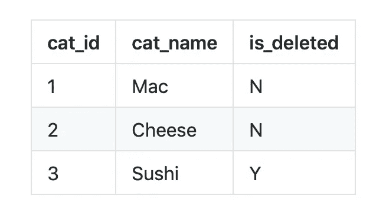
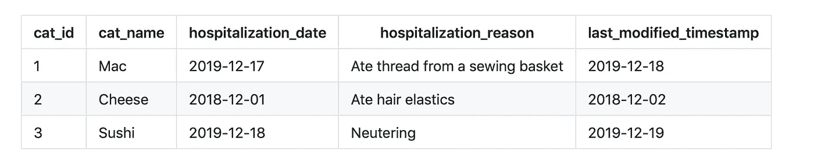
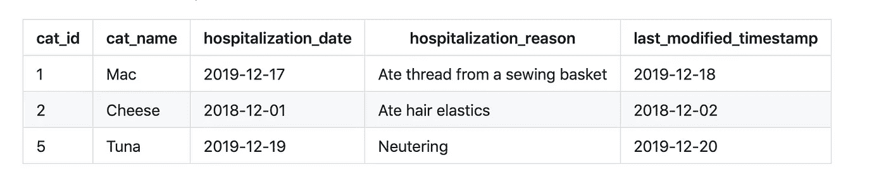
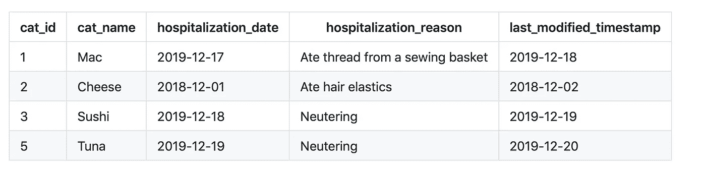
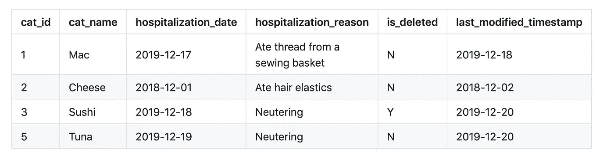
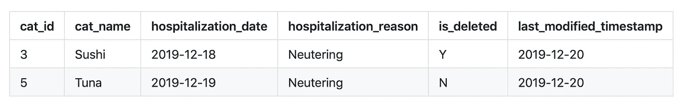

# 努力删除的好日子

> 原文：<https://medium.com/analytics-vidhya/a-good-day-to-delete-hard-22b8be83b622?source=collection_archive---------14----------------------->

删除方法是一个重要的数据仓库概念，你最好在面试前掌握它。这不是记住两个主要方法的定义的问题(下面我从网上复制给你)，而是理解选择其中一个的后果。

# 删除的类型有哪些？

删除方法描述了当记录被设置为删除时，数据库(或特定的表)如何变化。

**硬删除** —从表中删除整个记录。删除后，用户将无法看到该记录曾经存在过。
**软删除** —记录不会从表中删除，但表中的一个字段指示它已被删除。该字段可以是布尔值，如`is_deleted`或时间戳，如`deleted_timestamp`。如果这个字段名在所有表中都是一致的，那么通常是最好的，这样用户就可以容易地、动态地找到未删除的数据集。([来源](https://www.stitchdata.com/docs/replication/deleted-record-handling))

# 什么时候应该使用硬删除？

在分析数据仓库中，软删除不是一个好主意。利益相关者希望看到一个只有相关记录的表格；对于分析数据仓库用户来说，`cats_dim`意味着“当前活跃的猫的列表”参见下表作为反例:



猫 _dim

一个分析师(他可能没有读过所有的字段名，因为提供的字段名可能不止三个)可能会很快尝试用`select count(*) from cats_dim`找到当前猫的数量

这会给她三只猫，而不是两只的真实答案(当然我们不能收养寿司，尽管他很可爱)。我们的内心已经很充实了)。

这不是世界上最糟糕的错误，但是想象一下，不是`count(*)`，而是`sum(revenue)`。现在想象一下，这个指标被报告给一个主管。你明白我的意思了吧。

按照惯例，在数据仓库中，我们会进行硬删除。但这并不意味着我们在任何地方都这样做。

# 什么时候应该使用软删除？

我们知道，当用户只需要当前数据时，硬删除是有帮助的，但是还有其他类型的用户。例如，从源数据库编写 ETL 的团队——我们！

作为 ETL 的一部分，我们从源数据库中检索数据集，无论是完全提取还是增量提取。在完整提取中，每当我们需要更多数据时，我们都会提取整个数据集(数据集通常是一个表，但也可以是 API 端点的一个报告)。这是计算开销最大的获取数据的方式，但最容易编码。

在增量提取的情况下，我们只查询尚未从源中看到的数据。我们可以使用一个元数据字段来编写这个查询，该字段表示源数据库中该记录最后一次被修改的时间(我喜欢将这个字段称为 last_modified_timestamp，但您通常会看到它被称为 systimestamp 或 sysmodtimestamp)。在我们的提取查询中，我们有效地说“昨天我得到了截至 2019-01-01 的数据，请给我从那以后更新的数据。”这允许我们提取和加载更少的行，节省计算和可能的存储。

那么，如果源数据库执行硬删除会发生什么呢？假设我们从源中一个名为 cat _ hospitalization _ fact 的表中提取数据。



cat _ 住院治疗 _ 事实

如果我们在 2019 年 12 月 19 日从该表中增量提取，我们会收到所有这三行。现在，假设我们在 2019 年 12 月 20 日重新查看该表，结果如下:



当我们提取时，我们将得到一个关于金枪鱼的新行。我们数据库中的表将如下所示:



cat _ 住院治疗 _ 事实

当与来源相比，这是错误的，因为它仍然有寿司的住院治疗。不管什么原因，寿司住院被删了。为了知道这一点，我们必须将提取日期设置回 2019-12-18，但是，由于我们无法知道哪些记录将在何时被删除，我们实际上必须将提取日期设置回时间的开始，以考虑硬删除。这只是一个满载。

当源数据库有硬删除时，我们必须进行完整的提取，以确保我们不会误报数据。这非常昂贵，尤其是随着数据的增长。如果源数据库使用了软删除，它将如下所示:



cat _ 住院治疗 _ 事实

当我们第二次提取数据时(2019 年 12 月 20 日)，我们会收到:



cat _ 住院治疗 _ 事实

这将向我们表明，Sushi 的记录已被删除，而不必提取整个数据集。我们可以保持我们的增量负载，但不夸大数据。

从源数据库所有者的角度来看，软删除的另一个优点是更容易恢复。

那么，一旦我们有了这个软删除，我们该怎么办呢？很简单，我们可以在 merge 语句中使用(这个例子是[雪花特定的](https://docs.snowflake.net/manuals/sql-reference/sql/merge.html))。

我们的 merge 语句应该是这样的:

```
MERGE INTO cat_hospitalization_fact as t
USING source_data as s
ON t.cat_id = s.cat id
AND t.hospitalization_date = s.hospitalization_date
WHEN MATCHED THEN UPDATE SET
t.cat_name  = s.cat_name,
t.hospitalization_reason = s.hospitalization_reason,
WHEN NOT MATCHED THEN INSERT
(cat_id, cat_name, hospitalization_reason, hospitalization_date)
VALUES 
(s.cat_id, s.cat_name, s.hospitalization_reason, s.hospitalization_date)
WHEN MATCHED AND s.is_delete = ‘Y’ THEN DELETE
```

注意最后一行——我们可以使用软删除从源数据库中删除表中的记录。对于硬删除，我们无法做到这一点；缺少行不能在合并中创建删除，只有字段指示它的删除。在硬删除的情况下，我们必须执行单独的 [DELETE 语句](https://docs.snowflake.net/manuals/sql-reference/sql/delete.html)。

# 结论

软删除和硬删除之间没有明确的赢家；各有各的用法和优点。话虽如此，我不能强调这一点不够，不要让你的猫吃线。还有，我能借点钱吗？猫手术很贵。


我的小锥头猫在手术后从他的肠子里取出线

*原载于*[*http://www . alisa-in . tech*](http://www.alisa-in.tech/sql/2019/10/12/deletes.html)*。*