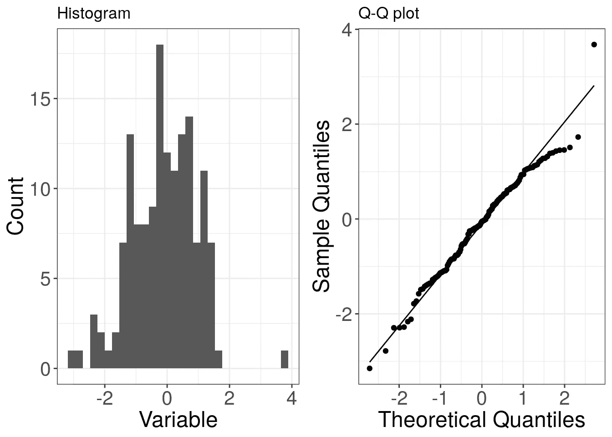
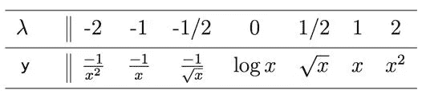

# 数据转换指南

> 原文：<https://medium.com/analytics-vidhya/a-guide-to-data-transformation-9e5fa9ae1ca3?source=collection_archive---------0----------------------->

## 了解何时以及如何转换变量以获得更好的洞察力。

阿瑟尼·托古列夫在 [Unsplash](https://unsplash.com/s/photos/transformer?utm_source=unsplash&utm_medium=referral&utm_content=creditCopyText) 上的照片

【https://www.r-bloggers.com/】这篇文章也发表在**上。**

**我在网上有两个关于更多数据基础设施相关主题的系列，第一个是关于* ***用 Docker*** *(链接到第一部分* *)构建并健壮地部署一个闪亮的 Flexdashboard。第二个是关于* ***构建并健壮部署一个 API，用于从 Google 大查询*** *(* [*链接到第一部分*](/analytics-vidhya/google-big-query-with-r-875facef7844) *)。**

# *什么是数据转换？*

*D 统计上下文中的数据转换是指将数学表达式应用于数据中的每一点。相比之下，在数据工程上下文中，转换也可能意味着在提取转换加载(ETL)过程中将数据从一种格式转换为另一种格式。*

## *我为什么要转换我的数据？*

*   ***提高可解释性。**有些变量不是我们在某个问题中需要的格式，例如，汽车制造商提供燃料消耗的英里/加仑值，但是在比较汽车型号时，我们更感兴趣的是加仑/英里的倒数。*
*   ***去杂波图。**如果您将两个或更多的变量可视化，这些变量并不均匀地分布在参数中，您最终会得到相近的数据点。为了更好地可视化，转换数据可能是一个好主意，这样它可以更均匀地分布在图形中。另一种方法是在图表轴上使用不同的刻度。*
*   ***洞察变量之间的关系。变量之间的关系通常不是线性的，而是不同类型的。常见的例子是将收入的对数与另一个变量进行比较，因为更多收入的效用随着更高的收入而减少。(参见这篇关于在[交叉验证](https://stats.stackexchange.com/questions/18844/when-and-why-should-you-take-the-log-of-a-distribution-of-numbers)中高度利用对数变换的精彩讨论。)另一个例子是银行账户上的钱随利率相对于时间的多项式增长。要计算变量之间的简单[相关系数](https://en.wikipedia.org/wiki/Correlation_coefficient)，变量需要呈现线性关系。为了满足这个标准，您可以转换一个或两个变量。***
*   ***满足统计推断的假设条件。**在构造简单的置信区间时，假设数据是正态分布，没有左右歪斜。对于线性回归分析，一个重要的假设是[同方差，](https://en.wikipedia.org/wiki/Homoscedasticity)意味着因变量的误差方差独立于预测变量。T 检验等许多统计检验的一个假设是，模型的误差(从总体抽样的测量值)是正态分布的。*

## *重要的区别*

*当我们使用术语“转换”时，知道我们在谈论什么是很重要的。转换、规范化和标准化经常互换使用，而且是错误的。*

*   ***归一化**是对整个数据范围进行缩放的过程，使数据的范围从 0 到 1。*
*   ***标准化**是对整个数据范围进行转换的过程，使数据的平均值为 0，标准差为 1。它的分布现在是标准的正态分布。*
*   ***转换**是将相同的计算分别应用于数据的每一点。*

*标准化将数据转换为遵循标准的正态分布(左图)。规范化和标准化可以看作是转换的特例。为了展示标准正态分布和标准分布之间的差异，我们模拟数据并绘制成图表:*

*用不同参数生成的正态数据直方图。更清晰地放大种子密度分布。*

*[上图](https://github.com/timosch29/Medium_Data_Transformation_with_R/blob/master/Plot%20Normal%20Distributions.R)的 R 代码。交互式 Plotly 图形通过 plot.ly 托管嵌入，但也可以通过 iframe 从 Github 页面嵌入，参见[这篇文章](https://towardsdatascience.com/how-to-create-a-plotly-visualization-and-embed-it-on-websites-517c1a78568b)获取说明。*

# *如何转换数据？*

*为了获得洞察力，数据通常被转换为接近正态分布，以满足统计假设或检测其他变量之间的线性关系。这些技术的第一步是检查变量有多接近正态分布。*

## ***如何检查你的数据是否服从正态分布？***

*常见的做法是目测数据和/或通过统计测试检查正态性假设。*

**

*变量分布直方图和相应的 QQ 图，带有完美正态分布的参考线。来自 [UCD](http://www.ucd.ie/ecomodel/Resources/QQplots_WebVersion.html)*

*为了**直观地探索**您的数据分布，我们将查看密度图以及简单的 **QQ 图**。QQ-plot 是一款出色的工具，可用于检查您的数据分布的各种属性，并评估您是否需要以及如何转换数据。这里，完美正态分布的分位数与数据的分位数相对应。分位数衡量在哪个数据点包含了一定百分比的数据。例如，0.2 分位数的数据点是 20%的数据低于和 80%的数据高于的点。将绘制一条参考线，指示如果您的变量遵循完美的正态分布，该图会是什么样子。您在 QQ 图中的点离这条线越近，您的数据就越有可能遵循正态分布，不需要额外的转换。*

*对于数据正态性的统计分析，常用的测试是夏皮罗-维尔克测试或科尔莫戈罗夫-斯米尔诺夫测试。SW 检验通常具有更高的检测能力，非参数 KS 检验应在大量观察时使用。一般来说，这些测试计算您的数据分布与正态分布相似的可能性有多大(从技术上讲，您不犯 H0 错误的可能性有多大——假设数据是正态分布的)。然而，这些测试存在 Frequentist 零假设测试的众所周知的问题，这不在本文讨论的范围之内，即对于大量的观察结果过于敏感的问题。与更重要的尾部相比，KS 检验通常对数据分布的中间点过于敏感。此外，这些测试无法告诉你非正态性对于从你的数据中获得洞见有多大的问题。因此，**我建议使用探索性的、可视化的方法来检查你的数据分布，如果自动化脚本不需要的话，就放弃任何统计测试**。*

## *数据分布及其相应的 QQ 图*

*下图显示了带有密度分布和相应 QQ 图的模拟数据。图中显示了正态分布的四个强典型偏差。只有对于正态分布的数据，在代码片段中显示了额外的正态性统计测试，以确保完整性。*

*正态分布数据及其样本分位数与理论分位数的 QQ 图。*

*用于数据生成、交互式可视化和正态性统计检验的 r 代码*

*右偏数据和相应的 QQ 图*

*左偏斜数据和相应的 QQ 图*

*重尾数据和相应的 QQ 图*

*轻尾(宽尾)数据和相应的 QQ 图*

*r 代码，用于使用库 fGarch 和 LambertW 生成附加图的数据*

*为了玩转发行版和它们相应的 QQ 图，我可以推荐[这个漂亮的小 R **闪亮的应用**](https://xiongge.shinyapps.io/QQplots/) 来自交叉验证用户[战雄](https://stats.stackexchange.com/questions/101274/how-to-interpret-a-qq-plot/185070#185070)。*

## ***挑哪个转型？***

*如果您决定您的数据应该遵循正态分布并需要转换，我们将会看到一些简单且利用率高的幂转换。它们将您的数据转换为更接近正态分布。然而，值得注意的是，当转换数据时，您将丢失关于数据生成过程的信息，并且您也将失去值的可解释性。您可能会考虑在分析的某个步骤对变量进行反向转换。**一般来说，最适合数据生成的变换表达式。**如果数据生成效应是倍增的，并且数据遵循数量级，则应使用对数。如果数据生成涉及平方效应，则应使用根。*

## *简单的转换*

*对于变换，将每个数据点乘以以下表达式之一。表情按效果从弱到强排序。如果您选择的转换太强，您最终会得到向另一个方向倾斜的数据。*

***右(正)倾斜数据:***

*   ***根 *ⁿ√x.* 根**变换最弱，高阶根更强。对于负数，在转换负数时需要特别注意符号:*

*立方根变换的 r 代码*

*   ***对数 *log(x)。*** 常用的变换，这种变换的强度可以通过对数的根来改变。它不能用于负数或 0，这里你需要通过添加至少 *|min(x)|+1 来移动整个数据。**
*   ***倒数** ***1/x.*** 变换最强，指数越高变换越强，如 *1/x* 。这种转换不应该使用负数和接近零的数字，因此数据应该像对数转换一样进行移位。*

***左(负)偏斜数据***

*   ***反映数据并对右倾斜使用适当的变换。**从最大值中减去每个数据点来反映。向每个数据点添加 1，以避免数据中有一个或多个 0。*
*   ***方 *x .*** 功率越高越强。不能与负值一起使用。*
*   ***指数 *eˣ.*** 最强变换，可与负值一起使用。基数越高越强。*

***轻&重尾数据***

*   ***从中值减去数据点，然后进行变换。**尾部偏离正态性通常没有偏度严重，可能根本不需要转换。减去中值会将您的数据设置为中值 0。之后，对任何一侧偏离 0 的绝对偏差上的偏斜数据使用适当的变换。对于**重尾**数据，使用右偏斜转换来拉近中值，对于**轻尾**数据，使用左偏斜转换来将数据推离中值。*

## *自动转换*

*R 中有各种自动转换的实现，可以为您选择最佳的转换表达式。它们确定一个*λ*值，该值是用于将数据转换为最接近正态分布的幂系数。*

*   ***使用 Lambert W x 高斯变换。**R 包 [LambertW](https://cran.r-project.org/web/packages/LambertW/index.html) 有一个用`Gaussianize()`自动转换重尾或轻尾数据的实现。*
*   ***图基的权力阶梯。**对于偏斜数据**，**来自 R 包 rcompanion 的[实现](https://rdrr.io/cran/rcompanion/man/transformTukey.html) `transformTukey()`迭代地使用夏皮罗-维尔克测试，以找到在哪个*λ*值处数据最接近正态，并对其进行转换。左偏斜的数据应该反映到右偏斜，并且不应该有负值。*

**

*图基的幂阶梯*λ值和相应的幂变换。λ值可以是小数。* [*来源*](http://onlinestatbook.com/2/transformations/tukey.html)*

*   ***Box-Cox 变换。**来自 R 包预测的[实现](https://rdrr.io/cran/forecast/man/BoxCox.lambda.html) `BoxCox.lambda()`迭代地找到使线性模型的对数似然最大化的*λ*值。然而，它可用于模型公式为 *x~1* 的单个变量。可以通过预测[函数](https://rdrr.io/cran/forecast/man/BoxCox.html) `BoxCox()`来转换得到的*λ*值。R 包 MASS 中也有实现。标准 Box-Cox 不能与负值一起使用，但双参数 Box-Cox 可以。*

**来源* [*GIPHY*](https://media.giphy.com/media/3o7TKVFCdpZD0nThEk/giphy.gif)*

*   ***杨-约翰逊变换。**这可以看作是对 Box-Cox 的有益扩展。它与非负值的 Box-Cox 相同，也处理负值和 0 值。在元机器学习框架 tidymodels 中，R via 包 [car](https://www.rdocumentation.org/packages/car/versions/3.0-6/topics/bcPower) 、 [VGAM](https://www.rdocumentation.org/packages/VGAM/versions/1.1-2/topics/yeo.johnson) 和 [recipes](https://tidymodels.github.io/recipes/reference/step_YeoJohnson.html) 有各种实现。*

# *结束语*

*本指南概述了一项重要的数据预处理技术，即数据转换。它说明了为什么要在分析过程中转换数据。它解释了如何检测您的数据是否需要转换以满足数据正态分布的最常见要求，并相应地进行转换。它显示了对于非正态性的典型情况，使用哪种数学表达式进行转换，以及如何使其自动化。有几个高级的转换案例，例如多式联运分销，这里没有涉及。*

*然而，必须提醒一句。何时以及如何转换数据没有明确的规则。这取决于数据是如何生成的(以及你对此了解多少)，你想从中获得什么样的见解，可解释性有多重要，以及数据分布与你想要的分布(在大多数情况下是正态分布)的偏差有多大。因此，数据转换的一些**结束建议**:*

*   *决定你将从转型中获得的洞察力是否值得这些负面影响。例如，决定是否能够进行统计建模、应用几何技术(如 k-means 聚类)、能够更好地比较比率或只是整理图表，值得失去直接的可解释性。*
*   *决定是否有替代方法满足你的分析。**一般来说，寻找适当的模型来使用原始数据，例如分位数、样条或加权最小二乘回归或非参数模型用于非线性关系应优先于转换。**或者，您可以删除异常值，但是您应该记住，您需要一个非常好的理由来删除测量值。*
*   *在转换前后，使用 QQ-plot 检查您的发行版，甚至使用自动转换方法。*
*   *弄清楚你何时以及为什么使用可再现性的转换。*