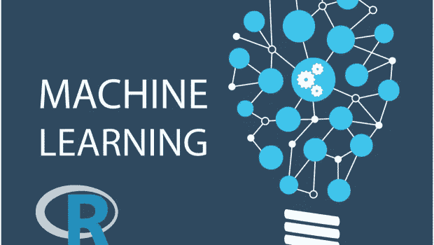

# 初学者 R 语言机器学习指南:逻辑回归

> 原文：<https://medium.com/analytics-vidhya/a-guide-to-machine-learning-in-r-for-beginners-part-5-4c00f2366b90?source=collection_archive---------0----------------------->

## 这是我的 R 语言机器学习初学者系列的第 5 部分

