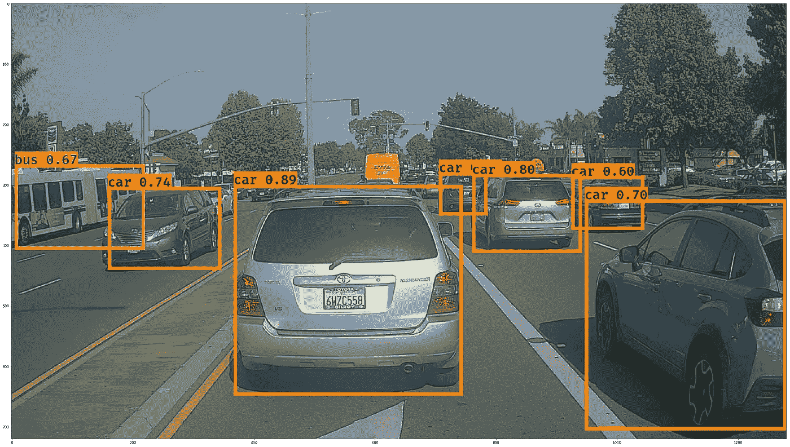
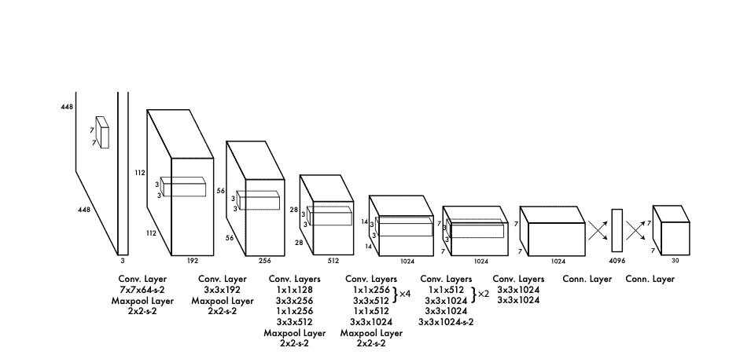
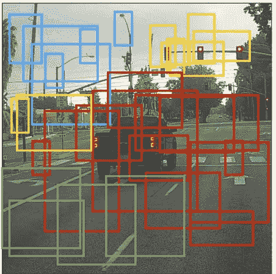
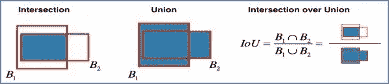
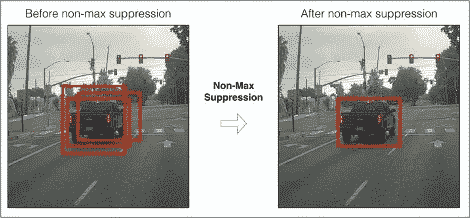
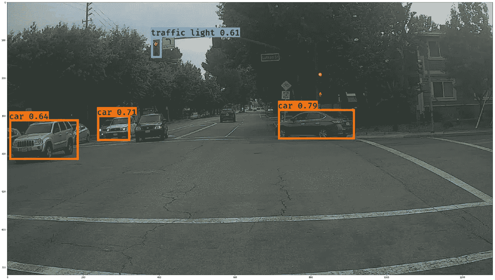
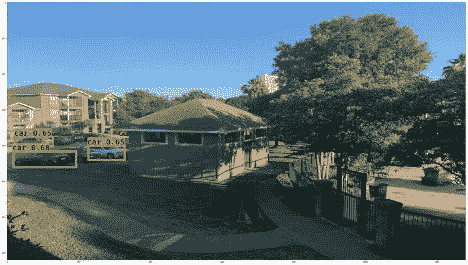
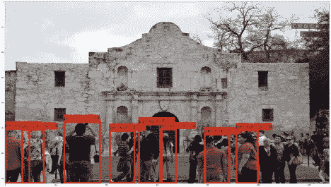

# 使用 YOLO 模型的目标探测练习指南

> 原文：<https://medium.com/analytics-vidhya/a-guide-to-the-object-detection-exercise-using-yolo-model-c551f65df637?source=collection_archive---------24----------------------->

目标检测是计算机视觉领域中的一项新兴技术，它使我们能够检测和识别图像或视频中的目标。对象检测可用于计算场景中的对象，并使用定位方法跟踪它们的精确位置。

以下是对象检测视频示例的链接:

[https://www.youtube.com/watch?v=A5r1jp4t8u8](https://www.youtube.com/watch?v=A5r1jp4t8u8)

**深度学习如何帮助建立一个健壮的计算机视觉框架？**

与其他计算机视觉任务一样，深度学习已被证明是在人工智能世界中执行对象检测的一种示范性方法。在本文中，我将尝试展示图像分类和定位的结合，它不仅检测对象的类别，还检测给定图像的相应位置。

在进入检测阶段之前，让我们深入研究一下模型架构。

**什么是 YOLO 模式？**

“你只看一次”(YOLO)是一种流行的算法，因为它实现了高精度，同时还能够实时运行。这种算法“只看一次”图像，因为它只需要一次通过网络的前向传播来进行预测。在非最大值抑制之后，它会将识别的对象与边界框一起输出。

来源:[https://arxiv.org/pdf/1506.02640v5.pdf](https://arxiv.org/pdf/1506.02640v5.pdf)

在上图中，检测网络有 24 个卷积层，后面是 2 个全连接层。交替的 1 × 1 卷积层减少了来自前面层的特征空间。ImageNet 分类任务中的相关卷积层以一半的分辨率(224 × 224 输入图像)执行，然后以两倍的分辨率进行检测。

# 输入和输出

*   **输入**是一批图像，每个图像的形状为(m，608，608，3)
*   **输出**是一个包含已识别类的边界框列表。如上所述，每个边界框由 6 个数字(pc，bx，by，bh，bw，c)表示。如果你把 c 展开成一个 80 维的向量，那么每个边界框由 85 个数字表示。变量 c 表示模型将用于检测目的的类的数量。(例如汽车、卡车、交通灯等。)

由于该模型使用 5 个锚盒，因此 19 个 x19 单元中的每一个编码了关于 5 个盒的信息。锚定框仅由其宽度和高度定义。

为简单起见，该模型展平了形状(19，19，5，85)编码的最后两个维度。所以深度 CNN 的输出是(19，19，425)。

来源:[https://www.coursera.org/](https://www.coursera.org/)

# 非最大抑制

在上图中，边界框绘制在那些模型分配了高概率的对象上，但这仍然是太多的框。您希望将算法的输出减少到更少的检测到的对象数量。

为此，您将使用**非最大抑制**。具体来说，您将执行以下步骤:

*   去掉分数低的盒子(意思是，盒子对检测一个类不是很有信心；或者由于任何对象的低概率，或者这个特定类的低概率)。
*   当几个框相互重叠并检测同一对象时，仅选择一个框。

为了移除那些重叠的盒子，模型将使用一种叫做**的技术。这种技术可以使用称为 IoU 的评估指标来实现，IoU 用于测量特定数据集上的对象检测器的精度。**

**IoU:** 这个验证度量对于确定地面实况框和预测框之间的交集和并集面积的比率很有用。

借据计算(来源:[https://www.coursera.org/](https://www.coursera.org/))

在上图中，B1 和 B2 是用于计算精度度量的预测和基本事实框。

来源:[https://www.coursera.org/](https://www.coursera.org/)

总而言之，对 YOLO 的总结看起来是这样的:

*   输入图像(608，608，3)
*   输入图像通过 CNN，产生(19，19，5，85)维输出。
*   展平最后两个维度后，输出是一个体积形状(19，19，425):
*   输入图像上 19x19 网格中的每个单元格给出 425 个数字。
*   425 = 5 x 85，因为每个单元格包含 5 个框的预测，对应于 5 个锚框，如讲座中所示。
*   85 =图像数组中的 5 + 80，其中 5 表示(pc，bx，by，bh，bw)，80 是我们想要检测的类的数量
*   然后，根据以下条件选择几个框:
*   分数阈值:丢弃检测到分数低于阈值的类的盒子
*   非最大抑制:计算并集上的交集，避免选择重叠的框
*   这给了你 YOLO 的最终输出。

**预测:**

多个类对象的检测:

**未来改进:**

1)使用 YOLO 模型的更新版本，这可能会解决在此练习中注意到的一些检测问题。

2)在移动对象上实现相同的模型，或者使用视频文件代替静态图像。

3)使用不同组的图像来训练 YOLO 模型，而不是加载预先训练的模型。添加新的类以增加对象分类器的范围。

**参考文献:**

*   约瑟夫·雷德蒙、桑托什·迪夫瓦拉、罗斯·吉斯克、阿里·法尔哈迪— [你只看一次:统一的实时物体检测](https://arxiv.org/abs/1506.02640) (2015)
*   约瑟夫·雷德蒙，阿里·法尔哈迪——[yolo 9000:更好、更快、更强](https://arxiv.org/abs/1612.08242) (2016)
*   艾伦·泽伦纳— [YAD2K:又一个黑暗网络 2 Keras](https://github.com/allanzelener/YAD2K)
*   https://pjreddie.com/darknet/yolo/ YOLO 官方网站()
*   [https://www . tensor flow . org/datasets/catalog/rock _ paper _ scissors](https://www.tensorflow.org/datasets/catalog/rock_paper_scissors)
*   [https://www.tensorflow.org/tutorials/images/classification](https://www.tensorflow.org/tutorials/images/classification)
*   [https://arxiv.org/abs/1506.02640](https://arxiv.org/abs/1506.02640)

**汽车检测数据集**:

Drive.ai 样本数据集(由 drive.ai 提供)获得了[知识共享署名 4.0 国际许可](http://creativecommons.org/licenses/by/4.0/)的许可。我们感谢 Brody Huval、Chih Hu 和 Rahul Patel 提供这些数据。

GitHub 链接到源代码和测试图片:

 [## GitHub-soudey 123/自动汽车检测-使用 YOLO 模型

### 要记住的事情:YOLO 是一个艺术级的物体检测模型，它运行一个输入图像…

github.com](https://github.com/soudey123/Autonomous-car-detection-using-YOLO-model)