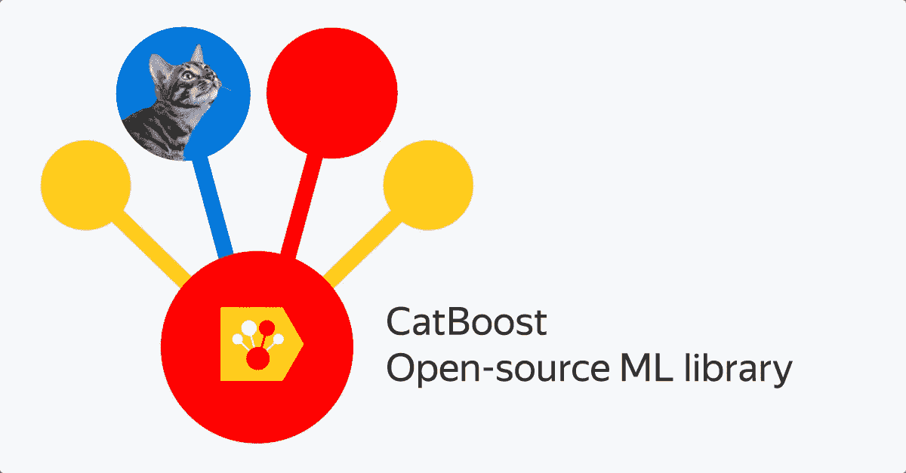

# 被低估的机器学习算法指南——决策树和随机森林分类器的替代品

> 原文：<https://medium.com/analytics-vidhya/a-guide-to-underrated-machine-learning-algorithms-alternatives-to-decision-tree-and-random-forest-6e2f8336d4d5?source=collection_archive---------5----------------------->

**决策树**分类器是大多数数据科学家和 Kagglers 每天用来拟合和评估他们的数据以进行监督学习的第一批方法之一。有时，他们确实给出了一个令人满意的结果，而有时却没有。因此，在此之后，我们转向其他选择。

但是我们能不能暂时尝试一个非常好的方法来代替随机森林或者决策树来进行快速评估？我想我们可以，但我们没有。我们只是继续在更复杂的模型(深度学习)上拟合和评估我们的数据，这可能是富有成效的(有时)。

然而，我将要讨论的替代方法可以用决策树和随机森林分类器来代替，以获得更好的结果和更易于使用的方法:

1 **XGBoost:** 这个模型是大部分数据科学竞赛的心脏和灵魂。它现在也广泛用于常规项目。它用于监督学习问题，我们使用数据集中的一些特征来预测目标变量。那么使用 XGBoost 背后的心态是什么？

a) XGBoost 代表极限梯度提升，这是一种基于决策树的机器学习算法。它使用起来高效灵活。实践证明，该方法提高了计算速度和模型性能。

b)虽然大型训练数据集可能需要很长时间才能适应决策树或随机森林，但 XGBoost 脱颖而出，适应数据的速度比以前快 10 倍。

c)它对数据集中的缺失数据进行了高效的内置处理。

d)更好性能背后的主要因素是用于避免过拟合的内置正则化。

e)其高速度背后的主要因素是它具有支持并行树构造和使用深度优先方法的块结构。

AdaBoost: 大多数人没听说过，有些人听说过，但没用过。但是实施过它的人知道它的能力。Yoav Freund 和 Robert Schapire 制定了 AdaBoost 算法。那么为什么要用 AdaBoost 呢？

a) AdaBoost 代表自适应增强，这是一种监督学习的有效方法，已知可提高整体性能。

b)它最适合用于提升决策树在二元分类问题上的性能。

c)众所周知，它在准确性方面优于决策树和随机森林(没有过拟合)，尽管计算速度比后者低。

d)它表现如此之好的原因是，它通过组合多个表现不佳的分类器来构建一个强大的分类器，因此您将获得高精度的评估。

3 **LightGBM:** 从名字上，你可能已经猜到它代表的是光线渐变增强机，由微软开发。也是除 XGBoost 之外，机器学习竞赛中应用最广泛的算法之一。那么为什么要选择 LightGBM 呢？

a)众所周知，LightGBM 训练速度快，效率高。

b)它比 XGBoost 更快，有时提供的结果也比 XGBoost 更准确。

c)由于其低内存使用率，其计算速度相当快，并为 GPU 学习提供并行支持。

d)它的低内存使用率也使它能够非常容易地处理大规模数据。

4**CatBoost:**CatBoost 是另一种基于决策树梯度推进的机器学习算法，由 Yandex 开发。同样的问题，为什么是 CatBoost？

a) CatBoost 算法具有较浅的树深度，与其他 boosting 算法相比，这导致较少的预测时间。

b)它优雅地处理分类特征，最重要的是，它比 XGBoost 快 8 倍。

c)它可以像 XGBoost 一样有效地处理缺失值。

d)它减少了为提高性能而调整超参数的必要性，也降低了过拟合的机会。

快速注意:每个模型的性能取决于您定义和调整其超参数的好坏。但是应该记住，参数的调整不会导致过度拟合。

最后，我希望你对上面的算法有一个基本的了解，并在你未来的项目和比赛中使用它们。您可以查看它们的文档，以获得关于如何使用它们的详细见解。

此外，您可以查看下面提到的 Kaggle 笔记本，了解如何实现上述算法:

 [## 离婚预测- RF + ADABoost + XGB + LGBM

### 使用 Kaggle 笔记本探索和运行机器学习代码|使用离婚预测中的数据

www.kaggle.com](https://www.kaggle.com/dhruvanurag20/divorce-prediction-rf-adaboost-xgb-lgbm) 

祝你学习愉快！