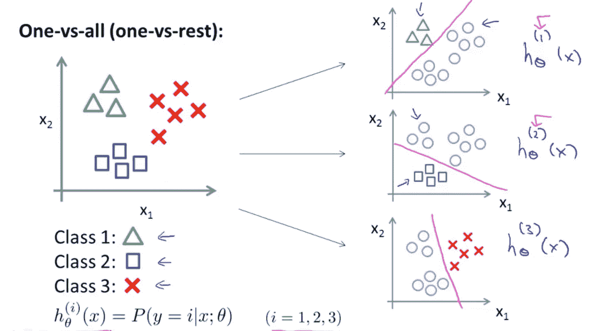
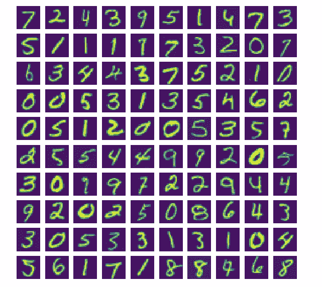

# 使用逻辑回归进行数字识别的指南(带 Python 代码)

> 原文：<https://medium.com/analytics-vidhya/a-guide-to-using-logistic-regression-for-digit-recognition-with-python-codes-86aae6da10fe?source=collection_archive---------0----------------------->


任何有抱负的数据科学家遇到的第一种分类技术通常是逻辑回归。事实上，尽管出现了像随机森林这样更强大的方法，许多银行服务仍然在使用它。然而，考虑到逻辑回归是如此简单易懂，这并不奇怪。

但是你能想象用它来完成计算机视觉任务吗？

在本帖中，我们将学习如何使用一种称为一对一分类的技术，使用像逻辑回归这样的简单算法来识别手写数字(0-9)。在此过程中，我们还将了解矢量化及其优势。

*这篇博文的灵感来源于吴恩达的机器学习课程习题集 3(数据集可以在这里*[](https://s3.amazonaws.com/spark-public/ml/exercises/on-demand/machine-learning-ex3.zip)**)获得。**

*如果你是这个领域的新手，一定要看看我下面的帖子:*

*   *[一元和多元线性回归](/analytics-vidhya/python-implementation-of-andrew-ngs-machine-learning-course-part-1-6b8dd1c73d80)(第一部分)*
*   *[逻辑回归或分类](/analytics-vidhya/python-implementation-of-andrew-ngs-machine-learning-course-part-2-1-1a666f049ad6)(第 2.1 部分)*
*   *[正则化逻辑回归](/analytics-vidhya/python-implementation-of-andrew-ngs-machine-learning-course-part-2-2-dceff1a12a12)(第 2.2 部分)*

# ***了解一对多分类***

*如果在一个数据集中有 K 个不同的类，我们将首先建立一个模型，其中我们将属于一个类的数据视为正的，而将所有其他类视为负的。接下来，我们将构建另一个模型，假设属于某个其他类的数据为正，其余的为负。我们将不断重复这个过程，直到我们建立 K 个不同的模型。*

*让我们借助一个例子来更好地理解这一点。在下图中，我们有属于 3 个不同类别的数据。因此，我们将构建 3 个不同的模型，将一类特定数据视为正值，将其余数据视为负值。*

*一般来说，如果数据集中有 K 个类，我们需要建立 K 个不同的模型。*

**

*借用吴恩达机器学习课程(Coursera)*

# ***使用逻辑回归的一对一对比***

*数据集由从 0 到 9 的数字组成，所以这里有 10 个不同的类。如上所述，我们将通过训练 10 个不同的逻辑回归分类器来利用一对一分类技术。*

*首先，让我们加载必要的库。*

```
*from scipy.io import loadmat
import numpy as np
import scipy.optimize as opt
import matplotlib.pyplot as plt*
```

***读取数据***

```
*data = loadmat('ex3data1.mat')
X = data['X']
y = data['y']*
```

*数据集有 5000 个训练样本，每个样本是一个 20×20 像素的灰度图像，展开成一个 400 维的向量，从而形成一个 5000×400 的矩阵`X`。还要注意，在标记向量`y`中，数字`0`被标记为`10`，而数字 1-9 被标记为 1-9。*

***可视化数据***

```
*_, axarr = plt.subplots(10,10,figsize=(10,10))
for i in range(10):
    for j in range(10):
       axarr[i,j].imshow(X[np.random.randint(X.shape[0])].\
reshape((20,20), order = 'F'))          
       axarr[i,j].axis('off')* 
```

**

***增加截距项***

```
*m = len(y)
ones = np.ones((m,1))
X = np.hstack((ones, X)) #add the intercept
(m,n) = X.shape*
```

***矢量化***

*根据吴恩达的说法，“向量化是一种消除代码中显式 for 循环的艺术”。作为数据科学家，我们处理大量数据。在处理如此庞大的数据时使用 for 循环是非常低效的。因此，我们利用了矢量化技术，避免了 for 循环的使用，并且提高了计算的效率和速度。*

*例如，让我们考虑两个一维数组- `a`和`b`，每个都有一百万个元素。为了演示矢量化与 for 循环的运行速度，我们对两个数组执行元素乘法，并对结果数组中的元素求和，然后比较时间差。*

```
*import numpy as np
import timea = np.random.rand(1000000)
b = np.random.rand(1000000)c = 0
tic = time.time()
for i in range(1000000):
  c += a[i] * b[i]
toc = time.time()
print("value of c {0:.5f}".format(c))
print("time taken using for-loop " + str(1000*(toc-tic)) + " ms")c = 0
tic = time.time()
c = np.dot(a,b) # no for-loops in vectorized version
toc = time.time()
print("value of c {0:.5f}".format(c))
print("time taken using vectorized operation " + str(1000*(toc-tic)) + " ms")*
```

*   *c 的值`249740.84172`*
*   *使用 for 循环花费的时间`431.77247047424316`毫秒*
*   *c 的值`249740.84172`*
*   *使用矢量化操作花费的时间`1.9989013671875`毫秒*

*从上面的输出可以看出，在这种情况下，矢量化版本比 for 循环快 200 倍。*

# ***矢量化逻辑回归***

*使用逻辑回归的矢量化版本比使用 for-loops 更有效，尤其是当数据量很大时。在本练习中，我们将通过实现矢量化逻辑回归来避免使用 for 循环。*

*因为我们知道逻辑回归使用 sigmoid 函数，我们将首先实现它:*

```
*def sigmoid(z):
    return 1/(1+np.exp(-z))*
```

*矢量化成本函数；*

```
*def costFunctionReg(theta, X, y, lmbda):
    m = len(y)
    temp1 = np.multiply(y, np.log(sigmoid(np.dot(X, theta))))
    temp2 = np.multiply(1-y, np.log(1-sigmoid(np.dot(X, theta))))
    return np.sum(temp1 + temp2) / (-m) + np.sum(theta[1:]**2) * lmbda / (2*m)*
```

*矢量化渐变:*

```
*def gradRegularization(theta, X, y, lmbda):
    m = len(y)
    temp = sigmoid(np.dot(X, theta)) - y
    temp = np.dot(temp.T, X).T / m + theta * lmbda / m
    temp[0] = temp[0] - theta[0] * lmbda / m
    return temp*
```

*从上面可以看出，我们避免了使用 for 循环，还增加了正则项来处理过度拟合。*

***优化参数***

*这里，我们将利用来自`scipy`库的一个名为`fmin_cg`的高级数值优化库函数来找到我们的参数的最佳值。*

```
*lmbda = 0.1
k = 10
theta = np.zeros((k,n)) #inital parametersfor i in range(k):
    digit_class = i if i else 10
    theta[i] = opt.fmin_cg(f = costFunctionReg, x0 = theta[i],  fprime = gradRegularization, args = (X, (y == digit_class).flatten(), lmbda), maxiter = 50)*
```

*由于我们有 10 个不同的模型，我们需要通过使用 for 循环找到每个模型的最佳参数。*

# ***使用一对一技术进行预测***

*在训练了一对一分类器之后，我们现在可以用它来预测给定图像中包含的数字。对于每个输入，您应该使用经过训练的逻辑回归分类器来计算它属于每个类的“概率”。我们将选择相应的逻辑回归分类器输出最高概率的类，并返回类标签(1、2、…、或 K)作为输入示例的预测。然后，我们使用返回的预测向量来确定模型的准确性。*

```
*pred = np.argmax(X @ theta.T, axis = 1)
pred = [e if e else 10 for e in pred]
np.mean(pred == y.flatten()) * 100*
```

*这应该给我们一个`95.08%`的精度。印象深刻！我们的模型在预测数字方面做得非常好。*

# *结束注释*

*我们已经了解了如何使用逻辑回归等简单算法来执行数字识别等复杂任务，并在此过程中了解了一对一技术和矢量化。*

*谢谢你能走到这一步。如果你喜欢我的作品，给我一个(或几个)掌声。在下一篇文章中，我们将学习神经网络。敬请期待！*