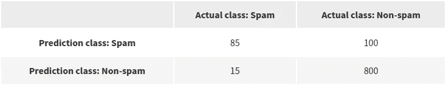
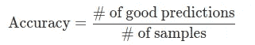
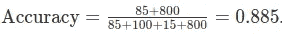
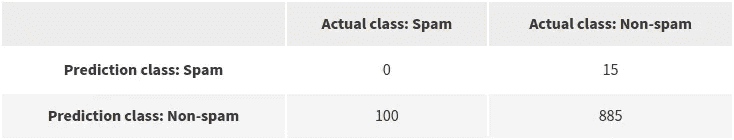
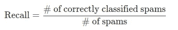
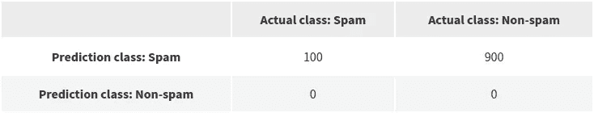
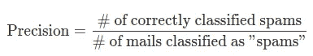
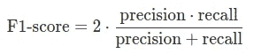

# 分类标准指南

> 原文：<https://medium.com/analytics-vidhya/a-guided-tour-of-classification-metrics-f143e56c0032?source=collection_archive---------17----------------------->

照片由 [**马克**](https://www.pexels.com/@marc-218740?utm_content=attributionCopyText&utm_medium=referral&utm_source=pexels) 发自 [**像素**](https://www.pexels.com/photo/green-and-yellow-darts-on-brown-black-green-and-red-dartboard-695266/?utm_content=attributionCopyText&utm_medium=referral&utm_source=pexels)

准确度、精确度、召回率和 F1 分数是用于评估自动分类器的度量。这些指标是根据混淆矩阵计算出来的。假设我们有垃圾邮件过滤器，它可以判断一封邮件是否是垃圾邮件。对于 100 封垃圾邮件和 900 封非垃圾邮件的测试数据集，我们得到以下结果。

这个*混淆矩阵*显示了系统在其预测中造成的混淆。但是如果我们可以用一个数字来概括这个矩阵呢？一个能告诉我们这个系统好不好的数字？

# 我们系统的预测有多“准确”

假设我们的系统实际上已经完成了毕业考试，现在是给它打分的时候了。我们可以数一数系统给出了多少个好答案。也就是 85 + 10 = 95 个好答案。然后我们给系统一个分数，这个分数是好答案的数量除以问题的数量。听起来像是在普通考试中会做的事情，对吗？这就是机器学习中称为*准确度*的度量。

在上述带有垃圾邮件过滤器的示例中，

准确性将所有答案相加，而不管它们各自的类别，如果我们的类别是平衡的，也就是说，如果它们包含大致相等数量的样本，这是可以的。然而，在垃圾邮件过滤的情况下(这是许多其他应用程序的情况，通常表示为*异常检测*)“负面”类别(非垃圾邮件)通常比“正面”类别(垃圾邮件)多**，后者应被视为“非垃圾邮件”电子邮件分布的异常值类别。让我们考虑下面的混淆矩阵。**

你能看出这个系统在预测垃圾邮件方面是多么的无用吗？然而精度没变，还是 0.885！

具有讽刺意味的是，这说明了为什么准确性不是评估系统准确性的有效指标。 *Precision* 和 *recall* 是更精细的度量，因为它们测量系统相对于“真实类别”的性能，或者在我们的例子中是“垃圾邮件类别”。让我们看看他们。

# 精确度和召回率

我们只需要改进考试的评分方式。让我们只考虑一个类，积极的类，看看我们的系统表现如何。这是对*召回*的定义。*回忆*仅将指标集中在一个类上，并测量系统预测它的能力。

当我们选择哪个类被认为是积极的时，会有一个偏差。在垃圾邮件过滤的情况下，系统应该能够在正常示例中识别垃圾邮件，因此对于垃圾邮件来说，*召回率*应该是最高的。*召回*指标并不关心你如何处理非垃圾邮件，只要你能正确识别“垃圾邮件”。

好的。但是如果你的系统认为所有的东西都是垃圾邮件呢？

它得到 Recall = 1，最高分！因此，我们还需要一个度量标准，告诉系统在将邮件标注为“垃圾邮件”时有多精确。为此，我们将自己限制在被系统预测为“垃圾邮件”的一组邮件中。

因此，系统在选择垃圾邮件时具有最大的精确度，不会出错。对于前面的例子，*精度*将是 100 / 900 = 0.1111。

我们构建了两个度量标准*召回率*和*精确度*，通过选择一个“正面”类别(“垃圾邮件”)作为我们分类问题的目标，这两个度量标准比*精确度*更加精确。

# f1-分数，因为一个数字比两个数字好

我们数据集的最佳系统将具有最大的*召回*和*精度*分数。通过取*精度*和*回忆*的调和平均值，F1 分数是一个整体性能的指标，我们可以用它来对系统的考试答案进行评分。

例如，调和平均值优于算术平均值，因为它惩罚坏分数。如果召回率高但精确度低，调和平均值将会低。这是由于调和平均数的[几何性质。](https://en.wikipedia.org/wiki/Harmonic_mean)

[来自我网站的文章](https://adamoudad.github.io/posts/classification-metrics/)