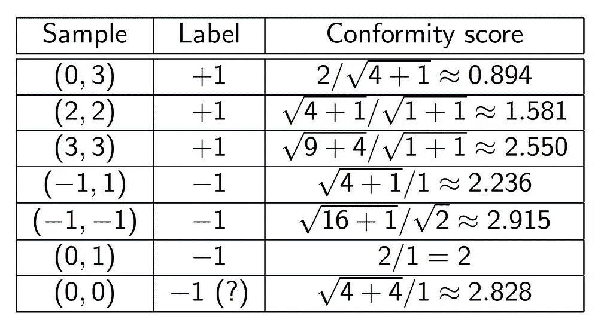

# 保形预测指南

> 原文：<https://medium.com/analytics-vidhya/a-guideline-to-conformal-prediction-7a392fc29bc1?source=collection_archive---------2----------------------->

当预测向量空间中的事件或点时，我们需要结果的有保证的有效性。这在统计学中已经作为置信区间或预测区间存在。它可以通过保形预测嵌入到机器学习中，这是相对较新的方法。

> 保形预测的思想是根据过去的经验预测给定测试观察的标签。

保形预测使用过去的经验来确定新预测的精确置信度。我们计算每个观察的不符合分数，它衡量我们的观察相对于以前的例子有多不寻常。保形预测算法使用不一致性度量，为每个误差概率ε产生一个预测区域。

通俗地说，如果给定一个训练集和测试集，我们依次尝试测试集的每个潜在标签。对于每一个假设的标签，我们看看如何似是而非的扩展训练集。如果除了一个以外，所有的完成看起来都不可信，我们可以做出有把握的预测。为了评估扩展训练集的不可信程度，我们使用了统计概念 *p 值。*

## 步伐

> 计算一致性度量

一致性度量是一种为数据集中的每个样本分配一致性分数的函数。一致性分数(*∧*)定义了数据集中的样本( *z* )与数据集中的其他样本的一致性。如果 *∝* 小，我们就说 *z* 是*不符合*或者*奇怪*。


## 有效性和效率

共形预测器自动满足以下有效性属性


即预测器最多以概率 ***ε*** 出错(假设标记样本独立且同分布)

如果预测集/数据集非常大，共形预测通常效率非常低，因为我们必须计算测试集中每个样本的一致性度量并进行预测。如果我们需要提高效率，预测集必须很小。

## 用于分类的保形预测(最近邻实现)

在最近邻分类中，我们可以以两种方式使用保形预测思想。

1.  计算到不同类别的最近样本的距离
2.  一个是到最近的同类样本的距离

结合这两种方式，


## 不符合措施

在形式上，不符合措施的定义与符合措施的定义相同。但是他们的解释是不同的


原则上，无论您使用不一致措施(皇家霍洛韦公约)还是一致措施(卡内基梅隆公约)，都没有关系。但是在回归应用中，非一致性分数通常更方便。

让我们做一个练习。

***训练设置:***
1。阳性样本:(0，3)，(2，2)，(3，3)
2。负样本:(-1，1)，(-1，-1)，(0，1)
***测试样本:*** (0，0)
让我们计算一下新样本到每个训练样本的欧氏距离。


作为一致性测量，使用到不同类别的最近样本的距离除以到相同类别的最近样本的距离。



> 1.假设(0，0)的标签是+1。测试样本是最奇怪的，所以 p 值是 1/7 = 0.143。
> 
> 2.假设(0，0)的标签是-1。测试样品是第二符合的；它的秩是 6，所以 p 值是 6/7 = 0.857。

*p 值*分别为 0.143(对于+1)和 0.857(对于-1)。我们可以预测-1，但是我们的预测没有达到 5%的统计显著性，因为我们至少应该有 20 个训练观察值。

保形预测也可以应用于回归模型，这不在本文讨论范围之内。

## Python 中保形预测的实现

```
def calculate_distance(X_tr, y_tr):
    train_length = X_tr.shape[0]
    same_class_dist, other_class_dist = [[math.inf for i in range(train_length)] for j in range(2)]

    for i in range(train_length-1):
        for j in range(i+1,train_length):
            distance = np.linalg.norm(X_tr[i]-X_tr[j])

            if y_tr[i]==y_tr[j]:
                if distance < same_class_dist[i]:
                    same_class_dist[i] = distance
                if distance < same_class_dist[j]:
                    same_class_dist[j] = distance
            else:
                if distance < other_class_dist[i]:
                    other_class_dist[i] = distance
                if distance < other_class_dist[j]:
                    other_class_dist[j] = distance

    return [same_class_dist, other_class_dist]def conformal_prediction(X, y, dataset, test_size=0.3, train_size=0.7, random_state=3006):
    predicted_list, p_values = [[] for i in range(2)]
    # splitting the data
    X_train,X_test,y_train,y_test = train_test_split(X, y, test_size=test_size, train_size=train_size, random_state=random_state)
    lenrange = len(list(set(y_train)))
    same_class_dist, other_class_dist = calculate_distance(X_train, y_train)

    for i in range(len(X_test)):
        conformity_scores = [[] for j in range(lenrange)]
        curr_testXval = X_test[i]
        for j in range(lenrange):
            new_same_dist = np.append(same_class_dist, math.inf)
            new_other_class_dist = np.append(other_class_dist, math.inf)
            extended_X = np.concatenate((X_train, [curr_testXval]), axis = 0)
            extended_y = np.concatenate((y_train, [j]), axis = 0)

            for curr_idx, curr_elem in enumerate(extended_X):
                distance = np.linalg.norm(curr_elem - curr_testXval)
                idx = len(extended_X)-1

                if distance != 0: #to avoid duplicate value
                    if j == extended_y[curr_idx]:
                        if distance < new_same_dist[idx]:
                            new_same_dist[idx] = distance
                    else:
                        if distance < new_other_class_dist[idx]:
                            new_other_class_dist[idx] = distance

                if new_same_dist[curr_idx] == 0: #to avoid duplicate value
                    conformity_scores[j].append(0)
                else:
                    conformity_scores[j].append(new_other_class_dist[curr_idx]/new_same_dist[curr_idx])

        p_vals = []
        for k in range(lenrange):
            p_vals.append(np.mean(conformity_scores[k]<=conformity_scores[k][X_train.shape[0]]))

        predicted_list.append(p_vals.index(max(p_vals)))
        p_values.append(p_vals)

    falsep = []
    for i, p in enumerate(p_values):
        sumval = 0;
        for j, q in enumerate(p):
            if j != y_test[i]:
                sumval += q
        falsep.append(sumval)

    false_p_value = np.sum(falsep)/(len(falsep)*2)
    accuracy = np.mean(predicted_list == y_test)

    print("For {}, "
          "The average false p-value : {} \n"
          "The accuracy of prediction : {} \n"
          "The test error rate is : {}"
          .format(dataset, false_p_value, accuracy, 1-accuracy))
```

这种共形预测适用于 Iris 和电离层数据集。代码的完整上下文可以在资源库中找到。

[](https://github.com/venkatasandeepd/conformal_prediction) [## venkatasandeepd/conformal _ 预测

### IRIS 和电离层数据集上的 KNN 和共形预测实现—venkatasandeepd/Conformal _ Prediction

github.com](https://github.com/venkatasandeepd/conformal_prediction) 

还有保形预测的框架实现，它可以用作 scikit-learn 库的扩展。

## Python 包

1.  Orange 3 中的保形预测附加组件(版本 1.1.3，2019 年 5 月)
    https://pypi.org/project/Orange3-Conformal/
2.  不墨守成规者亨利克·利努松(2017 年 6 月 2.1.0 版)
    https://pypi.org/project/nonconformist/
    [https://github.com/donlnz/nonconformist](https://github.com/donlnz/nonconformist)
    [http://donlnz.github.io/nonconformist/](http://donlnz.github.io/nonconformist/)

## r 包

1.  卡耐基梅隆共形推理团队(马克斯·格塞尔、井磊、亚历山德罗·里纳尔多、瑞安·蒂布拉尼和拉里·乏色曼)，《共形参考》(版本 1.0.0，2018 年 6 月)
    https://github.com/ryantibs/conformal/
2.  Niharika Gauraha 和 Ola Spjuth，保形分类(版本 1.0.0，2017 年 12 月)
    https://cran . r-project . org/web/packages/保形分类/

## 资源:

1.  [http://jmlr . csail . MIT . edu/papers/volume 9/shafer 08 a/shafer 08 a . pdf](http://jmlr.csail.mit.edu/papers/volume9/shafer08a/shafer08a.pdf)
2.  [https://CML . rhul . AC . uk/Copa 2017/presentations/CP _ Tutorial _ 2017 . pdf](https://cml.rhul.ac.uk/copa2017/presentations/CP_Tutorial_2017.pdf)

感谢您的阅读:)