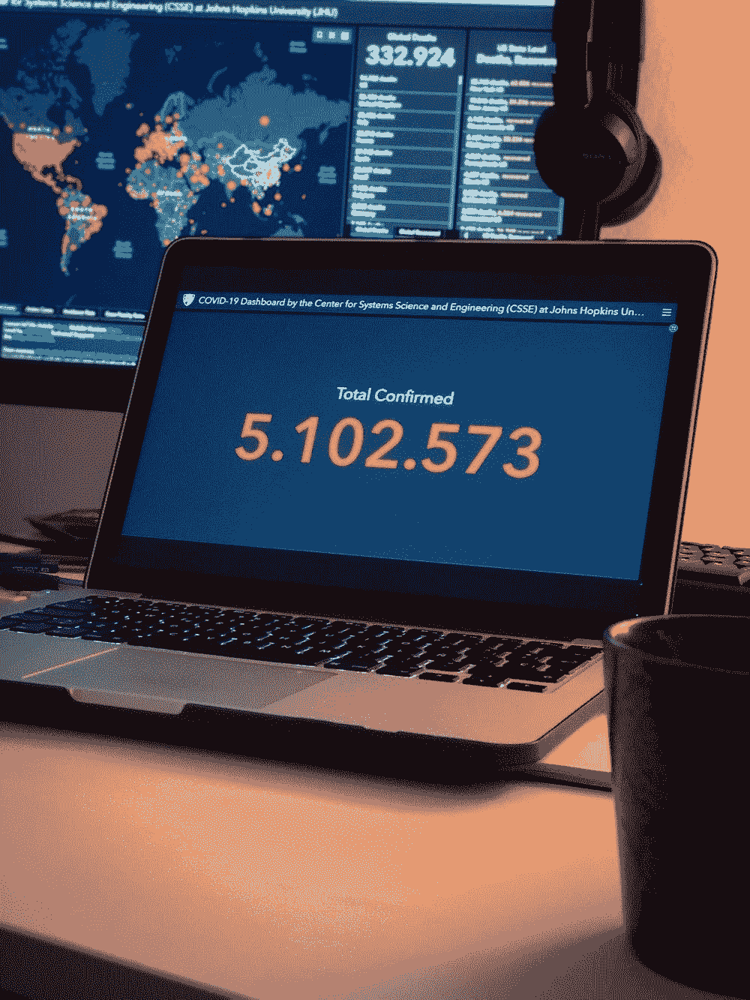

# 一个自我复制的黑客，不用 CPU/GPU 就能挖掘密码

> 原文：<https://medium.com/analytics-vidhya/a-hack-that-replicates-self-mines-crypto-without-cpu-gpu-d88219a0a1c3?source=collection_archive---------22----------------------->

资料来源:联合国人类住区规划署

现在，继续我的概念验证。请注意，我没有创建(大部分)这个，也没有将它传播给任何不同意的机器。假设并不违法，对吧？

注意:我确实创建了大部分 powershell 中的挖掘脚本，并在不久前执行了它。这个概念验证的其他方面是全新的。