# Python 自动化要素工程实践指南

> 原文：<https://medium.com/analytics-vidhya/a-hands-on-guide-to-automated-feature-engineering-in-python-13260eae9270?source=collection_archive---------2----------------------->

任何参加过机器学习黑客马拉松和竞赛的人都可以证明特征工程是多么重要。往往就是进入排行榜前 10 和排在前 50 之外的区别！

自从我意识到特征工程的巨大潜力，我就一直是它的大力支持者。但是手动完成时，这可能是一个缓慢而艰巨的过程。我必须花时间集思广益，想出什么功能，并从不同的角度分析它们的可用性。现在，整个有限元过程可以自动化，我将在本文中向您展示如何实现。

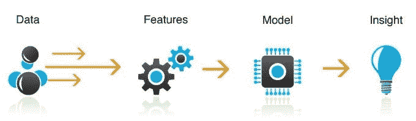

*来源:VentureBeat*

我们将使用名为 Featuretools 的 Python 特征工程库来完成这项工作。但是在我们开始之前，我们将首先看看 FE 的基本构建模块，通过直观的例子来理解它们，然后最终使用 [BigMart 销售数据集](https://datahack.analyticsvidhya.com/contest/practice-problem-big-mart-sales-iii/)深入到自动化特征工程的令人敬畏的世界。

# 目录

1.  什么是特性？
2.  什么是特征工程？
3.  为什么需要特征工程？
4.  自动化特征工程
5.  功能工具简介
6.  功能工具的实现
7.  功能工具可解释性

# 1.什么是特性？

在机器学习的背景下，特征可以被描述为解释现象发生的一个特征或一组特征。当这些特征转换成某种可测量的形式时，就叫做特征。

例如，假设您有一个学生列表。这个列表包含每个学生的名字，他们学习的小时数，他们的智商，以及他们在以前考试中的总分数。现在你得到了一个新学生的信息——他/她学习的小时数和他/她的智商，但是他/她的分数不见了。你必须估计他/她的可能分数。

在这里，你可以使用智商和学习时间建立一个预测模型来估计这些缺失的分数。所以，智商和学习时间被称为这个模型的特征。


# 2.什么是特征工程？

要素工程可以简单地定义为从数据集中的现有要素创建新要素的过程。让我们考虑一个样本数据，它包含一些商品的详细信息，比如它们的重量和价格。

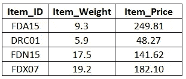

现在，要创建一个新特性，我们可以使用 Item_Weight 和 Item_Price。因此，让我们创建一个名为 Price_per_Weight 的特性。它只不过是物品的价格除以物品的重量。这个过程被称为特征工程。

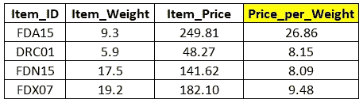

这只是一个从现有特性创建新特性的简单例子，但是在实践中，当我们有相当多的特性时，特性工程会变得相当复杂和麻烦。

我们再举一个例子。在流行的泰坦尼克号数据集中，有一个乘客姓名功能，以下是数据集中的一些姓名:

*   约萨斯牧师蒙特维拉
*   格雷厄姆小姐。玛格丽特·伊迪丝
*   约翰斯顿小姐。凯瑟琳·海伦《嘉莉》
*   卡尔·豪厄尔先生
*   杜利，帕特里克先生

这些名称实际上可以分解成更多有意义的特性。例如，我们可以提取相似的标题并将其分组到单个类别中。让我们来看看乘客姓名中独特的头衔数。

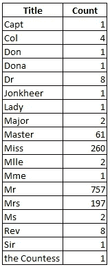

事实证明，像“夫人”、“夫人”、“伯爵夫人”、“上尉”、“上校”、“唐”、“博士”、“少校”、“牧师”、“先生”和“琼基尔”这样的头衔非常罕见，可以放在一个标签下。姑且称之为*稀有 _ 称号*。除此之外，头衔“Mlle”和“Ms”可以放在“Miss”下面，“Mme”可以用“Mrs”代替。

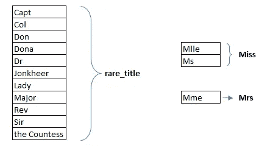

因此，新的标题功能将只有 5 个唯一值，如下所示:

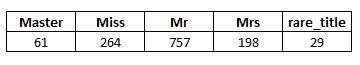

因此，这就是我们如何在特征工程的帮助下提取有用的信息，甚至是从最初看起来毫无意义的乘客姓名这样的特征中。

# 3.为什么需要特征工程？

预测模型的性能在很大程度上取决于用于为该模型定型的数据集中的要素的质量。如果您能够创建新的特性来帮助为模型提供更多关于目标变量的信息，那么它的性能将会提高。因此，当我们的数据集中没有足够的高质量特征时，我们必须依靠特征工程。

在最受欢迎的 Kaggle 比赛之一“自行车共享需求预测”中，参与者被要求根据与天气、时间和其他数据相关的历史使用模式来预测华盛顿特区的租赁需求。

正如在这篇[文章](https://www.analyticsvidhya.com/blog/2015/06/solution-kaggle-competition-bike-sharing-demand/)中所解释的，智能功能工程在确保排行榜前 5%的位置中发挥了重要作用。下面给出了创建的一些特征:

1.  **小时箱**:宁滨在决策树的帮助下创建了一个新功能*小时*功能
2.  **温度箱**:类似地，温度变量的装箱特征
3.  **年份库**:创建了 8 个季度库，为期 2 年
4.  **日类型**:日分为“工作日”、“周末”或“假日”

创建这样的功能并不容易——它需要大量的头脑风暴和广泛的数据探索。不是每个人都擅长特征工程，因为这不是你通过看书或看视频就能学会的。这就是为什么特征工程也被称为一门艺术。如果你擅长它，那么你在竞争中就有很大的优势。很像罗杰·费德勒，网球击球时的特征工程大师。


# 4.自动化特征工程


分析上面显示的两幅图像。左图展示了 20 世纪早期一群人正在组装一辆汽车，右图展示了当今世界机器人做着同样的工作。任何流程的自动化都有可能使其更加高效和经济。出于类似的原因，特征工程可以并且已经在机器学习中实现了自动化。

构建机器学习模型通常是一个艰苦而乏味的过程。它涉及许多步骤，因此如果我们能够自动完成一定比例的功能工程任务，那么数据科学家或领域专家就可以专注于模型的其他方面。听起来好得难以置信，对吧？

既然我们已经理解了自动化特征工程是当前的需要，下一个问题是——它将如何发生？嗯，我们有一个很好的工具来解决这个问题，它被称为功能工具。

# 5.功能工具简介


Featuretools 是一个用于执行自动化特征工程的开源库。这是一个非常棒的工具，旨在快速推进特征生成过程，从而将更多时间专注于机器学习模型构建的其他方面。换句话说，它让你的数据“机器学习就绪”。

在使用 Featuretools 之前，我们应该了解该软件包的三个主要组件:

*   实体
*   深度特征综合(DFS)
*   特征基元

a)一个**实体**可以被认为是一个熊猫数据帧的表示。多个实体的集合被称为一个**实体集**。

b) **深度特征合成** (DFS)与深度学习无关。别担心。DFS 实际上是一种特征工程方法，是 Featuretools 的主干。它支持从单个以及多个数据帧创建新要素。

c) DFS 通过将**特征原语**应用于 EntitySet 中的实体关系来创建特征。这些图元是手动生成特征的常用方法。例如，原语“mean”将在聚合级别找到变量的平均值。

理解和熟悉 Featuretools 的最佳方式是将其应用于数据集。因此，我们将在下一节中使用来自我们的 [**BigMart 销售实践问题**](https://datahack.analyticsvidhya.com/contest/practice-problem-big-mart-sales-iii/) 的数据集来巩固我们的概念。

# 6.功能工具的实现

BigMart 销售挑战的目标是建立一个预测模型来估计特定商店中每种产品的销售额。这将有助于 BigMart 的决策者找出任何产品或商店的属性，这些属性在增加整体销售额中起着关键作用。请注意，在给定的数据集中，10 家商店有 1559 种产品。

下表显示了我们的数据中提供的功能:

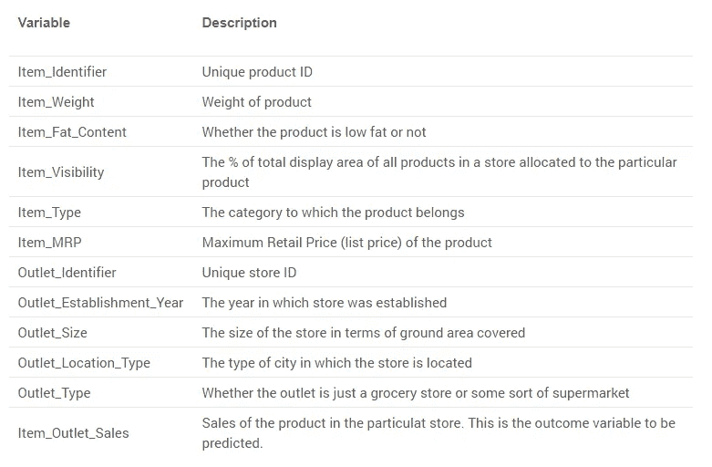

你可以从[这里](https://datahack.analyticsvidhya.com/contest/practice-problem-big-mart-sales-iii/)下载数据。

# 6.1.装置

Python 2.7、3.5 和 3.6 版提供了 Featuretools。您可以使用 pip 轻松安装 Featuretools。

```
pip install featuretools
```

# 6.2.加载所需的库和数据

```
import featuretools as ft 
import numpy as np 
import pandas as pd train = pd.read_csv("Train_UWu5bXk.csv") 
test = pd.read_csv("Test_u94Q5KV.csv")
```

# 6.3.数据准备

首先，我们将目标 Item_Outlet_Sales 存储在一个名为 Sales 的变量中，id 变量存储在 test_Item_Identifier 和 test_Outlet_Identifier 中。

```
# saving identifiers 
test_Item_Identifier = test['Item_Identifier'] test_Outlet_Identifier = test['Outlet_Identifier'] sales = train['Item_Outlet_Sales'] 
train.drop(['Item_Outlet_Sales'], axis=1, inplace=True)
```

然后，我们将组合训练集和测试集，因为这样可以省去我们两次执行相同步骤的麻烦。

```
combi = train.append(test, ignore_index=True)
```

让我们检查数据集中缺失的值。

```
combi.isnull().sum()
```

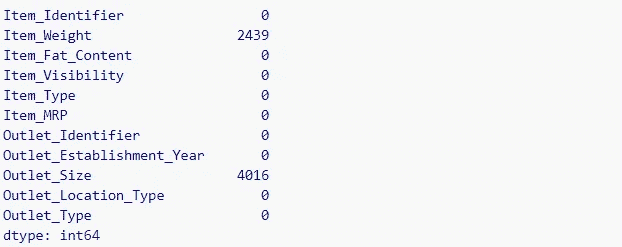

Item_Weight 和 Outlet_size 变量中有大量缺失值。让我们快速处理它们:

```
# imputing missing data combi['Item_Weight'].fillna(combi['Item_Weight'].mean(), 
                            inplace = True) combi['Outlet_Size'].fillna("missing", inplace = True)
```

# 6.4.数据预处理

我不会做大量的预处理操作，因为这篇文章的目的是让你开始使用 Featuretools。

```
combi['Item_Fat_Content'].value_counts()
```

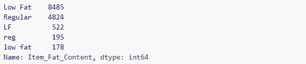

似乎 Item_Fat_Content 只包含两个类别，即“低脂”和“普通”——其余的我们将认为是多余的。所以，我们把它转换成一个二进制变量。

```
# dictionary to replace the categories fat_content_dict = {'Low Fat':0, 'Regular':1, 'LF':0, 'reg':1, 
                    'low fat':0} combi['Item_Fat_Content'] = combi['Item_Fat_Content'].replace(   
                            fat_content_dict, regex=True)
```

# 6.5.使用特征工具的特征工程

现在我们可以开始使用 Featuretools 来执行自动化的特征工程了！数据集中必须有一个唯一标识符特征(我们的数据集目前还没有)。因此，我们将为合并的数据集创建一个唯一的 ID。如果您注意到，我们的数据中有两个 IDs 一个用于商品，另一个用于经销店。因此，简单地将两者连接起来将会给我们一个唯一的 ID。

```
combi['id'] = combi['Item_Identifier'] + combi['Outlet_Identifier'] combi.drop(['Item_Identifier'], axis=1, inplace=True)
```

请注意，我已经删除了功能 *Item_Identifier* ，因为不再需要它了。但是，我保留了功能 *Outlet_Identifier* ，因为我打算以后使用它。

现在，在继续之前，我们必须创建一个 EntitySet。EntitySet 是包含多个数据帧以及它们之间的关系的结构。因此，让我们创建一个 EntitySet 并向其添加 dataframe 组合。

```
# creating and entity set 'es' 
es = ft.EntitySet(id = 'sales') # adding a dataframe 
es.entity_from_dataframe(entity_id = 'bigmart', 
                         dataframe = combi, 
                         index = 'id')
```

我们的数据包含两个级别的信息——商品级别和经销店级别。Featuretools 提供了将数据集分割成多个表的功能。我们根据 Outlet ID*Outlet _ Identifier*从 BigMart 表中创建了一个新表‘Outlet’。

```
es.normalize_entity(base_entity_id='bigmart', 
                    new_entity_id='outlet', 
                    index = 'Outlet_Identifier', 
                    additional_variables =   
                    ['Outlet_Establishment_Year', 'Outlet_Size',  
                     'Outlet_Location_Type', 'Outlet_Type'])
```

让我们检查一下我们的 EntitySet 的摘要。

```
print(es)
```

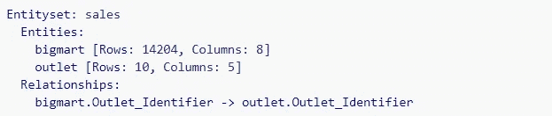

正如您在上面看到的，它包含两个实体— bigmart 和 outlet。这两个表之间也形成了一种关系，由 Outlet_Identifier 连接。这种关系将在新功能的生成中发挥关键作用。

现在我们将使用**深度特征合成**来自动创建新特征。回想一下，DFS 使用功能原语，通过 EntitySet 中的多个表来创建功能。

```
feature_matrix, feature_names = ft.dfs(entityset=es, 
                                       target_entity = 'bigmart', 
                                       max_depth = 2, 
                                       verbose = 1, 
                                       n_jobs = 3)
```

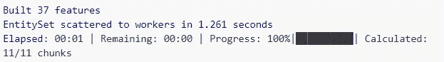

*target_entity* 只是我们希望为其创建新特征的实体 ID(在本例中，它是实体‘bigmart’)。参数 *max_depth* 控制通过堆叠图元生成的特征的复杂度。参数 *n_jobs* 通过使用多个内核来帮助并行特征计算。

这就是使用 Featuretools 所要做的一切。它自己产生了一系列新功能。

让我们来看看这些新创建的功能。

```
feature_matrix.columns
```

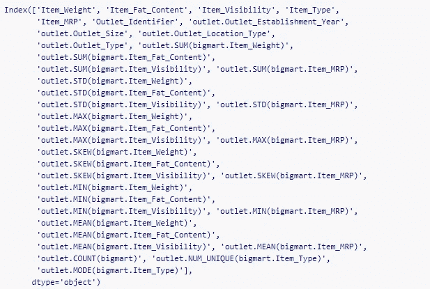

DFS 在如此短的时间内创建了 29 个新功能。这是惊人的，因为手动操作会花费更长的时间。如果您的数据集包含多个相互关联的表，Featuretools 仍然有效。在这种情况下，您不必规范化一个表，因为已经有多个表可用了。

让我们打印 feature_matrix 的前几行。

```
feature_matrix.head()
```

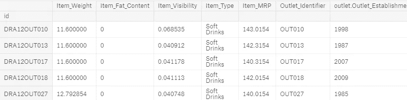

这个数据帧有一个问题—排序不正确。我们必须根据*组合*数据框中的 *id* 变量对其进行排序。

```
feature_matrix = feature_matrix.reindex(index=combi['id']) feature_matrix = feature_matrix.reset_index()
```

现在，数据框特征矩阵处于正确的顺序。

# 6.6.模型结构

是时候检查这些生成的特性实际上有多大用处了。我们将使用它们来建立模型并预测 Item_Outlet_Sales。因为我们的最终数据(feature_matrix)有许多分类特征，所以我决定使用 CatBoost 算法。它可以直接使用分类特征，并且本质上是可扩展的。你可以参考[这篇文章](https://www.analyticsvidhya.com/blog/2017/08/catboost-automated-categorical-data/)了解更多关于 CatBoost 的内容。

```
from catboost import CatBoostRegressor
```

CatBoost 要求所有分类变量都是字符串格式。因此，我们首先将数据中的分类变量转换为字符串:

```
categorical_features = np.where(feature_matrix.dtypes =='object')[0] for i in categorical_features: 
    feature_matrix.iloc[:,i]=feature_matrix.iloc[:,i].astype('str')
```

让我们将 feature_matrix 拆分回训练集和测试集。

```
feature_matrix.drop(['id'], axis=1, inplace=True) train = feature_matrix[:8523] 
test = feature_matrix[8523:]# removing uneccesary variables 
train.drop(['Outlet_Identifier'], axis=1, inplace=True) test.drop(['Outlet_Identifier'], axis=1, inplace=True)# identifying categorical features categorical_features = np.where(train.dtypes == 'object')[0]
```

将训练数据分为训练集和验证集，以在本地检查模型的性能。

```
from sklearn.model_selection import train_test_split # splitting train data into training and validation set 
xtrain, xvalid, ytrain, yvalid = train_test_split(train, sales, 
                                                  test_size=0.25, 
                                                  random_state=11)
```

最后，我们现在可以训练我们的模型。我们将使用的评估指标是 RMSE(均方根误差)。

```
model_cat = CatBoostRegressor(iterations=100, learning_rate=0.3, 
                              depth=6, eval_metric='RMSE',  
                              random_seed=7) # training model 
model_cat.fit(xtrain, ytrain, cat_features=categorical_features, 
              use_best_model=True)# validation score 
model_cat.score(xvalid, yvalid)
```

**1091.244**

验证集的 RMSE 分数约为 1092.24。

**同款在大众排行榜上获得 1155.12 分。在没有任何特征工程的情况下，在验证集和公共排行榜上的分数分别为~1103 和~1183。因此，由 Featuretools 创建的要素不仅仅是随机要素，它们是有价值和有用的。最重要的是，它在特征工程中节省的时间是不可思议的。**

# 7.功能工具可解释性

使我们的数据科学解决方案可解释是执行机器学习的一个非常重要的方面。由 Featuretools 生成的特征即使对非技术人员来说也很容易解释，因为它们基于易于理解的图元。

例如，特色*插座。SUM(bigmart。*【物品 _ 重量】*出口。STD(bigmart。Item_MRP)* 分别表示门店级别的物品重量和物品成本的标准差。

这使得那些不是机器学习专家的人也可以根据他们的领域专长做出贡献。

# 结束注释

featuretools 包确实是机器学习领域的游戏规则改变者。虽然可以理解它的应用在行业用例中仍然有限，但它在黑客马拉松和 ML 竞赛中已经迅速变得非常流行。它所节省的时间，以及它所产生的有用的特性，真的赢得了我的心。

下次处理任何数据集时尝试一下，并在评论部分告诉我效果如何！

*原载于 2018 年 8 月 22 日*[*www.analyticsvidhya.com*](https://www.analyticsvidhya.com/blog/2018/08/guide-automated-feature-engineering-featuretools-python/)*。*