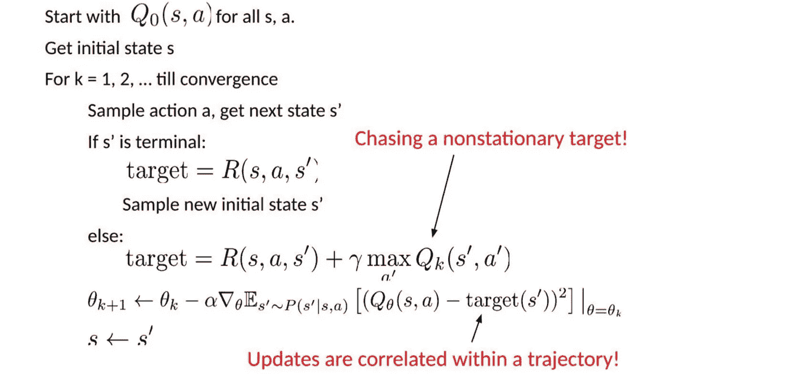

# 使用 Python 中的 OpenAI Gym 进行深度 Q 学习的实践介绍

> 原文：<https://medium.com/analytics-vidhya/a-hands-on-introduction-to-deep-q-learning-using-openai-gym-in-python-b15d7d8597d?source=collection_archive---------0----------------------->

# 介绍

我一直对游戏很着迷。在紧张的时间表下执行一个动作似乎有无限的选择——这是一种令人兴奋的体验。没有什么比这更好的了。

因此，当我读到 DeepMind 正在开发的令人难以置信的算法(如 AlphaGo 和 AlphaStar)时，我就被迷住了。我想学习如何在自己的机器上制作这些系统。这让我进入了深度强化学习的世界。

即使你不喜欢游戏，深度学习也很重要。请查看当前使用 Deep RL 进行研究的各种功能:

行业就绪的应用程序呢？这里有两个最常被引用的深度 RL 使用案例:

*   谷歌的云汽车
*   脸书的地平线平台

深度 RL 的范围是巨大的。这是进入这个领域并以此为职业的大好时机。

在这篇文章中，我的目标是帮助你迈出进入深度强化学习世界的第一步。我们将使用 RL 中最流行的算法之一，深度 Q 学习，来理解深度 RL 是如何工作的。还有锦上添花？我们将使用 Python 在一个很棒的案例研究中实现我们所有的学习。

# 目录

1.  Q-Learning 之路
2.  为什么要进行“深度”Q 学习？
3.  深度 Q 学习简介
4.  与深度学习相比，深度强化学习的挑战
5.  体验回放
6.  目标网络
7.  使用 Keras & Gym 在 Python 中实现深度 Q 学习

# Q-Learning 之路

在深入深度强化学习之前，您应该了解一些概念。别担心，我会掩护你的。

我以前写过各种关于强化学习的具体细节的文章，介绍像多臂强盗、动态编程、蒙特卡罗学习和时间差分这样的概念。我建议按以下顺序浏览这些指南:

这些文章足以从一开始就获得基础 RL 的详细概述。

*然而，请注意，上面链接的文章绝不是读者理解深度 Q 学习的先决条件。在探索什么是深度 Q 学习及其实现细节之前，我们将快速回顾一下基本的 RL 概念。*

# RL 代理-环境

强化学习任务是关于训练一个**代理**，它与它的**环境**交互。代理通过执行**动作**到达被称为**状态**的不同场景。行动会带来积极和消极的回报。

代理人在这里只有一个目的——在一集里最大化它的总报酬。这一集是在环境中第一个状态和最后一个或最终状态之间发生的任何事情。我们通过经验强化代理学习执行最佳操作。这就是战略或**政策**。

让我们以超受欢迎的 PubG 游戏为例:

*   士兵是与环境互动的代理人
*   这些状态正是我们在屏幕上看到的
*   一集是一个完整的游戏
*   动作有向前、向后、向左、向右、跳、蹲下、射门等。
*   奖励是根据这些行动的结果来确定的。如果士兵能够杀死一个敌人，那就需要一个积极的奖励，而被敌人击中则是一个消极的奖励

现在，为了杀死敌人或获得积极的奖励，需要一系列的行动。这就是延迟或推迟奖励的概念发挥作用的地方。RL 的关键是学习执行这些序列，并最大化回报。

# 马尔可夫决策过程(MDP)

需要注意的重要一点是，环境中的每个状态都是前一个状态的结果，而前一个状态又是前一个状态的结果。然而，存储所有这些信息，甚至对于具有短情节的环境，将变得不可行。

为了解决这个问题，我们假设每个状态遵循一个马尔可夫性质，即每个状态仅依赖于前一个状态以及从该状态到当前状态的转换。查看下面的迷宫，更好地理解其工作原理背后的直觉:

现在，有两个场景，有两个不同的起点，代理通过不同的路径到达相同的倒数第二个状态。现在，代理通过什么路径到达红色状态并不重要。离开迷宫并到达最后一个状态的下一步是向右走。显然，我们只需要红色/倒数第二个状态的信息来找出下一个最佳行动，这正是马尔可夫属性所暗示的。

# q 学习

假设我们知道每一步每一个行动的预期回报。这基本上就像是代理的备忘单！我们的代理会准确地知道该执行哪个操作。

它将执行一系列的行动，最终产生最大的总回报。这种总回报也称为 Q 值，我们将我们的战略正式化为:

上面的等式表明，处于状态 *s* 并执行动作 *a* 所产生的 Q 值是即时回报 r(s，a)加上下一状态*s’*可能的最高 Q 值。这里的 Gamma 是贴现因子，它进一步控制未来奖励的贡献。

Q(s’，a)再次依赖于 Q(s”，a)，于是 Q(s”，a)将具有γ平方系数。因此，Q 值取决于未来状态的 Q 值，如下所示:

调整 gamma 的值会减少或增加未来奖励的贡献。

由于这是一个递归方程，我们可以从任意假设所有 q 值开始。有了经验，就会收敛到最优策略。在实际情况下，这是作为更新来实现的:

其中α是学习速率或步长。这仅仅决定了新获得的信息覆盖旧信息的程度。

# 为什么要进行“深度”Q 学习？

Q-learning 是一个简单但非常强大的算法，可以为我们的代理创建一个备忘单。这有助于代理准确地计算出要执行的操作。

但是如果这个备忘单太长了怎么办？想象一个有 10，000 个状态，每个状态有 1，000 个动作的环境。这将创建一个包含 1000 万个单元格的表格。事情会很快失控！

很明显，我们不能从已经探索过的态中推断出新态的 Q 值。这提出了两个问题:

*   首先，保存和更新该表所需的内存量会随着状态数量的增加而增加
*   第二，探索每个状态以创建所需的 Q 表所需的时间是不现实的

这里有一个想法——如果我们用机器学习模型(如神经网络)来近似这些 Q 值会怎么样？嗯，这就是 DeepMind 算法背后的想法，导致它被谷歌以 5 亿美元收购！

# 深度 Q-网络

在深度 Q 学习中，我们使用神经网络来逼近 Q 值函数。状态作为输入给出，所有可能动作的 Q 值作为输出产生。Q-learning 和深度 Q-learning 之间的比较如下图所示:

那么，使用深度 Q 学习网络(dqn)进行强化学习涉及到哪些步骤呢？

1.  所有过去的经验都由用户存储在存储器中
2.  下一个动作由 Q 网络的最大输出决定
3.  这里的损失函数是预测 Q 值和目标 Q 值的均方误差— Q*。这基本上是一个回归问题。然而，我们不知道这里的目标或实际值，因为我们正在处理一个强化学习问题。回到从贝尔曼方程导出的 Q 值更新方程。我们有:

绿色部分代表目标。我们可以说它在预测自己的值，但由于 R 是无偏的真实回报，网络将使用反向传播来更新其梯度，以最终收敛。

# 与深度学习相比，深度学习面临的挑战

到目前为止，这一切看起来都很好。我们了解神经网络如何帮助代理学习最佳行动。然而，当我们将深度 RL 与深度学习(DL)进行比较时，存在一个挑战:

正如您在上面的代码中看到的，目标在每次迭代中不断变化。在深度学习中，目标变量不会改变，因此训练是稳定的，这对于 RL 来说是不正确的。

总之，我们经常依靠强化学习中的策略或价值函数来采样动作。然而，随着我们不断学习探索什么，这种情况经常会发生变化。随着游戏的进行，我们对状态和动作的基本真值有了更多的了解，因此输出也在变化。

因此，我们试图学习映射一个不断变化的输入和输出。但是解决办法是什么呢？

# 1.目标网络

由于同一个网络正在计算预测值和目标值，这两者之间可能会有很大差异。因此，我们可以使用两个神经网络，而不是使用一个神经网络进行学习。

我们可以使用单独的网络来估计目标。该目标网络具有与函数逼近器相同的架构，但是具有冻结的参数。对于每 C 次迭代(超参数)，来自预测网络的参数被复制到目标网络。这导致更稳定的训练，因为它保持目标函数固定(一段时间):

# 2.体验回放

以上说法是什么意思？当状态/动作对在模拟或实际体验中出现时，系统不是在状态/动作对上运行 Q-learning，而是将[状态、动作、奖励、下一状态]的发现数据存储在一个大表中。

让我们用一个例子来理解这一点。

假设我们试图构建一个视频游戏机器人，游戏的每一帧代表一个不同的状态。在训练期间，我们可以从最后 100，000 帧中随机抽取 64 帧来训练我们的网络。这将使我们得到一个子集，其中样本之间的相关性较低，并且还将提供更好的采样效率。

# 把所有的放在一起

到目前为止我们学到的概念？它们结合在一起形成了深度 Q 学习算法，该算法用于在 Atari 游戏中实现人类水平的性能(仅使用游戏的视频帧)。

我在下面列出了深度 Q 网络(DQN)涉及的步骤:

1.  预处理并将游戏屏幕(状态 s)输入到我们的 DQN，它将返回状态中所有可能动作的 Q 值
2.  使用ε-greedy 策略选择一个操作。对于概率ε，我们选择随机动作 *a* ，对于概率 1-ε，我们选择具有最大 Q 值的动作，例如 a = argmax(Q(s，a，w))
3.  在一个州 *s* 执行这个动作，然后移动到一个新的州*s’*领取奖励。这个状态 s’是下一个游戏屏幕的预处理图像。我们将这个过渡存储在我们的重放缓冲器中作为< s，a，r，s’>
4.  接下来，从重放缓冲区中随机抽取一些转换批次，并计算损失
5.  众所周知:

也就是目标 Q 和预测 Q 的平方差

6.相对于我们的实际网络参数执行梯度下降，以最小化这种损失

7.每 C 次迭代后，将我们的实际网络权重复制到目标网络权重

8.重复这些步骤达 *M* 集

现在来看看实际情况，在 [Analytics Vidhya 博客](https://www.analyticsvidhya.com/blog/2019/04/introduction-deep-q-learning-python/)上有一个很棒的 python 案例研究，使用 Keras-rl 库和 Deep Q 学习来解决 Cartpole 问题。看看这个。