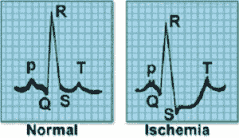
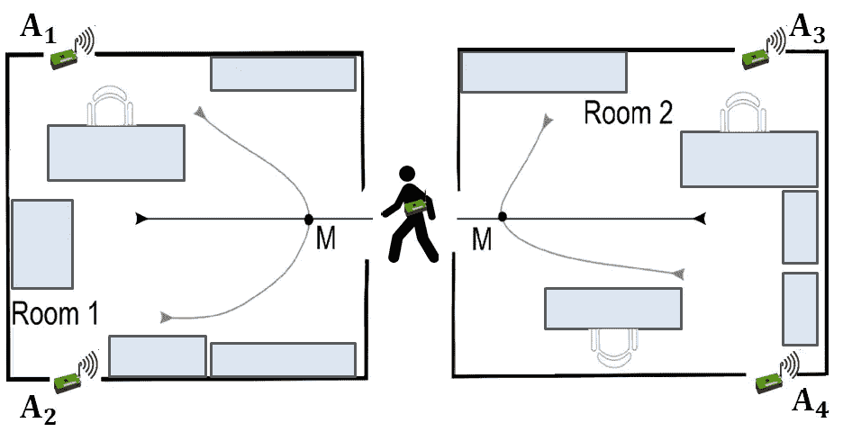
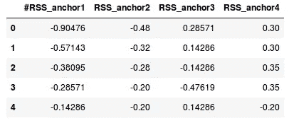
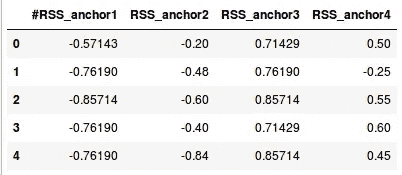
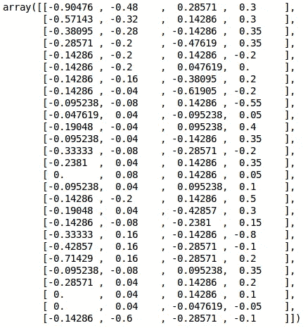
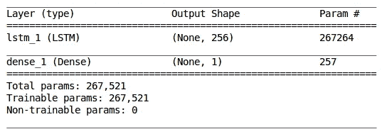

# 时间序列分类实践介绍(带 Python 代码)

> 原文：<https://medium.com/analytics-vidhya/a-hands-on-introduction-to-time-series-classification-with-python-code-48f8b442e7c1?source=collection_archive---------0----------------------->

对时间序列数据进行分类？这真的可能吗？这样做的潜在用途是什么？以上只是你在看这篇文章标题时一定会有的一些疑问。公平地说，当我第一次看到这个概念时，我也有同样的想法！

我们大多数人接触到的时间序列数据主要用于生成预测。无论是预测产品的需求或销售、航空公司的乘客数量还是特定股票的收盘价，我们都习惯于利用久经考验的时间序列技术来预测需求。


但是随着生成的数据量呈指数级增长，尝试新想法和算法的机会也在增加。处理复杂的时间序列数据集仍然是一个利基领域，扩展您的知识库以包含新的想法总是有帮助的。

这就是我在这篇文章中要做的，向你介绍时间序列分类的新概念。我们将首先了解这个主题的含义及其在行业中的应用。但是我们不会停留在理论部分—我们将通过处理时间序列数据集和执行二元时间序列分类来动手。边做边学——这也将帮助你以实用的方式理解这个概念。

如果你以前没有处理过时间序列问题，我强烈建议你先从一些基本的预测开始。首先，你可以阅读下面的文章:

[创建时间序列预测的综合初学者指南(用 Python 编写代码)](https://www.analyticsvidhya.com/blog/2016/02/time-series-forecasting-codes-python/)

# 目录

1.  时间序列分类介绍
    1.1 心电信号
    1.2 图像数据
    1.3 传感器
2.  设置问题陈述
3.  阅读和理解数据
4.  预处理
5.  构建我们的时间序列分类模型

# 时间序列分类介绍

时间序列分类实际上已经存在一段时间了。但到目前为止，它主要局限于研究实验室，而不是工业应用。但是有很多研究正在进行，新的数据集正在创建，许多新的算法正在提出。当我第一次遇到这个时间序列分类概念时，我最初的想法是——我们如何对时间序列进行分类，以及时间序列分类数据是什么样的？我相信你也在想同样的事情。

可以想象，时间序列分类数据不同于常规分类问题，因为属性具有有序的序列。让我们看一些时间序列分类用例来理解这种差异。

# 1)对 ECG/EEG 信号进行分类

ECG 或心电图记录心脏的电活动，并广泛用于诊断各种心脏问题。这些 ECG 信号是使用外部电极采集的。

例如，考虑以下代表一次心跳的电活动的信号样本。左边的图像代表正常的心跳，而旁边的图像代表心肌梗塞。



从电极捕获的数据将是时间序列形式，并且信号可以被分类为不同的类别。我们还可以对记录大脑电活动的 EEG 信号进行分类。

# 2)图像分类

图像也可以是顺序的时间相关格式。考虑以下场景:

作物种植在特定的田地里，这取决于天气条件、土壤肥力、水的可利用性和其他外部因素。连续 5 年每天拍摄这片土地的照片，并标上该土地上种植的作物名称。你明白我的意思了吗？数据集中的影像是在固定的时间间隔后拍摄的，并具有定义的序列，这是对影像进行分类的一个重要因素。

# 3)对运动传感器数据进行分类

传感器产生高频数据，可以识别其范围内的物体运动。通过设置多个无线传感器，观察传感器中信号强度的变化，我们可以识别物体的运动方向。

你能想到我们可以应用时间序列分类的其他应用吗？请在文章下方的评论区告诉我。

# 设置问题陈述

我们将致力于解决“*室内用户运动预测*问题。在这项挑战中，多个运动传感器被放置在不同的房间中，目标是根据这些运动传感器捕获的频率数据来识别个人是否在房间中移动。

有四个运动传感器(A1、A2、A3、A4)横跨两个房间放置。请看下图，它展示了每个房间中传感器的位置。这两个房间的设置是在 3 对不同的房间中创建的(第 1 组、第 2 组和第 3 组)。



一个人可以沿着上图所示的六条预定义路径中的任何一条移动。如果一个人走在路径 2、3、4 或 6 上，他在房间内移动。另一方面，如果一个人沿着路径 1 或路径 5 走，我们可以说这个人在房间之间移动了。

传感器读数可用于识别人在给定时间点的位置。当人在房间内或房间间移动时，传感器中的读数会发生变化。这种变化可以用来识别人的路径。

现在问题陈述清楚了，是时候开始编码了！在下一节中，我们将查看问题的数据集，这将有助于澄清您对该陈述可能存在的任何疑问。可以从这个链接下载数据集:[**室内用户运动预测**](https://archive.ics.uci.edu/ml/datasets/Indoor+User+Movement+Prediction+from+RSS+data) **。**

# 阅读和理解数据

我们的数据集由 316 个文件组成:

*   314
*   **一个 ***目标*** csv 文件，包含每个运动文件的目标变量**
*   **一个 ***组数据*** csv 文件，用于识别哪个运动文件属于哪个设置组**
*   **包含对象路径的 ***路径*** csv 文件**

**让我们来看看数据集。我们将从导入必要的库开始。**

```
import pandas as pd 
import numpy as np 
%matplotlib inline 
import matplotlib.pyplot as plt 
from os import listdirfrom keras.preprocessing import sequence 
import tensorflow as tf 
from keras.models import Sequential 
from keras.layers import Dense 
from keras.layers import LSTM 
from keras.optimizers import Adam 
from keras.models import load_model 
from keras.callbacks import ModelCheckpoint
```

**在加载所有文件之前，让我们先快速浏览一下我们将要处理的数据。从移动数据中读取前两个文件:**

```
df1 = pd.read_csv(‘/MovementAAL/dataset/MovementAAL_RSS_1.csv') df2 = pd.read_csv('/MovementAAL/dataset/MovementAAL_RSS_2.csv')df1.head()
```

****

```
df2.head()
```

****

```
df1.shape, df2.shape((27, 4), (26, 4))
```

**这些文件包含来自四个传感器(A1、A2、A3 和 A4)的标准化数据。csv 文件的长度(行数)各不相同，因为对应于每个 csv 的数据持续时间不同。为了简化，让我们假设每秒收集传感器数据。第一次读数持续时间为 27 秒(即 27 行)，而另一次读数持续时间为 26 秒(即 26 行)。**

**在我们建立模型之前，我们必须处理这个变化的长度。现在，我们将使用以下代码块读取传感器的值并将其存储在一个列表中:**

```
path = 'MovementAAL/dataset/MovementAAL_RSS_'
sequences = list()
for i in range(1,315):
    file_path = path + str(i) + '.csv'
    print(file_path)
    df = pd.read_csv(file_path, header=0)
    values = df.values
    sequences.append(values)targets = pd.read_csv('MovementAAL/dataset/MovementAAL_target.csv') 
targets = targets.values[:,1]
```

**我们现在有一个列表*序列*，其中包含来自运动传感器的数据和保存 csv 文件标签的“目标”。当我们打印*序列[0]* 时，我们从第一个 csv 文件中获取传感器的值:**

```
sequences[0]
```

****

**如前所述，数据集是在三对不同的房间中收集的，因此分为三组。此信息可用于将数据集划分为训练集、测试集和验证集。我们现在将加载***dataset group***CSV 文件:**

```
groups = pd.read_csv('MovementAAL/groups/MovementAAL_DatasetGroup.csv', header=0) 
groups = groups.values[:,1]
```

**我们将采用前两组数据进行训练，第三组数据进行测试。**

# **预处理步骤**

**由于时间序列数据的长度是可变的，我们不能直接在这个数据集上建立模型。那么如何才能决定一个系列的理想长度呢？我们可以用多种方式来处理它，这里有一些想法(我很乐意在评论区听到你的建议):**

*   **用零填充较短的序列，使所有序列的长度相等。在这种情况下，我们将向模型输入不正确的数据**
*   **找出序列的最大长度，并用最后一行的数据填充序列**
*   **确定数据集中序列的最小长度，并将所有其他序列截断到该长度。但是，这将导致大量数据丢失**
*   **取所有长度的平均值，截断较长的序列，填充比平均长度短的序列**

**让我们找出最小、最大和平均长度:**

```
len_sequences = []
for one_seq in sequences:
    len_sequences.append(len(one_seq))
pd.Series(len_sequences).describe()count    314.000000
mean      42.028662
std       16.185303
min       19.000000
25%       26.000000
50%       41.000000
75%       56.000000
max      129.000000
dtype: float64
```

**大多数文件的长度在 40 到 60 之间。只有 3 个文件的长度超过了 100。因此，取最小或最大长度没有多大意义。第 90 个四分位数是 60，这是数据序列的长度。让我们把它编码出来:**

```
#Padding the sequence with the values in last row to max length
to_pad = 129
new_seq = []
for one_seq in sequences:
    len_one_seq = len(one_seq)
    last_val = one_seq[-1]
    n = to_pad - len_one_seq

    to_concat = np.repeat(one_seq[-1], n).reshape(4, n).transpose()
    new_one_seq = np.concatenate([one_seq, to_concat])
    new_seq.append(new_one_seq)
final_seq = np.stack(new_seq)

#truncate the sequence to length 60
from keras.preprocessing import sequence
seq_len = 60
final_seq=sequence.pad_sequences(final_seq, maxlen=seq_len, padding='post', dtype='float', truncating='post')
```

**既然数据集已经准备好了，我们将根据组对其进行分离。准备训练、验证和测试集:**

```
train = [final_seq[i] for i in range(len(groups)) if (groups[i]==2)]
validation = [final_seq[i] for i in range(len(groups)) if groups[i]==1]
test = [final_seq[i] for i in range(len(groups)) if groups[i]==3]

train_target = [targets[i] for i in range(len(groups)) if (groups[i]==2)]
validation_target = [targets[i] for i in range(len(groups)) if groups[i]==1]
test_target = [targets[i] for i in range(len(groups)) if groups[i]==3]train = np.array(train)
validation = np.array(validation)
test = np.array(test)

train_target = np.array(train_target)
train_target = (train_target+1)/2

validation_target = np.array(validation_target)
validation_target = (validation_target+1)/2

test_target = np.array(test_target)
test_target = (test_target+1)/2
```

# **建立时间序列分类模型**

**我们已经准备好了用于 LSTM(长短期记忆)模型的数据。我们处理了可变长度序列，并创建了训练、验证和测试集。让我们建立一个单层 LSTM 网络。**

***注:可以在本期* [*精彩讲解教程*](https://www.analyticsvidhya.com/blog/2017/12/fundamentals-of-deep-learning-introduction-to-lstm/) *中结识 LSTMs。我建议你先浏览一遍，因为这会帮助你理解下面的代码是如何工作的。***

```
model = Sequential()
model.add(LSTM(256, input_shape=(seq_len, 4)))
model.add(Dense(1, activation='sigmoid'))model.summary()
```

****

**我们现在将训练模型并监控验证准确性:**

```
adam = Adam(lr=0.001)
chk = ModelCheckpoint('best_model.pkl', monitor='val_acc', save_best_only=True, mode='max', verbose=1)
model.compile(loss='binary_crossentropy', optimizer=adam, metrics=['accuracy'])
model.fit(train, train_target, epochs=200, batch_size=128, callbacks=[chk], validation_data=(validation,validation_target))#loading the model and checking accuracy on the test data
model = load_model('best_model.pkl')

from sklearn.metrics import accuracy_score
test_preds = model.predict_classes(test)
accuracy_score(test_target, test_preds)
```

**我得到了 0.78846153846153844 的准确率。这是一个非常有希望的开始，但我们肯定可以通过调整超参数、改变学习率和/或时期数来提高 LSTM 模型的性能。**

# **结束注释**

**这就导致了本教程的结束。写这本书背后的想法是以一种实用的方式向你介绍一个全新的时间序列世界。**

**就我个人而言，我发现预处理步骤是我们讨论的所有步骤中最复杂的部分。然而，这也是最重要的一点(否则整个时间序列数据将会失败！).在处理这类挑战时，为模型提供正确的数据同样重要。**

**这里有一个非常酷的时间序列分类资源，我参考了一下，发现它非常有用:**

*   **关于“通过水库计算预测异质室内环境中的用户运动”的论文**

**我很乐意在下面的评论区听到你的想法和建议。**

***原载于 2019 年 1 月 7 日*[*www.analyticsvidhya.com*](https://www.analyticsvidhya.com/blog/2019/01/introduction-time-series-classification/)*。***