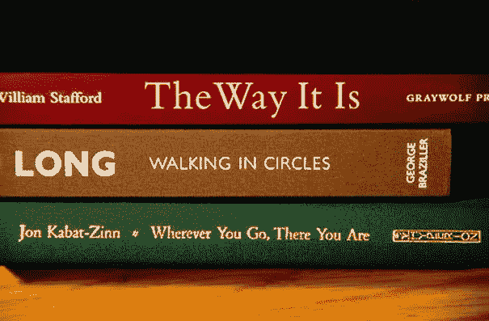

# OCR 的搭便车指南

> 原文：<https://medium.com/analytics-vidhya/a-hitchhikers-guide-to-ocr-8b869f4e3743?source=collection_archive---------2----------------------->


[来源](https://www.123rf.com/stock-photo/ocr.html?sti=lgjzergvukttwzx9uf|&mediapopup=78977356)

光学字符识别(OCR)是从图像中提取文本的过程。有许多开源引擎，这使得将 OCR 集成到几乎任何类型的产品中变得非常容易。这些引擎，特别是基于神经网络的引擎，知道如何从随机图像中提取文本，因为他们已经看到了成千上万的文本示例，并找到了图像和它们可能包含的文本之间的一般映射。然而，这意味着当给定的图像看起来像他们被训练的图像时，他们工作得最好，即纯文本、几乎没有背景噪声和非文本对象的黑白文档。

如果您正在尝试在“自然场景”环境中使用 OCR，那么在没有任何图像预处理的情况下使用开箱即用的 OCR 引擎可能不会如此成功。不准确的 OCR 会使需要在存在模糊、眩光、旋转、倾斜、非文本和无数其他问题的图像中查找文本的任务难以(如果不是不可能的话)自动化。像亚马逊的 Textract 和谷歌的 Cloud Vision 这样的工具可以让这些问题消失，但它们有其局限性(更不用说你必须为它们付费)。幸运的是，我们可以采取很多步骤来为开源 OCR 引擎预处理图像，并达到相当的准确度。

# 预处理的目标

当图像看起来与 OCR 引擎训练的图像相似时，图像与 OCR 引擎配合使用效果最佳。也就是说，他们有:

*   非常少的非文本对象
*   文本和背景之间的高对比度
*   边缘清晰的文本
*   噪音小/粒度小
*   水平文本(无旋转)
*   文本的鸟瞰图(无倾斜)

根据您正在开发的系统，这些目标中的一些会比另一些更难实现。为了演示我们如何实现其中的一些目标，我将使用 Python 的 OpenCV 模块，因为它可以在几行代码中实现大多数目标。我将通过用于 OCR 的 PyTesseract Python 模块使用 Google 的 Tesseract OCR。

你可以跟着这个 Jupyter 笔记本走。请注意，我使用了几个自定义函数/抽象，使得教程代码更加紧凑。虽然这些函数中的大部分要么是用于设置，要么是将 OpenCV 函数应用于一组图像，但其他函数如`EastDetector`相当复杂。如果你好奇的话，我已经在本教程的[库](https://github.com/aparande/OCR-Preprocessing)中尽可能清晰地记录了它。

# 文本本地化

假设我们试图在这个图像中找到所有的书名和作者名。



([来源](https://static.boredpanda.com/blog/wp-content/org_uploads/2013/03/poetry-from-stacked-books-nina-katchadourian-14.jpg))

如果我把这个直接放入宇宙魔方，它不会做得很好。

```
books = load_image("Images/books1.jpg")
print(pytesseract.image_to_string(books))
```

返回

```
DR) The Way It [5 — cxsrwour
LONG  WaAtkine In circtes HF

RCA Maca CRC Usa CW ta Sohwxcrceey]
```

这些都不太准确。有很多额外的，随机的字母，显然不是这本书或作者标题的一部分。由于书上的各种字体和颜色，宇宙魔方正经历一段艰难的时期。它不能正确地把图像分割成它能理解的部分，所以我们必须帮助它。我们能做的第一件也是最简单的事情是只给 Tesseract 包含文本的图像片段。

```
detector = EASTDetector()
slices = detector.get_slices(books)
titles = [pytesseract.image_to_string(img) for img in slices]
show_images(slices, titles=titles, cols=3)
```


EAST 检测到的区域输出

如您所见，通过单独传递每本书的书脊，而不是一次性传递图像，带来了巨大的改进。以前的胡言乱语现在是可识别的文本。

**注意:**我用东方文字探测器定位了书脊。PyImageSearch 有一个关于如何使用它的很棒的教程，所以我在这里就不赘述了。如果您感兴趣，可以查看存储库中的`east_detector.py`,看看我的`EASTDetector`类如何使用该模型为文本生成边框。

请注意，虽然 EAST 将所有的书彼此分开，但它没有将由大空格分隔的文本分成大块。这就是为什么对于目前的*来说,*宇宙魔方仍然无法读取它。如果我像现在这样专门为*缩小框架，那么宇宙魔方最终可以正确地读取它。*

```
narrowed = binarize_images(slices[2:], black_on_white=False)
narrowed = narrow_images(narrowed)
titles = [pytesseract.image_to_string(img) for img in narrowed]
show_images(narrowed, titles=titles, cols=3)
```


仅仅按照*的方式缩小框架*本书给了我们 3 个框架。请注意，包含标题的框架非常干净，因此宇宙魔方可以完美地阅读它。与此同时，包含作者名字的框架是相当模糊和嘈杂的，所以宇宙魔方无法阅读它。这是因为名字在原始图像中一开始就有些模糊，这给我们上了 OCR 的重要一课:有时候，你能做的就这么多。

**注意:**我选择不在这里详述我是如何在`narrow_images`函数中缩小图像帧的，因为它使用了一种叫做膨胀的技术，我将在后面的教程中介绍。在我介绍了膨胀之后，我将详细介绍这个函数。

如果你读了上面的代码，你会注意到我在缩小图像帧之前调用了一个函数`binarize_images`。这使得图像经过一个叫做图像二值化的过程，这是我接下来要介绍的预处理步骤。

# 图像二值化

缩小搜索范围后，最简单的预处理步骤之一是对图像进行二值化。二值化意味着将每个像素转换为黑色(0)或白色(255)。这些被称为**二进制图像**。我们这样做是因为像 Tesseract 这样的 OCR 引擎在文本和背景之间具有高对比度的图像上表现很好，没有什么比黑色背景上的白色文本更突出了。

二值化可以通过多种方式实现。例如，您可以设置一个简单的阈值(即，每个大于 127 的像素都设置为 255，每个小于 127 的像素都设置为 0)，或者您可以做一些更复杂的事情(例如，对于每个像素，取周围像素的中间值，并对其应用阈值)。然而，在自然场景中，很难找到适用于每幅图像的单一阈值。动态计算阈值要好得多。这样做的一种方式被称为 **Otsu 的二进制化**。它假设像素是双峰分布的，并确定最佳阈值在两种模式的中间。


[呈双峰分布(来源](https://www.chegg.com/homework-help/definitions/bimodal-31))

幸运的是，OpenCV 有一些功能可以帮我们做到这一点。

```
image = cv2.cvtColor(image, cv2.COLOR_RGB2GRAY)
_, thresholded = cv2.threshold(image, 0, 255, cv2.THRESH_BINARY_INV + cv2.THRESH_OTSU)
```

`cv2.THRESH_OTSU`告诉 OpenCV 使用 Otsu 二值化，`cv2.THRESH_BINARY_INV`将使图像的暗部分为白色，亮部分为黑色。请注意，我们必须在二值化之前将图像转换为灰度，因为您无法二值化三通道彩色图像。

注意，我对`binarize_images`函数的实现并不像使用`cv2`那样直接。

```
gray = cv2.cvtColor(img, cv2.COLOR_RGB2GRAY)
_, binary = cv2.threshold(gray, 0, 255, cv2.THRESH_BINARY_INV + cv2.THRESH_OTSU)
if np.mean(binary) > 127:
    binary = cv2.bitwise_not(binary)
```

将图像二值化后，我计算它的平均值。如果平均值大于 127，那么我对每个像素进行位非运算。我这样做是因为`THRES_BINARY_INV`旗会使图像的黑色部分变成白色，反之亦然，所以如果我们的文本是白色的，那么在二进制图像中它会变成黑色。这将是我们后面预处理步骤的一个问题。如果图像主要是白色的(即大多数像素是> 127)，那么很可能文本是黑色的，所以我做了一个颜色翻转来使文本变成白色。

让我们在新图像上尝试二值化。


[(来源](https://everyday-reading.com/wp-content/uploads/2015/09/CurrentlyReading-1.jpg))

```
detector = EASTDetector(small_overlap=0.75)
slices = detector.get_slices(books
binarized = binarize_images(slices, black_on_white=True)
```


为了比较，这里是我在使用 EAST 后没有对图像进行二值化得到的结果。


请注意，对于大多数书籍来说，二进制化实际上使 OCR 变得更糟。对其他人来说，它使 OCR 成为可能，而对其他人来说，它使 OCR 成为不可能。这是开箱即用 OCR 模型的另一个常见教训:预处理对每张图像都有不同的作用。它甚至可能把你引向错误的方向。

二值化似乎也给图像增加了一些以前没有的噪声。这通常是好的，因为我们的其他预处理步骤会替我们处理它。

# 模糊

虽然这看起来不太直观，但稍微模糊图像实际上可以提高 OCR，尤其是在图像被二值化之后。二值化图像的像素为 255 或 0，因此这可能会在图像中添加颗粒/噪声，即使它会使对比度非常明显。OCR 在噪声下表现不佳，所以我们应该尽可能地去除噪声。应用轻微的模糊可以实现这一点。

让我们来关注一下《全能家庭》这本书。当它被二进制化时，宇宙魔方读作“oer Ar”(见上)。在应用模糊后，

```
img_blurred = cv2.medianBlur(img, blur_weight)
```


对于人眼来说，图像没有太大变化。但是很明显，模糊版本对于宇宙魔方来说要容易得多！

我使用的特殊类型的模糊是一个**中值模糊**。中值模糊计算相邻像素的中值以替换当前过滤器。另一种常用的模糊是高斯模糊，它计算邻域上的高斯分布，并使用它来替换当前像素。

# 扩张

有时候，我们要阅读的文本是极细的字体。图像膨胀是一种可以帮助我们做到这一点的技术。它通过对图像应用一个内核来工作。把内核想象成一个滑动的窗口。当窗口在图像上滑动时，它用窗口内所有像素的最大值乘以落在它们上面的内核值来替换当前像素。这就是导致白色区域扩大的原因。


膨胀示例([来源](https://homepages.inf.ed.ac.uk/rbf/HIPR2/dilate.htm))

对于上图中的书*受过良好教育的头脑*，二值化图像上的 OCR 输出是乱码，原始图像上的 OCR 输出不是准确的标题(“受过良好教育的头脑”)。如果我们放大图像，我们可以赋予文本更多的实体，这样宇宙魔方就可以更容易地看到它。

```
blurred = blur_images([binarized[0]], blur_weight=1)
dilated = dilate_images(blurred, kernel=np.ones((5, 5), np.uint8))
```

请注意，我在放大之前模糊了图像的二进制形式。这是为了先平滑图像。否则，二值化引入的噪声/颗粒度也会扩大，使得输出图像成块且不可读。我使用的内核是一个 5x5 的正方形。这会在 x 和 y 方向适度扩展文本。


如你所见，宇宙魔方可以从放大的图像中提取出书名。

# 框架变窄

在本教程的早些时候，我使用了一个名为`narrow_images`的函数来更具体地处理我输入 OCR 的图像中超出 EAST 给我的部分。既然我们已经讨论了膨胀，我们可以深入研究它是如何工作的。

```
def narrow(image, convert_color = False, binarize = True):
    """
    Draws narrower bounding boxes by heavily dilating the image and picking out the 3 largest blocks
    """
    original = image.copy()
    if convert_color:
        image = cv2.cvtColor(image, cv2.COLOR_RGB2GRAY)

    if binarize:            
        _, image = cv2.threshold(image, 0, 255, cv2.THRESH_BINARY_INV + cv2.THRESH_OTSU)
        if np.mean(image) > 127:
            binary = cv2.bitwise_not(image)

    box_kernel = np.ones((5, 25), np.uint8)
    dilation = cv2.dilate(image, box_kernel, iterations = 1)
    bounds, _ = cv2.findContours(dilation, cv2.RETR_EXTERNAL, cv2.CHAIN_APPROX_SIMPLE)boxes = []for cnt in bounds:
        x, y, w, h = cv2.boundingRect(cnt)
        region = original[y:y + h, x:x + w]
        boxes.append(region)boxes = sorted(boxes, key=lambda i: -1 * i.shape[0] * i.shape[1])
    return boxes[:3]
```

第一步是把图像转换成灰度，二值化。这是我们后面要做的一个要求:**轮廓绘制。**一旦我们有了二值图像，我们就应用一个大的膨胀(内核是一个 5x25 的矩形)。这将在 x 方向上扩展图像的亮区，使文本的相近区域融合在一起。在这一点上，文本组看起来像白色的固体斑点。


然后我们找到这些斑点的**外部轮廓**，它们成为包含文本的图像的一部分。外部轮廓是定义白色斑点的边缘(即白色与黑色相遇的地方)。这是通过 OpenCVs `findContours`函数来完成的。我们返回这些斑点中的 3 个最大的(以去除任何由噪声引起的或者不是文本的斑点)。


这里我用绿色画出了外部轮廓。请注意，并非所有区域都包含文本，但在放大的图像中它们是白色的。宇宙魔方会浪费时间试图在其中找到文本，但至少它也会找到重要的文本。

# 结论

这篇文章仅仅触及了图像预处理的表面。除了二值化、模糊和膨胀之外，还有许多其他技术用于从图像中去除噪声，并使 OCR 系统更容易处理它们。偏斜、腐蚀、填充和打开是可以使用的一些其他操作。然而，对于大多数任务来说，这些指南中涵盖的技术应该足够了。

一般来说，您将使用的技术在很大程度上依赖于您正在构建的系统。因为每个处理步骤都不能保证提高 OCR 质量，所以很难建立一组预处理步骤来完美地处理您想要识别的所有图像类型。有多种方法可以处理这个问题。如果你主要关心的是速度而不是准确性，那么做任何预处理都是没有意义的，因为 Tesseract 可以处理大量的图像而不需要额外的工作。如果您非常关心准确性，您可以设计一个管道，将不同的转换顺序应用于图像，直到您的 OCR 引擎输出可以理解的内容。但是，请注意，更精确的系统会更慢(通常)。

由于使用开箱即用的模型构建 OCR 系统需要大量的工程设计，如果您有大量带标签的训练数据，您可能会更好地使用迁移学习来训练 OCR 引擎。这将为您的特定类型的图像产生更高的精度，并将解决预处理的问题。当然，这样做的缺点是很难收集训练数据并确保模型能够学习。

最终，对于如何让 OCR 处理图像没有“正确”的答案，但是有一些确定的技术可以尝试。这只是一个找出哪种顺序的哪种变换适合你的特定图像的问题。

有关图像处理的更多信息，请查看 OpenCV 的文档了解其内置函数。如果你对宇宙魔方感兴趣，你可以查看[知识库常见问题解答](https://github.com/tesseract-ocr/tesseract/wiki/FAQ)，了解它所采用的不同参数。

我希望这个教程对你有用。你可以在这里看到所有的代码和我用来举例的 Jupyter 笔记本。