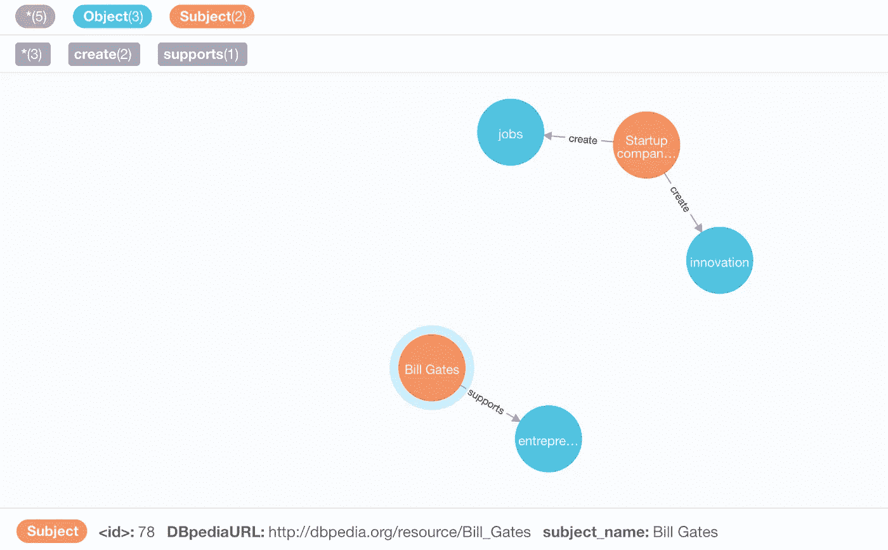

# 面向初学者的知识图理解和实现教程

> 原文：<https://medium.com/analytics-vidhya/a-knowledge-graph-implementation-tutorial-for-beginners-3c53e8802377?source=collection_archive---------0----------------------->

[https://upload . wikimedia . org/Wikipedia/commons/thumb/0/06/DIKW _ pyramid . SVG/1200 px-DIKW _ pyramid . SVG . png](https://upload.wikimedia.org/wikipedia/commons/thumb/0/06/DIKW_Pyramid.svg/1200px-DIKW_Pyramid.svg.png)

# **数据 vs 信息 vs 知识**

在构建知识图之前，了解数据、信息和知识的区别是必不可少的(智慧是改天的话题！).

**数据**一般代表事实的集合。在按摩、过滤和转换这些数据后，我们给它一个结构并创建**信息**。可以从这些信息中得出的理解叫做**知识**。

# **语义网**

现在让我给你介绍一个梦，叫做语义网。这代表了一种世界的状态，互联网上的一切都完全被机器理解。这意味着所有的文字，图片，视频，音频等。网页是完全被机器理解的。(本文仅涉及文字。)

当我们实现这个梦想时，它将在互联网上打开许多可能性。当计算机可以理解互联网上的一切，互联网就从一个信息共享平台转变为一个**知识平台**。然后，计算机可以开始帮助您找到更适合您需求的内容。他们可以通过展示非显而易见的见解来帮助你做出更好的决定。他们可以更好地找出趋势、异常、差距等。在各个领域。这也将开启一系列在互联网成为知识平台上蓬勃发展的业务。

网络上充斥着用自然语言写的内容。为了实现语义网的梦想，我们需要将从自然语言内容中提取的信息的表达方式标准化。这种标准化将有助于所有人理解提取的信息。RDF (资源描述框架)和 OWL (网络本体语言)是走向标准化的几个步骤。

知识图表是实现语义网的一个步骤！

# **机器学习 vs 结构化关系学习**

这一部分只是为了提供一个更广泛的图景。如果你不遵守这一节，那是完全没有问题的。

**机器学习(ML)** 对数据矩阵进行操作，每行代表一个具有特征的对象。鉴于，**结构化关系学习(SRL)** 的工作假设对象本身彼此相关，因此，表示最有可能是以**图的形式。**

知识图上应用的学习技术是进行结构化关系学习的一种方式！

# **什么是知识图？**

知识库是任何信息的集合。**知识图是一个结构化的知识库。**

**知识图以不同实体间关系的形式存储事实。**

记住，我们知道对信息的理解转化为知识。因此，通过从知识库中提取事实并以实体和关系的形式表示这些事实，知识图声称对信息有所理解。

目前许多知识图以**主谓宾(SPO)** 三元组的形式表示提取的事实，这符合 RDF(资源描述框架)规定的标准。

所以，举个例子，让我们考虑这个句子:

伦纳德·尼莫伊是在科幻电影《星际迷航》中扮演斯波克的演员

可以从这句话中提取的 SPO 三元组(事实)是:

来源:[https://arxiv.org/pdf/1503.00759.pdf](https://arxiv.org/pdf/1503.00759.pdf)作者:马克西米利安·尼克尔、凯文·墨菲、沃尔克·特雷普、叶夫根尼·加布利洛维奇(对知识图的关系机器学习的评论)

上述事实，当用图形表示时，就变成了一个知识图:

来源:[https://arxiv.org/pdf/1503.00759.pdf](https://arxiv.org/pdf/1503.00759.pdf)作者:马克西米利安·尼克尔、凯文·墨菲、沃尔克·特雷普、叶夫根尼·加布利洛维奇(对知识图的关系机器学习的评论)

既然我们已经了解了一个简单的**知识图(KG)** 是什么样子，那么让我们列出构建一个 KG 所涉及的步骤(一个基本的！).

1.  知识提取:
    a. **从文本中提取 SPO** **三元组**(事实)。使用**自然语言处理(NLP)** 技术，如**依赖解析**。NLP 是从文本信息中形成好的知识图的支柱。
    b. **实体识别&链接:**
    ——这是映射 Leonard N，L Nimoy，Leo Nimoy 等的步骤。全部交给一个实体，也就是伦纳德·奈莫伊。
    - **DBpedia** ，在本教程中，维基百科的结构化数据存储被用作所有实体的单一全局存储。所以伦纳德·奈莫伊会被映射到 http://dbpedia.org/page/Leonard_Nimoy。
2.  图构造:
    a .消除歧义并将 SPO 三元组存储在图数据库中。在这里，表示为 SPO 的事实传达了主语通过谓词描述的关系与宾语相关。
    b .这里的另一个步骤是处理图形，以实现诸如填充缺失的链接、聚类实体等。

我强烈建议你阅读 **NLP** 来进一步理解可以在知识提取步骤(提取 SPO 三元组)中使用的技术，并且理解不同技术的优缺点和准确性水平。

让我们进入有趣的部分，即演示！

# **知识图的实现**

**代码可在:**获得

[**https://github.com/kramankishore/Knowledge-Graph-Intro**](https://github.com/kramankishore/Knowledge-Graph-Intro)

1.  **知识提取:**使用 python 中的 **spaCy** 库进行 SPO 三元组提取。
    检查 repo 中的文件 **knowledgeExtraction.py** 以查看代码。
2.  **实体链接:**使用 DBpedia api 提取所有已识别的实体，并将它们链接到 DBpedia URL。
    检查 repo 中的文件**entityrecognitionlinking . py**以查看代码。
3.  **将步骤 1 中的 SPO 三元组**映射到步骤 2 中相应的 DBpedia URLs。很少有实体可能没有直接匹配的 DBpedia。这里需要应用 NLP 中更高级的实体消歧和链接技术来解决这个问题。
4.  用 DBpedia 实体链接映射的 SPO 三元组然后被存储到一个**图形数据库中。**我用 python 使用 **neo4j** 作为图形数据库和 **neomodel** 库(虽然我对 neomodel 和它的文档不是很感兴趣)。
    检查 repo 中的文件 **graphPopulation.py** 以查看代码。
5.  在 neo4j 中摄取图形数据后，您可以在 neo4j 浏览器中看到图形的可视化，通常在[http://localhost:7474/browser/](http://localhost:7474/browser/)访问

上面 repo 中的代码是为文本输入执行的:

> 创业公司创造就业和创新。比尔·盖茨支持创业。

产生的知识图看起来像这样:

这只是开始，当你开始尝试不同的输入时，代码将开始显示有趣的结果！
现在，您已经对什么是知识图以及如何构建知识图有了大致的了解，您可以开始更深入地探索知识提取和图填充的每一层，以提高准确性并使其适合您的应用。

谢谢大家！

参考资料:

1.  [https://arxiv.org/pdf/1503.00759.pdf](https://arxiv.org/pdf/1503.00759.pdf)
2.  [https://kgtutorial.github.io/](https://kgtutorial.github.io/)
3.  [https://www . analyticsvidhya . com/blog/2017/12/introduction-computational-linguistics-dependency-trees/](https://www.analyticsvidhya.com/blog/2017/12/introduction-computational-linguistics-dependency-trees/)
4.  [https://github.com/BrambleXu/knowledge-graph-learning](https://github.com/BrambleXu/knowledge-graph-learning)