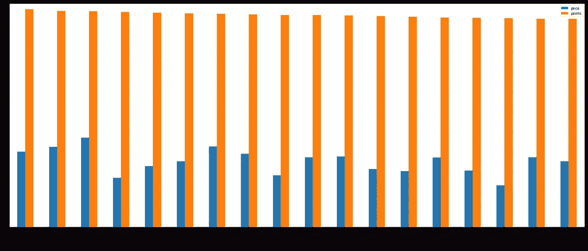

# “端对端葡萄酒质量建模，由沃森 NLP 服务推动”的一个不那么乏味的版本

> 原文：<https://medium.com/analytics-vidhya/a-less-nerdy-revision-of-end-to-end-wine-quality-modeling-with-a-boost-from-watson-nlp-services-54d11c408d25?source=collection_archive---------34----------------------->

丹尼尔·沃格尔在 [Unsplash](https://unsplash.com?utm_source=medium&utm_medium=referral) 上的照片

我最近写了一篇关于使用一些 IBM Watson 工具分析文本数据来预测葡萄酒质量的[文章](/@elliott.botwick_90525/end-to-end-wine-quality-modeling-with-a-boost-from-watson-nlp-services-8ebfd4137f6c?sk=3e471d765e570da1788678a26b7516e8)。我认为我在一些数据准备步骤上做得太过草率，让一些读者感到不快。考虑到这一点，我将项目这一部分的技术文章移到了我的 [github 自述文件](https://github.com/ebotwick/wine-NLP)中，并更加关注整个故事的最终收获。感谢阅读(可能是第二次)和欢呼！

几个月前，我从各种葡萄酒的详细评论中发现了一个相当受欢迎的数据集，包括品种、价格、酒厂、产地以及葡萄酒评论者的描述。你可以在下面看到数据的快照以及数据集的链接-

数据来自—[https://www.kaggle.com/zynicide/wine-reviews](https://www.kaggle.com/zynicide/wine-reviews)

我创建了一个笔记本，用一些我常用的方法来建立一个回归模型，并带走了一个不错但不起眼的结果。我觉得浪费了很多潜力，因为我对 description 列所做的只是计算长度，并认为该列错过了自然语言处理(NLP)的机会。因此，在我返回到这些数据时，我想利用一些 IBM 的 Watson APIs，看看我能从 description 列中提取出什么来添加到我的分析中。也许一台机器可以理解一些短语，比如“一种微弱但有魅力的香气由一种精致的橡木味支撑”，而我从来不能。

下面，我将概述我的分析中的一些发现，以及沃森自然语言理解 API 如何帮助我从一个 OK 模型变成一个侍酒师可能会描述为天鹅绒般柔软的模型(两者都是好东西)。

我将在以下部分回答三个问题

1.  葡萄酒的价格和质量有哪些有趣的趋势？
2.  红葡萄酒和白葡萄酒的评论有显著的不同吗？
3.  我们能否在书面产品描述中衡量情感情绪，并使用它来提高预测模型的性能？

注意——这些是重新构建原始分析的修订问题，原始提出的问题仍然可以在 github 自述文件或原始媒体故事中找到。

# 1.首要任务——探索性数据分析(EDA)

大多数分析都是从探索数据开始的，尤其是当分析师不熟悉数据的时候。下面是我在着手更好地理解我的数据时发现的一些发现。

葡萄酒的价格变化很大。

我甚至不想把价格柱状图放在这里，它太难看了。根据我的判断，你可以在下面看到它。

恶心——非常扭曲

您还可以看到，对数变换有助于更好地反映数据中的点分布。

更有趣的是——这是这个数据集中 20 种最常见的葡萄酒品种的平均价格——

一瓶 Nebbiolo 通常要 60 多美元，但 Rose 通常不到 20 美元

**二世。人们在说什么**

从描述的长度来看，正如所料，得分较高的葡萄酒在评论中的描述更长。对我来说不太明显的是，人们对赤霞珠的评价多于对霞多丽的评价。

平均而言，对出租车的评论比对霞多丽的评论多 30 个字符

**三世。弗吉尼亚是葡萄酒爱好者的天堂**

我来自弗吉尼亚，是一个参观葡萄园的爱好者(绝不是鉴赏家)，我很好奇在哪里可以买到一瓶又好又便宜的葡萄酒。

弗吉尼亚州的葡萄酒厂至少有 10 瓶葡萄酒在该数据集中进行了审查

如果你曾经在阿尔伯马尔县附近，有几个不错的酿酒厂可以试试，比如金家族葡萄园。

四。 **Cab Sav 与 Chardonnay 深度对比**

正如我们在上面看到的，对赤霞珠的评论看起来比霞多丽更长。这里我们可以看到两种常见品种的平均价格、质量和描述长度的比较。

水平线代表该属性所有葡萄酒的平均值。

一瓶解百纳平均售价约为 43.28 美元，有 254 个字符的描述，得分为 88.2 分。另一方面，夏敦埃酒通常售价 32.38 美元，有 227 个字符的描述，得分为 87.7 分。

# 2.数据准备

对于本文的范围，这一部分已经移到 github readme 中。

 [## 依波缇/葡萄酒-NLP

### 笔记本最初由 Elliott Botwick 在 Watson Studio Cloud 上创作。这个项目的目的是首先应用…

github.com](https://github.com/ebotwick/wine-NLP) 

# 3.自然语言理解

同样，这里的一个主要灵感是建立一个好的基线回归模型，然后看看是否将一些 NLP 应用到描述列可以进一步推动模型。显然有很多 NLP 库和函数，你可以花几个月的时间尝试各种方法。我想让事情变得相对简短和有趣，这是 Watson APIs 在这方面非常方便的地方。

这里的第一步是提供沃森自然语言理解(NLU)精简服务。这对于任何想尝试的人都是免费的，是一个真正有价值的免费 API。如果您想了解更多关于 API 的内容，并注册一个免费的 NLU 服务或订阅完整的服务，请查看主页:

 [## 沃森自然语言理解—概述

### IBM Watson 自然语言理解是 IBM Cloud 上的一项服务，它使您能够分析文本以提取…

www.ibm.com](https://www.ibm.com/cloud/watson-natural-language-understanding) 

开发人员可以从自然语言中提取很多东西，包括基本到高级的实体提取、概念识别、情感分析，甚至实体之间的关系。可以对语言模型进行调整，以识别特定的术语集，并根据特定业务和领域的语言进行完全定制。

在我们的案例中，我只是使用了开箱即用的模型，因为它们也可以提供巨大的价值。因为我们本质上是在基于评论来衡量产品的质量，所以从理论上来说，查看来自模型的情感评分结果对预测非常有帮助。

我能够在每篇品酒评论中表达出喜悦、恐惧、愤怒、厌恶和悲伤的程度。我很高兴在评论中看到更多的快乐，而不是愤怒或悲伤。这是有意义的，因为在 100 分的范围内，这个数据集中的所有葡萄酒都在 80-100 分之间。

情绪以从[0，1]到 1 的标度评分，0 表示没有检测到该情绪的痕迹，1 表示完全代表该情绪

在所有其他因素保持不变的情况下，使用分数作为我们 ML 模型的附加输入，我们从 0.586 的 R 到 **.605** (越高越好)，从 4.29 的均方误差(MSE)下降到 **4.10** (越低越好)。当然是一个有影响力的进步。

除了情感，我还使用 NLU 从描述中提取关键词。关键词本质上是 NLU 在文本中找到的最相关的标签。为每段输入文本检测几个关键词，并按照相关性的顺序排列。我认为再次回顾一下赤霞珠和霞多丽的对比会很有趣，看看一种受欢迎的红葡萄酒和白葡萄酒的关键词有什么不同。

赤霞珠(上)和霞多丽(下)的关键词词云

你当然可以看到这两种葡萄酒之间的风味差异，以及其他一些有趣的东西，比如“单宁”在 cabs 中是一个受欢迎的关键词，“酸度”在霞多丽中是一个受欢迎的关键词。

我强烈推荐任何对探索 NLU 应用感兴趣的人来看看这个由[主持的演示](https://www.ibm.com/demos/live/natural-language-understanding/self-service/home)。你可以看到例子输出(实体，概念标签，情绪，情感等。)获取各种行业示例(金融、法律、媒体)或输入您自己的文本或 URL。这是一个探索如何利用 NLU 帮助从业务数据中提取意义的好方法——友情提示 IBM 从不收集或存储您的数据！

# 摘要

最后，我想重提三个要点:

1.  在这些数据中发现了许多有趣的趋势，特别是当它涉及到不同品种葡萄酒的质量和价格时。虽然这个数据集中的大多数葡萄酒定价合理，但也有一些价格过高(你可以在纳帕谷花 625 美元买到姚明的葡萄酒，或者花 1000 多美元买到几款波尔多葡萄酒)。使用 log()变换重新调整数据有助于更好地解释这种差异。
2.  受欢迎的红葡萄酒和白葡萄酒在评论的长度和内容上都有显著差异。赤霞珠(红)和霞多丽(白)因其在数据集和葡萄酒市场中的突出地位而受到关注。赤霞珠主要被描述为深色水果和浓郁风味的关键词，而霞多丽则被描述为更清爽的水果和味道。
3.  感谢沃森 NLU API，我们能够非常容易地计算出这些葡萄酒评论中的情绪水平。更好的是，将提取的情绪添加到我们的训练数据中，证明对我们的模型的预测性能有很大的影响。

谢谢，享受你的下一款土红色中的果酱般的单宁🍷