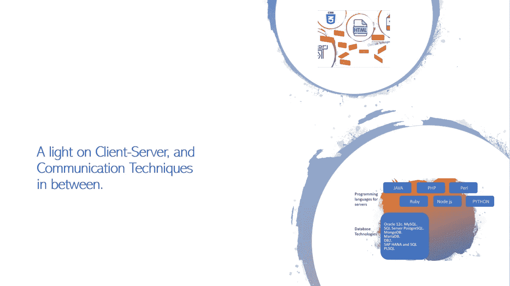

# 客户机-服务器以及两者之间的通信技术。

> 原文：<https://medium.com/analytics-vidhya/a-light-on-client-server-and-communication-techniques-in-between-ac40e53a4318?source=collection_archive---------12----------------------->

当我还是编程领域的初学者，开始构建前端应用程序时，我一直在思考一个难题，如何独自实现一个完整的应用程序，包括客户端和服务器端，如果我想实现它，我需要了解服务器端技术，直到有一天我开始…