# 模拟优化—操作方法

> 原文：<https://medium.com/analytics-vidhya/a-list-of-operational-methods-in-simulation-optimization-324ca5016f9c?source=collection_archive---------21----------------------->


## 在 **C++** 和 **Python 中包含了一系列科学代码，用于性能优化和代码演示**

# **简介**

本文包含从各种来源收集的代码样本，如使用数值和随机优化方法的英特尔 MKL 和 SceneNet 深度学习框架。这里介绍的 C++代码库使用了示例代码，这些代码可以使用 OpenMP (OMP)或 OpenMPI (MPI)进行性能增强。

## **使用 OMP 运行代码的说明:**

该存储库是为在 OMP 执行而构建的，以利用并行化和矢量化技术。

```
**cmake .. && make all** **./app --intervals 4 --iterations 8 --condition_factor 2 --multiplier 1000000**
```

首先，您需要通过以下方式在 Linux 中安装 cmake:

```
**sudo apt-get install cmake**
```

或者获取 docker 存储库:

```
***git clone*** [***https://github.com/aswinvk28/cpp-performance-math-problems***](https://github.com/aswinvk28/cpp-performance-math-problems) ***cpp_math_problems******git checkout* navier-stokes-autodiff**
```

## 使用 MPI 运行代码的说明:

请修改存储库中的代码，以 MPI 编程方法执行代码。然后使用 mpiexec 执行命令行应用程序。为了执行命令行应用程序，您需要执行存储库中给出的 shell 脚本。

> `./run_project.sh`

```
**mpiexec -n 4 ./app --intervals 4 --iterations 8 --condition_factor 2 --multiplier 1000000**
```

1.  *你需要创建一个实现函数*

```
**double * navier_stokes(double * u2, double u0, const double dt, const double dx, const double p, const double alpha, int length, double * model)**
```

*2。对照参考实现功能*

```
**double * navier_stokes_ref(double * u1, double u0, const double dt, const double dx, const double p, const double alpha, int length, double * model)**
```

实现函数在给定向量值的每个间隔执行，类似于参考实现。参考实现与手写模型进行了比较。

我 **初始假设:**

> *线性估计模型的组合方程为:*

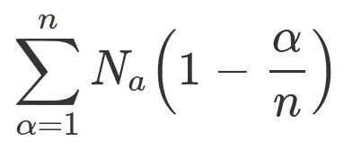

线性阻尼因子被应用于满足我们的估计模型的每个单元向量的原始单元。这意味着我们的假设，即估计模型观察到的每细胞单位满足。

P初步分析:

在初步分析中，我们采用了一种宏观方法，这种方法使我们得到了每个单元的最佳曲线。我们需要根据一个幂级数公式来表示该函数，该公式由下面的问题表示:

在幂级数方程中，精度得分是多项式回归中的均方误差，使用从原始数据点到预测曲线的误差向量来测量。在支持向量机(SVM)中，它们要么是功能边界，要么是几何边界。因为我们假设色散关系中的每个点都将质量传递给另一个点，所以流函数和解析复变量将解决我们的问题。我们可以在幂级数方程中选择相位，表示为:

> ***a*₀+*a*₁cos(*θ*)+*a*₂cos(2*θ*)+*a*₃cos(3*θ*)+*a*₄cos(4*θ【t18)+*a*₅cos(5*θ*)+……***

***衍生:——***

> ***A* ₀ + - *A* ₁辛( *θ* ) + -2 * *A* ₂辛(2 *θ* ) + -3 * *A* ₃辛(3 *θ* ) + -4 * *A* ₄辛(4 *θ* ) + -5 ***

*这将使我们的函数在每个方向上进行分析，并创建一个像 SVM 这样的分类器可以预测的流函数。存在另一组幂级数系数，其代表具有相移的幂级数系数。*

> ***B₀ + B₁辛( *θ* ) + B₂辛(2 *θ* ) + B₃辛(3 *θ* ) + B₄辛(4 *θ* ) + B₅辛(5 *θ* ) + …***

****衍生:——****

> ***b₀+b₁cos(*θ*)+2 *b₂cos(2*θ*)+3 *b₃cos(3*θ*)+4 *b₄cos(4*θ*)+5 *b₅cos(5*θ*)+…***

*让我们将我们的*流程模型*表示为:*

> *f(x，t) : **状态空间模型***

*C **ost 功能:***

*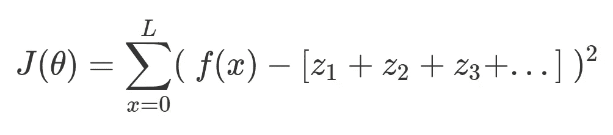*

*当您对“*参考执行功能”*执行梯度下降时，分析上下文被设置为离散。间隔的大小各不相同，这产生了模型一致性检查*

> ***因此，我们得到的系数将是一个傅立叶变换，事实上，它是一个时域的逆 STFT(逆短时傅立叶变换)。***

*可以执行 STFT 的流行 python 包有:*

*   *numpy*
*   *利布罗萨*
*   *scipy*
*   *张量流*

*其他可以执行 STFT 的软件包有:*

*[](https://uk.mathworks.com/help/signal/ref/stft.html) [## stft

### 短时傅立叶变换崩溃都产生两秒钟的压控振荡器输出，由…

uk.mathworks.com](https://uk.mathworks.com/help/signal/ref/stft.html)* 

*这篇来自英特尔的文章解释了使用 C++编译器 的浮点运算的 [**一致性。所有 GPU 和操作系统的浮点精度必须一致。为了保持一致性，加法和乘法的属性必须遵循关联原则，并且浮点数可以被序列化以在各种线程和向量单元(VU)下执行。这里演示的问题展示了 OMP (OpenMP)和 OpenMPI 在计算模型评估中的应用。练习中选用的计算模型是 C++和 Python 语言。出现的问题有:**](https://software.intel.com/en-us/articles/consistency-of-floating-point-results-using-the-intel-compiler)*

> *-蒙特卡罗扩散作为色散关系，*
> 
> *-格子波尔兹曼方法，*
> 
> *-实验设计和*
> 
> *-复杂分析。*

# ****给定参数执行代码得到的结果:****

*模式 1:当量化因子被设置为默认分数时*

```
***qf = ( MAX. ESTIMATED VALUE ) * 2 / 3***
```

*Y ***您可以调整 Max。作为力项的模型估计值，并根据最大值的选定分数评估异常值。估计值。****

```
****./app \
--intervals 4 \
--iterations 8 \
--condition_factor 2 \
--multiplier 1****
```

*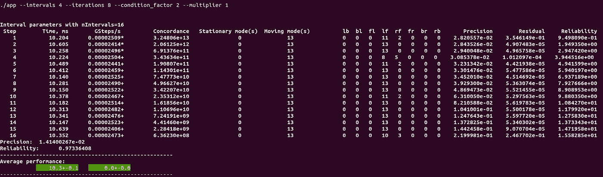*

***一致性、可靠性、残差、精度***

## *代码示例*

```
****./app \
--intervals 3 \
--iterations 7 \
--condition_factor 2 \
--multiplier 1 \
--quantisation_factor 2e-2****
```

*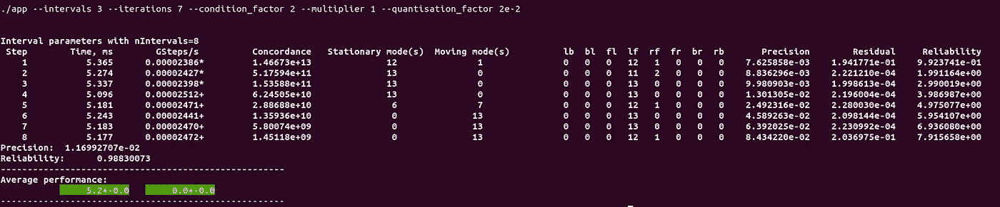*

***一致性、可靠性、残差、精度***

*区间长度的变化确实改变了精确度、可靠性和一致性。在内插我们为校准的假设的每细胞单位参数时*

> *长度= 100*

**使用样条插值，带有控制点**

> **α* 和 *1 - α**

# **设定目标**

*P ***精度****

*如您所见，两种模型的精度不同，这是因为:*

```
***--intervals 4 --iterations 8       being used in model1
--intervals 3 --iterations 7       being used in model2***
```

*当进行即兴表演时，每个音程(长度分别为 2⁴和 2)被用作我们的计算模型。我们在每个间隔取 MAE(平均绝对误差)来最终确定我们的结果。*

*RT38*可靠性**

*两种模型中的可靠性值不同，这是因为区间确实随着精度的变化而变化。可靠性被定义为 N 次实验失败的概率。*

*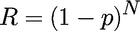*

*R***ESI dual****

*在一段时间内，模型值会因微小的偏差而变化。用平方表示的偏差或由模型值归一化的偏差给出了该区间内模型的残差属性。*

*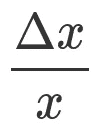*

*同样，表示为条件数，它在分子处取 N 范数，并乘以矩阵的逆矩阵。对于大的区间，它是一个相关的统计量，因为它提供了泰勒级数展开。*

*C**on cord***

*用模型的定义，力项表示: *ρ ( δu / δt )* 和力项的导数，*V*(*τ【T11)=(1*/ρ)**(δF/δx)，*表示区间。**

*这里的一致性统计考虑了一个数值和一个复杂的参数。数值对应 ***( δx / x )*** *复数 arg 对应****z*₂*/z*₁**其中复数是流函数的轮廓积分和复数导数的乘积。这里取的流函数是力项。*

*I ***来自统计分析的影响****

*区间分析是我们理解模型参数的关键，如精度、残差、条件数、可靠性模型和模型的一致性。*

*如上面在**“初步分析”中所讨论的，**幂级数参数， ***θ，*** *在从‘a’到‘b’的区间上，区间长度 L = ( b - a)，表示为:**

> **θ*= 2*π*nx/L*

*在 *泰勒级数展开中，kᵗʰ导数将包含归一化参数 nᵏ，因为在每个导数的间隔处具有控制点α和 1 - α的样条插值将具有相同的形式:**

> **f*(*k*)=*α**f*ᶦ+(1*α*)*f*ᶦ⁺*

*这里使用泰勒级数展开偏差，我们得到了 Ramanujan 的生日函数。递归的生日问题是一个人在包含 N 天的一年中找到另一个生日相同的人之前可以尝试的次数的解决方案。生日问题在这里给出[https://en.wikipedia.org/wiki/Birthday_problem](https://en.wikipedia.org/wiki/Birthday_problem)*

*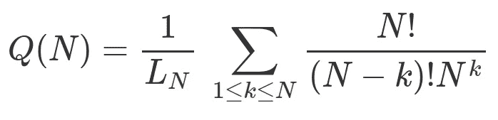*

***用区间长度归一化的生日问题***

*生日问题与一组 Ramanujan 分布的推导相关，例如*

*   ***Ramanujan Q 分布**，以及*
*   ***Ramanujan R 分布***

*其实我可以说 Ramanujan R 分布在哪里有用。在我们的宏观问题的情况下，我们迭代区间，并发现我们的生日问题实际上可以创建记录的观察偏差的母函数，Ramanujan R-分布是置换矩阵的概率问题。*

*如果我们在这里利用我们的问题，其中我们假设将基于光流相位的方法应用于我们的流函数的每一个导数，则产生的数据争论阶段有两个选项:*

*F*

*让我们在这里讨论一些强化学习，如果你有一个数据集，你需要根据可能的[蒙特卡罗树搜索](https://en.wikipedia.org/wiki/Monte_Carlo_tree_search) ( **MCTS** )算法对数据集的发现进行评分，你可以搜索整个数据集，并根据你选择的算法或模型对数据集进行分层聚类。这样，迭代的状态空间将是巨大的。下面使用的置换矩阵将模型的输入映射到从第一因子图到第二因子图的输出。如下所述:*

*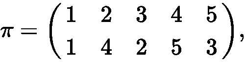**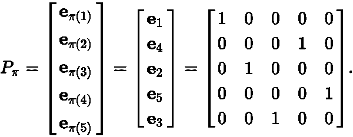*

*一旦它们被映射，可能的 N×5×5 的状态空间，正如我们在这里可以看到的 5 个因子，被减少到 2×5×5。*

*S ***其次*** *，将系数 Aₙ视为时间序列连续体的一部分，执行随机化以选择复值状态空间* ***由*** *匹配 k* ***世界痕迹*** *成对拍摄。在这种情况下，* jᵗʰ *衍生工具可以与* iᵗʰ衍生工具进行匹配。*

*在这里，[https://arxiv.org/pdf/1506.02335.pdf,](https://arxiv.org/pdf/1506.02335.pdf)的论文描述了在秩(N+k)的状态空间中匹配随机排列的多匹配算法运行，将 k 个元素匹配到特定的 k 个元素。*

# *“Ramanujan R 分布在这里显示了在没有两列系数重复其结构的情况下进行匹配的概率，以便通过独立考虑流函数导数来解决问题，例如置换矩阵问题。”*

# *"二项式分布表示为 Ramanujan Q 分布和 Ramanujan R 分布的乘积. "*

> *区间长度的重要性很高，因为无论是动量守恒模型、 *k* ᵗʰ导数、能量还是哈密顿力学，它都是用于这个宏观问题的相同样条插值。*

> *autodiff 软件包帮助我推导导数，并且擅长向前和向后微分*
> 
> *@礼貌:[https://autodiff.github.io/](https://autodiff.github.io/)*

*如论文[https://arxiv.org/pdf/1801.06397.pdf](https://arxiv.org/pdf/1801.06397.pdf)中所述，使用光流方法分析数据集所获得的结果可归纳为两个方面:*

> *(1) **多样性**，以及*
> 
> *②**现实主义**。*

# *正如本文所述，与基于多样化数据训练的网络相比，基于专门化数据训练的网络对其他数据集的泛化能力更差。它还指出，大多数学习任务可以通过简单的数据和数据扩充来完成。*

*我想在这里讨论三种作战模拟优化方法，它们展示了如何达到最优解的各种技术。*

*一个 *计算模型列表:**

# ***作为弥散关系的蒙特卡罗(MC)扩散***

*在蒙特卡罗扩散中，扩散的概率可以写成空气流入和空气流出选定点的概率之和*

*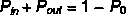*

*P **问题** : *给定问题是一个小时间间隔、小位移的计算模型，在一段时间内，当有一个输入速度的空气供应时**

*供应输入空气时，质量流量可写为:*

*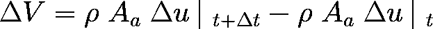*

*利用这个线性方程，如果用空气动力学的动能(K.E .)向前计算，得到空间和时间之间的关系:*

*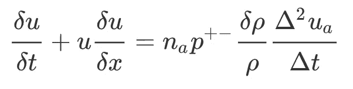*

***各向同性外部压力下动量守恒的纳维尔-斯托克斯关系，无任何剪切力穿过输入速度时间序列的壁面***

*我们的模型变量是:*

*   *每个单元格的单位数*
*   *运动概率*
*   *空气密度率的无量纲常数*
*   *流体速度的输入时间序列*

*在推导纳维尔-斯托克斯模型时，使用的方程有:**菲克扩散通量**和**吉布自由能。**空气密度率的无量纲参数在计算过程中假设为常数。该方程假设在每单元参数的单位和空气密度速率的无量纲常数之间存在同步性。该模型的主要缺点是，它从 1 到 0 呈线性分布，并且从不考虑单元段内分析的墙壁上的反弹或剪切应力。*

> *由于大的输入信号，存在粒子的分散。*

*S *模拟优化模型:**

# ***随机优化***

*通过使用张量流库的随机梯度下降，在单位段长度内确定计算模型的参数。对于纳维尔-斯托克斯关系，这里使用了一个输入速度时间序列 **t ^ 5** 。*

**

> ***如本库中所述:***

*[](https://github.com/aswinvk28/cpp-performance-math-problems-benchmark) [## aswinvk 28/CPP-性能-数学-问题-基准

### 这个练习的目的是用 C++开发一个性能优化模型，使用基本的 GNU 编译器特性，例如…

github.com](https://github.com/aswinvk28/cpp-performance-math-problems-benchmark) 

**速度**的计算基于:

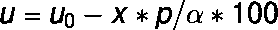

这意味着速度从大约为的值 **0.2 线性降低到大约为**的值 **0.1。总有效点的长度取为 100。等式中的其他参数描述如下:**

1.  *显著速度观察点*绘制成散点图；

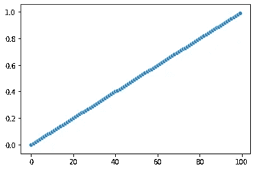

2.初始速度是

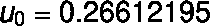

3.概率是

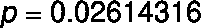

4.alpha 值为

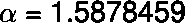

计算模型的位移和时间参数为:

> *dt = 1e-3*
> 
> *dx = 1e-6*

> 通过校准蒙特卡罗扩散的结果，我们总是得到每个单元的体积关系的相同模式

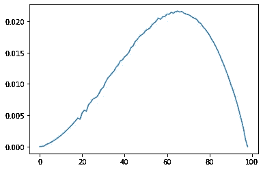

G ***高斯峭度解释***

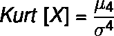

> 这是完全可以预料的，因为我们的原始模型显示了动量守恒模型的这一结果，因为原始纳维尔-斯托克斯关系的**峰度**高于计算模型的每个单元的体积关系

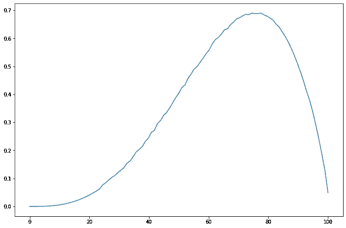

> 为了在同一时刻观察我们的有界环境中的整个空气立方体，必须确定这种模式重复自身的间隔。可以看出，由于尺寸问题，这样的间隔必然存在。我相信在指定空间的每个长方体内标定的声速为 343 m/s 时，显示出这样的**峰度**区间是可能的。

一个 *计算模型列表:*

# **格子玻尔兹曼方法(LBM)**

在格子 Boltzmann 方法中，我们将流体在某一时刻离散为 8 个速度矢量和 1 个静止速度。使用格子玻尔兹曼方法，声速由下式确定:

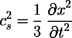

> 玻尔兹曼晶格模型的能量取决于密度、速度和速度矢量，声速是附加参数。这是格子玻尔兹曼方法应用于障碍物的演示。

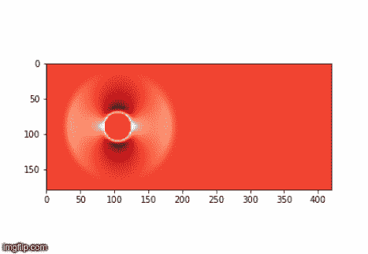

**请花时间观察 LBM 的变化**

## 代码示例

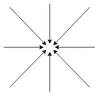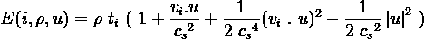

晶格玻尔兹曼模型的能量取决于作用于粒子的输入/输出方向、密度或速度，以及来自每个方向的速度矢量。

S *模拟优化模型:*

# **进化策略**

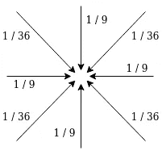

如前所述，基于输入时间序列的模型以如下所述的组合方式发展:

> **下面提供了 LBM 的代码示例:**

[](https://github.com/aswinvk28/doe-response-surface/blob/master/lattice-boltzmann.py) [## aswinvk 28/doe-response-surface/lattice-Boltzmann . py

### 晶格玻尔兹曼方法 as winvk 28/doe-响应面

github.com](https://github.com/aswinvk28/doe-response-surface/blob/master/lattice-boltzmann.py) 

一小部分 **1 / 9** 被分配给正交方向，一小部分 **1 / 36** 被分配给对角方向，一小部分 **4 / 9** 被分配给剩余速度。

一个 *计算模型列表:*

# **实验设计**

可以安装的实验设计使用:

> pip 安装—用户 pyDOE2

是一系列被构造来模拟给定世界轨迹的技术。它可以创建的实验有:析因设计、响应面设计和随机设计。

[*析因设计*](https://pythonhosted.org/pyDOE/factorial.html#factorial)

1.  [*一般全因子*](https://pythonhosted.org/pyDOE/factorial.html#general-full-factorial) *(fullfact)*
2.  [](https://pythonhosted.org/pyDOE/factorial.html#level-full-factorial)**【ff2n】**
3.  *[](https://pythonhosted.org/pyDOE/factorial.html#fractional-factorial)**【frac fact】***
4.  **[*【Plackett-Burman】*](https://pythonhosted.org/pyDOE/factorial.html#plackett-burman)*(Pb design)***

**[*响应面设计*](https://pythonhosted.org/pyDOE/rsm.html#response-surface)**

1.  **[*框-贝肯*](https://pythonhosted.org/pyDOE/rsm.html#box-behnken) *(bbdesign)***
2.  **[](https://pythonhosted.org/pyDOE/rsm.html#central-composite)**【cc design】****

**[*随机设计*](https://pythonhosted.org/pyDOE/randomized.html#randomized)**

1.  **[*拉丁超立方体*](https://pythonhosted.org/pyDOE/randomized.html#latin-hypercube) *(lhs)***

## **代码示例**

**S模拟优化模型:**

# ****响应面方法****

**使用响应面方法，一系列回归模型拟合提供的输入参数。使用计算模型**实验设计**，可以运行一组实验，这些实验基于期望的一组特性(例如 L2 范数和用于建模状态空间的流动特性)来内插数据。**

**在这种情况下， **MNIST** 数字和 **EMNIST** 字符通过随机设计方法(拉丁超立方)使用两个极端区间(即 MNIST 数字 7 和 5)从地面真实数据中模拟出来。这里使用的插值特征是实验矩阵与实验值和地面真实值之间的差的乘积，差的次数为 1。**

**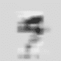**

****MNIST 位数从 7 转换为 5****

> **实验设计的代码库如下所示:**

**[](https://github.com/aswinvk28/doe-response-surface) [## aswinvk 28/doe-响应面

### 使用实验设计的响应面方法

github.com](https://github.com/aswinvk28/doe-response-surface) 

*计算模型列表:*

# **复分析中的循环和通量**

在复分析中，解析复变量表示如下:

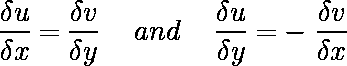

如果复函数是调和函数，它们表示为:

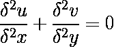

假设有一个流量函数，定义如下:

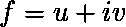

沿着指定等高线的环流和通量定义为:

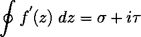

S *模拟优化模型:*

# **使用基于相位方法的光流分析**

使用基于相位的方法，提取图像的空间和时间属性。光流分析是一组可以进行图像分割、确定视频中的约束等的方法。这是一个库，它使用光流技术来预测图像中的微分关系。使用 SceneNet 框架进行光流导数的查找。该脚本将图像转换为定义的大小，并对图像应用水平视野和垂直视野。图像的输入就是 1e-3 归一化的深度图。

可以进行光流的封装:

[](https://opencv-python-tutroals.readthedocs.io/en/latest/py_tutorials/py_video/py_lucas_kanade/py_lucas_kanade.html) [## 光流- OpenCV-Python 教程 1 文档

### 在这一章中，我们将理解光流的概念及其使用 Lucas-Kanade 方法的估计。我们会…

opencv-python-tutro als . readthedocs . io](https://opencv-python-tutroals.readthedocs.io/en/latest/py_tutorials/py_video/py_lucas_kanade/py_lucas_kanade.html) [](https://robotvault.bitbucket.io/scenenet-rgbd.html) [## SceneNet RGB-D:具有完美地面真实性的 5M 图像的照片级真实感渲染

### scene net RGB-D:500 万张合成室内轨迹的照片级逼真图像。

robotvault.bitbucket.io](https://robotvault.bitbucket.io/scenenet-rgbd.html) [](https://github.com/scivision/pyoptflow) [## scivision/pyoptflow

### 仅使用 Scipy 栈的光流估计的 Python 实现也是可能的

github.com](https://github.com/scivision/pyoptflow) 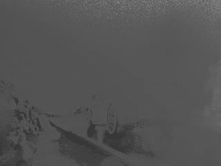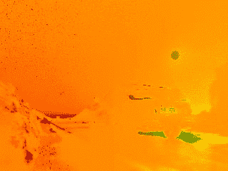

**左边是振幅变化，右边是几个轨迹上的光流图像变化**

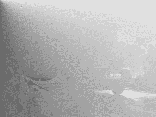

**左边是太阳穴的变化，右边是原始图像**

H **这是怎么生成的！！！**

> 只需将 2 通道 2D 带通信号[和光流导数的复共轭乘积作为一个复数，即可得到实部、虚部和反正切分量。为了将光流导数表示为空间分量，考虑使用移动图像，然后将它们分解成 **X** 和 **Y** 轴。](https://www.electronics-tutorials.ws/filter/filter_4.html)

> **光流分析的代码库如下:**

[](https://github.com/aswinvk28/optical-flow-analysis) [## aswinvk 28/光流分析

### 使用 Python 和 scene net-aswinvk 28/optical-Flow-Analysis 对图像数据进行光流分析

github.com](https://github.com/aswinvk28/optical-flow-analysis) 

# 结论

总之，组合学分析算法，然后根据状态空间的大小和模型复杂性概括问题，并解决状态空间的表示问题。通过复杂分析，可以确定数据的时间和空间成分或复杂性。实验设计的方法利用社会图表，能够以标准化的方法模拟数据。蒙特卡罗方法是抽样技术，在许多用例中使用。蒙特卡罗方法是与其他问题解决技术相结合的强大技术，例如哈密尔顿力学(带哈密尔顿的 MCMC)。

这是一篇关于深度学习网络梯度[变化的论文，读起来很有趣，因为它们解释了神经网络内几个节点的激活模式。他们还讨论了深层神经网络中最大的变化发生在节点较少的层改变其激活模式时。观察到深度学习问题中的深度神经网络(DNN)同时实现其**复杂性**和**不变性**。](https://arxiv.org/pdf/1812.00308.pdf)***