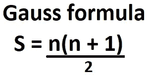

# 你可以在 python 中使用一点数学知识

> 原文：<https://medium.com/analytics-vidhya/a-little-bit-of-math-that-you-can-use-in-python-2ada05709693?source=collection_archive---------32----------------------->

**数学数学再数学**


当有人试图完成大学作业、编程课程或像 hackerrank、codewars 或类似网站上的挑战时，如果有人是新手，当面对数学问题或编写更好的代码时，他往往会卡住。我们可以举一些例子。

开始

**数字 1，一个高斯解**

如果需要对从第 I 个数字到第 n 个数字的所有元素求和，可以将名为 sum 的变量初始化为 0，并在每次迭代中更新变量的值，直到迭代结束。

```
def sumOfN(n):
    sum = 0
    i = 0
    while(i <= n):
        sum += i
        i += 1
    return sum
```

这是一个右循环解，如果你运行 n = 5 的函数，返回 15

**1 + 2 + 3 + 4 + 5 = 15。
但是这个函数的开销是 O(n)，因为对每个小于等于 n 的数进行 n 次迭代** 我们可以忽略其他开销作为变量的赋值，更新和变量或返回函数的结果，所有这些指令都是常量值开销为 O(1)。一个总的通用成本为 T(n) = O(n)，但是如果你尝试用最大的数字并试图计算一个估计的时间将获得:

```
import timedef sumOfN(n):
    sum = 0
    i = 0
    start = time.time()
    while(i <= n):
        sum += i
        i += 1
    end = time.time()
    total_time = {round(float(end - start), 4)}
    return f"total sum -> {sum}, total time: {total_time} seconds"print(sumOfN(1000))print(sumOfN(5000))print(sumOfN(9000))print(sumOfN(100000))print(sumOfN(500000))print(sumOfN(900000))print(sumOfN(1000000))print(sumOfN(10000000)) output:
total sum -> 500500, total time: {0.0003} seconds
total sum -> 12502500, total time: {0.0015} seconds
total sum -> 40504500, total time: {0.0024} seconds
total sum -> 5000050000, total time: {0.0573} seconds
total sum -> 125000250000, total time: {0.3246} seconds
total sum -> 405000450000, total time: {0.4936} seconds
total sum -> 500000500000, total time: {0.4264} seconds
total sum -> 50000005000000, total time: {4.7874} seconds
```

高斯用一个简单的公式来帮助我们:



**众多公式之一**

简单地用你想要的数字设置 n，例如如果你想计算 n = 5

**S = 5(5+1)/2 =>5(6)/2 =>30/2 =>15**

代码是:

```
def sumwithgaussformula(n):
    s = (n*(n+1))/2
    return s
```

我们可以在没有循环解决方案的情况下获得相同的结果，所有指令都具有常数成本 O(1)。

**第二:不要多此一举**

最重要的一个教训是不要重新发明轮子，如果你找到了你需要的功能，不要一次又一次地重写代码。如果需要计算一组数的平均值、中位数。
现在要计算集合 s 的平均值，首先你需要对集合 s 包含的元素求和。

我们以两种不同的方式进行:

如果你有一组像这样的数{1，2，3，4，5，…..n+1，n}，
更精确的说如果你有一组像本文第一点的数，你可以用高斯公式，把代价化为 O(1)，计算均值为:

```
def calculate_mean(n):
    s = sumwithgaussformula(n)
    mean = s/n
```

意思是简单地将所有元素相加，然后除以元素个数。
在这种情况下，我们循环使用“sumwithgaussfuormula()”函数，而不是编写重复的代码(这是非常不必要的)。
下面我们写**中位数。**

```
def calculate_sum(lst):
    sum = 0    
    for i in lst:
        sum += i
    return sum
```

在这里，我们可以使用一个循环，因为我们在一个不遵循 **{1，2，3，4，5，…的元素列表上迭代..n+1，n}** 系列。但是要找到 median(列表的中心元素)，我们需要对元素集进行排序。在按照“重新发明轮子”的说法，我们使用的 sort()函数是 python 的一个核心函数。

```
def find_median(lst):
    sorted_cluster = lst.sort()
    median_value = int(len(lst)/2)

    return lst[median_value]with: lst = [1,2,3,44,6,7,7,7,8,8,9,9,4,3,2,1,5,4,6,74,5,6]
output -> 6
```

现在让我们假设我们想要打印中间值，意思是我们 wind

```
def print_mean_and_median(lst,arg1,arg2):
    print("given " + str(lst) + " median 
           result is ->" +  str(arg1) + " \n" 
           + "given " + str(lst)
           +" mean result is ->" + str(arg2))
```

有更多的方法来优化计算的媒体，平均和类似的。

**数字 3:交换功能**

一个重要且最常用的指令是两个或多个变量之间的交换，所以深入研究交换技术。

给定两个变量 a = 2 和 b = 3，我们要将**a****b**的值和 **b** 的值赋给变量 **a。换句话说
输入 a = 2，b = 3
输出 a = 3，b = 2
一个简单的方法是使用 c 变量作为“交换”变量并交换值**

```
def swap(a,b):   #if a = 2 and b = 3
    c = a        #c = 2
    a = b        #a = 3
    b = c        #b = 2 
```

一种正常的交换方式，另一种不需要临时变量的交换方式。
我们可以利用两个数字之间的差异:

```
def swaptypo2(a,b): if a = 2 and b = 5
    a = a + b       #2 + 5 = 7
    b = a - b       #then we calculate difference a - b => 7 - 5 = 2
    a = a - b       #and calculate difference a - b => 7 - 2 = 5
output b = 2 and a = 5
```

请记住，对大数使用这个可能会导致算术溢出。另一种方法是使用按位运算符“^".”

```
def swapwithbitwise(a,b):
    a = a^b
    b = a^b
    a = a^b
```

关于按位运算及其在编程中的应用，我将在另一篇文章中讨论。目前按原样使用该功能。

**数字 4:在有序集合中寻找一个值**

典型地，一个人生中第一次用一两个星期写代码的人，当到达一个正常的练习时，他可以在一个集合中找到一个值，第一个方法是在所有集合上迭代，并找到 I 元素是否等于我们正在寻找的值。如果你有一个无序的集合，这是一个很好的方法。

```
def findvalue(lst, k):
    for i in range(len(lst)):
        if lst[i] == k:
            return lst[i]print(findvalue([1,2,33,4,5],33))
output will be 33 in other case None
```

这很容易，但是如果我们有一个好的排序集，我们能做什么呢？
答案是使用二分搜索法并降低成本，如果我们研究 findvalue()我们可以看到一个θ(n)成本，但是在一个有序集合中我们可以做得更好

让我们假设我们有一个排序列表= 1，2，3，4，5，6
而不是开始对所有集合进行线性搜索，我们可以从中间的元素开始，并比较关键字和元素。我们可以进行比较，如果元素小于 mid，则向左移动，如果大于 mid，则向右移动。想想如何基于最后一个想法写一个算法。

我会写一篇文章，列出基于非常有趣的数学概念的更难的算法，并且我会写一个复杂的研究来分析计算成本。随时联系我问任何问题，并联系我的意见。