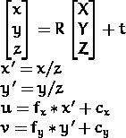

# Instagram Face 3D 滤镜背后的一点数学/线性代数

> 原文：<https://medium.com/analytics-vidhya/a-little-math-linear-algebra-behind-instagram-face-3d-filters-7862200938f6?source=collection_archive---------9----------------------->

我坚信，我们所有人都曾经使用过 Snapchat / Instagram 过滤器，或者至少看到过我们的朋友使用它，并在他们的社交媒体故事或帖子上分享它。

我们开始知道“滤镜”这个词是作为美化者或背景添加装饰品，后来它变得更受欢迎，因为它出现在相机的每个脸上，如嵌入太阳镜，兔子头，年龄转换等。我们急切地看着自己的脸🤭

具体来说，在这篇文章中，我们将讨论当我们进行面部过滤时，我们的手机/ Instagram *会做什么，这样**眼镜**就会被放在**的正确位置**，并能够跟随我们的**头部姿势**。*

## 简而言之，人脸 3D 滤镜的主要过程依次分为 3 个阶段:

1.  人脸检测
2.  面部标志检测
3.  项目投影

人脸检测和地标检测是**机器学习/深度学习**的一部分，分别从整个图像中进行物体检测和进行回归。对于每个检测到的人脸，它将被发送到第二阶段的算法，以估计鼻子，眼睛，嘴等的位置。到目前为止，许多算法和数据集覆盖了 68 个人脸标志。[这里是进一步阅读的绝佳资源](http://pyimagesearch.com/2017/04/03/facial-landmarks-dlib-opencv-python/)。

pyimagesearch.com 的面部标志

然而，我们将关注第三阶段**(项目投影)**，因为我们正在谈论数学/线性代数/矩阵变换。当然，前两个阶段有很多数学内容要讲，但是每个阶段都有一大堆问题要讨论。

# 项目投影

标志检测的结果是每个标志的一组 x 和 y 坐标，这仅仅是 2D 信息，同时我们需要知道 z 坐标，左眼是否比右眼离相机更远，所以我们可以说面部正在看左侧，因为眼镜会跟随我们看的方向。

我们用来进行这种投影的问题/方法被称为**“透视 n 点(PnP)”**或**“针孔摄像机模型”**。这是几十年前的方法，但仍然经常用于许多计算机视觉案例，包括机器人，增强现实和我们的讨论。要使这种方法奏效，需要三个要素:

## 1.作为参考的世界坐标空间的 3D 点

术语是超级酷的“世界坐标空间”，它们是一些固定点，我们可以说是参考点或在正常情况下，因为世界知道这是真的！！！。在这种情况下，我们使用这 14 个点。

这些点的位置类似于人的面部标志坐标，鼻子在面部的前面和中心，下巴在底部等等。

## 2.投影点的 2D 点，与世界坐标空间一一对应

投影点来自第二阶段的深度学习模型，这是面部标志模型，我们只使用模型输出的 68 点中的 14 点。

## 3.相机矩阵

该矩阵包含关于相机的**焦距**和**主点**的信息，其实际上被图像中心的坐标所替代。而焦距通常与图像宽度的总像素相同。

# **透视-n 点(PnP) /** 针孔摄像机模型

通过使用上面的 3 个信息，我们希望从这个公式中得到一个**旋转矩阵(R)** 和**平移向量(t)** 。

来源: [OpenCV 文档](https://docs.opencv.org/2.4/modules/calib3d/doc/camera_calibration_and_3d_reconstruction.html)

它将世界坐标空间的 14 个点与实际检测到的面部的 14 个点进行匹配，以获得**面部在每个维度上旋转了&平移了**多少。

## 新点投影

来源: [OpenCV 文档](https://docs.opencv.org/2.4/modules/calib3d/doc/camera_calibration_and_3d_reconstruction.html)

在知道旋转矩阵和平移向量之后，我们想要投射新的点(可能不是 14 个输入点)。**输入**是 3d 坐标(X，Y，Z) **类似世界坐标空间**指向 2D 坐标(u，v)，最后我们只显示 2D 的图像。

来源:[护目镜和眼镜](https://www.gogglesandglasses.com/article4.html)

例如，如果你想将一个镜头的一个新的点**投射到 2D，选择输入 3D **围绕眼睛的世界坐标**加上少量的 Z 坐标，因为镜头比眼睛更靠近摄像机。同样，在**鼻垫**中，选择鼻子的世界坐标位置。**

要应用过滤器，你需要定义一些 3D 点**给你的物体，比如眼镜、帽子或胡子，相对于世界坐标空间的 14 个点，然后投影**将这些 3D 点转换成 2D** 点，考虑到脸部和头部的姿势。**

> **综上所述，展示滤镜的流程是:检测人脸- >估计 2D 人脸标志- >获取旋转矩阵和平移向量- >投影 3D 项指向 2D - >可视化。它发生在摄像机捕捉到的每一帧。**

# python / C++中的代码来实现它

如果你想应用这个概念，请参考 [OpenCV 文档](https://docs.opencv.org/2.4/modules/calib3d/doc/camera_calibration_and_3d_reconstruction.html)中关于这个的讨论。

得到一个**旋转矩阵&平移向量的函数:**
C++ : `**projectPoints**`
Python : `cv2.**projectPoints**`

**项目 3D 项的函数指向 2D:** c++:`**projectPoints**`
Python:`cv2.**projectPoints**`

两者都在 OpenCV 包里面！！

# **免责声明**

我不是 Snapchat / Instagram 的工程师，我没有说他们使用这个概念，我不知道他们在里面做什么，我感觉他们比你在这篇文章中读到的更复杂。我想传达给你的主要信息是，你可以用这个概念来做这件事！

## 感谢阅读！！！干杯😃 😀 😄