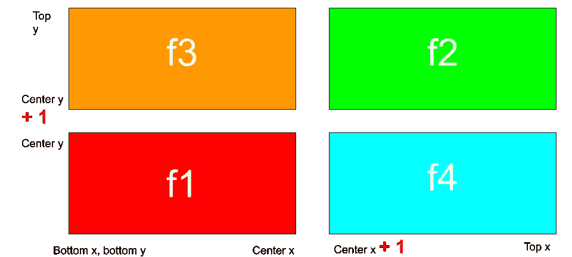

# 分而治之的小练习

> 原文：<https://medium.com/analytics-vidhya/a-little-practice-of-divide-and-conquer-5b02826e0c45?source=collection_archive---------8----------------------->

奥拉夫·阿伦斯·罗特内在 [Unsplash](https://unsplash.com?utm_source=medium&utm_medium=referral) 上的照片

当我们谈到算法时，我们会有一些一般性的想法，如递归、动态编程以及分而治之。

分而治之是一个非常重要的想法，你只能通过实践来掌握它。如果你需要一些经典的例子，我会说快速排序和二分搜索法。对于分而治之，有时，我们会将其分为 3 个步骤:

分裂，征服，结合。

快速排序正好有这三个部分。如果你忘记了快速排序，这里是代码。如果你不知道这个算法，请先 youtube 或者 google 一下。

二分搜索法，它只有两步，分而治之。不需要合并。这里给出了一个二分搜索法猜测产品价格的示例代码。在这个例子中，我们将猜测产品的价格。我们被告知价格在 0 美元到 1000 美元之间。我们会得到我们的猜测过高或过低或正确的反馈。下面是使用二分搜索法的代码。

今天，我从 leetcode 遇到一个有趣的问题，它也可以使用分而治之的思想。我想分享一下这个问题的解决方法。问题是

1274.矩形中的船只数量

 [## 帐户登录- LeetCode

### 提高你的编码技能，迅速找到工作。这是扩展你的知识和做好准备的最好地方…

leetcode.com](https://leetcode.com/contest/biweekly-contest-14/problems/number-of-ships-in-a-rectangle/) 

类似于**二分搜索法**，然而，我们需要将矩形切割成 4 部分，如下图所示。如果四分之一区域返回 false，这意味着该区域没有船只，我们可以安全地返回 0
如果四分之一区域返回 True，我们应该继续将该区域划分为四个部分以进一步探索。
基本情况将是顶点和底点相同，然后我们可以得到精确的结果。如果是真的，我们有一艘船，如果是假的，我们没有船。

一个微妙的事情是为了这四个部分没有重叠，我们需要增加一个中心点，如图所示。

这是代码

非平凡的分而治之。

932.漂亮的阵列

据说可以分而治之解决。但是，很难理解。解决方案和讨论可以在这里找到。

 [## 奇数+偶数模式，O(N) - LeetCode 讨论

### 最后编辑:2019 年 8 月 2 日 5:22 AM 10.2K 视图尝试分而治之，所以我们有左半部分，右半部分。一种方法是…

leetcode.com](https://leetcode.com/problems/beautiful-array/discuss/186679/Odd-%2B-Even-Pattern-O%28N%29) 

感谢阅读。