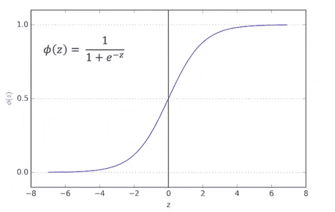
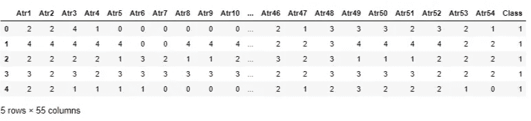
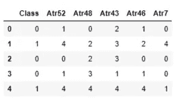
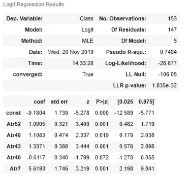
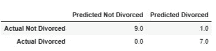
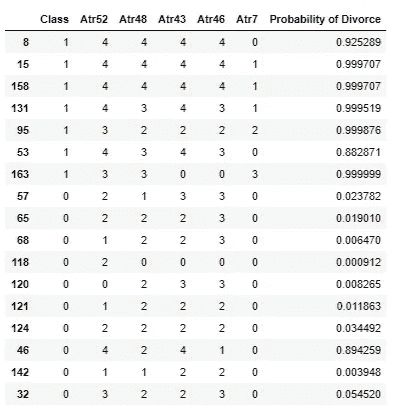

# 预测夫妇离婚率的逻辑模型，使用 statsmodel.api 库实现。

> 原文：<https://medium.com/analytics-vidhya/a-logistic-model-for-predicting-divorce-rates-among-couples-implemented-using-the-statsmodel-api-763e03d29d68?source=collection_archive---------5----------------------->


对土耳其 84 对(49%)离婚夫妇和 86 对(51%)已婚夫妇进行了调查。研究人员构建了 54 个问题，涵盖了基于以下内容的研究中的以下内容:

> 在这个模型中，合理关系房屋理论中定义的标准是重要的离婚预测因素。模型中最重要的离婚预测是《启示录》中的四骑士。戈特曼将其描述为**批评**、**蔑视**、**蒙混过关**和**防御性**(戈特曼，2014；Gottman 和 Gottman，2012 年)

虽然 54 个研究问题可以在本文的底部找到，但值得一提的是，本文采用的模型发现，其中只有 5 个问题足以作为离婚的预测因素。每个问题都有不同的几率(影响)作为离婚的预测因素。所有回答都以 5 分制收集，即(0 =从不，1 =很少，2 =一般，3 =经常，4 =总是)

这 5 个问题按影响顺序突出显示如下:

1.  我们就像两个陌生人，在家里而不是在家里共享同一个环境。离婚夫妇对这个问题做出肯定回答的可能性要高 275 倍。
2.  即使我在讨论中是对的，我保持沉默是为了伤害我的配偶。离婚夫妇对这个问题做出肯定回答的可能性要高 0.54 倍。
3.  我通常保持沉默来让环境平静一点。离婚夫妇对这个问题做出肯定回答的可能性是普通夫妇的 3.8 倍。
4.  我觉得我们的讨论是对的。离婚夫妇对这个问题做出肯定回答的可能性是 T21 的 3.0 倍。
5.  我会毫不犹豫地告诉我的配偶她/他的不足。离婚夫妇对这个问题做出肯定回答的可能性是普通夫妇的 3.0 倍。

要访问数据集，使用[该链接](https://archive.ics.uci.edu/ml/datasets/Divorce+Predictors+data+set)。

# 创建逻辑回归模型的演练

简单来说，逻辑回归模型是一个分类器，它将模型中的因变量分为两类。因此，它也被称为二元分类器。



逻辑回归函数，也称为 Sigmoid 函数，显示 0 和 1 之间的概率

它通过给数据集中的每条记录分配概率(在 0 和 1 之间)来做到这一点。通常，所有小于 0.5 的概率被归入 0 类，所有大于或等于 0.5 的概率被归入 1 类。在这个特定的模型中，0 级代表已婚，1 级代表离异。

现在，使用该特定数据集开发逻辑回归模型所需的步骤如下:

1.  导入必要的库。
2.  加载数据集。
3.  删除缺失值，因为如果有任何缺失值，逻辑回归将会失败。在这个数据集中，没有。
4.  查看数据集。
5.  分为训练数据集和测试数据集。
6.  分配因变量和自变量。
7.  使用 statsmodel add_constant 功能添加常数。
8.  运行模型。
9.  估计每个系数的影响。
10.  开发混淆矩阵以使用模型检查准确性
11.  检查每对预测概率
12.  将预测测试值与实际测试值进行比较
13.  输出你的最终结果。

这是我们深入研究技术内容的部分。系好安全带，伙计们！

导入相关库:

```
#import relevant librariesimport pandas as pd
import numpy as np
import statsmodels.api as sm
```

将文件读入笔记本:

```
#read file into notebook
import osos.chdir(‘C:\\Users\\XXXXX\\Downloads\\divorce’) # Set working directoryraw_data = pd.read_excel(‘divorce.xlsx’)raw_data.head()
```

最后一行返回熊猫数据帧的前 5 列。见下文:



离婚数据集的前 5 列快照

使用以下代码创建用于分析的数据集副本:

```
#create copy of Datasetdata = raw_data.copy()
data.shape**Output:
(170, 55)**
```

这个数据集有 170 行和 55 列。Class 列保存受试者的婚姻状况值，0 表示已婚，1 表示离异。

现在，在这一点上，值得一提的是，使用数据集的所有 54 列来推导逻辑回归将产生以下类型的错误:

```
“**LinAlgError**: Singular matrix”
```

错误的出现是因为一些独立变量彼此之间有很强的相关性，这就要求分析人员消除这些变量，以得出独立变量中相关性最小的变量。

为了确定我们的主要独立变量，我们删除了 Class 列，并对所有独立变量运行相关方法。

```
#declare independent and dependent variables
y = train[‘Class’]
x1 = train.drop(‘Class’, axis=1)#Check correlations between independent variables
corr_measure = x1.corr()#Sort values in descending order
corr_measure.loc['Atr1', :].sort_values(ascending=False)#Read the bottom 10 Records
sorted_df = corr_measure.loc['Atr1', :].sort_values(ascending=False)sorted_df.tail(10)**Output:
Atr42    0.616241
Atr53    0.593598
Atr48    0.593373
Atr47    0.564280
Atr52    0.548976
Atr45    0.518663
Atr43    0.462278
Atr7     0.448927
Atr46    0.393671
Atr6     0.255335
Name: Atr1, dtype: float64**
```

相关值通常在-1 和 1 之间是连续的，其中接近-1 的值彼此负相关(即彼此相反)，接近 1 的值彼此正相关(即联合相关)。越接近 0 的值表示没有相关性。

在本练习中，我从这 10 列开始，经过几次迭代(为了让读者不至于看不到这篇文章)，我将列减少到 5 列。重要的剔除标准包括:**调查问题之间的相似度**、**系数的 p 值**和**模型的总体 p 值**。

选定的列显示在下面的代码中:

```
#create new dataframe using the least homoscedactic variables
new_df = raw_data[[‘Class’,’Atr52', ‘Atr48’, ‘Atr43’, ‘Atr46’, ‘Atr7’]]#randomize the rows of the dataframe
new_df = new_df.sample(frac=1).reset_index(drop=True) new_df.head()
```



具有相关列的新数据框架

对于统计爱好者来说，除了相关性方法，你还可以对独立变量进行主成分分析(PCA)或方差膨胀因子，以得出最终的独立变量。为了简单起见，我使用了相关方法。

接下来，我们将新的数据框架分成训练和测试数据集，并运行逻辑回归。

```
#split into train & test datasetsnew_train = new_df.sample(frac=0.9, random_state=45)
new_test = new_df.drop(new_train.index)#Define Independent & Dependent Variablesx1 = new_train.drop(‘Class’, axis=1)
y = new_train[‘Class’]#Add constant and run Regressionx = sm.add_constant(x1)
reg_log = sm.Logit(y,x)
results_log = reg_log.fit()**Output:
Optimization terminated successfully.
         Current function value: 0.174361
         Iterations 10**
```

为了查看模型的输出，我们在“results_log”上运行一个摘要:

```
results_log.summary()
```



这为我们提供了模型的概要。伪 R 平方值明显高于 02。-0.4 的可接受性阈值，但在数据集上运行的所有模拟中，0.7484 是达到的最合适的值。

此外，LLR p 值表明模型足够强大，远低于 0.05。

自变量的系数由 Atr(52，48，43，46 & 7)表示。要找出这些变量的影响，必须找出每个变量的指数，如下所示:

```
#find the impact of each VariableAtr52 = np.exp(1.0905)
Atr48 = np.exp(1.1083)
Atr43 = np.exp(1.3371)
Atr46 = np.exp(-0.6117)
Atr7 = np.exp(5.6193)print(‘I who would not hesitate to tell my spouse about her/his inadequacy increases odds of divorce by: ‘, Atr52 )print(‘I feel right in our discussions increases odds of divorce by: ‘, Atr48 )print(‘I mostly stay silent to calm the environment a little bit increases odds of divorce by: ‘, Atr43 )print(‘Even if I am right in the discussion, I stay silent to hurt my spouse increases odds of divorce by: ‘, Atr46 )print(‘We are like two strangers who share the same environment at home rather than family increases odds of divorce by: ‘, Atr7**Output:
I who would not hesitate to tell my spouse about her/his inadequacy increases odds of divorce by:  2.975761581445578****I feel right in our discussions increases odds of divorce by:  3.029204367329437****I mostly stay silent to calm the environment a little bit increases odds of divorce by:  3.807984322766186****Even if I am right in the discussion, I stay silent to hurt my spouse increases odds of divorce by:  0.5424279572943541****We are like two strangers who share the same environment at home rather than family increases odds of divorce by:  275.69632824364794**
```

## 系数分解

从所有迹象来看，报告“感觉彼此陌生”的夫妇离婚的可能性是普通夫妇的 275 倍。对这个问题做出肯定的回答对一对夫妇来说是一个非常不好的信号。

该模型还揭示，对“保持沉默以平息环境”做出肯定回应的夫妇离婚的可能性是其他夫妇的 3.8 倍。

对“在我们的讨论中感觉正确”做出肯定回答的夫妇离婚的可能性是其他夫妇的 3.0 倍。

那些毫不犹豫地告诉配偶他/她的不足之处的夫妇离婚的可能性是其他夫妇的 2.9 倍。

## 模型精度

根据测试数据集测试时，该模型的准确性如何？为了实现这一点，我依赖于 statsmodel 库的代码转储，它定义了可以在模型上实现的混淆矩阵。

该函数接受测试数据集的自变量、测试数据集的因变量和建立的初始回归模型。

```
def confusion_matrix(data,actual_values,model):

 # Confusion matrix 

 # Parameters
 # — — — — — 
 # data: data frame or array
 # data is a data frame formatted in the same way as your input data (without the actual values)
 # e.g. const, var1, var2, etc. Order is very important!
 # actual_values: data frame or array
 # These are the actual values from the test_data
 # In the case of a logistic regression, it should be a single column with 0s and 1s

 # model: a LogitResults object
 # this is the variable where you have the fitted model 
 # e.g. results_log in this course
 # — — — — — 

 #Predict the values using the Logit model
 pred_values = model.predict(data)
 # Specify the bins 
 bins=np.array([0,0.5,1])
 # Create a histogram, where if values are between 0 and 0.5 tell will be considered 0
 # if they are between 0.5 and 1, they will be considered 1
 cm = np.histogram2d(actual_values, pred_values, bins=bins)[0]
 # Calculate the accuracy
 accuracy = (cm[0,0]+cm[1,1])/cm.sum()
 # Return the confusion matrix and 
 return cm, accuracy
```

在我们的训练数据集上实现这一点，我们有:

```
#prepare test data
x2 = new_test.drop(‘Class’, axis=1)
y1 = new_test[‘Class’]x_test = sm.add_constant(x2)cm = confusion_matrix(x_test,y1, results_log)
cm**Output:****(array([[9., 1.],
        [0., 7.]]), 0.9411764705882353)**
```

测试该模型显示，该模型准确预测了 94%的测试数据集值。显示预测的混淆矩阵如下所示:

```
cm_df = pd.DataFrame(cm[0])
cm_df.columns = [‘Predicted Not Divorced’, ‘Predicted Divorced’]
cm_df = cm_df.rename(index={0: ‘Actual Not Divorced’, 1:’Actual Divorced’})
cm_df
```



一点都不差！

为了确定测试数据集中每对夫妇的离婚概率，我们使用自变量 x_test 对模型运行预测函数:

```
#Test model on test data setpred_values1 = results_log.predict(x_test)#Save predicted values into new dataframe along with the original valuesfinal_df = pd.DataFrame(new_test)
final_df[‘Probability of Divorce’] = pred_values1#Compare predicted values with actual outcomesfinal_df.sort_values(by=’Class’, ascending=False)
```

嘣！这给了我们一个最终的数据框架，让我们可以看到每对夫妇的离婚概率，以及他们与现实的对比。见下文:



最终数据帧值

163 号夫妇有 0.9999 的离婚几率，我想他们已经离婚也就不足为奇了。非常有趣的数据集。

逻辑回归有很多应用，但它非常适合分析调查数据，并根据年龄、收入、地点等因素将对象分为两类。这对于分析政治数据和媒体倾向非常有用。

如果你是一个非技术性的读者，并且你做到了这一点，我为你的坚韧而喝彩。我也写一些与地缘政治和经济相关的非技术性文章，请在 twitter @the_horoatio 上关注我。

谢谢你。

## 夫妻调查的 54 个问题

**属性信息:**

1.当我们的讨论恶化时，如果我们中的一个人道歉，讨论就结束了。
2。我知道我们可以忽略我们的差异，即使有时事情变得很困难。
3。当我们需要的时候，我们可以从一开始就和我的配偶讨论并改正它。
4。当我和我的配偶讨论时，联系他最终会起作用。
5。我和妻子共度的时光对我们来说很特别。
6。作为伴侣我们没有时间在家。
7。我们就像两个陌生人，在家里而不是在家里共享同一个环境。
8。我喜欢和妻子一起度假。
9。我喜欢和我的妻子一起旅行。
10。我们的大多数目标和我的配偶是一样的。
11。我想，在未来的某一天，当我回首往事，我看到我的配偶和我已经水乳交融。
12。我和我的配偶在个人自由方面有相似的价值观。
13。我和我的配偶有相似的娱乐意识。
14。我们对人的大部分目标(孩子、朋友等。)都一样。
15。我们和我配偶的梦想是相似而和谐的。
16。关于爱应该是什么，我们和我的配偶意见一致。
17。我们和我的配偶对幸福生活有着相同的看法。我和我的配偶对婚姻应该如何有相似的想法。我和我的配偶对婚姻中的角色有相似的想法。我和我的配偶在信任方面有相似的价值观。
21。我很清楚我妻子喜欢什么。22。我知道我的配偶在生病时希望得到怎样的照顾。
23。我知道我配偶最喜欢的食物。24。我可以告诉你我的配偶在她的/他的生活中面临着什么样的压力。25。我了解我配偶的内心世界。26。我知道我配偶的基本焦虑。27。我知道我配偶目前的压力来源是什么。28。我知道我配偶的希望和愿望。29。我非常了解我的配偶。三十岁。我了解我配偶的朋友和他们的社会关系。31。当我和我的配偶争论时，我感到咄咄逼人。
32。当我和我的配偶讨论时，我通常使用“你总是”或“你从不”这样的表达方式。
33。在我们的讨论中，我可以对我配偶的个性进行负面评价。34。在我们的讨论中，我可以使用攻击性的表达。
35。我可以在我们讨论的时候侮辱我的配偶。36。当我们讨论的时候，我会很丢脸。37。我和配偶的讨论并不平静。38。我讨厌我配偶打开话题的方式。39。我们的讨论经常突然发生。40。在我知道发生了什么之前，我们只是开始讨论。
41。当我和我的配偶谈论一些事情时，我的平静会突然打破。
42。当我和我的配偶争吵时，我只是出去，一句话也不说。
43。我通常保持沉默来让环境平静一点。
44。有时候我觉得离开家一段时间对我有好处。
45。我宁愿保持沉默，也不愿和我的配偶讨论。
46。即使我在讨论中是对的，我保持沉默是为了伤害我的配偶。
47。当我和配偶讨论时，我保持沉默，因为我害怕无法控制我的愤怒。
48。我觉得我们的讨论是对的。
49。我与我被指控的事无关。
五十。实际上我并不是那个被指控有罪的人。
51。家里的问题不是我错。52。我会毫不犹豫地告诉我的配偶她/他的不足。
53。当我讨论时，我会提醒我的配偶她/他的不足。54。我不怕告诉我的配偶她/他的无能。

# 参考

*   恩特姆、m、阿德姆、k、i̇lhan、t、科尔察斯兰、S. (2019 年)。基于相关性特征选择和人工神经网络的离婚预测。nevehir hacebekta Veli 大学 SBE 德尔吉斯，9 (1)，259–273。检索自[【网页链接】](http://dergipark.org.tr/nevsosbilen/issue/46568/549416)
*   UCI 机器学习知识库
*   戈特曼，J. M. (2014)。什么预测离婚？婚姻过程和婚姻结果之间的关系。纽约:心理学出版社。
*   Gottman，J. M .和 Gottman，J.S. (2012 年)。伊夫特勒·阿拉桑达·科普吕·i̇nşa·埃特梅克:戈特曼伊夫·特拉皮西·埃蒂米 1。Düzey Kitab，[1 级临床培训。戈特曼夫妇疗法。给夫妻带来裂痕。i̇stanbul:·i̇stanbul.