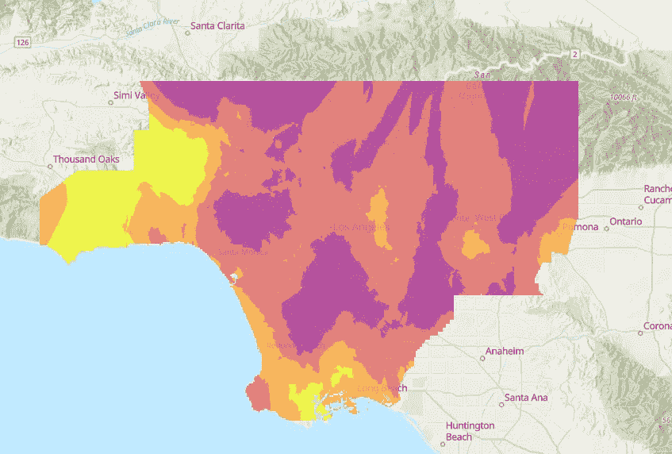
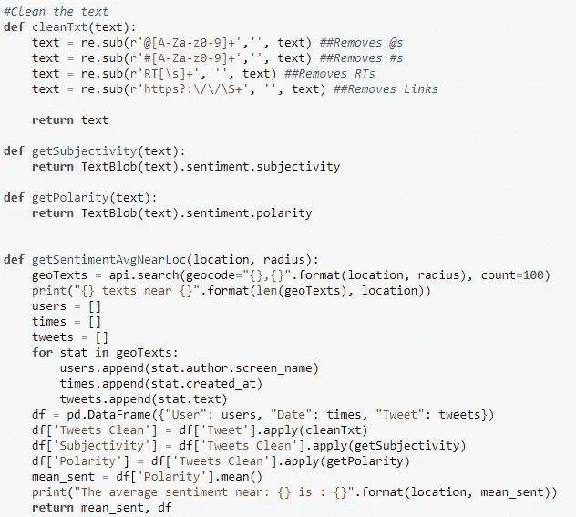
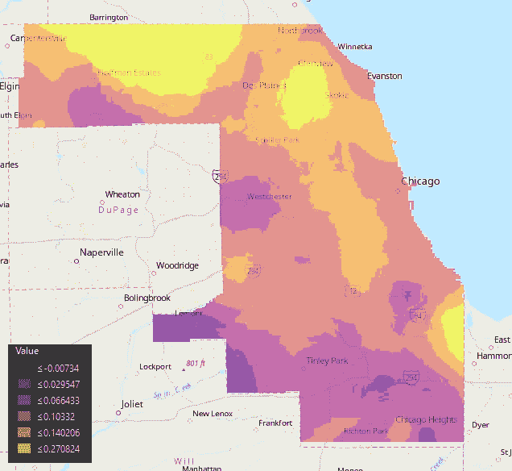

# 使用 Tweepy、文本 Blob 和 ArcGIS 查看城市的空间幸福感。

> 原文：<https://medium.com/analytics-vidhya/a-look-at-spatial-happiness-in-cities-using-tweepy-text-blob-and-arcgis-c60c50cb64b0?source=collection_archive---------5----------------------->

# 我们如何利用社交媒体来衡量建筑环境？

理解建筑环境的影响一直是我的兴趣所在。我们如何判断大发展？我们如何知道城市规划成功地让生活变得更好？我们的分析可以数据驱动吗？

为了了解人们对一个地方的感受，建筑师通常会花几个月的时间召开社区会议并进行调查，以获得详细的了解。但是，如果我们正在寻找一个更快、更不精确的观点，Twitter 情绪分析也许可以提供一种标准化的、大量的方式来理解人们在任何给定时间、任何给定地点的感受。至少他们的社交媒体自我感觉是这样的。

我正在考虑的这种推特情感分析将关于推文语气的知识与推文的地理位置结合起来。为了进行调查，我在两个不同的城市随机取样:洛杉矶和芝加哥。我使用 Tweepy API 提取推文，使用 Text Blob 分析情感，使用 ArcGIS 在样本点之间插入情感。

# 分析。

要爬的第一座山是构建一个简单的脚本来理解地球上任何给定点附近的推文的情绪。我的输入将是一个纬度/经度坐标，我希望输出是该点 1 英里范围内的推文的平均情绪。代码如下:

方法利用 TextBlob 和 Tweepy 获取推文的主观性和极性

对于每个点，最后一个函数使用 Tweepy 来搜索指定半径内的推文。该 API 返回给定半径范围内最近一天左右的多达 100 条推文。使用文本 Blob 评估每条推文的“极性”和“主观性”。极性以介于-1 和 1 之间的浮点数形式返回，从负到正。主观性以介于 0 和 1 之间的浮点数形式返回。使用熊猫，极性被平均以获得该点的极性分数。

推文内容及其极性得分

一旦我们知道如何捕捉和理解一个点周围的情绪，下一步就是为每个城市生成样本点。我想在大约 95%的置信度和 5%的误差范围内评估空间 twitter 情绪。这意味着，例如，对于我的洛杉矶县 AOI，我需要 294 个随机样本。为了确保不会对人口稀少的区域进行采样，我首先擦除了该县提供的“洛杉矶县公园和空地”数据集中指定为“公园和空地”的所有区域。然后使用无公园数据集，我用 ArcGIS 的“创建随机点”工具创建了 294 个随机点。这些点被输入到前面概述的脚本中，以获得样本平均情绪。

为了对整个城市地区的空间 Twitter 情绪进行插值，我使用了“普通克里金法”工具。克里金法着眼于样本点距离和情感值之间的关系，构建线性方程来预测已知样本之间的平均 Twitter 情感。克里金法使我们能够获得完整 AOI 的良好预测。

# 检验空间推特情感

在对洛杉矶和芝加哥进行分析后，我们可以看到每个城市的 Twitter 情绪是如何变化的。

**洛杉矶，**2020 年 11 月 28 日

2020 年 11 月 28 日洛杉矶空间情绪

我在 2020 年 11 月 28 日运行了我的洛杉矶分析，结果可以在上面的地图中查看。地图通过 z 得分进行符号化，因此显示为具有积极和消极情绪的区域尤其如此。大多数区域预计会接近平均值，并被符号化为既不特别正也不特别负。看地图，有一些有趣的模式。与洛杉矶其他地区相比，马里布地区尤其幸福。通过这种分析，很难知道那是什么，尽管我会猜测这与住在美丽的海滩、自然公园附近以及特别富裕有关。虽然，根据这个分析，很难说你越富有就越幸福。这座城市的许多其他富裕地区并不特别幸福。参观贝弗利和好莱坞山地区。

**芝熙，**2020 年 11 月 28 日

2020 年 11 月 28 日芝加哥空间情绪

我也在 2020 年 11 月 28 日进行了芝加哥分析。洛杉矶和芝加哥的地图以相同的方式和相同的数据分布进行符号化，因此可以直接进行比较。与洛杉矶不同，库克郡/芝加哥地区有三个特别快乐的地方。在北部，有广阔的霍夫曼庄园和 Glenview/Skokie 地区，在南部，靠近伊利诺伊州和印第安纳州边界的 Calumet 市。同样明显的是，至少在这一天，库克县的南部代表着更高的负面情绪。

# 结论

我首先要说的是，这种分析有许多错误。首先，我只考虑信息的快照。如果我们想更准确地了解 Twitter 情绪如何随空间变化，收集更长时间的数据将会有所帮助。也许是一个月甚至几年的数据。第二，我认为广泛的 Twitter 情绪与一个人的幸福并没有特别的相关性，一个更优雅的分类模型是有序的。最后，使用 Twitter 数据会带来很多自我选择。只有一部分人使用 Twitter，经常使用的人会被过度考虑。比如说。如果你在 2016 年至 2020 年期间对 DC 华盛顿州宾夕法尼亚大道 1600 号附近的推文进行采样，你可能会从一个人那里获得太多推文，而从当地其他人那里获得的推文则不够多。

尽管有缺陷，但我认为这一分析显示了 Twitter 情绪数据的潜在力量。使用推特，以一种标准化的方式跨越时间和空间快速、廉价地比较和对比情绪成为可能。这种分析并不局限于正面情绪和负面情绪。可以建立更有针对性的模型来寻找推文中更有趣的趋势。人们在哪里谈论一件具体的事情？一些变化的知识能传播多远？这真的是一个开放的分析的盒子。

# **接下来的步骤**

我发表这篇文章的主要目的是开启一场关于用强有力和可扩展的方式评估我们生活的地方的对话。请随意评论这篇文章，给我发电子邮件，或在 LinkedIn 上与我联系。很想听听大家的意见和建议！

电子邮件:benny.friedman2@gmail.com

领英:【https://www.linkedin.com/in/benjaminfriedman2/ 