# 一种识别葡萄牙银行定期存款客户的机器学习方法。

> 原文：<https://medium.com/analytics-vidhya/a-machine-learning-approach-to-identifying-customers-of-bank-of-portugal-who-would-subscribe-to-a-8bd04387aac2?source=collection_archive---------11----------------------->

几个世纪以来，石油一直是社会最有价值的资源之一。纵观历史，谁控制了石油，谁就控制了经济。然而，在今天的“数据经济”中，可以说数据，由于可以从中提取的洞察力和知识，是**潜在的**更有价值。


照片由[达米尔·斯班尼克](https://unsplash.com/@spanic?utm_source=medium&utm_medium=referral)在 [Unsplash](https://unsplash.com?utm_source=medium&utm_medium=referral) 拍摄

金融业是利用大数据价值的顶级行业之一。由于营销经理越来越有兴趣根据严格选择的联系人仔细调整他们的定向活动，葡萄牙银行希望找到一种模型来预测哪些未来客户会订阅他们的定期存款。拥有这样一个有效的预测模型有助于提高他们的活动效率，因为他们将能够确定哪些客户会订阅他们的定期存款，从而将他们的营销工作引向这些客户。这将帮助他们更好地管理他们的资源。

这个项目的目标是通过使用从葡萄牙银行的客户那里收集的数据来提出这样一个有效的预测模型。

# 数据集的描述

葡萄牙银行已经收集了大量的数据，包括那些已经订阅定期存款和那些没有订阅定期存款的客户资料。数据包括以下列。

1 —年龄(数字)

2-作业:作业类型(分类:“管理。”、'蓝领'、'企业家'、'女佣'、'管理'、'退休'、'自雇'、'服务'、'学生'、'技术员'、'失业'、'未知')

3-婚姻:婚姻状况(分类:“离婚”、“已婚”、“单身”、“未知”)；注意:“离婚”是指离婚或丧偶)

4 —教育(分类):'基础. 4y '，'基础. 6y '，'基础. 9y '，'高中'，'文盲'，'专业.课程'，'大学。程度'，'未知')

5 —违约:有信用违约？(分类:“否”、“是”、“未知”)

6 —住房:有住房贷款？(分类:“否”、“是”、“未知”)

7 —贷款:有个人贷款？(分类:“否”、“是”、“未知”)

以下内容与当前活动的最后一个联系人相关

8-联系人:联系人通信类型(分类:“手机”、“电话”)

9-月:一年中的最后一个联系月(分类:'一月'，'二月'，'三月'，…，'十一月'，'十二月')

10-星期几:一周的最后一个联系日(分类:“星期一”、“星期二”、“星期三”、“星期四”、“星期五”)

11-持续时间:最后一次联系的持续时间，以秒为单位(数字)。重要注意事项:该属性对输出目标有很大影响(例如，如果 duration=0，则 y='no ')。然而，在执行呼叫之前，持续时间是未知的。同样，在呼叫结束后，y 是已知的。因此，该输入应仅用于基准测试目的，如果目的是获得现实的预测模型，则应丢弃。

#其他属性:

12-活动:在此活动期间为此客户执行的联系次数(数字，包括最后一次联系)

13 天:从上一个活动中最后一次联系客户后经过的天数(数字；999 意味着之前没有联系过该客户)

14-previous:在此活动之前为此客户执行的联系次数(数字)

15-结果:先前营销活动的结果(分类:“失败”、“不存在”、“成功”)

#以下是社会和经济背景属性

16 —就业变动率:就业变动率—季度指标(数字)17 — cons.price.idx:消费者价格指数—月度指标(数字)

18 — cons.conf.idx:消费者信心指数—月度指标(数字)

19 — euribor3m: Euribor 3 个月利率—每日指标(数字)

20 —受雇人数:雇员人数—季度指标(数字)产出变量(预期目标):

21 — y —客户是否订阅了定期存款？(二进制:“是”、“否”)

# 所用分类器的描述

**XGBoost** —是一种梯度增强决策树的实现，旨在提高速度和性能。

**逻辑回归** —是一种统计模型，其基本形式使用逻辑函数来模拟二元因变量。

**随机森林** —是一种用于分类、回归和其他任务的集成学习方法，通过在训练时构建大量决策树并输出作为类模式或个体树均值预测的类来运行。

**多层感知器** —是一类前馈人工神经网络(ANN)。

## GitHub 链接

[https://github . com/nahomneg/Bank-Institution-Term-Deposit-Predictive-Model/](https://github.com/nahomneg/Bank-Institution-Term-Deposit-Predictive-Model/)

# 数据处理类

该类涉及葡萄牙银行数据的所有预处理、数据探索(绘图)和特征提取。

# 建模课程

这个类与创建分类器、创建管道、k-fold 分裂和可用分类器的比较有关。

# 解释性数据分析

## 导入必要的模块和库

```
# import the neccesary libraries
import pandas as pd
import seaborn as sb
import matplotlib.pyplot as plt
import numpy as np
%matplotlib inline
from sklearn import preprocessing
from itertools import islice
import seaborn as sns
from scipy.stats import binom
from scipy.stats import norm
import statsmodels.stats.api as sms
from sklearn.pipeline import Pipeline
from sklearn.linear_model import LogisticRegression
from sklearn.tree import DecisionTreeClassifier
from sklearn.ensemble import RandomForestClassifier
from sklearn.neural_network import MLPClassifier
from sklearn import preprocessing
# import preprocessor and modelling classes
import data
from model import Model
```

加载数据集并创建预处理和建模类的实例。

```
#load the data set
data_frame = pd.read_csv("dataset/bank-additional-full.csv",sep=';'  , engine='python')
# initialize the modelling and preprocessing classes
processor = data.PreProcessing(data_frame)
model = Model()
```

# 阶级不平衡

类别不平衡是机器学习分类中的一个主要问题，其中每个类别中的观察值比例不成比例。在这种情况下，许多分类算法对于具有较低比率的类别具有较低的准确度。

为了查明数据是否是类不平衡的受害者，我使用了预处理类中的 plot _ target _ imbalance()方法。

```
# use the plot_target_imbalance method from the PreProcessing class 
processor.plot_target_imbalance()
```

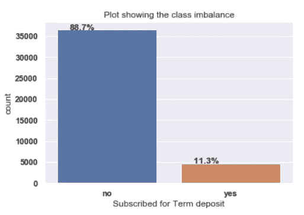

上图显示数据存在类别不平衡，其中“否”类别的频率是“是”类别的 8 倍。

## 极端值

为了识别有异常值的列，我使用了预处理类中的 detect_outliers_boxplot()，并将数字列传递给它。

```
processor.detect_outliers_boxplot(['duration','age','cons.conf.idx','euribor3m'])
```

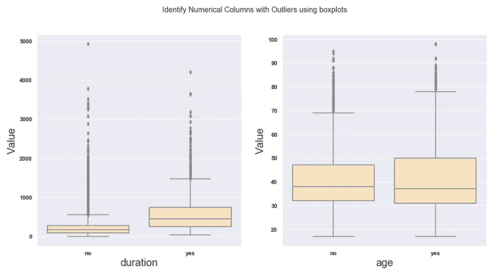

这两个类别的盒状图在年龄上有相当多的重叠。这个节目年龄不是这样一个分离的栏目。

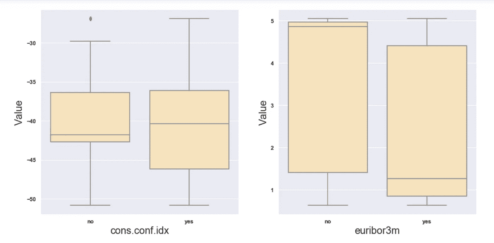

euribor3m 的 b/n 中位数为“是”和“否”,这表明它是一个独立的类别。

上面的图显示持续时间和年龄有大量的异常值。我使用预处理类中的 handle_outliers()方法将离群值替换为它们各自的中间值。

```
processor.handle_outliers(['duration','age','cons.conf.idx'])
```

## 分类变量对目标的影响

接下来，我可视化了每个分类变量对目标变量(‘y’)的影响。

我从预处理类向 plot _ multiple _ categorial _ against _ target()传递了一些分类变量。

```
# use the plot_multiple_categorical_against_target method of the PreProcessing class
# to plot the count of each categorical variable with the target as a hue
processor.plot_multiple_categorical_against_target(['poutcome','marital','loan','housing'])
```

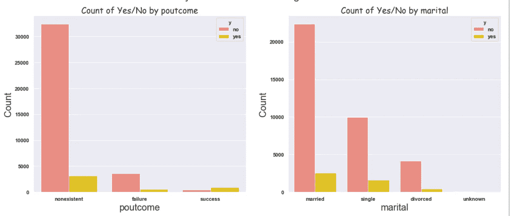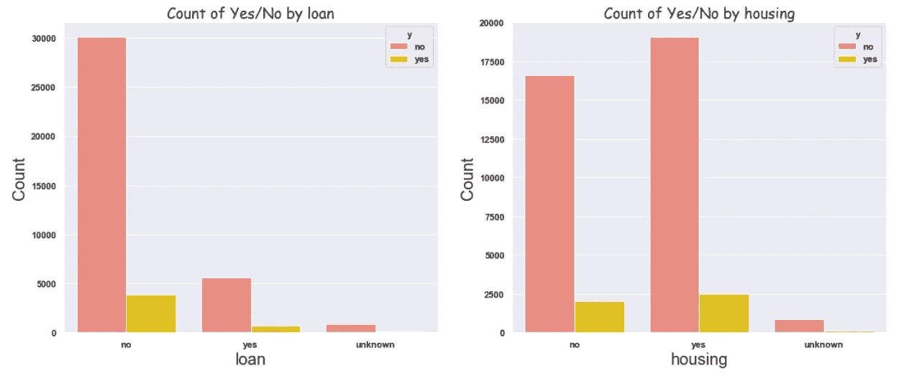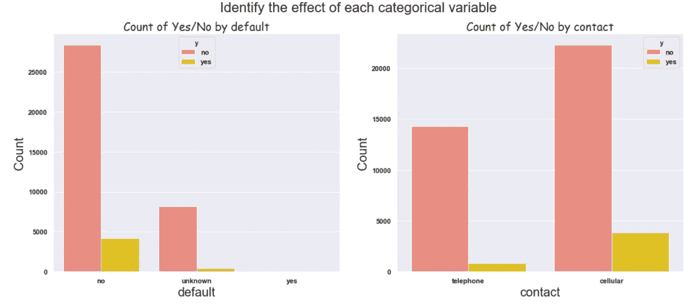

```
processor.plot_single_categorical_against_target('education')
```

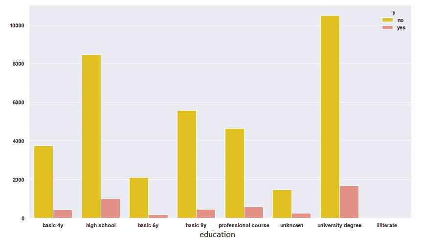

```
processor.plot_single_categorical_against_target('day_of_week')
```

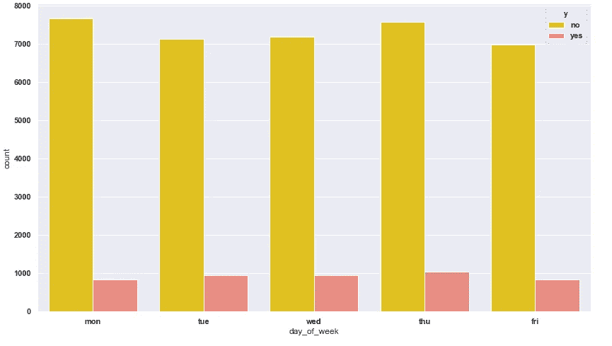

上面的图显示，在预测目标变量时，星期几没有太大帮助。

## 使用直方图的数值变量对目标的影响。

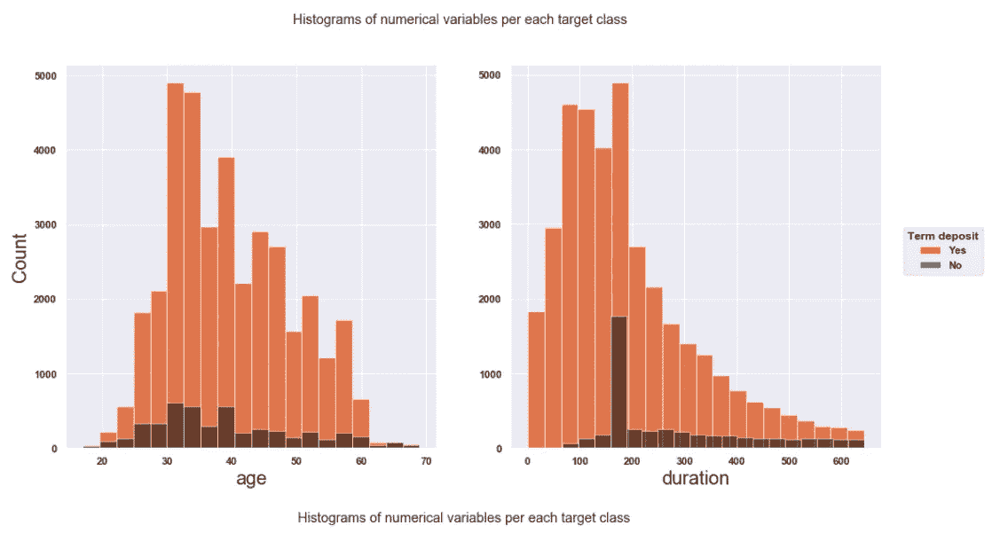

看一下年龄图，参加活动的人数在 25 岁到 40 岁之间上升，但没有那些没有参加的人多。

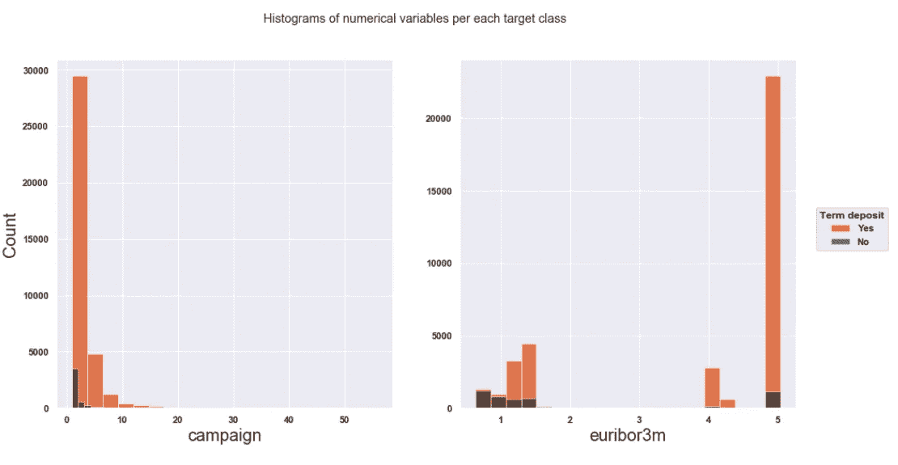

## 分布图

接下来，我通过使用 plot_distribution()方法并向其传递一些数字变量来研究数字列的分布。

```
processor.plot_distribution(['age','duration','campaign','emp.var.rate','euribor3m'])
```

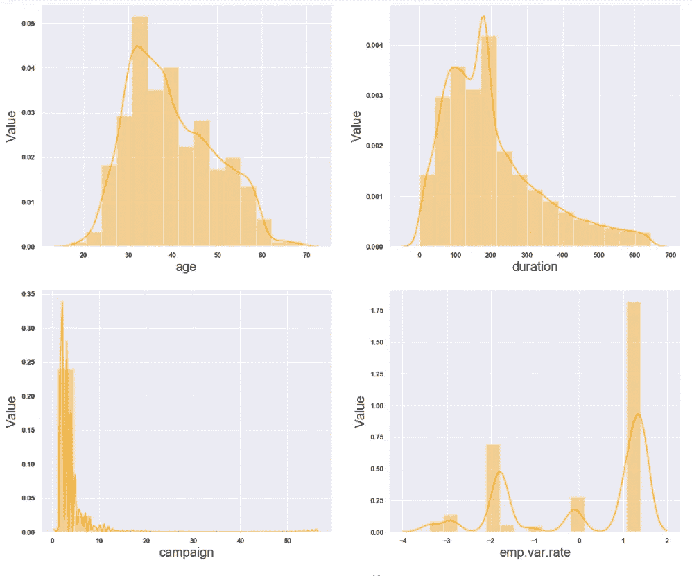

## 相关 b/n 数值变量

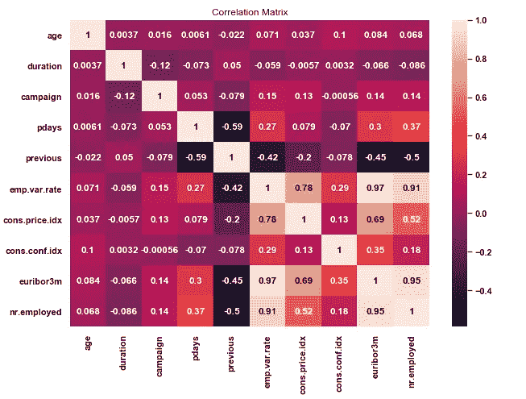

emp.var.rate、cons.price.idx、euribor3m 和 nr.employed 特征具有非常高的相关性。euribor3m 和 nr.employed 之间的相关性最高，为 0.95！

## 特征工程

我利用预处理类中的 assign_years()方法从 month 列中提取了一个新特性‘Year’。

```
# create a new feature 'Year' using assign years method
processor.assign_years()
processor.data_frame.sample(10)
```

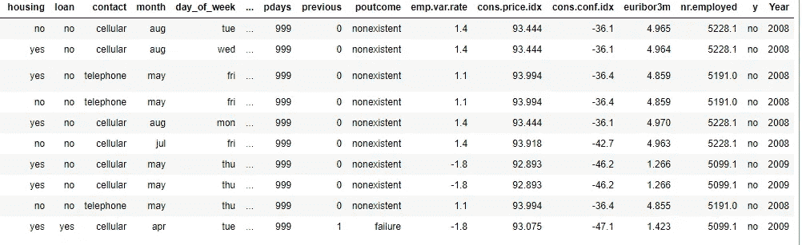

## 一次热编码和标准化

一种热编码是将分类变量转换成一种形式的过程，这种形式可以提供给 ML 算法，以便在预测中做得更好。

数据标准化是重新调整数字列的过程，以便它们的平均值为 0，标准差为 1。这也有助于 ML 算法做得更好。

我选择标准化而不是归一化，因为当使用归一化时，数据集与平均值的偏差会有所妥协，归一化试图拟合数据 b/n 0 和 1。

# 柱式变压器和管线

Scikit-learn 最近增加了 Column Transformers 类，它允许为每一列指定不同的转换，使预处理变得不那么繁琐(并且更容易阅读！).在这种情况下要应用的转换是一个热编码和标准化。

顾名思义，管道允许将多个进程、列转换器和机器学习模型堆叠到单个 scikit-learn 估计器中。与任何其他评估者一样，管道也有拟合、预测和评分方法。

我使用预处理类的 get_column_transformer 方法来获取列转换器，该列转换器又被传递给管道。我放弃了持续时间，因为它决定了命运目标变量，这对于训练机器学习模型来说是不好的。星期几也被删除，因为它对模型没有显著影响。

```
#a column transformer that handles both one hot encoding and standardization
column_transformer = processor.get_column_transformer(categorical_columns,numerical_columns,['duration','day_of_week'])
```

在创建管道之前，我必须在列转换器旁边添加要传递给管道的分类器。为了添加分类器，我使用了 model 类的 add_model()函数。

```
# add 4 classifier models to be compared
model.add_classifier(model.get_random_forest_classifier(),'Random Forest')
model.add_classifier(model.get_logistic_classifier(),'Logistic Regressor')
model.add_classifier(model.get_xgboost_classifier(),'XGBoost')

model.add_classifier(model.get_multi_perceptron(),'MLP')

#create a pipeline using the transformer and the above classifiers
model.create_pipes(column_transformer)
```

# 拆分数据、K 倍和交叉验证

交叉验证是数据科学家工具箱中的一个重要工具。它允许更好地利用数据。训练集用于训练模型，验证集用于在它从未见过的数据上验证模型。我使用了 K-fold 的以下变体来提出训练和验证集。

**K-fold** 包括将数据集随机分成 K 个大小大致相等的组或折叠。保留第一个折叠用于测试，并在其他 k-1 个折叠上训练模型。该过程重复 K 次，每次使用不同的折叠或不同组的数据点进行验证。

当将数据拆分成多个折叠时，每个折叠都应该很好地代表整个数据。当考虑遭受类不平衡的数据时，这是重要的，就像这里正在考虑的。

**分层 K** - **褶皱**通过保留每类目标的样本百分比来提供训练/验证。

我将数据分别分成 64%、20%和 16%的训练集、测试集和交叉验证集。使用 K 倍从最初为 80%的训练数据中分离出验证集。我使用模型类来完成这个任务。

```
#train_test split in 80:20 ratio
X_train,X_test,y_train,y_test=  processor.train_test_split()#use K-fold to split the training data in 80:20 ratio
kfold = model.get_cross_validation_splitter(is_strattified = False)
```

# 模型比较

我使用了 model 类的 compare_models()方法来比较 4 个分类器，这 4 个分类器使用了 5 个折叠，并基于不同的评估指标取它们的平均分数。

我用 LabelBinarizer 告诉分类器目标变量的哪一类(是或否)是正的和负的。compare_models 方法需要知道哪个类是肯定的，哪个是否定的，以便根据召回率、精确度和 f1_score 来比较分类器。

```
# Label Binarizer to identify which target class is positive
lb = preprocessing.LabelBinarizer()
y_train = np.array([number[0] for number in lb.fit_transform(y_train)])
```

然后，我基于不同的评估标准对模型进行了评估。

```
#compare the models based on roc_auc
models_k_fold = model.compare_models(kfold , X_train, y_train,scoring = 'roc_auc')
#compare the models based on accuracy
models_k_fold_accuracy = model.compare_models(kfold , X_train, y_train,scoring='accuracy')
#compare the models based on recall
models_k_fold_recall = model.compare_models(kfold , X_train, y_train,scoring='recall')
#compare the models based on precision
models_k_fold_precision = model.compare_models(kfold , X_train, y_train,scoring='precision')
#compare the models based on f1_score
models_k_fold_f1 = model.compare_models(kfold , X_train, y_train,scoring='f1')
```

模型类的 compare_models()方法返回平均分数(5 倍)以及分类器的名称。我使用返回的数据创建了一个表，显示了基于不同度量的分类器的得分。

```
#create a performance for each criteria based on the different metrics
classifiers = models_k_fold['classifiers']
scores_auc = models_k_fold['scores']
scores_accuracy = models_k_fold_accuracy['scores']
scores_recall = models_k_fold_recall['scores']
scores_precision = models_k_fold_precision['scores']
scores_f1 = models_k_fold_f1['scores']
data = {'Classifier':classifiers , 'Auc':scores_auc, 'Accuracy': scores_accuracy,
        'Recall':scores_recall, 'Precision':scores_precision }
#change the dictionary to data frame
performance_df = pd.DataFrame(data)
performance_df = performance_df.set_index('Classifier')
performance_df
```

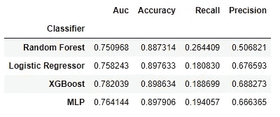

使用正常 K 倍的性能总结

```
#create a stratified k-fold by passing True to is_strattified 
kfold = model.get_cross_validation_splitter(is_strattified = True)
```

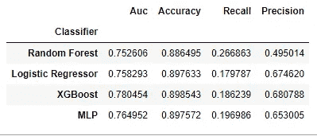

使用分层 K-Fold 的性能摘要

上表总结了基于每个 K 倍类型的不同度量的每个分类器的平均性能。从上表中可以看出，两种 K-Fold 类型的得分相当相同，但对于具有高度类别不平衡的数据集(如本文所考虑的数据集),依靠**分层 K-Fold** 技术总是更好。

以上每个指标都更适合不同的情况。

## 评估指标选择

1.  **准确性** —正确预测的数量占所有预测的比例。
2.  **ROC** —通过绘制不同阈值设置下的真阳性率(TPR)与假阳性率(FPR)来计算。曲线下的面积就是 ROC_Score。
3.  **召回** —量化发现的真阳性的数量
4.  **精度** —量化实际属于正类的正类预测的数量。

由于数据集的不平衡性质，我选择了 **ROC_AUC** 作为最可靠的指标。如果我使用准确性，即使是最差的分类器也会有很高的分数，但最终，它仍然只是一个差的分类器。

ROC 分析对以少数类为代价在多数类上表现良好的模型没有任何偏见，这种属性在处理不平衡数据时非常有吸引力。

ROC 能够通过研究真阳性率(TPR)和假阳性率(FPR)来实现这一点。如果 TPR 和 FPR 都在随机线以上，我们会得到一个高 ROC。

查看这两个表，我观察到 **XGBoost** 是 ROC_AUC 中表现最好的，得分约为 0.764。

# 结论

该项目的主要目标是能够预测哪些客户将为葡萄牙银行订阅定期存款。该项目使用了葡萄牙银行收集的数据，包括定期存款客户和未定期存款客户的资料。

深度解释性分析表明，数据集是高级别不平衡的受害者。它还表明星期几对预测没有太大帮助。

在 EDA 之后，数据集通过对分类变量使用一键编码器进行预处理，而对数字列使用 StandardScaler。

然后，我创建了由 4 个分类器组成的管道，通过使用 K-Fold 和交叉验证进行比较。

我选择 ROC_AUC 作为最可靠的评估指标，因为它对类不平衡有容忍度。基于 ROC_AUC 分数，XGBoost 分类器以大约 0.76 的分数名列前茅。

## 感谢

我把这些放在一起作为第三批[10academy.org](http://10academy.org/)培训的一部分，我想对我所有的学习伙伴和工作人员的支持表示感谢。

# 参考

[1]:[泰蕾兹·富尔巴克](https://www.northridgegroup.com/blog/author/therese-fauerbach/) **h** 。(2017 年 4 月 16 日)。[在当今的数据经济中，数据比石油更有价值](https://www.northridgegroup.com/blog/more-valuable-than-oil-data-reigns-in-todays-data-economy/#:~:text=Oil%20has%20reigned%20for%20centuries,it%2C%20is%20potentially%20more%20valuable.)

[https://www . northridgegroup . com/blog/more-valued-than-Oil-data-regins-in-todays-data-economy/#:~:text = Oil % 20 已经统治了% 20 个世纪，它% 2C % 20is 是% 20 潜在% 20 更有价值的。](https://www.northridgegroup.com/blog/more-valuable-than-oil-data-reigns-in-todays-data-economy/#:~:text=Oil%20has%20reigned%20for%20centuries,it%2C%20is%20potentially%20more%20valuable)