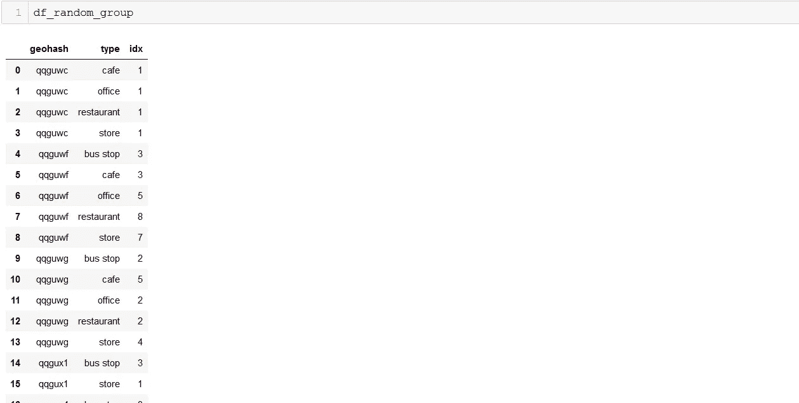

# 一种离散化经纬度的方法

> 原文：<https://medium.com/analytics-vidhya/a-method-to-discretization-latitude-and-longitude-c05d53f0fdfa?source=collection_archive---------15----------------------->

短篇小说，
这个故事与之前的[个故事](/analytics-vidhya/reverse-address-to-latitude-and-longitude-using-here-api-73458b4df996)有关。这篇主要文章是地理空间数据景观的一部分。

首先，什么是地理空间数据？
根据 www.gislounge.com，地理空间数据定义如下。


简而言之，任何包含坐标、地址、城市或邮政编码的数据。属于地理空间数据景观。


地理空间数据示例

# 地理哈希

[**Geohash**](https://en.wikipedia.org/wiki/Geohash) 是 Gustavo nie Meyer[【1】](https://en.wikipedia.org/wiki/Geohash#cite_note-first2008-1)和 g . m . Morton[【2】](https://en.wikipedia.org/wiki/Geohash#cite_note-morton66-2)在 2008 年发明的一个[公共域](https://en.wikipedia.org/wiki/Public_domain) [地理编码系统](https://en.wikipedia.org/wiki/Geocode#Geocode_system)，它将一个地理位置编码成一个由字母和数字组成的短字符串。它是一种分层的空间数据结构，将空间细分为网格形状的桶，这是所谓的 Z 顺序曲线 T21 的众多应用之一，通常称为空间填充曲线。

简而言之，geohash 将一对纬度和经度编码成一个字符串。这取决于 geohash 的级别。例如，geohash 级别 1 有 1 个数字字符串，geohash 级别 2 有 2 个数字字符串，依此类推。


[https://www . elastic . co/guide/en/elastic search/reference/current/search-aggregations-bucket-geohashgrid-aggregation . html](https://www.elastic.co/guide/en/elasticsearch/reference/current/search-aggregations-bucket-geohashgrid-aggregation.html)

地理哈希可视化


[https://www.movable-type.co.uk/scripts/geohash.html](https://www.movable-type.co.uk/scripts/geohash.html)

上图说明，qqguwf 是 geohash 级。编码范围为-6.2265 和 106.826。此外，它还显示了 9 个 geohash 邻域。

**一个简单的用例**

哪个区域属于商业区？
假设:业务领域是业务点感兴趣的领域。例如:商店、咖啡馆、餐馆、公共汽车站等..

导入必要的库

```
import random
import geohash
import pandas as pd 
import seaborn as sns
```

生成随机坐标函数

```
def generate_random_data(lat, lon, num_rows):
 #df_res = pd.DataFrame()
 random_item = [‘store’,’cafe’,’restaurant’,’office’,’bus stop’]
 tmp_list = []
 for _ in range(num_rows):
 hex1 = ‘%012x’ % random.randrange(16**12) # 12 char random string
 flt = float(random.randint(0,100))
 dec_lat = random.random()/100
 dec_lon = random.random()/100
# print (hex1.lower(), flt, lon+dec_lon, lat+dec_lat)
 tmp_list.append([hex1.lower(), lat+dec_lat , lon+dec_lon, random.choice(random_item) ])
 return pd.DataFrame(tmp_list,columns = [‘idx’,’latitude’,’longitude’,’type’])# generate random geohash
df_random = generate_random_data(-6.23,106.826,100)
```


随机坐标

添加地理哈希

```
# add geohash level 6
df_random[‘geohash’] = df_random.apply(lambda x:geohash.encode(x[‘latitude’],x[‘longitude’],6),axis=1)
```

聚合和透视

```
# aggregation and pivot
df_random_group = df_random[[‘geohash’,’type’,’idx’]].groupby([‘geohash’,’type’]).agg({“idx”: “nunique”}).reset_index()
df_random_group_pvt = df_random_group.pivot(index=’geohash’, columns=’type’, values=’idx’).fillna(0)
```

聚合输出



枢轴输出


添加热图


**结论**
总而言之，geohash 让 geo 计算变得更加简单快捷。
从上面的热图可以看出，geohash qqguwf 属于商业区。因为，那里有很多餐馆、商店、办公室等。