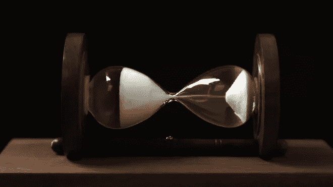

# PyTorch 中的最小堆栈自动编码器

> 原文：<https://medium.com/analytics-vidhya/a-minimal-stacked-autoencoder-from-scratch-in-pytorch-da236dbf9345?source=collection_archive---------9----------------------->

自动编码器是惊人的。它们能够学习比输入数据维数低得多的“压缩”编码。这种学习输入的密集表示的能力对于诸如降维、无监督任务的特征检测、生成模型等任务非常有用。

这就是如何在 PyTorch 中构建一个最小的自动编码器。我们将使用…