# 一种基于模型的推荐引擎构建方法

> 原文：<https://medium.com/analytics-vidhya/a-model-based-approach-to-build-a-recommendation-engine-1519d347cd22?source=collection_archive---------1----------------------->

*这是* [*IBM 的推荐引擎挑战赛*](https://datahack.analyticsvidhya.com/contest/build-a-recommendation-engine-powered-by-ibm-cloud/) *的入门指南。本文由 IBM 的*[*Rajesh K jeya Paul*](https://www.linkedin.com/in/rajeshjeyapaul/?originalSubdomain=in)*撰写。*

推荐引擎现在无处不在。世界各地的企业正在围绕这些系统创建完整的战略，以改善和增强客户体验。事实证明，这是组织的制胜之举。

了解推荐引擎的工作原理并构建一个推荐引擎是数据科学家的必备技能。

机器学习是一个优化问题，构建推荐引擎也是一个优化问题。推荐引擎可以灵活地采用基于记忆(非模型)的方法，如基于用户和基于项目的相似性方法，但是用户和项目之间的协作也可以采用基于模型的方法。

这可能是一个众所周知的事实，因为有很多内容都在讨论这个问题。在本文中，我将介绍基于模型的协同过滤中的基本优化，尤其是矩阵分解方法，并帮助您理解特定数据集如何适合这种方法。

首先，我们将理解为什么机器学习是一个优化问题。

# **机器学习——一个优化问题**

给定下面的数据集，你能找到给定方程的 B0 和 B1 的系数值吗？

***y=f(x)
体重= B0+B1 *身高***

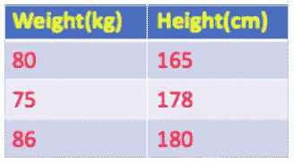

你可以做出假设，并被鼓励以一个随机值开始旅程。花 5 秒钟时间继续。

你得到 B0 和 B1 的值了吗？

嗯，我听到有人说 B0 =0，B1=5。感谢你的开始…正如我提到的，你可以做假设，在这种情况下，B0=0，开始

具有任意随机值的旅程，在本例中，B1=5。我们可以试着把这个代入给定的方程吗？

让我们取身高=180

**重量= 0 + 5 * 180 = 900**

嗯，对应的体重是 86，不是 900。因此，下一步是优化 B1 值。我们可以尝试用 4 或 2 或任何其他随机值。让我们取 B1=0.5，再次适合算法。

**重量= 0 + 0.5 *180 = 90**

啊哈，现在我们接近实际体重了，86。现在误差也减小了(90–86)。

这就是机器学习中的优化之旅。在这种情况下，为给定方程(在这种情况下为线性方程)找到最佳的系数值(称为权重),导致模型的更好性能。

等等，你的旅程还没有结束…你能试着为下面的数据集拟合你的系数值 B1=0.5 吗？

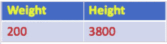

体重= 0+ 0.5 (3800) = 1900，并不是实际体重 200…怎么回事..？

如果我们有这样奇怪的数据集，这将是实际的行为。因此，这表明数据预处理在使模型更有效方面起着关键作用。在这种情况下，我们可以将上述数据点视为异常值并将其丢弃。

一般情况下，我们处理的数据点会有这种行为，并认为是非凸性质的。

您可以进一步微调 B1=0.5 的值。

这个试图达到最优值的旅程可以被称为“随机梯度下降”(SGD)

在理解了机器学习是一个优化问题之后，我们将把注意力转向理解推荐系统中的类似优化。

# **协同过滤在推荐系统中的作用**

协同过滤处理用户-项目关系的过去行为。例如，像星级评定、评论、通过拇指向上/向下的偏好这样的显式反馈，以及像购买历史、鼠标移动等这样的一些隐式反馈。

如果数据完整，有看得见的模式，那么我们就很容易预测和推荐。例如，以下面的场景为例:

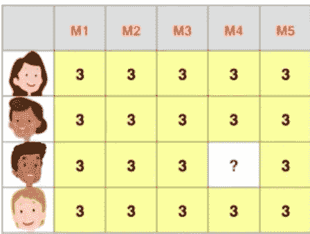

如果我让你预测电影 4 (M4)的评分，很简单:

但是，以下面的场景为例:

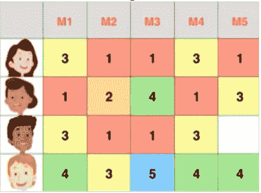

这也可能相对容易，因为它有一个模式:

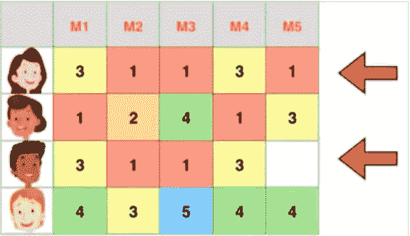

因此，我们可以将评级视为:

但是我们知道我们的数据是杂乱的，并且表现为以下方式:

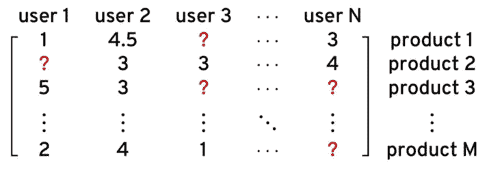

它只不过是一个稀疏矩阵，这就是为什么我们再次回来，通过优化来解决这个问题，将数据的非凸性质转换为凸性质。

顺便说一句，这种稀疏矩阵是因为我们只在进行任何在线购买时的行为。下次为了避免这个问题，试着给你买的所有产品打分(开玩笑的！).

嗯，这个问题的答案是“矩阵分解”。协同过滤有矩阵分解和向量分解两种方法来解决这个问题。

我们来讨论矩阵因式分解部分。什么是矩阵分解？

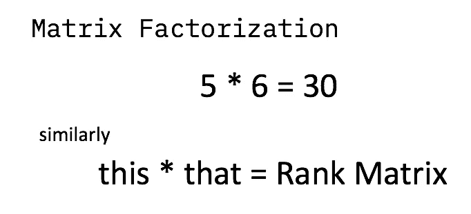

我们将反过来理解这一点，如何分解一个完整的秩矩阵，然后如何通过优化我们可以达到目标秩。

采用以下等级矩阵，用户项目评级:

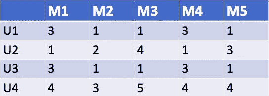

为了分解这一点，我们需要创建用户和项目共有的两个基于特征的“因子”。你能猜出电影等级矩阵有哪些特征吗？大概是喜剧和动作片？

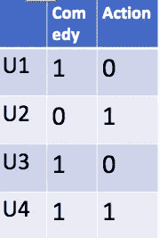

在这里，我们为这两个功能创建了基于用户的排名:

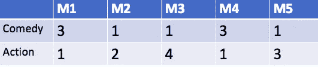

在这里，我们得到了这两个功能的电影排名。让我们来看看矩阵分解的全貌。

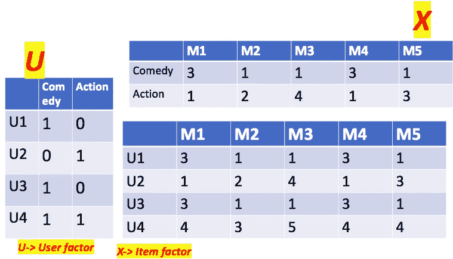

毫不奇怪，秩矩阵是通过叉积使用这两个基于特征的矩阵重新构建的。

**用户 1 (U1)对电影 1 (M1)的评分= 3 = 1*3 + 0*1 =3**

现在，如何导出那些基于特征的矩阵？我们必须回到我们的 ML 优化技术:

*   从某处开始，取一个随机值
*   假设一下

让我们看看下面的场景，我们从随机值开始:

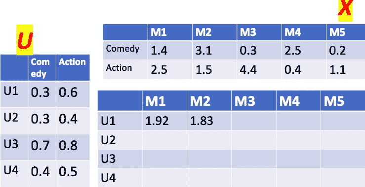

这里我们采用了随机值，并试图达到目标，并基于误差即兴进一步优化它。

在这种情况下，用户 1 (U1)对电影 1(M1)的评分是 3，这是我们的目标，但实际值是 1.92。

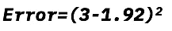

优化有助于我们减少达到最佳值的误差。以这种方式，可以逼近稀疏矩阵来构建最优秩矩阵。

此外，在因子分解过程中，我们可以使一个因子矩阵稳定，比如说用户因子，并修改项目因子。这个过程是相反的，使我们得到一个替代的优化方法，称为**替代最小二乘** (ALS)。

旅程不止于此。给定如下数据集，没有排名，那么起点是什么？如何建立秩矩阵？

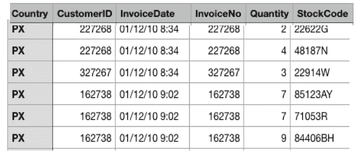

我们可以根据购买物品的频率(数量)创建等级吗？还是基于人气？还是一个虚拟矩阵？

解决这一问题的方法之一是创建一个等级矩阵，并继续进行基于模型的 CF 或基于记忆的 CF 来为用户预测前“n”个项目。

下面的链接提供了为每个用户购买的商品创建排名的详细信息:这将帮助您创建一个基线模型，并使您能够在正在进行的练习题中提交代码。详情如下:

*   基线模型实现步骤: [https://bit.ly](https://bit.ly/) /AVlab
*   推荐引擎在线挑战:[**https://ibm.biz/buildRE**](https://ibm.biz/buildRE)