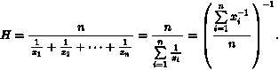
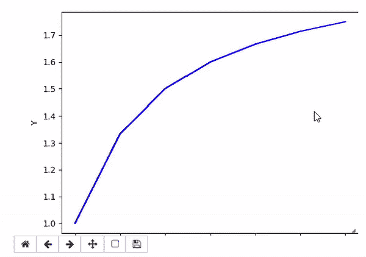
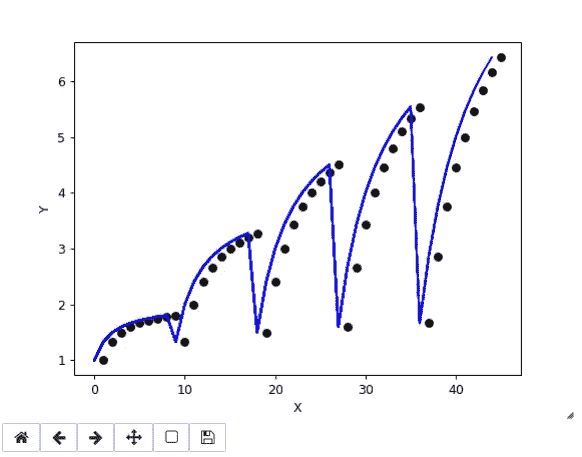

# 一种更自然的客户细分方法

> 原文：<https://medium.com/analytics-vidhya/a-more-reasonable-approach-of-customer-segmentation-29228c911f0b?source=collection_archive---------12----------------------->

更自然地细分客户的通用框架


# 介绍

企业有这种永恒的渴望去了解他们的客户，这有点道理。你越了解客户，你就能更好地为他们服务，你从客户那里获得的经济收益也就越高。这并不是业内讨论的新话题。自从贸易出现以来，这种为了战略利益而了解客户的过程就已经存在，这项任务通常被称为“[客户细分](https://research-methodology.net/microsoft-segmentation-targeting-and-positioning/)”。

顾名思义，客户细分是一个与任务无关的术语，涵盖了所有方式，企业可以根据客户的确切需求对其进行细分。一些常见的客户细分方法是基于他们的[最近频率单月](https://en.wikipedia.org/wiki/RFM_(market_research))值，他们的人口统计数据，如性别、地区、国家等，以及他们的一些商业评分。

为了更好地理解，请将段视为两种类型。硬段和软段(只是为了理解，这些不是正式的范畴)。硬细分市场是指那些可以直接解释为男性对女性或德国顾客对英国顾客的细分市场。有时仅用 SQL 查询就可以很容易地得到这些。尽管这些细分很容易获得，但对于了解企业在各个细分领域的表现也非常有用。说到软段，这些是通过解释或调查得出的。一些例子可能是忠诚者对新生者，或者有魅力的对顽固的。这些段有点难得到，所以自然比硬段有用得多。数据科学家采用了多种技术来推导它们。这里有一个[列表](https://www.decisionanalyst.com/whitepapers/comparesegmentation/)。

在这篇文章中，我将谈论一种这样的软分割技术，它在数学上是合理的，而且做起来更自然。

# 假设

本文中讨论的技术对数据做了一些假设。

1-作为一名业务人员或数据科学家，您已经建立了一组与您的用例更相关的重要属性/特性。例如，RFM 值、定义特定客户行为的一些自定义得分、活动的客户响应得分或金融领域的任何信用相关得分。基本上，它期望你已经做了你的特征工程。

2-所有这些分数都是递增函数，意味着值越高越好。如果你有一个类似 rank 的属性，通过归一化和减 1 把它转换成一个增函数。所以确保你的属性解释是“越高越好”。我假设在这个阶段你的属性都是数字。但是如果一些是分类的，那么用顺序优先级编码你的分类特征。就像更重要的一个比不重要的一个得到更高的数字。(不要错过这一步)

3.确保所有属性都是非负的。原因陈述如下。

# 一点理论

为了理解这项技术，你需要熟悉两个主要的理论概念。

# 调和平均值

大多数人都知道调和平均值是平均值之一。也称为毕达哥拉斯平均数或子区域平均数，它广泛用于需要比率平均值的情况。调和平均值可以表示为给定的一组观察值的倒数的算术平均值的倒数。



调和平均值是一个 Schur-凹函数，受其自变量的最小值支配。因此，通过将一些值改变为更大的值(同时保持至少一个值不变)，调和平均值不能变得任意大。

调和平均也是凹的，这是比 Schur 凹性更强的性质。必须注意只使用正数，因为如果使用负值，平均值就不会是凹的。这就是假设 3 的由来。

# 詹克斯自然休息

**Jenks 优化方法**，也称为 **Jenks 自然间断分类方法**，是[数据聚类方法](https://towardsdatascience.com/the-5-clustering-algorithms-data-scientists-need-to-know-a36d136ef68)中的一种，旨在确定不同类中值的最佳排列。

***自然间断:“*** 自然间断”是分割范围的最佳方式。最佳范围意味着相似区域被组合在一起的范围。这种方法最大限度地减少了每个范围内的变化，因此每个范围内的区域在值上尽可能接近。

***直觉***:Jenks natural breaks 算法，就像 K-means 一样，将数据分配给 K 个组中的一个，使得组内距离最小化。就像 K-means 一样，我们必须在运行算法之前选择 K。

***为什么手动设置不是一个好主意:*** 通常是**不切实际**因为会有大量不同的方式来设置范围**不准确**因为它破坏了数据的客观显示**。在用户可以测试的几个模式中，几乎肯定会选择“最漂亮”的模式，但这与数据的正确显示无关。**

# 算法

该算法非常简单和直观。

**步骤 1** :假设你用一个选择的属性向量将一个数据点表示为一个客户，取这些客户向量的调和平均值。调和平均值可以解释为考虑到客户的所有属性值而分配给该客户的平衡最优得分。

**步骤 2** :将这个客户分数数组(调和平均值)传递给 Jenks natural breaks 算法，根据这些最佳客户分数得到自然聚类。

**第三步**:调查这些集群并命名。

对于未来的推断，计算未来客户向量的调和平均值，并查看它们属于哪个集群桶，以对它们进行分类。

您将注意到的第一件事是，这是一种通用技术，集群的行为随着所使用的特性/属性而变化。这是算法的可定制部分。当使用 RFM 分数时，形成顾客忠诚度集群。当使用响应分数时，形成客户行为群。企业可以为各种客户用例形成多个集群桶，这种技术将能够自然地以数学保证对事物进行集群。

# 履行

为了更直观，我们来谈谈 python 中的一个通用示例

下面是必需的导入语句

```
import statistics 
import numpy as np
from matplotlib.animation import FuncAnimation
import matplotlib.pyplot as plt
import pandas as pd
import random
import time
```

一些助手功能。

```
# Function that returns harmonic mean. 
def harmonicMean(arr, weights, n) : 
    sm = 0
    weight_sum = 0
    for i in range(0,n) : 
        sm = sm + weights[i] / arr[i] 
        weight_sum  = weight_sum  + weights[i] 
    return (round(weight_sum / sm,4))# Plots the harmonic means
def plt_dynamic(x, y, ax, colors=['b']):
    for color in colors:
        ax.plot(x, y, colors[0])
    fig.canvas.draw()
```

为了简单起见，我只使用了两个通用属性/特性。Atr1 和 Atr2。但是对于任何数量的属性/特征都是一样的。让我们看看，随着 Atr1 和 Atr2 值的增加，调和平均值是如何显现出来的。

```
fig,ax = plt.subplots(1,1)
ax.set_xlabel('X') ; ax.set_ylabel('Y')xs, ys = [], []
all_x, all_y = [], []
count = 0
atr1_range = 6
atr2_range = 10
weights = [1, 1]
n = 2for atr1 in range(1,atr1_range):
    for atr2 in range(1,atr2_range):
        data = [atr1, atr2]
        y = harmonicMean(data, weights, n)
        xs.append(count)
        count +=1
        ys.append(y)
        if atr1 % 1 == 0:
            all_y.append(y)
            all_x.append(count)
            plt_dynamic(xs, ys, ax)
```



输出

正如您所看到的，保持一个属性 atr1 不变，谐波分数达到无穷大，并有一个上限。这确保了具有相同属性 1 和递增属性的客户获得递增的分数，直到无穷大。谷值表示 atr1 增加，正如我们可以看到的，atr1 增加的数据点的谐波分数开始低于先前 atr1 值的最大值，但很快超过它。调和平均值的这种行为确保了所有客户都得到公平对待，不会偏向某个更高的属性/特征值。例如，在企业中的客户总价值的上下文中，其特征是迄今为止以货币单位和关联年数进行的业务，在 10 年内货币价值为 1000 的客户将比在 11 年内货币价值为 50 的客户得到更多的分数。当我们看到客户被绘制成点时，这有助于更清楚地理解。



作为副产品，我们可以将这些客户谐波平均值标准化，并获得等级，这对于在多项任务中确定优先级非常有用。

现在，为了对客户进行细分，我们不再手动创建阈值，而是借助 Jenks Natural breaks 算法为我们创建自然时段。在这里举例说明，我要求 3 桶。

正在导入库。

```
from jenkspy import JenksNaturalBreaksjnb = JenksNaturalBreaks(n_classes = 3)
```

使用 jnb 对象调用客户调和平均值数组上的 fit 方法。

```
jnb.fit(all_y)
try:
    print(jnb.labels_)
    print(jnb.groups_)
    print(jnb.inner_breaks_)
except:
    pass
```

输出

```
Labels:
[0 0 0 0 0 0 0 0 0 0 0 0 1 1 1 1 1 1 0 0 1 1 1 1 1 2 2 0 1 1 1 2 2 2 2 2 0
 1 1 2 2 2 2 2 2]Groups:
[array([1\.    , 1.3333, 1.5   , 1.6   , 1.6667, 1.7143, 1.75  , 1.7778,
       1.8   , 1.3333, 2\.    , 2.4   , 1.5   , 2.4   , 1.6   , 1.6667]), array([2.6667, 2.8571, 3\.    , 3.1111, 3.2   , 3.2727, 3\.    , 3.4286,
       3.75  , 4\.    , 4.2   , 2.6667, 3.4286, 4\.    , 2.8571, 3.75  ]), array([4.3636, 4.5   , 4.4444, 4.8   , 5.0909, 5.3333, 5.5385, 4.4444,
       5\.    , 5.4545, 5.8333, 6.1538, 6.4286])]Inner Breaks:
[2.4, 4.2]
```

如您所见，标签代表集群，根据要求，它为我们创建了 3 个不错的集群。它也给出了带有内部中断的集群组。利用这些内在的突破，我们可以推断未来的顾客属于哪一类。

如果您的数据中碰巧有一些为客户收集的标签，如“有风险”与“无风险”或“有响应”与“无响应”，您可以通过检查哪些分类代表大多数收集的标签来进行验证，并相应地命名这些分类。

如果企业在属性上有更具体的优先级，同样的技术可以扩展到加权调和平均值，为属性设置企业定制的权重，这将相应地驱动得分。

# 其他应用

这是一种通用技术，除了只对客户进行细分之外，它还可以在任何用例中用于实际细分任何东西，只要假设得到满足。

# 结论

这就把我们带到了本文的结尾。总之，我们研究了一种通用的、直观的、更自然的客户细分方法，它带有一些先决条件，利用了调和平均值和 Jenks 自然间断算法的特性。这些数学工具强大、高效，并且可以扩展到任何领域。现在你的工具箱里有了它们，疯狂地进行你的实验吧。

# 关于我

我是高通大学的高级机器学习专家。我们在高通做人工智能的前沿研究，以优化性能和降低成本。

嗯，这些都在这个博客里。感谢阅读:)

保持好奇！

你可以在 [LinkedIn](https://www.linkedin.com/in/rehan-a-18675296) 上联系我。