# 预测和建模的多元时间序列指南(带 Python 代码)

> 原文：<https://medium.com/analytics-vidhya/a-multivariate-time-series-guide-to-forecasting-and-modeling-with-python-codes-8733b5fd1a56?source=collection_archive---------0----------------------->

时间是决定一个企业兴衰的最关键因素。这就是为什么我们看到商店和电子商务平台的销售与节日保持一致。这些企业分析多年的支出数据，以了解打开大门的最佳时机，并看到消费者支出的增加。

但是，作为一名数据科学家，您如何执行这种分析呢？别担心，你不需要建造时间机器！时间序列建模是一种强大的技术，可以作为理解和预测趋势和模式的途径。


但是即使是时间序列模型也有不同的方面。我们在网上看到的大多数例子都是关于单变量时间序列的。不幸的是，现实世界的用例并不是这样工作的。有多个变量在起作用，同时处理所有这些变量是数据科学家的价值所在。

在本文中，我们将了解什么是多元时间序列，以及如何处理它。我们还将进行一个案例研究，并用 Python 实现它，让您对这个主题有一个实际的理解。

# 目录

1.  单变量与多变量时间序列
    1.1 单变量时间序列
    1.2 多变量时间序列
2.  处理多元时间序列——向量自回归(VAR)
3.  我们为什么需要 VAR？
4.  多元时间序列的平稳性
5.  训练-验证分割
6.  Python 实现

# 1.单变量与多变量时间序列

本文假设读者对单变量时间序列、它的性质和用于预测的各种技术有一定的了解。由于本文将重点关注多变量时间序列，我建议您浏览以下文章，它们是对单变量时间序列的很好介绍:

*   [创建时间序列预测综合指南](https://www.analyticsvidhya.com/blog/2016/02/time-series-forecasting-codes-python/)
*   [使用 Auto Arima](https://www.analyticsvidhya.com/blog/2018/08/auto-arima-time-series-modeling-python-r/) 构建高性能时间序列模型

但是，在详细讨论多变量时间序列之前，我将快速回顾一下什么是单变量时间序列。让我们一个一个来看，了解其中的区别。

# 1.1 单变量时间序列

单变量时间序列，顾名思义，就是有单一时间相关变量的序列。

例如，看看下面的样本数据集，它包含过去两年的温度值(每小时)。这里，温度是因变量(依赖于时间)。

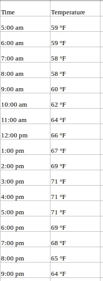

如果我们被要求预测未来几天的温度，我们将查看过去的值，并尝试测量和提取一个模式。我们会注意到温度在早上和晚上较低，而在下午达到峰值。此外，如果你有过去几年的数据，你会发现 11 月至 1 月期间天气较冷，而 4 月至 6 月相对较热。

这样的观察将有助于我们预测未来的价值。你是否注意到我们只使用了一个变量(过去两年的温度)？因此，这被称为单变量时间序列分析/预测。

# 1.2 多元时间序列

多元时间序列有多个时间相关变量。每个变量不仅依赖于它过去的值，还依赖于其他变量。这种相关性用于预测未来值。听起来很复杂？让我解释一下。

考虑上面的例子。现在假设我们的数据集包括排汗百分比、露点、风速、云量百分比等。以及过去两年的温度值。在这种情况下，需要考虑多个变量来优化温度预测。像这样的序列属于多元时间序列的范畴。下面是对此的说明:

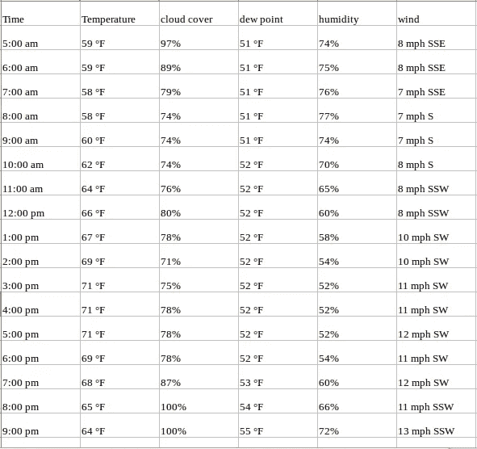

既然我们已经了解了多元时间序列是什么样的，那么让我们来了解如何使用它来建立预测。

# 2.处理多元时间序列——VAR

在本节中，我将向您介绍多元时间序列预测最常用的方法之一— **向量自回归(VAR)** 。

在 VAR 模型中，每个变量都是其自身和所有其他变量的过去值的线性函数。为了更好地解释这一点，我将使用一个简单的可视化示例:

我们有两个变量，y1 和 y2。我们需要根据过去 n 个值的给定数据，预测这两个变量在时间 t 的值。为简单起见，我认为滞后值为 1。

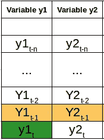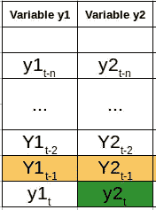

为了计算 y1(t)，我们将使用 y1 和 y2 的过去值。类似地，为了计算 y2(t ),将使用 y1 和 y2 的过去值。下面是表示这种关系的简单数学方法:

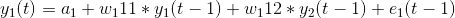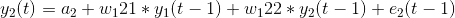

这里，

*   a1 和 a2 是常数项，
*   w11、w12、w21 和 w22 是系数，
*   e1 和 e2 是误差项

这些方程类似于 ar 过程的方程。由于 AR 过程用于单变量时间序列数据，因此未来值只是其过去值的线性组合。考虑 AR(1)过程:

*y(t) = a + w*y(t-1) +e*

在这种情况下，我们只有一个变量——y、一个常数项——a、一个误差项——e 和一个系数——w，为了在 VAR 的每个方程中包含多个变量项，我们将使用向量。我们可以将等式(1)和(2)写成以下形式:

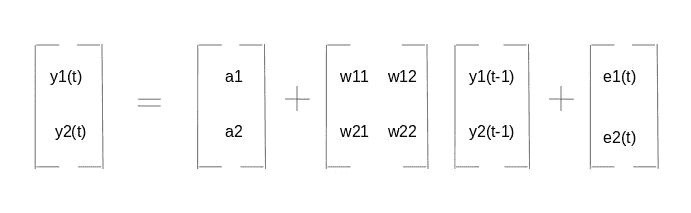

这两个变量是 y1 和 y2，后面是常数、系数度量、滞后值和误差度量。这是 VAR(1)过程的向量方程。对于 VAR(2)过程，另一个时间向量项(t-2)将被添加到等式中，以推广 p 滞后:

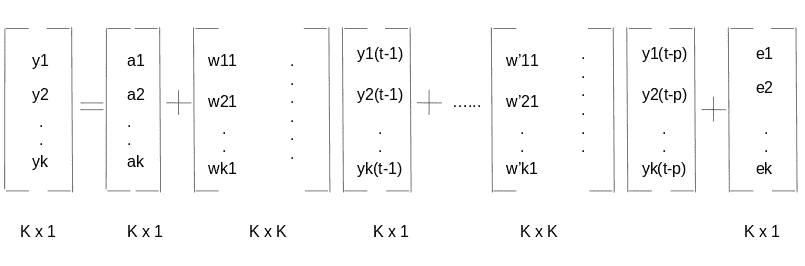

上面的等式表示变量为 y1，y2 …yk 的 VAR(p)过程。同样可以写成:

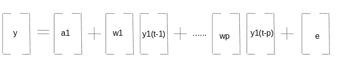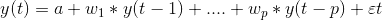

方程中的εt 项代表多元矢量白噪声。对于多元时间序列，εt 应该是满足以下条件的连续随机向量:

1.  E(εt) = 0
    误差向量的期望值为 0
2.  E(εt1，εT2 ')=σ12
    εt 的期望值，εt '是数列的标准差

# 3.我们为什么需要 VAR？

回想一下我们之前看到的气温预测的例子。可以提出一个论点，把它当作一个多单变量序列。我们可以使用 AR 等简单的单变量预测方法来解决这个问题。由于目标是预测温度，我们可以简单地移除其他变量(除了温度)并在剩余的单变量序列上拟合一个模型。

另一个简单的想法是使用我们已知的技术分别预测每个序列的值。这将使工作变得非常简单！那你为什么要学习另一种预测技术呢？这个话题还不够复杂吗？

从上面的等式(1)和(2)可以清楚地看出，每个变量都在使用每个变量的过去值来进行预测。与 AR 不同， **VAR 能够理解和利用几个变量之间的关系**。这有助于描述数据的动态行为，并提供更好的预测结果。此外，实现 VAR 与使用任何其他单变量技术一样简单(您将在最后一节中看到)。

# 4.多元时间序列的平稳性

通过研究单变量概念，我们知道平稳的时间序列通常会给我们一个更好的预测集。如果你不熟悉平稳性的概念，请先通读这篇文章:[处理非平稳时间序列的温和介绍](https://www.analyticsvidhya.com/blog/2018/09/non-stationary-time-series-python/)。

总而言之，对于给定的单变量时间序列:

*y(t) = c*y(t-1) + ε t*

若|c| < 1\. Now, recall the equation of our VAR process:

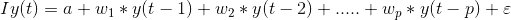

*的值为，则称该数列为平稳数列注:I 为单位矩阵。*

用[滞后算子](https://ocw.mit.edu/courses/economics/14-384-time-series-analysis-fall-2013/lecture-notes/MIT14_384F13_lec1.pdf)表示方程，我们有:

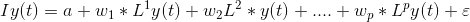

取左侧的所有 y(t)项:

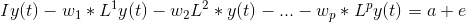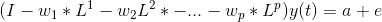

**y(t)的系数称为滞后多项式。**让我们将此表示为φ(L):

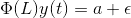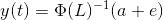

对于平稳的级数，|φ(L)-1 |的特征值在模中应小于 1。考虑到推导过程中变量的数量，这可能看起来很复杂。在下面的视频中，我们用一个简单的数字例子解释了这个想法。我强烈建议观看它来巩固你的理解:

类似于单变量序列的增强 Dickey-Fuller 检验，我们有 Johansen 检验来检查任何多变量时间序列数据的平稳性。我们将在本文的最后一节看到如何执行测试。

# 5.训练-验证分割

如果您以前处理过单变量时间序列数据，您会知道训练验证集。创建验证集的目的是在使用模型进行预测之前分析模型的性能。

为时间序列问题创建一个验证集是很棘手的，因为我们必须考虑时间因素。不能直接使用 *train_test_split* 或 *k 倍*验证，因为这将破坏系列中的模式。创建验证集时应考虑日期和时间值。

假设我们必须预测气温、露点、云量等。在接下来的两个月里使用过去两年的数据。一种可能的方法是将最后两个月的数据放在一边，并在剩余的 22 个月中训练模型。

一旦模型经过训练，我们就可以用它来对验证集进行预测。基于这些预测和实际值，我们可以检查模型的表现如何，以及模型表现不佳的变量。为了进行最终预测，请使用完整的数据集(组合训练集和验证集)。

# 6.Python 实现

在本节中，我们将在玩具数据集上实现向量 AR 模型。我为此使用了空气质量数据集，你可以从[这里](https://archive.ics.uci.edu/ml/datasets/Air+Quality)下载。

```
#import required packages
import pandas as pd
import matplotlib.pyplot as plt
%matplotlib inline

#read the data
df = pd.read_csv("AirQualityUCI.csv", parse_dates=[['Date', 'Time']])

#check the dtypes
df.dtypesDate_Time        object
CO(GT)            int64
PT08.S1(CO)       int64
NMHC(GT)          int64
C6H6(GT)          int64
PT08.S2(NMHC)     int64
NOx(GT)           int64
PT08.S3(NOx)      int64
NO2(GT)           int64
PT08.S4(NO2)      int64
PT08.S5(O3)       int64
T                 int64
RH                int64
AH                int64
dtype: object
```

*日期时间*列的数据类型是*对象*，我们需要将其更改为*日期时间*。此外，为了准备数据，我们需要索引具有*日期时间*。遵循以下命令:

```
df['Date_Time'] = pd.to_datetime(df.Date_Time , format = '%d/%m/%Y %H.%M.%S')
data = df.drop(['Date_Time'], axis=1)
data.index = df.Date_Time
```

下一步是处理丢失的值。由于数据中缺失的值被替换为值-200，我们将不得不用一个更好的数字来估算缺失的值。考虑到这一点——如果当前露点值缺失，我们可以有把握地假设它将接近前一小时的值。有道理，对吧？在这里，我将用以前的值估算-200。

您可以选择使用之前几个值的平均值替换该值，或者使用前一天同一时间的值(您可以在下面的评论部分分享您对输入缺失值的想法)。

```
#missing value treatment
cols = data.columns
for j in cols:
    for i in range(0,len(data)):
       if data[j][i] == -200:
           data[j][i] = data[j][i-1]

#checking stationarity
from statsmodels.tsa.vector_ar.vecm import coint_johansen
#since the test works for only 12 variables, I have randomly dropped
#in the next iteration, I would drop another and check the eigenvalues
johan_test_temp = data.drop([ 'CO(GT)'], axis=1)
coint_johansen(johan_test_temp,-1,1).eig
```

下面是测试的结果:

```
array([ 0.17806667,  0.1552133 ,  0.1274826 ,  0.12277888,  0.09554265,
        0.08383711,  0.07246919,  0.06337852,  0.04051374,  0.02652395,
        0.01467492,  0.00051835])
```

现在，我们可以继续创建适合模型的验证集，并测试模型的性能:

```
#creating the train and validation set
train = data[:int(0.8*(len(data)))]
valid = data[int(0.8*(len(data))):]

#fit the model
from statsmodels.tsa.vector_ar.var_model import VAR

model = VAR(endog=train)
model_fit = model.fit()

# make prediction on validation
prediction = model_fit.forecast(model_fit.y, steps=len(valid))
```

预测以数组的形式出现，其中每个列表代表该行的预测。我们将把它转换成一种更好看的格式。

```
#converting predictions to dataframe
pred = pd.DataFrame(index=range(0,len(prediction)),columns=[cols])
for j in range(0,13):
    for i in range(0, len(prediction)):
       pred.iloc[i][j] = prediction[i][j]

#check rmse
for i in cols:
    print('rmse value for', i, 'is : ', sqrt(mean_squared_error(pred[i], valid[i])))
```

上面代码的输出:

```
rmse value for CO(GT) is :  1.4200393103392812
rmse value for PT08.S1(CO) is :  303.3909208229375
rmse value for NMHC(GT) is :  204.0662895081472
rmse value for C6H6(GT) is :  28.153391799471244
rmse value for PT08.S2(NMHC) is :  6.538063846286176
rmse value for NOx(GT) is :  265.04913993413805
rmse value for PT08.S3(NOx) is :  250.7673347152554
rmse value for NO2(GT) is :  238.92642219826683
rmse value for PT08.S4(NO2) is :  247.50612831072633
rmse value for PT08.S5(O3) is :  392.3129907890131
rmse value for T is :  383.1344361254454
rmse value for RH is :  506.5847387424092
rmse value for AH is :  8.139735443605728
```

在对验证集进行测试之后，让我们在完整的数据集上拟合模型

```
#make final predictions
model = VAR(endog=data)
model_fit = model.fit()
yhat = model_fit.forecast(model_fit.y, steps=1)
print(yhat)
```

# 结束注释

在我开始这篇文章之前，处理多变量时间序列的想法在其范围内似乎令人生畏。这是一个复杂的话题，所以要花时间了解细节。最好的学习方法是实践，所以我希望上面的 Python 实现对你有用。

我建议你在自己选择的数据集上使用这种方法。这将进一步巩固你对这个复杂却非常有用的话题的理解。如果你有任何建议或疑问，请在评论区分享。

*原载于 2018 年 9 月 27 日*[*【www.analyticsvidhya.com】*](https://www.analyticsvidhya.com/blog/2018/09/multivariate-time-series-guide-forecasting-modeling-python-codes/)*。*