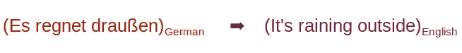
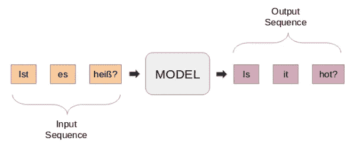
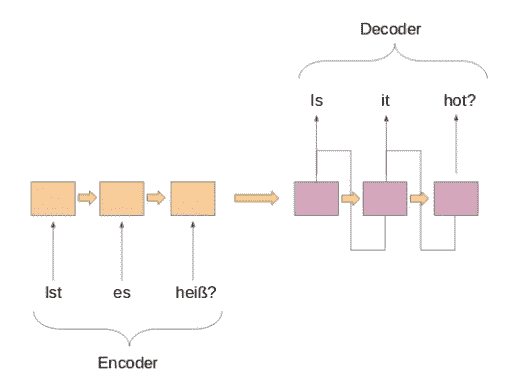
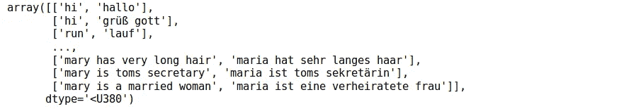
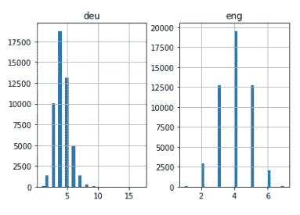
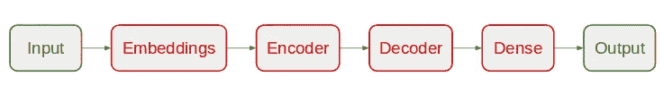
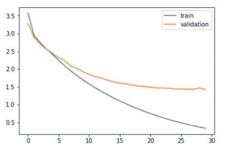
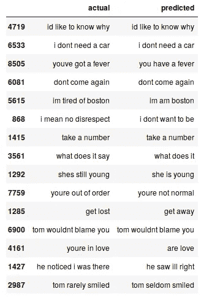

# 关于神经机器翻译的必读 NLP 教程——支持谷歌翻译的技术

> 原文：<https://medium.com/analytics-vidhya/a-must-read-nlp-tutorial-on-neural-machine-translation-the-technique-powering-google-translate-c5c8d97d7587?source=collection_archive---------0----------------------->


> “如果你用一个人能理解的语言和他交谈，那会让他头脑发热。如果你用他自己的语言和他交谈，那会触及他的内心。”纳尔逊·曼德拉

语言之美超越国界和文化。学习母语以外的语言是一个巨大的优势。但是通往双语或多语的道路往往是漫长的，永无止境的。

有如此多的细微差别，以至于我们迷失在文字的海洋中。然而，有了在线翻译服务，事情变得简单多了(我正看着你谷歌翻译！).

我一直想学一门英语以外的语言。早在 2014 年，我就尝试过学习德语。这既有趣又有挑战性。我最终不得不退出，但我怀有重新开始的愿望。


快进到 2019 年，我很幸运能够为任何可能的语言对构建一个语言翻译器。自然语言处理是多么大的一件好事啊！

在本文中，我们将介绍使用 Keras 构建德语到英语语言翻译模型的步骤。我们还将借助后见之明，快速浏览一下机器翻译系统的历史。

本文假设读者熟悉 RNN、LSTM 和喀拉斯。下面是几篇关于它们的文章:

*   [*递归神经网络简介*](https://www.analyticsvidhya.com/blog/2017/12/introduction-to-recurrent-neural-networks/)
*   [*长短期记忆简介*](https://www.analyticsvidhya.com/blog/2017/12/fundamentals-of-deep-learning-introduction-to-lstm/)

# 目录

1.  理解问题陈述
2.  序列间预测简介
3.  使用 Keras 在 Python 中实现

# 理解问题陈述

让我们回到我们在引言部分停止的地方，即学习德语。然而，这一次我将让我的机器来完成这项任务。**目标是使用神经机器翻译(NMT)系统将德语句子转换成英语句子。**



我们将使用来自 http://www.manythings.org/anki/的德语-英语句子对数据。你可以从[这里](http://www.manythings.org/anki/deu-eng.zip)下载。

# 序列间(Seq2Seq)建模简介

序列到序列(seq2seq)模型用于各种 NLP 任务，例如文本摘要、语音识别、DNA 序列建模等。我们的目标是把给定的句子从一种语言翻译成另一种语言。

在这里，输入和输出都是句子。换句话说，这些句子是一系列进出模型的单词。这是序列到序列建模的基本思想。下图试图解释这种方法。



**典型的 seq2seq 模型有两个主要组成部分—**

a)编码器
b)解码器

这两个部分本质上是两个不同的递归神经网络(RNN)模型组合成一个巨大的网络:



我在下面列出了序列到序列建模的几个重要用例(当然除了机器翻译):

*   语音识别
*   命名实体/主题提取从文本主体中识别主要主题
*   关系分类用于标记在上述步骤中标记的各种实体之间的关系
*   聊天机器人技能，具备对话能力并与客户互动
*   文本摘要生成大量文本的简明摘要
*   问答系统

# 使用 Keras 在 Python 中实现

是时候把手弄脏了！没有比通过亲眼看到结果来学习一个话题更好的感觉了。我们将启动我们最喜欢的 Python 环境(对我来说是 Jupyter 笔记本),然后直接进入正题。

# 导入所需的库

# 将数据读入我们的 IDE

我们的数据是一个文本文件。txt)的英德句子对。首先，我们将使用下面定义的函数读取文件。

让我们定义另一个函数，将文本分割成由' \n '分隔的英语-德语对。然后我们将这些句子分别分成英语句子和德语句子。

我们现在可以使用这些函数将文本以我们想要的格式读入一个数组。

```
data = read_text("deu.txt") 
deu_eng = to_lines(data) 
deu_eng = array(deu_eng)
```

**实际数据包含超过 150，000 个句子对。但是，我们将只使用前 50，000 个句子对来减少模型的训练时间。**你可以根据你系统的计算能力改变这个数字(或者如果你觉得幸运的话！).

```
deu_eng = deu_eng[:50000,:]
```

# 文本预处理

这在任何项目中都是非常重要的一步，尤其是在 NLP 中。我们处理的数据通常是非结构化的，因此在进入模型构建部分之前，我们需要注意一些事情。

**(一)文字清理**

先来看看我们的数据。这将帮助我们决定采用哪些预处理步骤。

```
deu_eng
```



我们将去掉标点符号，然后将所有文本转换成小写。

**(b)文本到序列的转换**

Seq2Seq 模型要求我们将输入和输出句子都转换成固定长度的整数序列。

但在此之前，让我们想象一下句子的长度。我们将分别在英语和德语的两个单独的列表中捕获所有句子的长度。



非常直观——德语句子的最大长度是 11 个，英语短语的最大长度是 8 个。

接下来，通过使用 Keras 的 *Tokenizer()* 类对我们的文本数据进行矢量化。它会把我们的句子变成整数序列。然后，我们可以用零填充这些序列，使所有的序列长度相同。

请注意，我们将为德语和英语句子准备标记符:

下面的代码块包含一个准备序列的函数。如上所述，它还将执行序列填充到最大句子长度。

# 模型结构

我们现在将数据分为训练集和测试集，分别用于模型训练和评估。

该给句子编码了。我们将编码**德语句子作为输入序列**，编码**英语句子作为目标序列**。对于训练和测试数据集都必须这样做。

激动人心的部分来了！

我们将从定义 Seq2Seq 模型架构开始:

*   对于编码器，我们将使用嵌入层和 LSTM 层
*   对于解码器，我们将使用另一个 LSTM 层，然后是一个密集层



我们在这个模型中使用 RMSprop 优化器，因为当使用递归神经网络时，它通常是一个很好的选择。

请注意，我们使用了'*sparse _ categorial _ cross entropy*'作为损失函数。这是因为该函数允许我们按原样使用目标序列，而不是一键编码格式。使用如此庞大的词汇对目标序列进行一次性编码可能会消耗我们系统的全部内存。

我们都准备好开始训练我们的模型了！

**我们将对其进行 30 个时期的训练，批次大小为 512，验证分割为 20%。** 80%的数据将用于训练模型，其余用于评估模型。你可以改变和摆弄这些超参数。

我们还将使用 **ModelCheckpoint()** 函数来保存验证损失最低的模型。我个人更喜欢这种方法，而不是提前停止。

让我们比较一下训练损失和验证损失。

```
plt.plot(history.history['loss']) plt.plot(history.history['val_loss']) plt.legend(['train','validation']) 
plt.show()
```



从上面的图中可以看出，20 个时期后，验证损失停止下降。

最后，我们可以加载保存的模型，并对看不见的数据——testX 进行预测。

这些预测是整数序列。我们需要将这些整数转换成相应的单词。让我们定义一个函数来做这件事:

将预测转换成文本(英语):

让我们将原始英语句子放入测试数据集中，将预测的句子放入数据帧中:

```
pred_df = pd.DataFrame({'actual' : test[:,0], 'predicted' : 
                        preds_text})
```

我们可以随机打印一些实际和预测的实例，看看我们的模型表现如何:

```
# print 15 rows randomly 
pred_df.sample(15)
```



我们的 Seq2Seq 模型做得不错。但是有几个例子，它错过了理解关键词。例如，它将“我厌倦了波士顿”翻译成“我是波士顿”。

这些是你在 NLP 中经常会遇到的挑战。但是这些并不是不可逾越的障碍。我们可以通过使用更多的训练数据和建立更好(或更复杂)的模型来缓解这些挑战。

**访问完整代码** [**此处**](https://github.com/prateekjoshi565/machine_translation/blob/master/german_to_english.ipynb) **。**

# 结束注释

即使使用非常简单的 Seq2Seq 模型，结果也相当令人鼓舞。通过在更大的数据集上使用更复杂的编码器-解码器模型，我们可以很容易地提高这种性能。

我能想到的另一个实验是在包含较长句子的数据集上尝试 seq2seq 方法。你尝试的越多，你对这个广阔而复杂的空间了解的就越多。

*欢迎致电****prateekjoshi565@gmail.com****联系我，进行一对一讨论。*

*原载于 2019 年 1 月 31 日*[*www.analyticsvidhya.com*](https://www.analyticsvidhya.com/blog/2019/01/neural-machine-translation-keras/)T22。