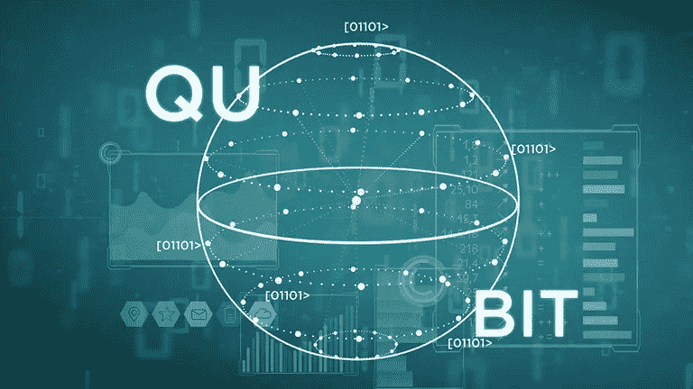
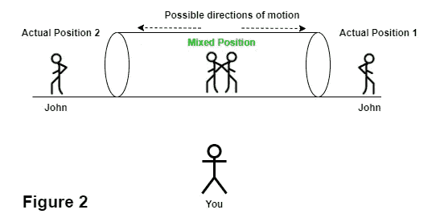
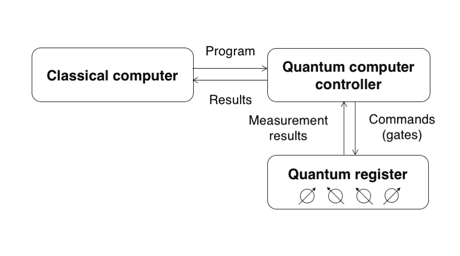
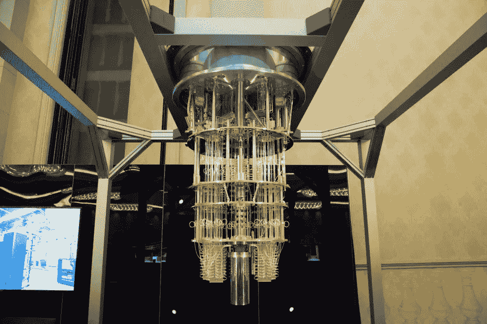

# 理解量子计算世界的天真方法

> 原文：<https://medium.com/analytics-vidhya/a-na%C3%AFve-approach-to-understand-the-world-of-quantum-computing-5e23f606798a?source=collection_archive---------16----------------------->

图片来源:www.machinedesign.com

> “DNA 是一台量子计算机，它将非局部无所不在的意识或精神定位到时空能量信息和物质中。”
> 
> ——狄巴克·乔布拉

如果你想探索量子计算世界，那么你来对地方了。这篇文章将帮助你了解这个高科技领域，从起源到当前的趋势。它是用最简单的方式写的，这样一个非技术人员也能理解它。

想象有一根 10 英尺高、20 英尺宽的金属管放在一块地上。你正站在那根管子前面。无论管道里发生了什么，你都看不见。你让你的朋友约翰走过管道。约翰同意了，开始走路。你期望约翰的运动方向朝向你的右手边。可以预期他在如下图 1 所示的预期位置。

但是这里没有更多的情况重要。如果约翰开始走在金属管里，他想回来怎么办？

参考图 2 可以很好地理解这一点。这里有三种可能性:

*   可以预期他在实际位置 1，如下图 2 所示(这是图 1 中的预期位置)。
*   在实际位置 2，因为他可以认为回来。
*   混合姿势是指他实际上在决定向右走还是向左走。可以说，在这个位置上，他既向左走，也向右走。

现在记住你的朋友约翰，探索量子计算世界的概念。

# 量子计算机

尽管量子计算始于 20 世纪 80 年代早期，当时[保罗·贝尼奥夫](https://en.wikipedia.org/wiki/Paul_Benioff)提出了一个量子力学模型，即[图灵机](https://plato.stanford.edu/entries/turing-machine/)、[、大卫·多伊奇、](https://en.wikipedia.org/wiki/David_Deutsch)、**、牛津大学理论物理学家**、**、**被誉为量子计算之父。

> 简而言之，量子计算机是一种利用量子力学现象的计算机，因此它可以比普通计算机更有效地执行某些类型的计算。量子计算机被用来执行这种计算，这可以在理论上或物理上实现。

我们一直使用的计算机被称为经典计算机。它们对**位** (0 或 1)进行操作，而在量子计算中，我们使用**量子位** (|0⟩,|1⟩或 x1|1⟩+x2|0⟩).)来表示状态量子比特也被称为**量子比特**或**量子比特**。|0⟩,|1⟩,|0000⟩,|10111⟩等。被称为**计算基向量**。

除了高(state_a 或 1)和低(state_b 或 0)状态，量子计算机还具有变化的状态，其包括一定百分比的高和低状态，并且在包括一些环境和机械约束之后，该状态可以保持不变。在量子计算中，我们将这种变化状态命名为**叠加态**。它可以表示为，

|ψ⟩被称为**狄拉克符号**，在这里它代表**一个量子比特**。x1 和 x2 被称为**振幅**。

*x1 和 x2 的大小分别是处于初态和终态的概率的平方根。*

通过下面的表达式可以更好地理解它。

在上面的例子中，我们处理了一个量子位。两个量子位可以表示为，

|ψ1⟩和|ψ2⟩分别是第一和第二个量子比特。这样我们可以表示两个量子比特系统。

所以可以得出结论 **n 个量子比特有 2^n 计算基矢**。我们观察到一个量子比特能够代表两种状态。在两个量子比特中，我们有 4 个状态。类似地 **2^n 态可以用 n 个量子比特来表示**。

量子比特之间的关联称为**量子** **纠缠**。这种关系存在于系统的可观测的物理性质中。

让我们回忆一下我们的朋友约翰——顺便说一下，我为这篇文章创造了他——我们将通过类比来理解上面提到的一些必要的概念。低(0)和高(1)状态可以分别被认为是约翰的起始位置和期望位置。在混合位置，我们可以说他处于叠加态。在这种状态下，他在考虑向实际位置 1(相当于预期位置)以及向实际位置 2(相当于起始位置)行走。他的行为就像一个量子比特，同时具有两种状态。

现在你已经理解了量子计算世界的基本概念，你有资格继续阅读。如果你没有正确理解以上概念，我建议你再读一遍。

# 基础建筑

量子计算机长什么样？它像个人电脑吗？还是类似于笔记本电脑？

你的问题没有一个是对的。量子计算机与笔记本电脑和个人电脑(PC)完全不同。

量子计算机的架构|图片来源:www.futurelearn.com

我们可以说，量子计算机是经典计算机与量子部件的结合，其中量子部件充当协处理器来执行经典处理器无法解决的非常大的运算。

量子计算机的架构意味着其部件的有效排列。每台计算机都遵循三个基本规则:

1.  应给出输入命令
2.  应根据要求进行加工
3.  获得预期的输出

> "如果你提供了一个模糊的输入，那么你将不会得到你所期望的输出."

这是一台 50 量子比特的量子计算机的样子|图片来源:www.engadget.com

在量子计算机中，量子寄存器被用作**存储器**。该寄存器进一步划分为子寄存器，以最大化存储效率。

**量子门**的作用类似经典逻辑门，用于实现**输入指令**。**输出数据**的生成速率取决于操作类型。一些操作需要较少的处理，因此输出的生成会更快，反之亦然。

## 量子编程

想在量子计算机上运行你的代码吗？你认为，对于那些没有量子计算机的人来说，这可能吗？

是的，你可以编写代码，这些代码可以通过云在量子处理器上执行。

如果你很兴奋能获得量子编程的 hello world 体验。查看我的 [**Github 库**](https://github.com/sk-sharique/QuantumComputing) 。在 Google Colab 上运行代码。我已经在 IBM Q 量子处理器上使用 Qiskit 框架运行了量子代码。跟随[库](https://github.com/sk-sharique/QuantumComputing)中的命令和代码，体验量子编程的味道。

在量子计算机中，计算电路模型是基于某些算法创建的。最著名的算法是 Shor 的因子分解算法和 Grover 的搜索非结构化数据库或无序列表的算法。

# 量子优势

当量子计算机在解决某种问题上击败最聪明的经典计算机时，可以说量子优势已经实现。

2019 年 10 月，谷歌的量子计算机 [**梧桐**](https://ai.googleblog.com/2019/10/quantum-supremacy-using-programmable.html) 可以实现量子至上。

可以点击[这里](https://www.youtube.com/watch?v=-ZNEzzDcllU)详细了解量子至上。是谷歌学者解释的。

# 量子计算项目

你可以在 Kaggle、Github 或他们的网站上找到 IBM、微软、谷歌和该领域一些伟大的初创公司在量子计算方面不同类型的实时和开源项目。下面提到了几个受欢迎的项目。

1.  [Q#](https://www.microsoft.com/en-us/quantum/development-kit)
2.  [Qiskit](https://qiskit.org/)
3.  [Cirq](https://github.com/quantumlib/Cirq)
4.  [森林](https://github.com/rigetti/pyquil)
5.  [海洋](https://github.com/dwavesystems/dwave-ocean-sdk)

# 量子计算的应用

1.  **人工智能:**量子技术帮助机器更准确、快速、高效地学习。
2.  **财务模型:**预测价格变化变得容易。可以更准确地分析需求和供应相关性。
3.  **药物设计:**量子比特的动态特性有助于为各种疾病选择合适的药物。
4.  **密码术:**由于它的多状态性质，它在处理安全性时提供了巨大的特性。
5.  天气预报:可以建立更好的气候模型。在此基础上，我们可以决定为了更美好的未来要采取的步骤。
6.  **问题优化:**有了量子计算机，我们可以处理无数的排列组合。
7.  **分子建模:**化学反应本质上是量子的，因为它们形成高度纠缠的量子叠加态。但是完全发展的量子计算机在评估最复杂的过程时不会有任何困难。
8.  **电路、软件和系统故障模拟:**当一个人开发具有数百万行代码的大型软件程序或具有数十亿个晶体管的大型 [ASIC 芯片](https://en.wikipedia.org/wiki/Application-specific_integrated_circuit)时，验证它们的正确性会变得非常困难和昂贵。可能有数十亿或数万亿种不同的状态，经典计算机不可能在模拟中检查每一种状态。

# 量子计算机工程师职业道路

以下是成为量子计算机工程师所需的一些技能。

1.  你应该知道如何在经典计算机上编程。
2.  有计算机硬件工作经验者优先。
3.  学习量子力学和量子物理。
4.  研究了很多研究论文。
5.  开始研究量子算法。与此同时，你可以读几本涵盖你感兴趣的领域的好书。
6.  尝试加入这个领域的一个大巨头。下面提到了其中的一些。

*   国际商业机器公司
*   谷歌有限责任公司
*   d 波
*   美国英特尔公司(财富 500 强公司之一ˌ以生产 CPU 芯片著称)
*   IonQ
*   阿里云
*   微软(Azure 量子)
*   阿尔卑斯量子技术公司(AQT)
*   里盖蒂
*   雷神公司

由于这个领域现在正处于实验和发展阶段，有许多创业公司正在前进。你也可以开始和他们一起工作。

下面列出了几所活跃在量子计算领域的大学。

1.  沃特卢大学量子计算研究所
2.  牛津大学
3.  新加坡国立大学和南洋理工大学量子技术中心
4.  麻省理工学院理论物理中心
5.  马里兰大学-联合量子研究所
6.  加州大学伯克利分校
7.  芝加哥大学-芝加哥量子交易所(CQE)

# 量子计算的未来

量子计算的未来似乎一片光明。这项技术具有改变世界的力量，这将有益于全人类。

正常的手在 30 到 50 年后就能使用这个神奇的装置了。建造一台量子计算机花费很大。如今，这项技术正处于发展阶段，只有少数公司在确定的恒定环境条件下使用。