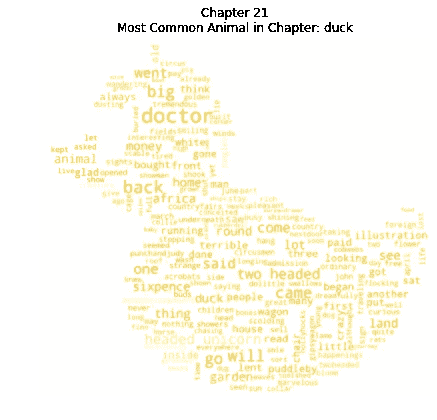

# 休·洛夫汀的《怪医杜立德》的自然语言处理之旅

> 原文：<https://medium.com/analytics-vidhya/a-natural-language-processing-journey-of-hugh-loftings-doctor-dolittle-18e63375bdb4?source=collection_archive---------16----------------------->

## 使用网络抓取、NLTK、wordcloud 和情感分析的教程


图片来源于[维基百科](https://simple.wikipedia.org/wiki/The_Story_of_Doctor_Dolittle)

这是来自 [Data Dolittle](https://datadolittle.com/) 的第一篇文章，这是一家数据分析公司，旨在帮助其他数据科学家和企业从他们的数据中获取洞察力。有什么比使用 Hugh Lofting 的 Doctor Dolittle 的自然语言处理(NLP)教程更好的开始方式呢？为了讲述 NLP 的故事，我们将使用 python 3.7、nltk、requests、string、PIL(可选)、wordcloud(可选)和 bs4。整个工作流程可以在[**Data Dolittle GitHub**](https://github.com/Datadolittle/drdolittlenlp)中找到。现在让我们开始:

## 目标:

很久以前，在第一次世界大战的战壕里有一个士兵。战争的恐怖沉重地压在他的肩上。日复一日，他在危险的环境中遭受最残酷的对待。是他的小女儿打破了艰苦的阵地战，给了他继续战斗的理由。与士兵的女儿短暂而不频繁的交流让士兵渴望以更有意义的方式参与进来。士兵想为他的女儿创造一个世界，一个比他生活的现实更好的世界。这个士兵创造了一个独一无二的英雄，一个所有传统上沉默的动物的英雄。这位士兵的名字叫休·洛夫汀，在创造杜立德医生的过程中，休创造了一个世界，为他的女儿和全世界无数其他儿童提供希望。杜立德医生为作者和目标观众提供了一个逃避的机会。休构想了一个完美的田园小镇 Puddleby-on-the-Marsh 作为开场设定，带领主角踏上前往遥远国度的奇幻之旅，同时与引人入胜的角色进行独特的互动。正是这些性格，让我们的好医生与众不同。

你看，杜立德医生被他信任的翻译波里尼西亚教授动物语言的秘密。波利尼西亚是一种既能说人话又能说动物话的鹦鹉。医生新获得的技能导致他为了保护全球的动物而疏远人类。这种远离人性的关注可能是对休在战壕中的人类经历的回应。在这里我们探索休想象世界的细节，探索使用的语言，章节的情绪，每种动物出现的频率，并尝试将史料与章节匹配，以搜索战壕中隐藏的信息。跟随我们一起踏上杜立德医生的世界！

## 正文:

我们从课文开始我们的故事。我们的旅程得益于古登堡计划提供的在线历史文献。这些高贵的知识管理者记录了涉及我们的好医生的出版物。为了检索文本，我们可以选择三个路径中的一个。首先，我们的英雄可以从认证的图书销售商那里购买 pdf 格式的图书。第二，我们的英雄可以直接从古腾堡计划下载文本，并将它们放在名为“数据”的文件夹中。最后，我们的英雄可以选择参与网络抓取。这是一个最困难的任务，但你作为我们的英雄肯定能完成！主人公可以通过遵循下面的命令图来执行网络搜集:

遵循这三条路径中的一条，我们的英雄应该会创建一个名为“data”的文件夹，将这本书存储为文本文件。

## 语言

休的故事面向年轻观众，因此我们可以期待更简单的语言和更简单的词汇。让我们使用下面的代码在文本中搜索不带连字符的最长单词:

最长的一个单词是 cutterigsloop，是猪 Gub-Gub 的发音错误。文中最长的一个实词是爷爷们。使用 Flesch-Kincaid 等级级别计算文本的可读性:

《怪医杜立德》的 Flesch_Kincaid 等级水平是:7.37。啊，我们发现了课文中最可怕的单词和难度。现在，我们应该看看还有多少其他独特的词伴随着这些怪物。这项任务并不像看起来那么简单，因为你看，有许多相同和不同的单词，使得计算每个独特的单词很困难。我这么说是什么意思？当然，我们的英雄理解单词 hard 和 hard 的意思非常相似，因为它们都描述了任务的难度或材料的强度，但简单的计数会考虑这两个不同的单词。为了改变文本，使相似的单词可以被识别，我们使用了一个叫做词汇化的过程。

在考虑了相似的单词后，我们的英雄必须去掉那些常用但意义不大的单词。停用词是对诸如**、**、**、**、**、**等词的称呼。刷掉频繁停用词的灰尘，我们剩下的是独特文本的黄金。下面的代码删除了停用词，并帮助我们的英雄完成文本中有多少独特的词。


《怪医杜立德》中丰富的前 25 个单词

唯一单词的数量是 2131。当我们绘制最频繁出现的单词时，我们看到分布遵循 Zipf 定律，这意味着最丰富的单词经常出现。这位好医生在故事里说了很多。像 **chee** 这样的词是什么，为什么它们出现得如此频繁？它们是动物名称的一部分。让我们将动物名称转换成动物种类，以获得分布的另一个视图。动物物种应该在分布中下移，因为在像 Chee Chee 这样的名字中，Chee 这个词被重复计算了两次。《杜立德故事》中的动物名字取自[维基百科](https://en.wikipedia.org/wiki/List_of_Doctor_Dolittle_characters)。

## 动物们


《怪医杜立德》中前 25 种动物的丰富程度

杜立德医生与 68 种不同的动物互动。在故事中，医生确实和很多小动物有过互动。哪些动物在每一章中都扮演了凝视的角色？为了形象化这一点，我们将把文本分成章节，找到最丰富的动物，然后使用蒙版和 wordcloud 包创建一个动物形状的 wordcloud。



单词 cloud 来自第 21 章，动物的形状在那一章中最为丰富。你能在 wordcloud 里找到 duck 这个词吗？

我们已经了解了很多关于医生朋友的事情。让我们跨章节探讨一下故事的感悟吧！

## 情绪

我们将用 [VADER](http://datameetsmedia.com/vader-sentiment-analysis-explained/) 来探究每一章的感悟。值越接近 1 意味着情绪越积极，而值越接近-1 意味着情绪越消极。

```
Sentiment of Chapter 1: 0.0296
Sentiment of Chapter 2: 0.828
Sentiment of Chapter 3: -0.962
Sentiment of Chapter 4: 0.982
Sentiment of Chapter 5: 0.989
Sentiment of Chapter 6: -0.953
Sentiment of Chapter 7: 0.99
Sentiment of Chapter 8: -0.924
Sentiment of Chapter 9: 0.987
Sentiment of Chapter 10: 0.999
Sentiment of Chapter 11: -0.996
Sentiment of Chapter 12: 0.998
Sentiment of Chapter 13: 0.957
Sentiment of Chapter 14: 0.989
Sentiment of Chapter 15: -0.987
Sentiment of Chapter 16: 0.983
Sentiment of Chapter 17: -0.0294
Sentiment of Chapter 18: 0.981
Sentiment of Chapter 19: -0.946
Sentiment of Chapter 20: 1
Sentiment of Chapter 21: 0.99
```

为了了解 Hugh Lofting 是否在文本中隐藏了与战争有关的信息，我们在故事中搜索了这一时期常见的战争术语列表。在名为 war_Terms.txt 的文件中编译了一个 War 单词列表。在文本中搜索该列表，并打印包含感兴趣的单词的任何句子以理解上下文。

故事中使用的战争术语数量:5。这五个词是火、氯、芥末、烟和死亡。使用循环提取包含战争词汇的句子，休·洛夫廷似乎没有暗示任何战争的恐怖。总的来说，这个故事的平均 VADER 情绪是 0.329，或者大部分是积极的。在 21 个章节中，几乎三分之二的章节有着压倒性的积极情绪。这和其他儿童小说相比如何？试试彼得潘，把文本变成网页碎片，变成 http://www.gutenberg.org/files/16/16-0.txt 的文本。**提示* *网页抓取代码块使用杜立德医生故事的结构来删除多余的信息。你会如何改变它来和彼得潘一起工作？

[回答这里](https://gist.github.com/glickmac/1592f8a038678cc00412f40a8565fa99)

## 回顾

我们进行了网络抓取来捕捉怪医杜立德。我们已经使用 NLTK 分析了文本。我们的冒险让我们详细描述了故事中独特单词的数量，最长的单词，以及文本的可读性。我们发现了这位好医生与多少动物互动，以及每章中最常提到的动物。我们探究了每一章的情感，发现休·洛夫汀善于将他的战争经历与他的幻想故事分开。整个工作流程可以在[**Data Dolittle GitHub**](https://github.com/Datadolittle/drdolittlenlp)中找到。我的个人 LinkedIn 位于 https://www.linkedin.com/in/codyglickman/。