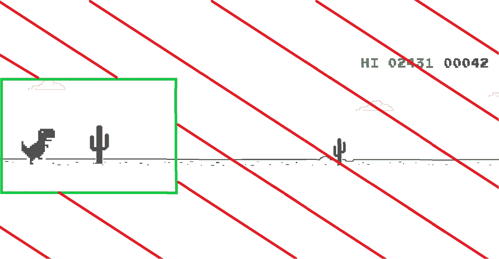

# 玩 Chrome dino 游戏的神经网络

> 原文：<https://medium.com/analytics-vidhya/a-neural-net-that-plays-the-chrome-dino-game-95c98a61257b?source=collection_archive---------14----------------------->

在某些时候，我们都遇到过这个页面，你可能试图修复你的互联网，或按空格键玩游戏。然而，我和普里特维·阿尼尔·库马尔试图训练一个模型自己玩这个游戏。

把“chrome://dino”放在 chrome 上玩游戏

# 手头的任务:

1.  自动化数据收集流程
2.  制作一个简单的网络
3.  创建一个脚本来实时预测和行动

# 创建数据集

这是我们想出来的[剧本](https://github.com/Shreyas-MS/DinoNet/blob/master/Training/Create_Dataset.py)，你可以跟着看。

为了创建数据集，我们必须注意两件事:

*   截图
*   记录键盘输入

我们尝试了几个模块来截图，在 [pyscreenshot](https://pypi.org/project/pyscreenshot/) 、 [pyautogui](https://pypi.org/project/PyAutoGUI/) 和 [pillow](https://pypi.org/project/Pillow/) 中，我们能够最快地从 pillow 中获取截图。当截图并立即保存图像时，我们得到了一个可怕的帧速率，通常低于每秒一张图片(1080*1920 图像保存为。png)。为了解决这个问题，我们决定将图像保存在 RAM 中，稍后保存到磁盘。现在我们平均每 0.07 秒或 14.28 FPS 就能截图一次。由于内存错误，我们的脚本在保存图像之前就会崩溃。这个问题很容易解决，方法是将图像大小调整为 216*384，然后保存到 ram 中。

记录 keyinput 非常简单，我们使用了[键盘包](https://pypi.org/project/keyboard/)来记录输入并将图像保存在它所属的文件夹中。

# 模型

你可以跟着[到这里](https://github.com/Shreyas-MS/DinoNet/tree/master/Pynotebooks)

我们从一个简单的类似 LeNet-5 的架构开始，不幸的是这个模型的表现比第一次玩的玩家差。对我们来说，这些预测似乎是随机的。最后，我们增加了完全连接层的数量，并对初始 Conv 层的过滤器大小和数量进行了调整。当我们看到我们的模型能够达到高达 98.05%的准确率时，我们非常高兴！然而，当我们试图在预测脚本中运行它时，我们的恐龙每次都会碰到第一棵仙人掌。

我们很快意识到，我们有一个学习预测 0 类的模型，这实际上是我们数据的 98.05%。这是我们开始了解不平衡数据集的时候。

## 不平衡数据

什么是不平衡数据？当你的大部分数据属于一个类，并盖过了其他少数类时，就是这样。对于一个模型来说，学习预测多数类并以较低的损失和良好的准确性逃脱是非常常见的。

让我们用一个更好的例子来理解这个问题。让我们假设有一种疾病存在于所有人中的 0.1%。如果有人制作了一个准确率达到 99.9%的机器学习模型，这本身不应该成为医院选择他的模型的衡量标准。一个模型可以非常容易地获得这种准确性，只需每次预测都是负面的，最终达到 99.9%的准确性。这将是一个可怕的模型！你真正应该寻找的是精确和回忆。

精准 Vs 召回。[创作者](https://commons.wikimedia.org/wiki/User:Walber)和[来源](https://en.wikipedia.org/wiki/File:Precisionrecall.svg)

有时一个模型得到更好的精确度，而另一个可能得到更好的回忆。在这种情况下，你应该用 F1 分数来判断哪个型号更好。

F1 得分= 2*(精确度*召回率)/(精确度+召回率)

如何修复不平衡的数据:

*   欠采样多数类
*   过采样少数类
*   类别权重

前两种方法非常明显，有助于平衡类分布。第三种方法非常有趣，类权重增加了权重较高的类的损失，从而阻止了模型始终预测多数类。当正确实施时，类权重在激励模型以更好的精确度、准确度和召回率进行预测方面非常有效。

然而，这仍然无法执行任何地方接近我们想要的。当查看我们的数据时，我们看到了改变感受域的潜力，只包括恐龙和它附近的东西，而不是将整个屏幕截图提供给模型。这将使模型更容易知道什么时候跳跃，什么时候什么也不做。不会有其他的模型必须学习的特性是不相关的。 [**这个**](https://github.com/Shreyas-MS/DinoNet/blob/master/Training/Preprocess.ipynb) 就是我们做的。

我们现在有了一个模型，它能够很好地执行，能够得到 250 分以上的分数，但通常会在 400 分左右崩溃。我们取得的最好成绩是 470 分左右。

使模型更深似乎很有希望，所以我们添加了一些模式 FC 层。像我们之前那样肤浅的模型(2 个 conv+最大池+ 3 个 FC)不符合“深度学习”这个名字。有了这个更好的和[改进的模型](https://github.com/Shreyas-MS/DinoNet/tree/master/Model/goodmodelv2)，我们能够得到好得多的结果。这是迄今为止表现最好的型号。它的平均得分约为 500-600 分，最高得分约为 750 分。

GoodmodelV2 架构

为了让恐龙根据我们的模型预测的输出跳跃，我们使用了这个[预测脚本](https://github.com/Shreyas-MS/DinoNet/blob/master/Output/app2.py)。我们将模型作为 json 文件和权重分别保存在 colab 上，并在本地加载这些文件。该脚本本身非常简单，在加载模型和权重后，它截取一个截图，将其转换为(384，216，1)灰度图像，并转换为一个 numpy 数组。现在，根据模型被训练的图像部分，脚本必须裁剪截图以反映原始图像的相同部分。现在，它以适合模型使用的格式进行了重新整形。使用 pyautogui 使代理根据模型的预测进行操作。

我们从来没有让模型运行超过 700 英里，因为那时天会变暗，我们的数据集没有任何夜间图像。我们决定通过使用[这个 python 脚本](https://github.com/Shreyas-MS/DinoNet/blob/master/Training/Preprocess2.ipynb)简单地反转白天的照片来增加夜晚的数据，而不是在天黑时收集一堆图像。这概括了它的平均性能。

质量非常低的 gif

[https://www.youtube.com/watch?v=56pw_7bM2Cg&feature = youtu . be](https://www.youtube.com/watch?v=56pw_7bM2Cg&feature=youtu.be)

使用 google colab，我们训练了大量的模型，试验了过滤器的大小、学习速度、神经元的数量、层数以及我们能得到的所有超参数。我们不能给谷歌 colab 足够的信任！他们真的让人在云上免费使用非常强大的 GPU！

谢谢谷歌 colab

不幸的是，即使有夜间数据，我们的模型也无法超越之前的最佳模型。除了夜间数据扩充，我们还为一个新的类“duck”收集数据。顾名思义，这个类包含恐龙应该闪避时的图像。这是我们目前拥有的三个职业的样子:

0 类:无

第一类:跳跃

第二类:鸭子

现在有一个问题变得非常明显，一旦你运行你的模型。我们看到，一旦预测了类别“duck ”,模型就不会停止预测“duck ”,当然，除非它看到了仙人掌(然后它会以很高的置信度预测 jump)。我们用“鸭子”类训练的大多数模型都有同样的问题。我这样做的原因是，一旦恐龙闪避，模型就会得到一个被闪避的恐龙的截图，并且可能已经知道，只要它看到恐龙已经闪避，它就必须预测“闪避”类。我们尝试了一系列方法，如更改输入以不包含 dino 本身，减少“duck”类的类权重，我们甚至尝试添加一个“unduck”类(一个伪类，否则将属于类 0，nothing)以防止 dino 进入永久的“duck”状态。这似乎有时会起作用，但恐龙有时仍然表现不佳。

在尝试以前的模型时，我们发现只根据白天数据训练的模型即使在天黑后也会继续玩。有趣的是，这个模型学会了自己对白天数据的抽象和转换，并在晚上播放！

我们在我们的一个模型上看到了大约 1200 左右的高分。该模型在遇到飞鸟时不断失败，它试图跳入鸟中而不是躲避，因为它没有被训练来预测“鸭子”类别。当我们使用模型作为辅助，而不是一个独立的模型来玩游戏时，我们能够得到更好的分数。我们甚至能够在使用它作为辅助时越过 3000 大关。

用作辅助

在一天结束的时候，我们可能还没有接近最先进的水平，如果有这样的东西来完成这项任务的话。我们确实学到了很多，对于一个初学者的项目，我们认为我们已经做得很好了。即使考虑到我们花了很多时间清理数据，等待模型训练和收集数据，这绝对是我们做的一个有趣的小项目。我们一直在寻找可以尝试的建议和改进。

我们已经将所有的数据和代码上传到这里(小于 100mb，因为这是文件大小的限制):

[https://github.com/Shreyas-MS/DinoNet](https://github.com/Shreyas-MS/DinoNet)

【https://www.youtube.com/watch?v=56pw_7bM2Cg】T2&feature = youtu . be