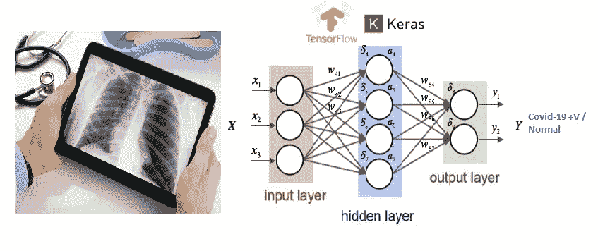
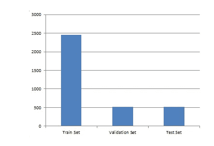
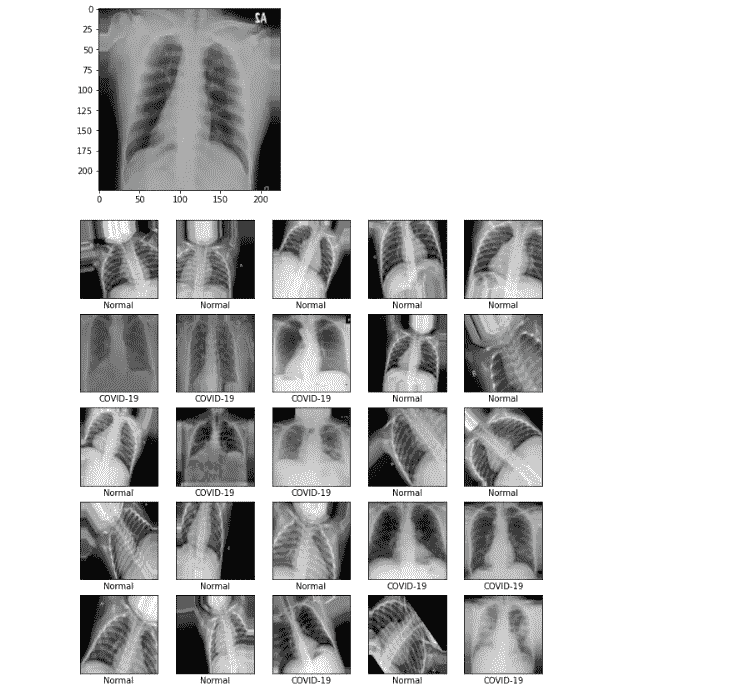
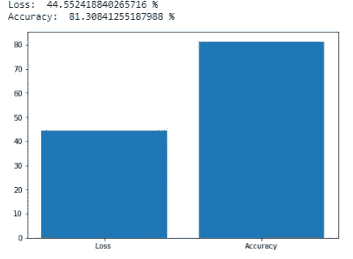
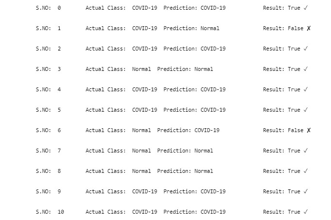

# 基于神经网络的胸部 x 光新冠肺炎检测方法

> 原文：<https://medium.com/analytics-vidhya/a-neural-networks-based-approach-to-detect-covid-19-through-chest-x-ray-c11c2b44824d?source=collection_archive---------10----------------------->

我们需要非常规的方法来对抗这种致命的病毒！

我们正面临着第三波致命的冠状病毒(新冠肺炎),它已经在世界各地造成了疫情局势，影响到 200 多个国家和地区。这种病毒很容易在人与人之间传播，或者通过触摸受感染的表面传播。新冠肺炎病毒感染的主要症状是发烧、干咳、味觉/嗅觉丧失和呼吸急促。在一些地区，由于缺乏检测试剂盒和医疗保健中心的巨大负担，识别新冠肺炎患者仍然是困难和昂贵的。在测试过程中，从鼻子或喉咙后部的拭子中采集样本，然后实验室检查拭子样本中的病毒遗传物质，一两天后得出测试结果。这个过程是痛苦的，耗时的和昂贵的。

新冠肺炎以某种方式影响患者的身体，特别是它攻击和损害人类胸部和肺部的某些区域。该想法是开发一种基于深度神经网络的解决方案，以在患者的胸部 X 射线图像的帮助下自动检测新冠肺炎，一些组织已经创建了公共存储库，其中包含新冠肺炎患者的真实胸部 X 射线图像数据集。

我已经设计并训练了一个卷积神经网络，它覆盖了成千上万的新冠肺炎效应和正常的 x 光图像。该模型获取疑似患者的 X 射线图像，并提供二元分类来预测(新冠肺炎阳性或正常)。本文一步一步地展示了使用 **Keras** 实现的上述项目，即**T5 是运行在 **TensorFlow** 顶层的高级 Python 神经网络库。**

# 资料组

本项目中使用的数据集取自两个不同的来源 Kaggle 和 Gituhub，构成了一个包含 3500 幅图像的数据集，其中 70%为训练图像，15%为 val 图像，15%为测试图像，50%为新冠肺炎图像和普通 X 射线图像。

数据集分布

*   训练集→ 2450 幅图像
*   验证设置→ 550 张图片
*   *测试集→ 550 张图像*

## 数据来源 1: Kaggle

来自 [kaggle](https://www.kaggle.com/darshan1504/covid19-detection-xray-dataset) 的数据集由新冠肺炎、细菌性和病毒性肺炎患者以及没有任何疾病的正常人的 X 射线(PA-CXR)图像组成。

## 数据来源 2: Github

第二个数据集的来源是一个 [gituhub](https://github.com/ieee8023/covid-chestxray-dataset) 存储库，其中包含新冠肺炎或其他病毒性和细菌性肺炎阳性患者的胸部 x 光和 CT 图像的开放数据集。

# 履行

**TensorFlow** 是一个开源库，用于数据流和跨一系列任务的可区分编程，即机器学习/深度学习应用，如神经网络。 **Keras** 是一个用 Python 编写的开源神经网络库，能够运行在 TensorFlow、微软认知工具包、R、Theano 或 PlaidML 之上。这是一个行业强度的框架，可以扩展到大型 GPU 集群或整个 [TPU 吊舱](https://cloud.google.com/tpu)，旨在实现深度神经网络的快速实验。在这里，我使用 Keras 来实现二进制分类器，将 X 射线图像分类为新冠肺炎感染或正常。

## > →让我们准备好深入研究代码

如果您计划实现这段代码，我假设您已经在工作站中加载了 *Keras* 和 *Tensorflow* 安装。→没有？遵循这个快速指南，了解 Anaconda、Jupyter Notebook、TensorFlow 和 Keras 的深度学习，然后马上回来

如果您不想在本地机器上设置环境，另一种方法是使用云服务进行机器学习，比如我在本次演示中使用的 [Google Colab](https://colab.research.google.com/)

## 导入库

第一步是导入下面的库，这将是进一步处理所需要的

## 使用 google Colab 安装 google drive

通过 google colab 笔记本获取数据的最佳方式是将数据集放在 google drive 上，并安装带有 colab 的驱动器，在运行以下代码后，将要求您提供凭据和访问代码，以放在笔记本控制台上授权访问。

## 使用 ImageDataGenerator 提取和转换数据

授权后，我们准备从驱动器中获取数据。有很多方法可以做到这一点，但是使用 Keras 的***imagedata generator****库是我最喜欢的方法。其功能***flow _ from _ directory***不仅可以将图像提取到迭代批次中，还可以提供数据扩充，并将基本的**变换**应用到整个图像数据集，即根据您的要求进行重新缩放、重新整形、缩放和翻转，然后将其转换为数字格式，以便直接传递到模型中。*

## 定义类标签并将 ImageDataGenerator 迭代器分成 X，Y 训练集和测试集

## 在定型模型之前可视化数据集

**数据集可视化**

## 设置一些要传递到模型中的重要参数

## 基于通道的转换

基于数据格式(即 channels_first 或 channels_last)的数据集转换，并将数值数据转换为浮点数

# 模型

一个基于卷积神经网络的模型包含 6 个隐藏层，已经被设计和训练为在转换数据集上编译后以 16 个时期进化。

## 层排列

该网络包含 6 层，包括

*   2 个 Conv2D 层，将 Relu 作为激活函数，内核大小为(3，3)，32 作为过滤器。
*   1 个最大池 2D 层，池大小为(2，2)。
*   1 展平图层，将输入的空间维度折叠为通道维度。
*   分别具有 Relu 和 softmax 作为激活函数的 2 个密集层

## 定义和编译模型

# 评价/结果

## 测试集上的模型拟合与评估

## 可视化结果(超过 100 名患者的实际类别与预测类别)

模型评估的损失和准确度图

10 样本评估结果

在 16 个时期之后，在测试集上已经获得了具有 81%准确度的结果，基于神经网络的模型成功地检测到新冠肺炎患者并且将 X 射线图像分类为(新冠肺炎或正常)

# 结论

一个问题可以有多种解决方案，每个人都可以发挥自己的作用，为社区贡献自己的一份力量。在这篇文章中，我展示了我在基于卷积神经网络的解决方案上的工作，以检测新冠肺炎患者，开发了二进制分类器，该分类器以 X 射线图像作为输入，并以 81%的准确度将其预测输出为新冠肺炎或正常。

页（page 的缩写）S →非常欢迎您通过我的 [github 资源库](https://github.com/sohailhanfi/CovidDetection)参与这个项目，或者在评论区分享您的建议/反馈。

***享受你的一天！***

