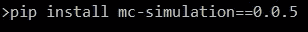

# 用于蒙特卡罗模拟的新 Python 模块

> 原文：<https://medium.com/analytics-vidhya/a-new-python-module-for-monte-carlo-simulations-7d0f1c0eaf96?source=collection_archive---------5----------------------->

有一次我的一个朋友问我:“卡洛，我需要你的帮助，我需要对一些金融数据进行蒙特卡洛模拟，你能帮我用 Python 编码吗？”。

我想做的第一件事是谷歌一些关键世界，如“python-monte-carlo-module ”,并找到一个快速解决这个问题的方法。当我没有找到任何令人满意的东西时，我有点惊讶，所以我决定启动一个新模块，专门用于时间序列的蒙特卡罗模拟。

本模块包含三个类别:

*   **AverageModel** :这个类的设计目的是在九个不同的 ARCH 模型之间找到最合适的平均模型，基于 Akaike 信息标准(AIC)。
*   **VolatilityModel** :这个类帮助你在六个不同的 GARCH 模型中找到最合适的波动率模型，方法和前面的一样。
*   这是一个允许你模拟未来场景的类，让你决定模拟的次数和时间范围。它还根据给定的置信区间显示最佳和最差情景以及最差和最佳情景。

在这里，我们将特别讨论如何使用这个强大而快速的模块来运行您的数据，并在一眨眼的时间内获得出色的输出！

如果您想直接阅读更具综合性的文档，可以在这里找到:

[https://www . slide share . net/Carlo parodi 1/MC simulation-documentation](https://www.slideshare.net/CarloParodi1/mcsimulation-documentation)

您应该首先在安装模块的提示中复制粘贴以下内容:



安装完这个库之后，您可以进入编辑器，导入我们简单讨论过的类，如下所示:

```
from mc_simulation import AverageModel as am
from mc_simulation import VolatilityModel as vm
from mc_simulation import MonteCarloSimulation as mcs
```

现在我们应该讨论一下你的数据了！它可以是 xls 或 csv 格式:这里所有的模块需要的是你有兴趣分析的列的名称！默认情况下，该列被命名为“Close ”,因为通常，在对金融时间序列建模时，我们指的是收盘价，而不是最低价、最高价或其他任何价格。但是您可以在输入中另外指定。因此，让我们这样定义一个名为“average_model”的变量:

```
average_model = am(link = r'\THE\PATH\TO\YOUR\FILE\ACEA.csv', file_type = 'csv', column_name = 'Close', p_value = 0.98)
```

以粗体显示的是参数的名称，除了第一个，其他都是可选的。这意味着，如果没有指定，AverageModel 将假定您所指示的文档是一个 csv 文件，并且列名是，如上所述，“Close”。

默认情况下，p_value 为 0.95，表示您稍后将要对每个模型的每个参数进行 t 检验的拒绝区域。

但是让我们按顺序进行吧！现在您有了 AverageModel 的一个实例，但什么也没发生，所以我们键入:

```
average_model.fit()
```

输出没有在控制台中打印出来，但是现在我们已经初始化了一些有趣的字段:

*   平均 _ 模型。 **MeanModelsDict** :该字段是一个字典，包含每个计算的 ARMA 模型的 Akaike 信息标准值、参数值、它们的 t 检验结果、协方差矩阵(按此顺序)。
*   平均 _ 模型。 **bestModel** :这是一个字符串，指定最佳拟合模型，基于赤池信息标准(AIC)。
*   平均 _ 模型。 **MeanParamsDict** :该字段包含最佳拟合模型的参数值。
*   平均 _ 模型。 **t_test_values** :该字段包含最佳拟合模型参数的 t 检验结果。测试的 p 值是多少？默认为 0.95，但你可以在输入中修改它，如前所示！

平均 _ 模型。 **adf_result** :这是增强 Dikey-Fuller 测试的值。如果您到达了这一点，这意味着测试已经被接受:在进行之前，事实上，您提供的时间序列需要结果协方差平稳，否则，模型评估的过程将被中断！

现在我们已经有了平均模型，我们可以通过对其波动性建模来进一步分析数据！为此，我们使用类 VolatilityModel:

```
volatility_model = vm(average_model = average_model, errors_distribution = 'Normal', p_value = 0.98)
```

同样，我们强调了要提供的参数，但是只有第一个参数是必须提供的，以便创建一个 VolatilityModel 实例。换句话说，如果你想得到一个波动模型，你首先要得到一个平均模型！您可以指定误差分布，默认设置为“正态”，键入“t”表示 t-Student，键入“ged”表示广义正态分布，键入“skewt”表示偏斜分布。p_value 参数允许您决定 GARCH 模型每个参数的 t-测试运行的拒绝区域。

现在让我们找到最佳模型:

```
volatility_model.fit()
```

和以前一样，我们在编辑器上看不到任何结果，但是我们有一些有趣的字段需要注意:

*   波动率 _ 模型。 **VarianceModelsDict** :该字段是一个字典，包含每个计算的 GARCH 模型的 Akaike 信息标准值、参数值及其 t 检验结果(按此顺序)。
*   波动率 _ 模型。 **bestVolatilityModel** :这个字段是一个字符串，它指定了基于 AIC 标准的最佳模型。
*   波动率 _ 模型。 **VolatilityParamsDict** :这里包含了最佳波动率模型的参数值。
*   波动率 _ 模型。 **t_test_values** :这里你找到了最佳波动率模型的参数的 t 检验结果。

## **最后，我们可以创建蒙特卡洛模拟！**

为了运行它们，我们需要一个波动性模型——我们刚刚创建了这个模型——为了得到它，我们需要一个平均模型，这是我们计算的第一件事。让我们开始吧:

```
mc_sim = mcs(volatility_model = volatility_model, time_horizon = 750, number_simulations=150)
```

唯一的强制参数是第一个参数(我们的波动率模型)，而 time_horizon 和 number_simulations 默认分别设置为 100 和 50(只允许整数)。“时间范围”是指我们希望模拟的时间范围。例如，如果我们保留默认值“100”，并且数据是由日常观察组成的，就像在这种情况下，我们说我们希望看到在未来 100 天内可能会发生什么。

我们所说的“模拟次数”是指设置我们想要在这个时间序列上计算的模拟次数。请记住默认值，如果我们保持它们不变，我们将要运行的方法将计算 50 个不同的场景，每个场景由 100 个观察值组成。

让我们看看会发生什么:

```
mc_sim.get_simulation()
```

输出:


太神奇了！假设我们希望看到所有这些场景的平均值。这个类提供了完美的方法:

```
mc_sim.get_average_scenario()
```

输出:


正如您所注意到的，我们还有最后一个观察值。如果我们想看到极端的场景呢？为此，我们有另一个强大的方法:

```
mc_sim.get_extreme_scenarios(criterion = 'returns_average')
```

参数“criterion”是可选的，默认情况下设置为“returns_average”。这意味着我们创建的 150 个场景按照它们的平均回报进行排序:


平均值总是显示出来，以便提供一个基准

但是您可以将标准设置为“last_obs”，在这种情况下，场景将按照其最后一次观察结果进行排序:


我想谈的最后一个方法，也许是最相关的，如下所示:

```
mc_sim.get_confidence_scenarios(conf_interval = 0.95, criterion = 'returns_average')
```

第一个参数是强制的，它允许我们看到排在第 95 百分位的场景和排在第 5 百分位的相反场景。您可以将此参数设置为 1 到 0.5(不包括)之间的任何浮点数。这对于计算未来某一天金融时间序列的风险值非常有用。第二个参数与前面讨论的完全相同，因此默认情况下设置为按平均回报对场景进行排序:


而这里是通过设置得到的结果:**判据** = 'last_obs '。


太好了！几行代码里有多少信息和图形！

如果您有任何疑问，或者希望看到在下一版本中实现一些新功能，请不要犹豫，与我联系。干得好！