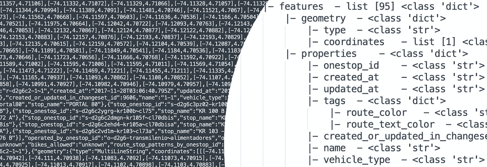
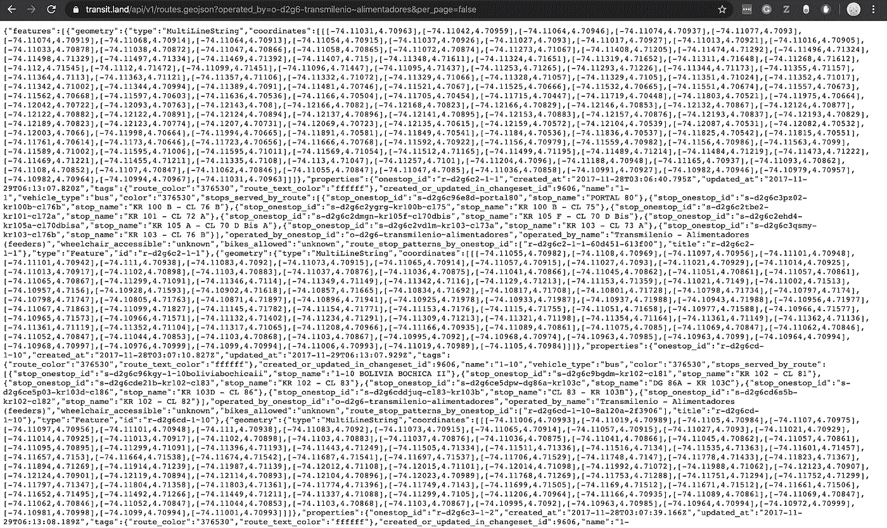
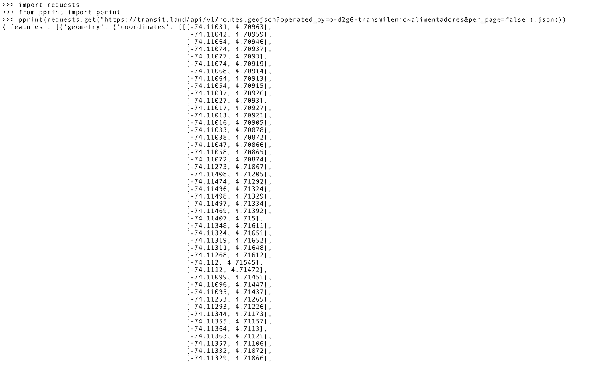
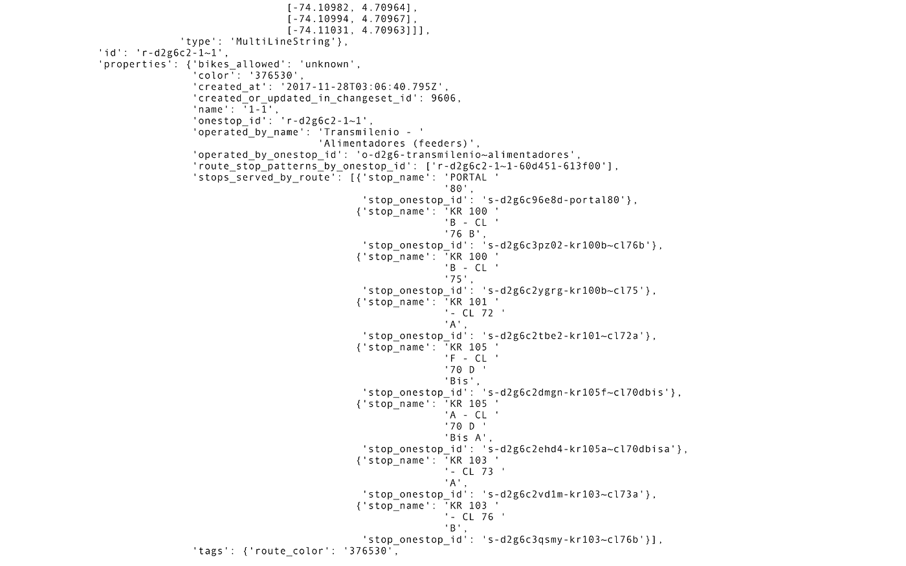
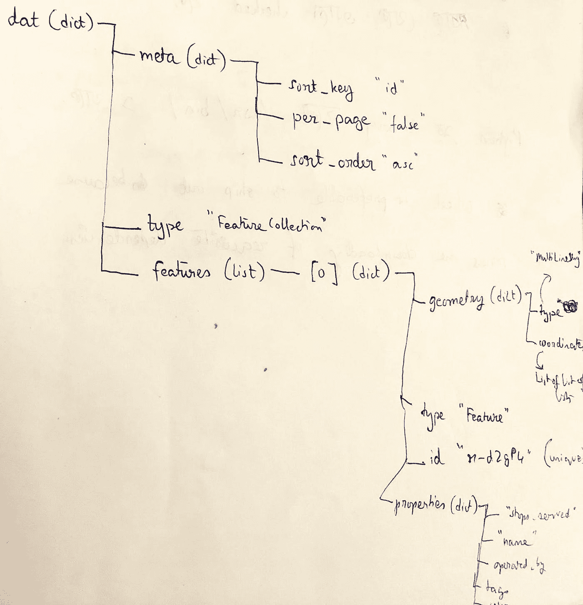
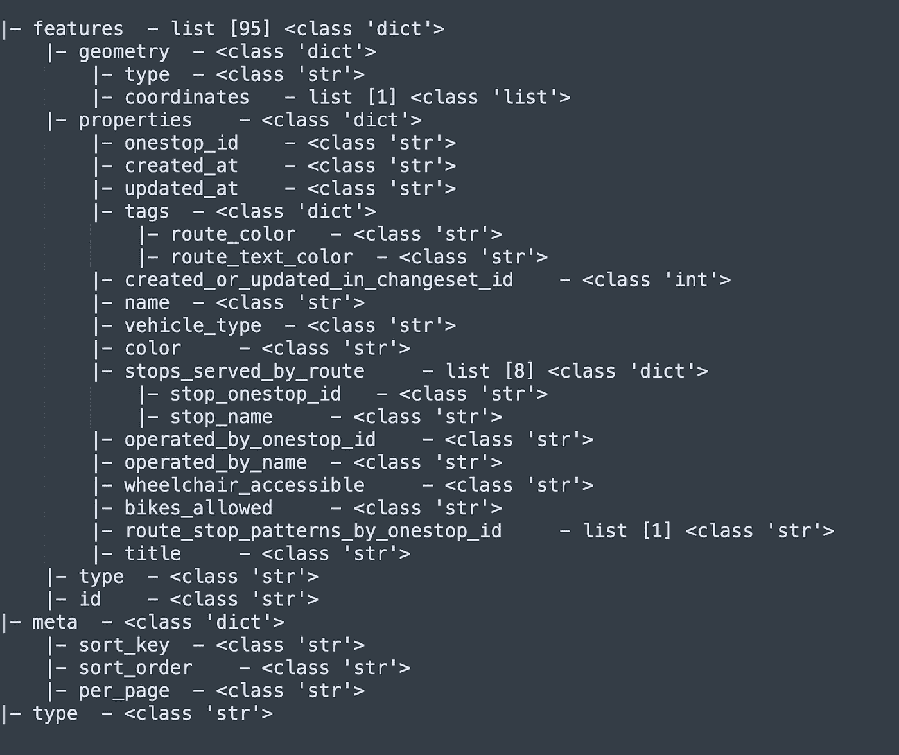
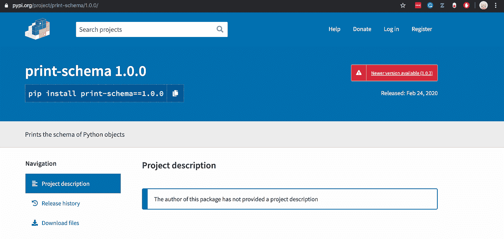
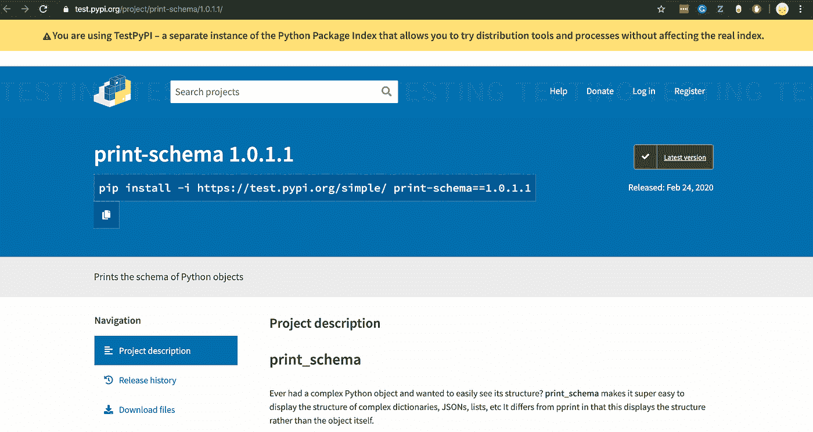
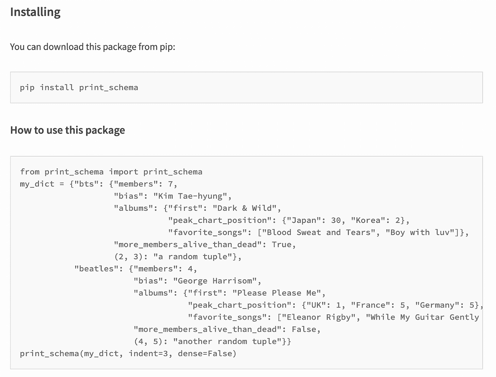

# 一种可视化复杂 Python 对象的新方法

> 原文：<https://medium.com/analytics-vidhya/a-new-way-to-visualize-complex-python-objects-bbea595bb1c9?source=collection_archive---------7----------------------->

在我工作的这种快节奏的创业公司，每天都有新的挑战摆在你面前。而在这一条上(宿命？)一天，我在哥伦比亚寻找公共汽车路线。这是来自提供地理数据的[网站](https://transit.land/api/v1/routes.geojson?operated_by=o-d2g6-transmilenio~alimentadores&per_page=false)的截图。

如果你试着去读的话。

现在，我想把这些数据转换成 GeoJSON。一个 **GeoJSON** 只是一个标准化的 JSON 格式，用来表示地理特征及其非空间属性(例如 *operated_by_name* 和 *vehicle_type* )。

为了将上面截图中的地理数据转换成 GeoJSON 格式，我需要理解地理数据本身的结构。如果我开始阅读这篇文章，我将需要一副新眼镜。

于是我求助于 **Python** 。我决定，*“让我们将 Python 上的数据作为 JSON 读取，然后使用内置的* `*pprint*` *方法来显示 JSON。当然，这种结构会很容易被看到，对吗？”*

不对。

还是不对。

这篇 JSON 极其冗长，漂亮的印刷让我无法对那里的地理数据结构有所了解。其他选项是`json.dumps()`或`yaml.dump()`该对象，它们也不是很容易理解，因为它包含的路线数据，一长串的纬度和经度，当显示时会使浏览该结构变得困难。

所以，我决定用老办法。

我拿出笔记本，费力地找出 JSON 的模式，匹配括号和缩进。

请注意我的文字是如何在一个点之后逐渐消失的

现在我已经习惯了使用`printSchema()`函数在 Spark 中打印复杂数据帧的模式，所以我对 Python 没有提供这种支持感到有点失望。

所以我做了任何工程师都会做的事:

> 编写[代码](https://github.com/suryashekharc/print_schema)来打印模式。

我编写了一个非常通用的代码，可以处理大多数常见的 Python 对象——字典、JSONs 和列表。程序将递归打印对象的结构，尽可能地输出细节。

好多了，是吗？

这种打印模式的方式有很多优点。

例如，如果我想知道地理数据中有多少条公交路线，我可以查看*“features”*列表的计数，在本例中是 95 条。如果我想知道字典“ *geometry* 包含什么，我知道它有键“ *type* ”和“ *coordinates* ”，它们的值分别是 string 和 list。我还启用了一些特性，比如选择每一级的缩进，如果您想要一个模式有连续的垂直线。

我已经将所有这些代码签入了 GitHub，但是现在我变得雄心勃勃。

> 我想把这个项目部署到 PyPI，这样你也可以下载这个包，并把它作为 pprint 的替代品(如果你愿意，没有压力)。

我遵循了 RealPython 上的这个[指南](https://realpython.com/pypi-publish-python-package/)关于如何发布一个包到 PyPI。我在 PyPI 上发布了 1.0.0 版本，我甚至可以从其他机器上下载。感觉几乎…太容易了。

JSONOFABITCH

我的预感是对的。即使我可以下载它，它也不能在其他机器上正常工作。导入语句不正确(*模块不可调用*)，我在 Python2 上遇到了有趣的错误，PyPI 页面没有接收到 readme markdown 文件。Github 曾经神奇地读取 markdown 文件，但是为什么 PyPI 不够聪明？

一天下班后，我和我的同事普内特坐在一起，我们一起开始调试问题。原来，还有一些事情要做。PyPI 要求 setup.py 文件提到一个`long_description`(我们决定[从 readme 文件](https://github.com/suryashekharc/print_schema/blob/master/setup.py)中动态读取)。并且，为了启用正确的导入级别，我们对 init 文件做了[这个更改](https://github.com/suryashekharc/print_schema/blob/master/print_schema/__init__.py)。

另外，我的代码需要 Python3(我在 Python2 不支持的代码中使用了花哨的类型提示)，所以我在 [setup.py](https://github.com/suryashekharc/print_schema/blob/master/setup.py) 中添加了`python_requires`字段。我们将整个装置放在 **test.pypi** 上，这是一个沙箱，允许你在将包部署到 pypi 之前对其进行测试。

看起来我们都准备好了！

PyPI 不允许你上传同一个版本的包两次，所以我们推出了新的(和功能！)`print-schema version 1.0.2`。我对 PyPI 的第一个贡献现在还活着！

我鼓励你用`pip install print-schema`下载。这里有 [Github 链接](https://github.com/suryashekharc/print_schema)和 [PyPI 链接](https://pypi.org/project/print-schema/)。

一定要让我知道你对它的看法！