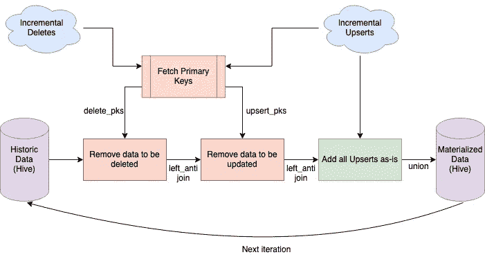

# 分布式数据处理新手编年史—第一季第二集:大量优化！

> 原文：<https://medium.com/analytics-vidhya/a-newbies-chronicles-on-distributed-data-processing-s01e02-optimizations-galore-a91eff7cdb02?source=collection_archive---------29----------------------->

声明:如果你还没有阅读这一季的第一集(S01E01) ，请随意先阅读它，以获得更多的上下文和更好的阅读流程。

在本系列的前面，我们已经介绍了我们需要的功能，以及在使用 Spark 时要记住的一些基本原则。好的，让我们从上一集停止的地方继续。

# 从概念验证开始

现在，我们已经了解了分布式 data domain 所需的功能和需要牢记的基本事项，我们已经准备好从一个简单的概念验证开始，它可以正确地进行合并。

当然，确切的工作包括几个额外的步骤，比如从我们的实际数据源中*序列化/反序列化，以及*预处理*——然而，由于它们有点太具体，我将跳过它们，直接切入正题。为了说明问题的关键，让我们以我们非常熟悉的复仇者联盟为例:*

实现所有增量事件 ft 的基本 POC。复仇者联盟

同一 POC 的流程图:对于跳过代码的人，这是第二次机会

作品？太好了！🎉

我能够让这个简单的概念验证在一个 2 节点集群中处理 100 GB 的增量数据，大约需要 55 分钟才能完成。耶！⭐️

# 负载测试

当然，我们没有利用 Spark & Scala，只是在一个 2 节点集群上运行它，并且只处理 100 GB 的增量数据。事实上，我们不得不越来越多地扩展，尝试不同的配置，看看哪种配置能够在资源利用率、完成工作所需的时间以及最终成本之间取得最佳平衡。

当进行负载测试时，我们必须在每次运行中跟踪不同的参数，以确保我们能够得到一组最佳的参数值。

1.  集群配置
    集群大小
    驱动程序内存
    驱动程序内核
    执行器内存
    执行器内核
    执行器数量
    实例类型
2.  与数据相关(偏斜？)

    独特事件的数量
    按事件类型分布的事件(插入/更新/删除)
    处理的增量数据总量
3.  输出指标
    完成工作所需的时间
    成本(取决于集群配置)

我们开始用 2 个群集节点处理 100 GB 的增量数据，然后慢慢地开始按比例增加到 200 GB、500 GB、1 TB。

负载测试进展顺利，直到 1 TB 的增量数据，使用 60 节点集群。但是，我们无法进入下一个级别— 2 TB。在多次尝试调整参数后，很明显，可伸缩性的问题一定在于代码而不是配置。

# 优化、优化和优化

通常很难找出 Spark 式代码中的优化范围，尤其是如果您是新手的话——然而，诀窍是要注意一些重要的方面，如内存优化和最小化数据混乱。

因此，我们请我们团队中的一位专家提出改进的范围。回车， [**桑吉萨胡**](https://www.linkedin.com/in/sanketsahu9394/) 。在一个小时的时间里，他设置了背景并向他介绍了 POC 代码，他有几个适用于 Spark jobs 的建议:

*   **使用更好的内存配置:**

内存配置通常遵循钟形曲线。如果您提供更少的执行器和每个执行器更多的内存，数据洗牌是最小的；但是垃圾收集变成了开销，并行性降低了。另一方面，如果您提供更多的执行器和更少的内存，尽管您利用了并行性，但是由于每个执行器的内存更少，所以会有大量的数据重排。

这是关于在这两种情况之间找到一个平衡/权衡！

*   **最小化数据洗牌:**

几乎所有的繁重工作都发生在执行者身上，很少的辅助步骤发生在驱动者身上。由于这种分布式特性，有很大的空间进行**数据洗牌**:即在集群内来回发送大量数据。

> 等等，等一下。我迷路了。驱动者、执行者&洗牌？

好的。抱歉，我想得太多了。简而言之:

**驱动**:主要处理读取我们的代码、将代码分割成阶段/任务、分割并委托给执行者等的过程。*有点类似于一个专注的 Scrum 大师。*

**执行者**:顾名思义，执行者是在数据/工作者节点中运行的流程——他们处理驱动程序委托给他们的任务。这可能类似于人们在短跑中捡票。

驱动程序-执行器架构。集群管理器

**数据混洗**:现在我们知道数据帧块存储在集群的分布式文件系统中。所以，任何时候我们使用像 *df1.join(df2)* 这样的动作，首先必须连接 *df1* 和 *df2* 的块，然后所有这些结果块必须逻辑合并以给出最终结果。为此，数据需要在集群中流动。

> 为什么数据洗牌又不好了？

嗯，对于我们必须用 Spark 作业处理的通常规模的数据，不必要的数据洗牌会导致集群内不必要的网络调用来产生数据流。因为这可能确实会影响性能，所以通常需要最少的数据混洗。

例如，让我们考虑我们正在执行的连接操作:

我们的概念证明中的加入操作

要从现有数据中删除现有的 DELETE & UPSERT 条目，不需要连接整个数据帧。如果我们只连接被认为是主键的列就足够了，然后我们可以从现有数据中保留那些不匹配的主键。

在类似的行中，优化后的更改如下所示:

只发送“左反”连接的主键

然而，即使实施了所有这些建议，我们的工作仍然在 2 TB 的增量数据上失败。我们遇到了一个障碍，我们不确定为什么这些优化还不够。我们必须深入挖掘，看看任务失败的地方/原因。

要了解我们是如何调试这个未知的路障并解决它的，我们来进行[本季大结局:第一季第三集](/@athityakumar/a-newbies-chronicles-on-distributed-data-processing-s01e03-grand-finale-99b7cc8601cb)！