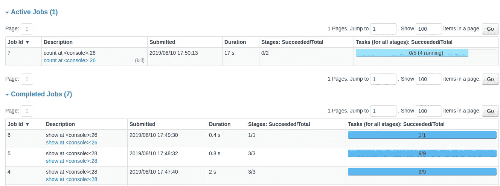

# 分布式数据处理新手编年史——第一季第三集:大结局

> 原文：<https://medium.com/analytics-vidhya/a-newbies-chronicles-on-distributed-data-processing-s01e03-grand-finale-99b7cc8601cb?source=collection_archive---------30----------------------->

声明:如果你没有读过这一季的前几集，我建议你先读一下[s01e 01](/@athityakumar/a-newbies-chronicles-on-distributed-data-processing-s01e01-pilot-5c76fb052db5)&[s01e 02](/@athityakumar/a-newbies-chronicles-on-distributed-data-processing-s01e02-optimizations-galore-a91eff7cdb02)以获得更多的上下文和更好的阅读流程。

回顾:在前几集，我们针对我们的需求进行了概念验证，将其扩展到 1TB，并进行了一些优化。但是由于一个未知的路障，我们仍然无法继续前进。

# 路障:深深切入的匕首

应用程序日志本身对于调试来说不是很有用，因为我们只能看到任务失败——而不是它们失败的确切情况。例如，我们看到由于 JOIN 步骤中的内存问题，我们的代码仍然失败。这很奇怪——因为在我们上一集所做的优化改变之后，内存不应该成为问题。

为了解决这个问题，我们求助于我们的秘密武器库:Spark Web 控制台！

样本 Spark Web UI，演职员表:【https://spark.apache.org/docs/3.0.0-preview/web-ui.html 

基本上，这是一个由 Spark 提供的仪表板 UI，它以一步一步的方式为正在运行的作业抛出许多有用的提示，如阶段、任务、花费的时间、节点状态、内存指标等。

至少可以说，它就像一把调试用的瑞士小刀一样。当我们查看当前应用程序的运行时，我们发现，出于某种原因，在 JOIN 操作期间，我们之前用于读取增量数据的一个*预处理*步骤被再次调用，而不是重用我们已经在 *count()* 操作阶段获得的输出。

重读增量数据的神秘案例

谢天谢地， [**Sanket**](https://www.linkedin.com/in/sanketsahu9394/) 对这个问题很熟悉，因为他自己也曾面对过这个问题，他向我们详细解释了这个问题。

> 基本上，Spark 根据 Catalyst 的逻辑计划在 DAG(有向非循环图)中保存计算值的版本。现在，根据其下一次操作的内存可用性(或需求),存储在 DAG 中的最早的值会被一个接一个地清除，直到我们为下一次操作准备了足够的内存。

这意味着，我们的增量数据帧的一个变体必须从 DAG 中清除，以适应连接操作，并且它试图再次读取它们并从头开始处理。这就是为什么它遇到了内存问题，并且在失败任务的最大容许重试次数为 4 次之后，作业开始失败。

我在这里想，如果数据帧在成功执行 *count()* 时在内存中，那么对于后续的连接步骤，它仍然在内存中。事实上，在这两行代码之间，数据帧可能会从 DAG 中被清除——感觉像是被我自己的代码出卖了。😢

> *信任问题:“你好，好久不见。”*

阿纳·戈斯瓦米解释我感受到的背叛

# **向上，向上，向上！**

现在我们已经锁定了 DAG 问题，解决方案非常明显。这就是开销:读取 2 TB 的 json 数据(再次)效率非常低，因为 json 没有相关的压缩，嵌套模式需要再次预处理。因此，如果我们将预处理的数据帧存储到压缩的 parquet 文件中，或者以某种方式将它保存在内存中，我们将能够继续进行实际的 *join()* 操作，而不需要被重定向来再次读取 json 数据。

很直观地，它不够小，不能直接*在集群中*广播——所以我们不得不使用 parquet。我们做了这样的改变，瞧——我们跳到了 2TB &,甚至处理 4TB 的数据也非常有效！🎉

在 8TB 的冲击下，出现了最后一个障碍——相对来说，调试和解决 IMO 都比较容易。又是一个内存问题，但这一次，它在保存最终物化数据时失败了。

当然，我们正在处理海量的数据，其中的 I/O 也需要处理。因此，我们必须根据正在处理的增量数据的规模对数据进行分区。我们也加入了这个逻辑:

为胜利而动态分区！

在所有这些累积的变化之后，我们的代码现在可以稳定可靠地运行 8TB、16TB 甚至 24TB！🎉

我们代码的能力从 100GB 扩展到 24TB 的真实镜头！

# 排列和组合

既然我们的代码已经经过了大规模测试，我们必须在结束之前确定基础参数的最佳组合。我们列出了所有实例类型，根据最小内存需求、最小 vCPU 需求和每小时最大成本对它们进行了筛选。

我们有像 c5.9xlarge、m5.8xlarge 等好但贵的实例，也有像 r5.2xlarge、m4.4xlarge 等差但便宜的实例。然而，由于我们的用例需要在 I/O(读写)和计算(对于像 JOIN 这样的操作)之间进行平衡，r5.2xlarge 和 r5.4xlarge 实例显然是赢家！🏅

也就是说，要么 x 台 r5.4xlarge 的机器，要么 2 台 r5.2xlarge 的机器——两者性能相当。

# 还有，场景！

总而言之，我认为这是一次很好的实践学习经历！自然，我们面临的大部分障碍都是由于我们操作的数据规模太大。首先，拥有如此大量的数据进行工作是一件很棒的事情；此外，在此基础上构建功能也是锦上添花！也许在建造它的过程中肯定会经历一次过山车*(感谢信任问题，Spark DAG)*；但回想起来绝对是一次很棒的经历。

对于刚刚进入 Spark 行业的人来说，有几点需要学习:

*   你写的代码是“*懒惰*，并且直到一个“*动作*开始才会真正执行
*   请注意所有 spark 配置/变量、它们的默认值和它们的限制
*   充分利用 Spark 控制台 UI——解决问题通常比调试和识别问题更容易

最后，我要向那些没有这种能力的人大声疾呼:

*   [**桑吉萨胡**](https://www.linkedin.com/in/sanketsahu9394/) —星火 pro。不仅仅是帮我调试，还教会我如何自己调试。还有低调的容忍我所有的质疑。

我给了一个人一条鱼，你喂了他一天；教一个人钓鱼，你可以喂他一辈子

*   [**普拉温**](https://www.linkedin.com/in/pravin-agrawal-25409329/)[**萨朗**](https://www.linkedin.com/in/sarangzargar/)[**高塔姆**](https://www.linkedin.com/in/guptagautam/)**&co**——客户。要求这种能力。也感谢大家积极参与富有成效的讨论，没有这些讨论，这样的无缝协作是不可能的！
*   **—绑定链接。完整地处理了需求的各个方面，并很好地规划了时间表。**
*   ****——产品经理。自信地接受这个挑战性的任务，并有一个舒适的计划时间表。****
*   ****[**基兰 A**](https://www.linkedin.com/in/kiranashwath/) —经理/总监。把这个有趣的任务放在我的盘子上！****

******鳍。******

****想看更多的新手编年史系列吗？Ping 我，或者在下面评论——请告诉我！****