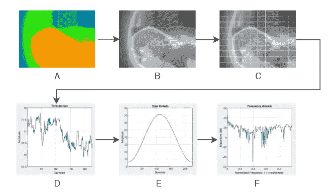
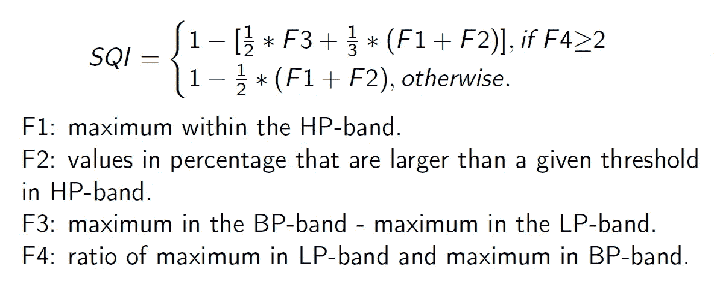

# 发现婴儿呼吸综合征的非侵入性方法:第一部分

> 原文：<https://medium.com/analytics-vidhya/a-non-invasive-approach-to-find-respiratory-syndromes-in-infants-part-one-51604f4c6f99?source=collection_archive---------27----------------------->

获得 B.Tech 学位最困难的部分可能是课程结束时需要提交的主要项目。每当它有了一个想法，就会出现一百万个问题，导致无数个痛苦的白天和不眠之夜。

在做我的项目时，我也有相当多的疑虑和不安。谢天谢地，我的小组里还有另外三个朋友可以分担痛苦。你知道吗，我们做到了！我们完成了这个项目，提交了一份报告，在评估者面前现场演示了这个项目(并给我们大学最严厉的教授之一留下了深刻的印象)，向一个 IEEE 国际会议提交了关于这个项目的研究论文，并获得了接受和发表！

这是一个小小的尝试，给正在阅读这篇文章的工程系学生带来希望。如果我们能做到，相信我，你也能。享受过程，顺其自然。

闲聊够了。让我们现在进入技术细节，好吗？

我们的项目旨在测量婴儿的呼吸频率，并确定他们可能患有的任何呼吸综合征。大多数时候，根本不测量呼吸频率，尽管它是最重要的健康参数之一，即使测量，也是通过将许多传感器和其他设备连接到婴儿娇嫩的皮肤上来实现的，这会导致疼痛和不适。这就是为什么我们选择了一种非侵入性的方法来测量呼吸频率，利用热成像的魔力。

这篇博客中提到的所有步骤都是在 MATLAB 中进行的，MATLAB 是 MathWorks 开发的一种计算环境和专有编程语言。

预处理步骤概述

第一步是从婴儿的热视频中提取每一帧。我们的视频长 15 秒，帧率为每秒 15 帧，总共 225 帧。完成后，我们在每一帧上应用一个网格，将它分成多个感兴趣的区域(ROI)。

这就是我们的项目不同于其他类似项目的地方。通常，只有鼻子或胸部区域被监测以确定呼吸率。问题是，当婴儿哭泣或移动时，胸部或鼻子区域偏离焦点时，很难保持准确性。网格通过将整个框架分割成潜在的感兴趣区域来解决这个问题。在我们的例子中，我们使用 10x10 的网格，这给了我们 100 个单独的 ROI。随后确定有效和无效的 ROI。

为了从每个 ROI 提取呼吸信息，我们考虑该空间中的平均像素值。通过在 225 帧的每一帧中一个接一个地附加 ROI 的平均像素值来形成呼吸信号，从而给我们总共 100 个呼吸信号(因为我们有 100 个 ROI ),每个信号中有 225 个值。

这些只是我们提取的原始信号；每个信号都需要进行预处理，以使其更加精确和易于处理。第一个预处理步骤是对信号应用汉明窗。如果您学过信号处理，可能会对这个术语很熟悉，但简单来说，当我们将它转换到频域时，它有助于我们更准确地了解信号。

一旦应用了汉明窗，信号以均值为中心并转换到频域，因为我们需要像素的变化率来确定呼吸率。然后信号被归一化，我们最终得到了我们的呼吸信号。

还记得我说过有效和无效 ROI 将在以后确定吗？这是我们做的部分。我们现在有 100 个呼吸信号，经过提取和预处理。尽管所有这些信号都没有呼吸信息；大部分只会是噪音。为了过滤掉这些，我们使用一个叫做 SQI 测量的公式。它的定义如下所示。

确定 SQI

LP、BP、HP 分别代表低通、带通、高通。低通 is 频率低于 0.1Hz，带通 is 频率在 0.1 至 0.3Hz 之间，高通 is 频率高于 0.3Hz。计算 F2 的阈值是根据经验确定的。

SQI 测量值大于 0.5 的信号被认为是有效的呼吸信号，并且通过将信号中的最大值乘以 60，仅从这些信号中确定呼吸率。对于其余的，呼吸率被认为是零。

最后，将呼吸信号及其相应的呼吸率导出为 CSV 文件，用于下一步；确定呼吸综合征的存在，这在本博客的第 2 部分[这里](/@navisk13/a-non-invasive-approach-to-find-respiratory-syndromes-in-infants-part-two-2ff4a8a5b653?source=friends_link&sk=d76381c9e1511bdc045481cb5ce5c542)有解释。