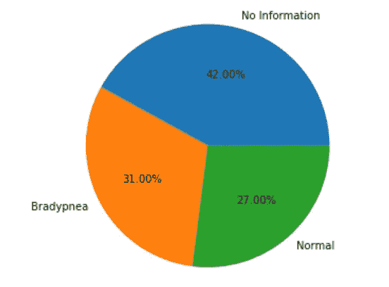

# 发现婴儿呼吸综合征的非侵入性方法:第二部分

> 原文：<https://medium.com/analytics-vidhya/a-non-invasive-approach-to-find-respiratory-syndromes-in-infants-part-two-2ff4a8a5b653?source=collection_archive---------24----------------------->

这是关于我最后一年项目的博客的第二部分。如果你还没有读过第一部分，你可以在这里找到它。

在第一部分结束时，我们留下了一个包含呼吸信号及其相应呼吸频率的 CSV 文件。现在，我们需要使用这些数据对婴儿可能患有的任何呼吸综合征进行分类。我们在深度学习模型的帮助下做到了这一点。

数据集(我们的 CSV 文件)被分为模型的训练和测试数据。我们总共有五个视频，我们从每个视频中获得 100 个呼吸信号，因此我们使用 400 个样本(80%)进行训练，100 个样本(20%)进行测试。

该模型共有四层；一个输入层、一个输出层和两个隐藏层。输入层有 225 个节点，因为我们的每个呼吸信号有 225 个特征值。输出层有 4 个节点，因为我们将信号分为四类，两个隐藏层各有 100 个节点。

我们将信号分为四类:无信息、呼吸徐缓(呼吸频率慢)、正常和呼吸急促(呼吸频率快)。婴儿的正常呼吸频率在每分钟 40 到 60 次呼吸(bpm)之间，因此频率低于 40 bpm 的信号被归类为呼吸缓慢，而频率高于 60 bpm 的信号被归类为呼吸急促。

该模型使用 Adam 优化器进行编译，并使用分类交叉熵作为损失度量，对 500 多个时期进行训练。该模型的总体准确率为 92%。

根据模型对疾病进行分类

我们就该项目撰写了一篇研究论文，该论文在 2020 年 IEEE 通信与信号处理国际会议(ICCSP)上被接受。这篇论文将很快发表在他们的杂志上。

如果你想要更多关于这个项目的技术细节，最后的论文或者项目实施和进一步发展的源代码，请给 navisk13@gmail.com 发邮件，我很乐意免费发给你。