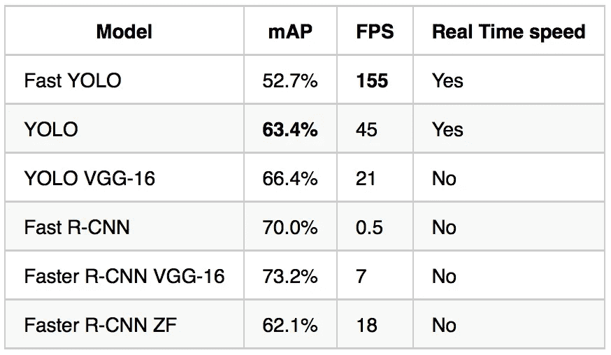

# 关于各种目标检测算法的一个注记

> 原文：<https://medium.com/analytics-vidhya/a-note-on-various-object-detection-algorithms-66ded1152773?source=collection_archive---------12----------------------->

随着世界科技的进步，工作各个方面的自动化受到了广泛关注。从聊天机器人到自动驾驶汽车，这个研究和应用领域正在发生巨大的飞跃。这篇文章是关于深度神经网络架构在物体检测领域的应用。我首先想到的是深入研究各种可用算法的细节，但这将是一个巨大的资源，听起来更像一个无聊的讲座。这一个将包含一些最应用的算法的一般概述，即。*滑动窗口，R-CNN 和 YOLO* ，带你入门。这仍然会是一个很长的帖子，我很抱歉。

给定一幅图像，卷积神经网络可以将其分类为不同的类别。但是真正的问题在于在单个图像中检测多个对象。当图像中有多个对象时，挑战在于识别每个对象并在图像中定位它们。早先，CNN 被应用于对象的紧密裁剪的图像或仅包含一个对象的图像。但是当然，为了训练用于物体检测和定位的网络，我们需要在具有一个或多个物体以及标记其在图像中的位置的清晰边界的图像上训练它。让我们来定义网络的输出，即我们希望网络预测什么。我们定义我们的输出向量**y**ₑₓₚ**，来自被训练来检测 n 类物体的网络，为:
t5】yₑₓₚ:**
**【pᵢ，**
**L** **ₓ，/ B** ₓ
**L** **ᵧ，/ B** **ᵧ**
**L ₕ，/ B**
**【c₃】，**
**…，**
**…，**
**【cₙ】**
**【pᵢ】**→定义给定图像是否具有属于 n 类图像中至少一类的任何对象的概率值。 因此，如果图像中有物体，则为 1；如果图像只是风景，或者没有感兴趣的特定物体，则为 0。
**Lₓ / B** ₓ →表示对象位置周围边界框中心的 x 坐标。
**Lᵧ** **/ Bᵧ** →表示对象位置周围包围盒中心的 y 坐标。
**Lₕ** **/ Bₕ** →表示包围盒的高度。
**Lₗ** **/ Bₗ** →表示包围盒的宽度。
**C₁，C₂，…，Cₙ** →它们代表不同类别的物体，网络正在被训练识别。因此，如果图像中有一辆汽车，并且 C₂用于表示汽车，那么 C₂的值应该是 1，而其他参数假定值为 0。

在给定的图像中，输出的值表示什么的例子。注:bₗ在这里用 b𝓌表示。

现在，在一组标记良好的图像上盲目训练神经网络不会产生令人满意的结果。我们需要更智能的算法实现，对图像进行一些有效的操作，并返回更好的结果。一、**滑动窗口检测算法**。

# 滑动窗口检测算法:

**滑动窗口检测算法**执行如下:
*首先*，我们训练一个 ConvNet 从那些对象的紧密裁剪图像中对对象的类别进行分类。因此，如果网络试图识别人类的图片，我们将在只包含一个人的图像上训练它。每个图像的额外背景被移除。因此，对于给定的数据集，如果是一个人的图像，输出将是 **1** ，否则输出将是 **0** 。

检测窗口如何滑过输入矩阵。

接下来是探测物体的工作。为此，我们选择一个特定大小的正方形窗口(与图像的大小相比，尺寸较小)。我们现在将这个窗口放在输入图像上，并通过窗口裁剪出图像中聚焦的部分。我们将这个裁剪后的图像输入到 ConvNet 中进行分类。现在，这个窗口首先被放置在图像的左上角，然后以某个选定的步幅(或跳跃)滑动到另一边，然后再以相同的步幅向下滑动。因此得名*滑动窗口检测*。

一个在完整图像上滑动窗口的例子。

每次，它都将图像的特定部分返回给 ConvNet。ConvNet 将图像的这一部分分为不同的类别(如果存在对象)。
算法的一个**缺点是图像中物体的尺寸经常会大于所选窗口的尺寸。这将返回一个否定的结果，即使对象可能存在。一种补救方法是使用几个不同大小窗口。我们还可以每次按一定比例调整图像大小，以确保滑动窗口至少检测到一次对象。虽然这可能会返回正确的结果，但是它们在计算上是不利的。手头的另一个选择是卷积地实现滑动窗口检测算法*。下面是视频的链接，它对这种实现进行了很好的解释。
[**利用卷积实现滑动窗口检测**](https://www.youtube.com/watch?v=mFunGvD5sVc)***

# *R-CNN 或基于地区的 CNN:*

*接下来是 R-CNN 或基于区域的卷积神经网络。它基于将图像划分成区域的概念。我们已经有了一个训练有素的网络来识别各种类型的物体。为了检测图像中的对象，该算法执行以下步骤。基于选择性搜索，它基本上必须提出近 2k 个与类别无关的感兴趣区域。这个想法是，这些区域可能包含不同大小的各种对象。这个*区域提议*的任务是通过**分段**来实现的。*

**

*图像分割的一个例子*

*然后，图像的建议区域被转换成先前训练过的 ConvNet 可接受的格式，并被输入其中。然后，ConvNet 对图像的这些聚焦部分执行分类任务。
以下是 R-CNN 应用的步骤:*

**

*这是基本概念。除此之外，这个网络还具有一个 *SVM(支持向量机)*，它可以根据 ConvNet 提取的特征执行图像分类。它还应用*线性回归模型*来微调区域边界框。很多东西，对吧？如果不需要深入研究它们的实现，就不需要太关注它们。*正如吴恩达所说，“不懂就别担心。”**

*尽管采取了所有这些步骤，但从视频片段中进行实时对象检测仍然很慢。为了增强它的性能，对这个算法的版本进行了各种更新。从**快 R-CNN 开始到更快 R-CNN，再到现在屏蔽 R-CNN** 。
**快速 R-CNN** 基于计算的共享。换句话说，就像我们在滑动窗口的卷积实现中所做的那样，类似地，这里我们将所有信息传递给 CNN 进行分类和边界框回归。这减少了先前在每个区域上单独训练时产生的总计算成本。一旦理解了滑动窗口检测算法的卷积实现，就可以很容易地确定这里采用的方法。
**更快的 R-CNN** 是将区域提议流程集成到 ConvNet 中的直观改进。而**掩模 R-CNN** 是更快的 R-CNN 到像素级图像分割的扩展实现。如果你需要了解更多，这里有这些论文的链接。
[R-CNN](https://arxiv.org/abs/1311.2524)
[快 R-CNN](https://arxiv.org/abs/1504.08083)
[快 R-CNN](https://arxiv.org/abs/1506.01497)
[屏蔽 R-CNN](https://arxiv.org/abs/1703.06870)*

# *YOLO 物体检测算法(最后):*

***YOLO** 或**你只看一次**算法采用了一种与其他算法完全不同的方法。而其他算法对图像中的每个建议区域执行分类和定位。YOLO 把这两项任务都在一张图像上通过了网络。它所做的是，将图像分成一定数量的区域，并预测每个区域的结果，如果某个对象的中心位于该区域。首先让我们看看它应该输出什么。
**包围盒:**我们期望网络预测出图像中物体周围的一个包围盒。我们像以前一样定义输出:*

***yₑₓₚ:**
**【cₛ，**
**L** **ₓ，/ B** ₓ
**L** **ᵧ，/ B** **ᵧ**
**L ₕ，/b̿**
**l↑，/b↑**
**c 它由*概率*(物体存在的 Pᵢ)与 IoU(结果，预期)的乘积给出。 我将在后面定义借据。
**Pᵢ** →定义给定图像中是否有属于 n 类图像中至少一类的物体。
**Lₓ / B** ₓ →表示对象位置周围边界框中心的 x 坐标。
**Lᵧ** **/ Bᵧ** →表示对象位置周围包围盒中心的 y 坐标。
**Lₕ** **/ Bₕ** →表示包围盒的高度。
**Lₗ** **/ Bₗ** →表示包围盒的宽度。
**C₁，C₂，…，Cₙ** →它们代表不同类别的物体，网络正在被训练识别。这里只是一个例子，说明在给定的图像划分成 3×3 个网格后，一个经过训练的网络能够返回什么。*这还没有显示置信度得分。****

**

*从图像中可以很容易地理解每个网格单元的输出是如何变化的。边界框的输出值是近似值。这里是另一个例子。假设网络被训练来检测各种街道标志，适用于自动驾驶应用。红色框表示由网络预测的边界框( **Bₒ** )，绿色框表示预期的边界框( **Bₑ** )。*

**

*那么，算法是做什么的呢？
*首先是*，像往常一样，我们有一个 CNN(卷积神经网络)被训练成将物体分类成不同的类别。
接下来，它将图像分成 **S x S 网格单元或区域**。如果发现某个对象的中心位于每个网格单元中，它会训练网络返回该网格单元的结果。可以用下面的图像来解释:*

**

*这里我们有给定的三个物体的图像。图像被分成一定数量的单元，并且网络预测可能包含物体中心的单元的边界框。注意，预测边界框的数量非常大。我们如何选择正确的呢？让我们在接下来的几个话题中理清思路:*

# *IoU(并集上的交集):*

*因此，在训练期间，我们有两个输出值:第一，真实值或预期输出。第二，我们通过网络传递图像后得到的结果
因此，期望的输出为一个对象定义了一些边界框( **Bₑ** )，而网络为同一对象预测了一些其他的边界框( **Bₒ** )。
**IoU** 定义为 **Bₑ** 和 **Bₒ** 的交集所覆盖的面积与 **Bₑ** 和 **Bₒ** 的并集所覆盖的面积之比。*

**

*因此，对于一幅图像，我们可能会得到许多由网络预测的边界框。我们只选择*置信度得分*超过某个阈值的结果。通常，该阈值取为 0.6 及以上，但这取决于开发者的判断。
下面是它在汽车检测中的应用实例。请注意预测的和预期的边界框几乎重叠。因此，它有一个高电平的 IoU。*

**

***非最大值抑制:**
在网络的应用过程中，当对图像中的物体进行检测时，网络可能会对一个置信度得分大于阈值的物体返回多个包围盒。我们应该选择哪一个。
我们考虑具有最大值 **IoU** 的包围盒。在所有结果中，我们抑制 IoU 较少的方框，并考虑 IoU**最高的方框。因此，它被称为非最大抑制。***

**

*在上面的图像中，假设网络预测了同一图像的三个边界框，其中 IoU 超过了阈值(例如 0.75)。非最大抑制确保选择具有最高 IoU(此处为 0.9)的边界框。*

***锚盒:**
另一个重要的概念是锚盒。假设我们有两个不同形状的物体，它们的中心位于同一个网格单元中。在这种情况下，网络不会正确预测其中一个对象。这里我们使用锚盒。这只是一个概念，代表各种物体可能的形状或配置。*

**

*上图恰当地展示了当两个对象共享同一个单元格作为它们的中心时，定位框是如何有用的。包含两个对象中心的单元格的输出将是:
**Yₑₓₚ:***

***、
1、**
**Lₓ、/ Bₓ
Lᵧ、/ Bᵧ
Lₕ、/ Bₕ
Lₗ、/ Bₗ**
**0、**
**1、**
 ****0.75、**
**1、**
**L 行人、汽车和街道标志。让 C₁表示行人，C₂表示汽车，C₃表示街道标志。边界框 B1(这里是 0.82)和 B2(这里是 0.75)都有一些**置信度得分**。汽车和行人同时存在的**概率**为 **1** 。它们的边界框的边界由参数 **Lₓ** / **Lₓ** **，Lᵧ** / **Lᵧ** **，Lₕ** / **Lₕ** **，Lₗ** / **Lₗ** 定义。类似地，对于边界框 B1，我们期望它表示一辆汽车，所以 **C₂是 1** 其他的是 0。而对于另一个边界框 B2，我们有 **C₁是 1** 而其他的是 0。
接下来，我们基于上述算法训练我们的网络，并获得结果。以下是 YOLO 的标准网络实现。请注意，输出是一个 7 x 7 x 30 的向量。因此，图像被分成 7×7 = 49 个区域，每个网格单元的输出向量包含 30 个用于预测各种物体的参数。*****

******

***我们如何在训练中定义损失函数？这非常困难，并且随着实现的不同而不同。然而，该图像提供了关于该功能的一般概念。(阅读风险自担)***

******

***最初，YOLO 接受了 PASCAL VOC 数据集的训练，该数据集可以对 20 类物体进行分类。已经证明这对于更快的物体检测是有用的。该算法已成功应用于视频中的实时目标检测。随着时间的推移，算法有了很多升级，导致了 YOLOv2 或 YOLO9000 以及类似的 YOLO v3。如果你感兴趣，这里有相应论文的链接。
[YOLO](https://arxiv.org/abs/1506.02640)
[YOLO v2](https://arxiv.org/abs/1612.08242)
[YOLO v3](https://arxiv.org/abs/1804.02767)
下面是一个表格，比较了各种算法在给定数据集上的性能。我决定在另一篇博客中广泛报道 YOLO。***

******

***希望这些信息对你有用。如有任何建议，欢迎在评论中表达。我仍处于学习这些主题的阶段，欢迎对文章的改进提出任何建议。***

***长命百岁，编码。***

***

因为在我的国家 Medium 不付我薪水:'(***